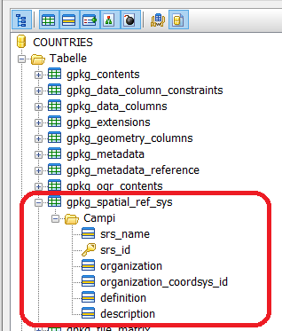
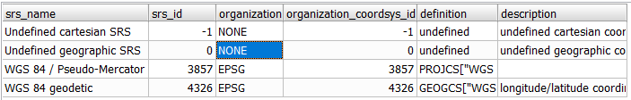
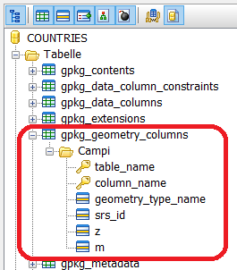
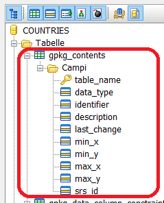
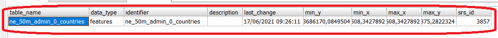
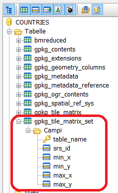
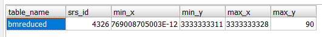
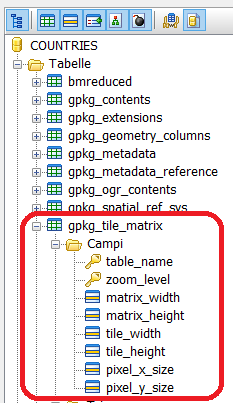
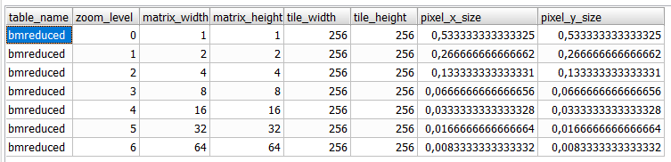

.. module:: geoserver.adding_data
   :synopsis: Learn how to adding data to GeoServer.

.. _geoserver.adding_data:

GeoPackage Format
========================

The GeoPackage is an open and standard format, portable and platform independent.

The format describes rules for storing geospatial data (vector and raster) within a SQLite database.

The format requires a SQLite database file with **.gpkg** extension.

**Tables Overview**

.. figure:: img/geopackage-tables-overview.png
      :width: 600

**gpkg_spatial_ref_sys**

This table contains records to define all spatial reference systems used by the table contents in the GeoPacakge itself.

Where:
      #. `srs_name`: name of the SRS
      #. `srs_id`: unique identifier for each SRS within the database
      #. `organization`: name of the defininig organization
      #. `organization_coordsys_id`: numeric ID of the SRS assigned by the organization
      #. `definition`: WKT representation of the SRS
      #. `description`: description of the SRS

**gpkg_geometry_columns**

This table identifies the geometry columns and geometry types in tables that contain user data representing features.

Where:
      #. `table_name`: name of the geometry table
      #. `column_name`: name of the geometry column
      #. `geometry_type_name`: name of the geometry type (eg. POINT, POLYGON)
      #. `srs_id`: SRS ID of the data in the geometry column
      #. `z`: enumerator for Z values (0: **prohibited**, 1: **mandatory**, 2: **optional**)
      #. `m`: enumerator for M values (0: **prohibited**, 1: **mandatory**, 2: **optional**)

.. figure:: img/geopackage-table-gpkg_geometry_columns-1.png

**gpkg_contents**

Where:
      #. `table_name`: name of the actual content table
      #. `data_type`: type of the data stored in the table (eg. tiles, features, attributes) table
      #. `identifier`: a short name identifier for the table_name content
      #. `description`: a description for the table_name content
      #. `last_change`: timestamp of the last change of the content
      #. `min_x`: minimum Easting or Longitude for all content in the table
      #. `min_y`: minimum Northing or Latitude for all content in the table
      #. `max_x`: maximum Easting or Longitude for all content in the table
      #. `max_y`: maximum Northing or Latitude for all content in the table
      #. `srs_id`: Spatial reference System ID (referencing `gpkg_sptial_ref_sys.srs_id`)

**gpkg_tile_matrix_set**
This table contains coordinates that define a bounding box as the exact stated spatial extent for all tiles in a tile (matrix set) table. 
If the geographic extent of the image data contained in tiles at a particular zoom level is within but not equal to this bounding box, then the non-image area of matrix edge tiles must be padded with no-data values, preferably transparent ones.

Where:
      #. `table_name`: name of the Tile Pyramid table
      #. `srs_id`: Spatial reference System ID (referencing `gpkg_sptial_ref_sys.srs_id`)
      #. `min_x`: minimum Easting or Longitude for the tile matrix set
      #. `min_y`: minimum Northing or Latitude for the tile matrix set
      #. `max_x`: maximum Easting or Longitude for the tile matrix set
      #. `max_y`: maximum Northing or Latitude for the tile matrix set
      

**gpkg_tile_matrix**

Where:
      #. `table_name`: name of the Tile Pyramid table
      #. `zoom_level`: zoom level
      #. `matrix_width`: number of columns for the specific zoom_level
      #. `matrix_height`: number of rows for the specific zoom_level
      #. `tile_width`: tile width in pixels for the specific zoom level
      #. `tile_height`: tile height in pixels for the specific zoom level
      #. `pixel_x_size`: width of the pixel in the table SRID unit (default meters)
      #. `pixel_y_size`: height of the pixel in the table SRID unit (default meters)

