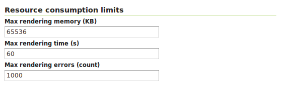

.. module:: geoserver.parameters

.. _geoserver.parameters:

Configuring GeoServer for robustness 
--------------------------------------------------

In a production environment may be necessary to properly configure the OGC services in order to give a limit to resources associated with a request. The **Resource Limits** options allow the administrator to limit the resources consumed by each WMS GetMap request.

WMS Resource Limits
++++++++++++++++++++++++++++++++++++

WMS is usually fond on memory as we are usually talking about rendering large and/or sophisticated (in term of styling) maps therefore we need to make sure we have a way out from requests that are consuming too many resources and/or that have been running for too much time.
In the picture below we have depicted the resource limits settings available for a WMS service, then you can find a quick explanation.

   
   *Setting the Resource consumption limits for WMS*

The following table shows each option name, a description and the minimum GeoServer version at which the option is available (old versions will just ignore it if set).

.. list-table::
   :widths: 10 80

   * - **Option**
     - **Description**
   * - **Max rendering memory**
     - Sets the maximum amount of memory, in kilobytes, that a single GetMap request is allowed to use. Each output format will make a best effort attempt to respect the maximum using the highest consuming portion of the request processing as a reference. For example, the PNG output format will take into consideration the memory used to prepare the image rendering surface in memory, usually proportional to the image size multiplied by the number of bytes per pixel.
   * - **Max rendering time**
     - Sets the maximum amount of time, in seconds, that GeoServer will use to process the request. This time limits the "blind processing" portion of the request serving. That is, the part in which GeoServer is computing the results before writing them out to the client. The portion that     is writing results back to the client is not under the control of this parameter, since this time is also controlled by how fast the network between the server and the client is. So, for example, in the case of PNG/JPEG image generation, this option will control the pure rendering time but not the time used to write the results back.
   * - **Max rendering errors**
     - Sets the maximum amount of rendering errors tolerated by a GetMap. Usually, GetMap skips over faulty features, reprojection errors and the like in an attempt to serve the results anyways. This makes for a best effort rendering, but also makes it harder to spot issues, and consumes CPU cycles as each error is handled and logged.
     
Out of the box, GeoServer uses 65MB, 60 seconds and 1000 errors respectively. All limits can be disabled by setting their value to ``0``.

Once any of the set limits is exceeded, the GetMap operation will stop and a ``ServiceException`` will be returned to the client.

It is suggested that the administrator sets all of the above limits taking into consideration peak conditions. For example, while a GetMap request under normal circumstance may take less than a second, under high load it is acceptable for it to take longer, but usually, it's not sane that a request goes on for 30 minutes straight. The following table shows some example values for the configuration options above with explanations of how each is computed:

.. list-table::
   :widths: 20 10 70

   * - **Option**
     - **Value**
     - **Rationale**
   * - maxRequestMemory
     - 65536
     - 65MB are sufficient to render a 4078x4078 image at 4 bytes per pixel (full color and transparency), or a 8x8 meta-tile if you are using GeoWebCache or TileCache. Mind the rendering process will use an extra in memory buffer for each subsequent FeatureTypeStyle in your SLD, so this will also limit the size of the image. For example, if the SLD contains two FeatureTypeStyle element in order to draw cased lines for a highway the maximum image size will be limited to 2884x2884 (the memory goes like the square of the image size, so halving the memory does not halve the image size).
   * - maxRenderingTime
     - 60
     - A request that processes for one minute straight is probably drawing a lot of features independent of the current load. It might be the result of a client making a GetMap against a big layer using a custom style that does not have the proper scale dependencies.
   * - maxRenderingErrors
     - 1000
     - Encountering 1000 errors is probably the result of a request that is trying to reproject a big data set into a projection that is not suited to area it covers, resulting in many reprojection failures.

WFS Resource Limits
++++++++++++++++++++++++++++++++++++
For WFS services the settings are available both at global level as well as on a per layer basis. WFS works mainly in streaming hence the settings focus mainly on the number of rows that a request can ask GeoServer to process. The goal is to reduce the time that a DBMS connection is used to respond to a request and/or the time it takes to generate an output.

The Global setting available are as follows:

 * Max feature returned: configured as a global limit that allows to manage maximum number of features returned in a WFS call.
 * Return feature bbox: If disabled then it reduces amount of generated GML since it wont be including bounding box for each feature. 

	   .. figure:: img/resource2.png
		:align: center

		*WFS Global Resource Limits Panel*

The Per layer settings available are as follows:

 * Per-Request feature limit: allows to defined maximum limit of features to return in a WFS for that layer.
 * Maximum number of decimals: allows to reduce number of decimals in numeric data related to features, reducing then size of response. 

	   .. figure:: img/resource3.png
		:align: center

		*WFS Per Layer Limits Panel*

WCS Resource Limits
++++++++++++++++++++++++++++++++++++
WCS is usually intensive in terms of I/O and CPU, sometimes also in terms of memory usage. 
This depends a lot on the chain of operations that is being requested (see picture below). We can ask GeoServer to process a huge dataset with simple chain to produce a small dataset or we can ask GeoServer to process a small chunk of a dataset to create a large output raster, possibly using a complex chain that involves reprojection and interpolation.

	   .. figure:: img/resource5.png
		:align: center

		*WCS Processing Pipeline*

In order to capture all these options we came up with two simple resource limits for WCS:

 * Maximum amount of data read: maximum size of area to read (in KB).
 * Maximum amount of data generated: defines the size of data to generate.

See picture below.

	   .. figure:: img/resource4.png
		:align: center

		*WCS Resource Limits Panel*