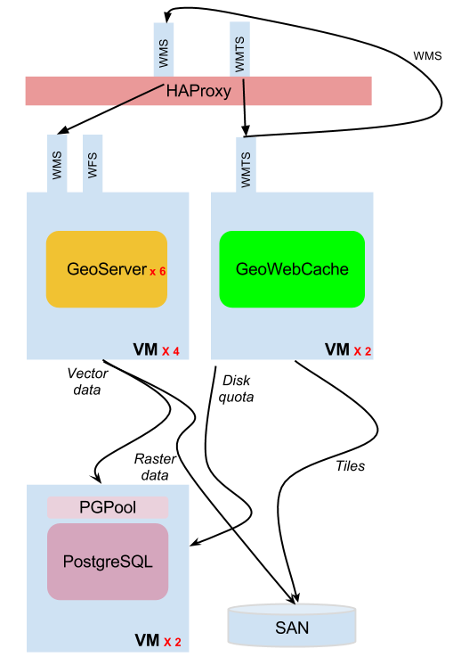
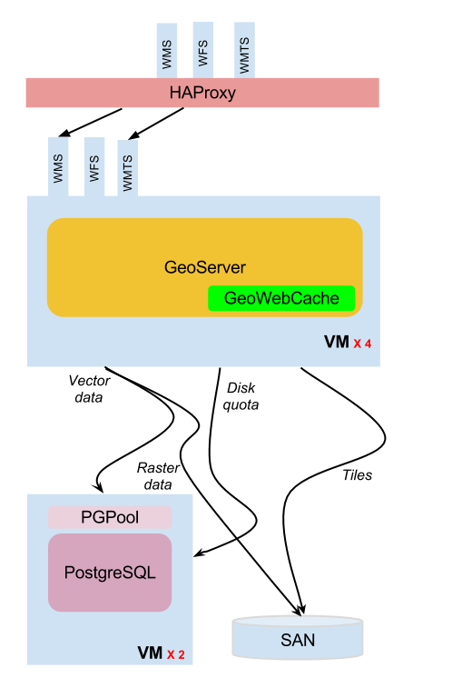

.. module:: gwc.clustering

.. _gwc.clustering:

Clustering GeoWebCache - Internal VS Standalone
================================================

This is a simple GWC cluster configuration which can be deployed with GeoServer:

   
   Illustration: external GWC clustering

As you can see the GeoWebCache instances are deployed to their own virtual machines and are configured to work in Active-Active mode. With this set up and the usage of the shared filesystem we are able to have the two instances working even against a non fully seeded cache.
GWC instances are also configured to go through the load balancer for creating tiles and talk to the GeoServer cluster in order to balance the load as much as possible, sharing the disk quota information in the same clustered database storage.
It is highly recommended to set up the control flow plugin in order to better control the load on the server and queue excessive requests to try and conserve a good throughput.

The set-up of an integrated GWC cluster is similar. Each GeoServer ships with its own integrated GWC, which means GWC does not need to reach for an external WMS server to create tiles, but also that control-flow and the web container need to be set-up to ensure some request fairness.

   
   Illustration: integrated GWC clustering

