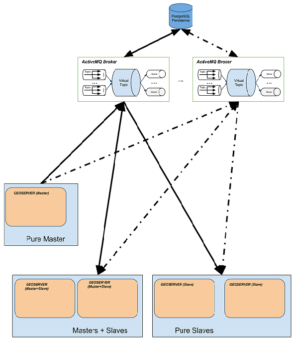

.. module:: clustering.active.description

.. _clustering.active.description:

More details on the Active Clustering Extension
===============================================
.. note:: In this section we are going to provide a few technical details on the Active Clustering Extension. 

The GeoServer Active Clustering Extension is implemented using Spring and Apache ActiveMQ as the MOM (Message Oriented Middleware) in particular using JMS (Java Message Service) as the message exchange technology.
The picture here below (click `here <https://docs.google.com/drawings/d/1hlPbf0uWMfZzJXltHEBKhpOgeBNorY4AUurfbUg_fA4/edit?usp=sharing>`__ for the live drawing) represents a complete high level design of the solution implemented.

For the implementation of the message exchange we are leveraging on **ActiveMQ VirtualTopics** to exploit dynamic routing (you can dynamically attach masters and slaves).
The VirtualTopics feature has also other advantages explained `here <http://activemq.apache.org/virtual-destinations.html>`__ 

   
   Illustration  Component Diagram for the MOM based clustering 

Limitations and future extensions
^^^^^^^^^^^^^^^^^^^^^^^^^^^^^^^^^
The current implementation has a few limitations as well as assumptions that must be taken into account when planning a deployment. Let's quickly summarise them.

Moving data between nodes
++++++++++++++++++++++++++++

The clustering solution we have put in place is specific for managing the GeoServer internal configuration, no data is transferred between master and slaves. For that purpose use external mechanisms depending on your deployment. 

In principle this is not a limitation per-se since usually in a clustered environment data is stored in shared locations outside the data directory or synched using other means. 

Additional files in the GeoServer Data Directory
+++++++++++++++++++++++++++++++++++++++++++++++++

 * Styles' accompanying graphics are not replicated over to slaves. Styles are replicated instead. 
 * Freemarker templates are not replicated over to slaves 
 
It is worth to point out that the use case we were bearing in mind when we developed this extensions was more towards publishing new stores/layers periodically (e.g. MetOc data), hence changing styles and other 'manual' actions were not a priority for us as we were expecting users to perform them upfront.or manually one in a while.
The shared data dir set up will also help with respect to this limitation, as the new graphics and freemarker templates will be transparently available to every node.

Integrated GeoWebCache Support
++++++++++++++++++++++++++++++++++++
Support for the integrated GeoWebCache is still somewhat sloppy since GeoWebCache does not fully integrate with the GeoServer event subsystem which is at the core of our extension,
as a result changes to GWC are not automatically propagating to other nodes, a reload wil be required in this case.

Things you should not be doing
++++++++++++++++++++++++++++++++++++

* **NEVER RELOAD THE GEOSERVER CATALOG ON A MASTER**
  Each master instance should never call the catalog reload since this propagates the creation of all the resources, styles, etc to all the connected slaves.
  
* **NEVER CHANGE CONFIGURATION USING A PURE SLAVE**
  This will make the configuration of the specific slave out of synch with the others.  

