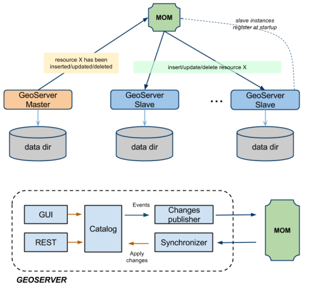
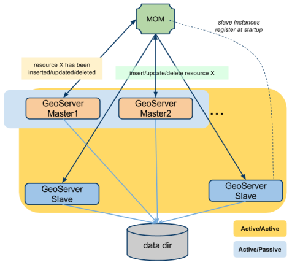
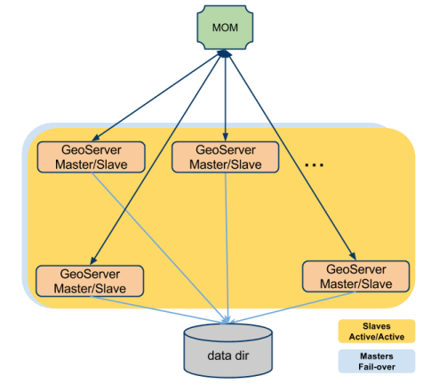

.. module:: clustering.active.index

.. clustering.active.index:

GeoServer Active Clustering 
=======================================

.. note:: In this section, and in the following as well, we are assuming you are familiar with the concept of GeoServer Data Directory 

As we have seen in previous sections, various approaches exist to implement a clustered deployment with GeoServer based on different mixes of data directory sharing/syncing plus configuration reload. 
However, these techniques have intrinsic limitations in terms of scalability with respect to the number of layer therefore we decided to create a specific GeoServer Clustering Extension in order to overcome them. 

We have implemented a **Multi Master** extension for GeoServer which leverages on a **Message Oriented Middleware (MOM)** to keep all the nodes in the cluster in synch with respect to their configurations.

 * The **Masters** accept changes to the internal configuration, persist them on their own data directory and forward them to the Slaves via the MOM (with guaranteed delivery)
 * The **Slaves** should not be used to change  the configuration from either REST or the User Interface, since they are configured to receive and inject (directly in memory) configuration changes disseminated by the Master(s) via the MOM
 * The **MOM** is used behind the scenes to make the Masters and the Slaves exchange messages that contain changes to the configuration. Sometimes we are going to use the term **Broker** as a synonym for *MOM*
 
Each Slave can be configured to have its own (**private**) data directory, in this case it shall be configured to use a durable subscription to the MOM  to keep its data dir in synch with the Master's one so that when a configuration change from a Master (through the MOM) is received it will also be persisted. With this configuration in case a Slave goes down when it goes up again he will receive a bunch of configuration changes to align its data directory to the Master's one.
In the illustration below this set up (with a Single Master - Multiple Slaves approach) is depicted.

   
   Illustration: Single Master - Multiple Slaves cluster with private data directories and external MOM
   
Such set up is useful in cases when sharing files via shared filesystem is not recommended, hence sharing the data directory is not possible. It is worth to mention that data to be served (e.g. ShapeFiles) should be synced between different instances through an external mechanism.

It is also possible to share the same data directory between Masters and Slaves as long as the Slave instances are configured to never persist the configuration changes once they are injected in memory and also a single master at a time is used. This is configurable in the GeoServer Active Clustering Extension (more on this later).
In the illustration below a set up with a Multiple Masters - Multiple Slaves and shared data directory is depicted.

   
   Illustration: Multiple Masters - Multiple Slaves and shared data directory
   
A similar set up is useful in cases when sharing the data directory across multiple instances is possible (e.g. scaling up or vertical scaling on a single large instance but even scaling out while still having shared/clustered file-system available). It is worth to mention that while changes to the configuration via UI or REST interface should be directed as much as possible to same Master (hence we recommend to configure them in fail-over or Active/Passive). It is however possible to configure all the instances in Active/Active when it comes to answering OGC queries.

It is worth to point out that with the GeoServer Active Clustering Extension **a Node can be both Master and Slave at the same time** allowing a **Peer-to-Peer** set-up. Generally speaking all nodes can be Master and Slave at the same time, however, as mentioned above, it would be good to configure the load balancer to use a fail-over for configuration changes (GUI or REST) in case frequent changes to the configuration are expected (more on this later).
In the illustration below a set up with a P2P layout and shared data directory is depicted.

   
   Illustration: P2P and shared data directory
   
.. note:: All the set-up described so far use a standalone broker. In the following sections we will show how to use an embedded version of the MOM which would make deployments much easier at the cost of less control.

In the following sections we are going to provide more information about how to install and use the Active Clustering Extension for GeoServer.

Installing and Configuring the GeoServer Active Clustering Extension
---------------------------------------------------------------------------

.. toctree:: 
   :maxdepth: 1

   description
   installation
   usage
   topologies
   advancedbrokerURI

Advanced Stand-Alone MOM Configuration and Usage 
---------------------------------------------------------------------------------

We deliver a web application based on ActiveMQ which is preconfigured to be used with the GeoServer Active Clustering Extension as the MOM.
Additional information can be found at the links below

.. toctree:: 
   :maxdepth: 1

   activemq/activemqBroker
   activemq/JDBC
   activemq/SharedFolder
   
   
   

   
