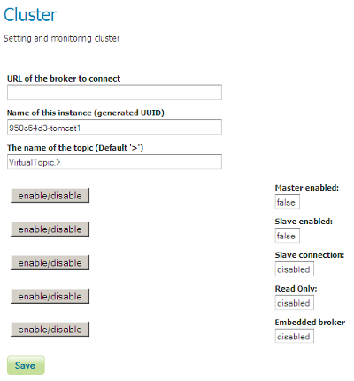

.. module:: clustering.active.installation

.. _clustering.active.installation:

We are now going to look into the basic steps for performing the installation of the GeoServer Active Clustering Extension.

Installing the GeoServer Active Clustering Extension
===================================================================

.. note:: The GeoServer available in the training already have the clustering extension installed, the following information is
          provided for reference. However, remember to do the last step, "Configuration", as the clustering extension is not active 
          in the training GeoServer instances yet.

Downloading
-----------

For the version compatible with the GeoServer 2.13.x contained in this training point your browser here::

  https://build.geoserver.org/geoserver/2.13.x/community-latest/

You'll find 2 different packages:
  
  1. geoserver-2.13-SNAPSHOT-jms-cluster-plugin.zip
  2. geoserver-2.13-SNAPSHOT-activeMQ-broker-plugin.zip

The **activeMQ-broker-plugin** is a actually standalone minimal ActiveMQ MOM web application packaged as a WAR file, ready to be dropped in a web container (e.g., Tomcat). 
This is useful if you want to run with a standalone broker.

The **cluster plugin** adds all the functionalities to GeoServer to work as master or slave.

Installing
-----------

Likewise other GeoServer extensions you can install the Active Clustering Extension by:

 1. Stopping GeoServer 
 2. Dropping the jms-cluster-plugin JARs inside the WEB-INF/lib directory
 3. Restarting GeoServer
 
These steps must be performed **for each geoserver instance which compose the cluster**, regardless of the role the instance will take (master or slave).

.. note:: The GeoServer used the training material already contains the clustering extension

Once the extension is installed you should be able to see a new section in the GeoServer user interface called **Cluster  configuration** as shown below.

.. figure:: images/Clustering_menu.png
   :align: center
   :alt: Illustration: GeoServer Active Clustering settings icon 
   
   Illustration: GeoServer Active Clustering settings icon 
   
By default the GeoServer start with the following configuration when the clustering extension is installed as is:

 1. An embedded Broker is started from within the GeoServer Java process
 2. GeoServer connects to the embedded broker
 3. GeoServer acts both as **Master** as well as **Slave**
 4. A randomized **unique** (within the cluster) name is generated
 5. A **cluster** folder is created under the GeoServer data directory 

.. _cluster-configuration:

Configuration
--------------
 
If you click on the **Cluster settings** link in a training GeoServer you will find the clustering extension is disabled:

   
   Illustration: GeoServer Active Clustering settings options page, clustering disabled
   
We are going to enable all the options. Perform the changes *in this order* (the changes are applied immediately, so the order is important):

* Enable the embedded broker
* Enable master
* Enable slave
* Enable slave connection

* *Do not* enable the "read only" toggle

The result will be:

.. figure:: images/Clustering_settings.png
   :align: center
   :alt: Illustration: GeoServer Active Clustering settings options page
   
   Illustration: GeoServer Active Clustering settings options page

Save the configuration to enable the clustering extension.
   
The default installation of the GeoServer Active Clustering Extension will turn your GeoServer instance into:

 * A running Master/Slave node with the ability to write to its data directory
 * An embedded Broker, which means that your instance will host an embedded version of messaging broker

To be more specific the GeoServer instances when acting as a Master will publish configuration changes to its own embedded broker which in turn is configured to automatically discover other Broker in the same network via **Multicast** (make sure you netadmin is happy about this) and spread the changes over to them as well as to all the GeoServer instances connected to them as Slaves. 

.. note:: Long story short, by default the extension can be used to create a peer-to-peer network of Master/Slave GeoServer instances with private data directory

Let's now move on and provide more details about how to configure and use the GeoServer Active Clustering Extension.
