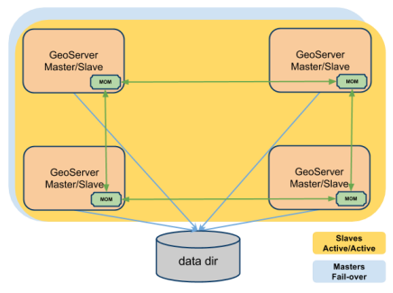
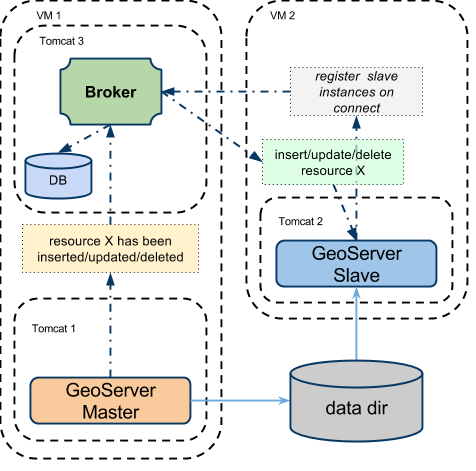

.. module:: clustering.active.topologies

.. _clustering.active.topologies:

Implementing Different Clustering Topologies
============================================

With the GeoServer Active Clustering Extension we are able to configure the cluster in many different ways leveraging on the capabilities provided by the extension.

In the following sections we are going to show you a few useful configurations, however bear in mind that additional set ups can be implemented by further customizing the configuration for the broker as well as how the GeoServer instances connect to the Broker itself.

Preliminary Information: What to know when sharing the GeoServer data directory 
--------------------------------------------------------------------------------------

.. warning:: Besides what we are going to here, when you share the GeoServer data directory between multiple GeoServer instances there are other things you need to take into account and configure correctly, namely the GeoServer logging file (each instance needs to be instructed to log to its own file) and the GeoWebCache disk quota mechanism, in case it is used. This is covered in the standard GeoServer documentation `here <http://docs.geoserver.org/2.10.x/en/user/advanced/logging.html>`__ and `here <http://geowebcache.org/docs/1.5.1/production/index.html#clustering>`__.

Read-only (pure) Slaves 
+++++++++++++++++++++++
.. note:: More information on the GeoServer data directory can be found in the standard documentation `here <http://docs.geoserver.org/stable/en/user/datadirectory/index.html>`__

The shared GeoServer data directory set-up is a common approach to cluster GeoServer instances that is used to share data and the configuration within a cluster.

It is possible to continue using the same approach with the GeoServer Active Clustering Extension (which supports, with some limitation as indicated before, the use of private GeoServer data directories) with some tweaking of the configuration for the cluster.

A suitable way is to elect one of more GeoServer instances as Master and use the **readOnly** toggle for the cluster configuration of the Slave instances to disable the persistence for them.
Once you defined which are the GeoServers you want to use as Master, (nodes which are able to propagate changes of the configuration over the network), you may want to set the **readOnly** status as following::

 #. GeoServer Masters: readOnly=false
 #. GeoServer Slaves: readOnly=true

In this configuration all the Slave instances will receive the configuration changes through the network and will apply such changes only to their in-memory configuration skipping the persistence phase because only Master instances will actually write to the GeoServer data directory.

Note that when sharing the GeoServer data directory  you may also evaluate to disable the durable subscriptions from the GeoServer Slave instances to the Broker (to improve performances). You can do this via the cluster.properties file setting::

  durable=false

Note that this is **not** the default setting. If a Slave instance goes down when it goes up again it will load the configuration from the shared data directory hence it is not needed to get messages about changes made while the slave was down.

Master/Slave instances
++++++++++++++++++++++++++++++++++++++++++++++++++++
It is possible to have a peer-to-peer set up where all the GeoServer instances share the GeoServer data directory while acting both as Master sand Slaves at the same time. This means all the instances can perform changes to the configuration on disk. 

This set up is fine(actually great in some cases) and does not require any additional thinking  when changes to the configuration are sporadic and/or well temporally separated between each other; in case you expect to make many concurrent modifications to the GeoServer configuration using this set-up is still ok but we do recommend to use sticky-sessions at the load balancer level or, better, to configure connections to the Master with a Fail-over approach. It is unsafe to have multiple GeoServer instances making changes to the configuration files concurrently when sharing the GeoServer data directory among all of them.

Useful Configuration Tweaks
++++++++++++++++++++++++++++++++++++++++++

When we share the GeoServer data directory we have to consider that the default *cluster.properties* location is::

  $data/cluster/cluster.properties

and therefore it would read and written by all the instances (depending on their roles). However this files contains information that are **unique** to a certain instance like the instance name, therefore it must be kept separate for each instance.

.. note:: Each GeoServer instance must have its own cluster.properties file with a unique identifier for that instance's **instanceName**.

To overcome this problem the **CLUSTER_CONFIG_DIR** variable comes to the rescue (in a way similar to the geoserver data  variable that you should be familiar with). 

When we want share the GeoServer data directory we have to make sure we add to the **JAVA_OPTS** for that instance an override for the CLUSTER_CONFIG_DIR variable telling that same instance where to locate the *cluster.properties* file.

 * In the provided training **Windows package** the variable is configured in *setenv.bat* located in the ``%TRAINING_ROOT% folder``
 
 * In the provided training **Linux environment** the variable is configured in *setenv.sh* located in the conf folder of each tomcat instance: ``/opt/tomcat_geoserver/conf/setenv.sh`` and ``/opt/tomcat_geoserver2/conf/setenv.sh``

Topology 1:  Peer-to-peer network with embedded brokers and shared data directory
--------------------------------------------------------------------------------------------

.. note:: This approach uses multicast for discovery hence you might want to talk to your network administrator to make sure multicast is available/possible!

The simplest way to use the GeoServer Active Clustering Extension is by setting up a peer-to-peer network of instances with shared data directory.
This is particularly well suited when scaling up GeoServer (which means installing multiple instances on a single large machine) but it can be also very useful when scaling out GeoServer on multiple smaller virtual machines as it allows new instances to *automagically* join the cluster since in this set up:

 * Each GeoServer instance will run an embedded broker 
 * Each GeoServer instance will talk to its own embedded broker without opening a port but directly in the same VM process
 * Each broker will automagically discover other brokers on the same network and bind to them to create a network of brokers (act as a single fault-tolerant broker)
 * Messages sent to a broker will be delivered to all the other brokers in the same network
 * GeoServer instances can join and leave the network dynamically
 
This set-up is described in the picture below.
 

   
   Illustration  P2P Cluster of GeoServer instances
   
.. note:: This is the default configuration for the GeoServer Active Clustering Extension, you can find this configured in the provided training package.

This (default) approach would work out of the box when you are using dedicate machines for each GeoServer instance (scaling out) while it requires some tweaks when scaling up to make sure you don't mess things up.

Configuring the location of the cluster.properties file
+++++++++++++++++++++++++++++++++++++++++++++++++++++++

As mentioned above you need to make sure each instance will have its own *cluster.properties* file with a unique name. It is worth saying that when you install the GeoServer Active Clustering Extension it created a *cluster.properties* file inside the GeoServer data directory with a randomized *instanceName* and default configuration which you can reuse as a baseline for configuring new instances.

.. _configuring-the-embedded-broker:

Configuring the embedded broker 
+++++++++++++++++++++++++++++++

When the embedded broker is enabled the broker configuration is loaded via the *xbeanURL* property of  the *cluster.properties* file.

The default broker configuration can be downloaded `here <https://github.com/geoserver/geoserver/blob/master/src/community/jms-cluster/jms-geoserver/src/main/resources/broker.xml>`__ and it's included in the classpath for GeoServer. The default path for it its a relative path (for the geeks, relative to the Extension JAR in GeoServer itself) but can be changed to an absolute path.

If you are using the same machine for more GeoServer instances (scaling up) and you also sharing the same GeoServer data directory you may have to configure the embedded brokers to use different ports (e.g. JMX ports) and file system paths (e.g. for persistence) to avoid collisions.
When you use different machines for each GeoServer instance then you don't need to configure any port, while you might still need to reconfigure some path in case you are sharing the GeoServer data directory.

*The good news is that by default there is nothing you need to reconfigure in terms of embedded broker ports since the default configuration dynamically choose a free port for the messaging and discovery agents when it starts*. You have to try and reconfigure the embedded broker (this is advanced stuff) only if you do want to use things like JMX to inspect what is going on with the embedded broker then you need to check the steps below. Jump to the note below to know how to reconfigure the persistence embedded database.

Generally speaking, to customize the configuration of the broker you can proceed in the following way:

 #. Changing the xbeanURL in this instance's cluster.properties file to point to a new broker definition (.xml file) in case you want to have deep control over the embedded broker configuration (which means you are an ActiveMQ black belt and like XML).
 #. Overriding the default values for the parameters provided to customize broker definition. To override them you can:
	#. Adding to the JAVA_OPTS the overriding value for the parameter you want to customize (this works best if you have multiple instances on the same machine)
	#. put a file called **embedded-broker.properties** into your user home dir. (this does not work well if you have multiple instances on the same machine).

Here is a list of all the available parameters for the *embedded-broker.properties* file (you'll find the explanations as comments). You can skip it if you are not interested in the low level details::

    ## JMX settings (can be overridden by env vars)
    ## For more information, see: http://activemq.apache.org/jmx.html
    # enable/disable broker jmx
    activemq.jmx.useJmx=false
    # set the JMX connector port
    activemq.jmx.port=1098
    # set the JMX connector host
    activemq.jmx.host=localhost
    # enable the JMX connector
    activemq.jmx.createConnector=false

    ## broker settings
    # set the base path of the temporary broker dir
    # this is also used as persistence base dir  
    activemq.base=./

    ## configuring the embedded broker
    # connects the server via native I/O socket to the local network broadcast using an automatic assigned port 
    # maximumConnections and wireFormat.maxFrameSize are added to avoid ddos attacks
    activemq.transportConnectors.server.uri=tcp://127.0.0.1:0?maximumConnections=1000&wireFormat.maxFrameSize=104857600&jms.useAsyncSend=true&transport.daemon=true
    ## the broker performs discovery using the following protocol:
    # multicast on default network
    activemq.transportConnectors.server.discoveryURI=multicast://default

    ## persistence settings and system usage
    ## The systemUsage controls the maximum amount of space the broker will 
    ## use before slowing down producers. 
    ## For more information, see: http://activemq.apache.org/producer-flow-control.html
    # enable/disable persistence
    activemq.broker.persistent=true
    # heap memory usage
    activemq.broker.systemUsage.memoryUsage=128 mb
    # disk space memory usage
    activemq.broker.systemUsage.storeUsage=1 gb
    # temp disk space memory usage
    activemq.broker.systemUsage.tempUsage=128 mb

.. note:: The one parameter that you might want to configure aside from the *cluster.properties* location is the *activemq.base* location as it is where the broker places the embedded database (which is KahaDB in case you wondered) it uses for persisting messages and making them durable. You don't want two instances to try and write to the same DB hence you may to point to a path of choice like shown below which defines an override for the persistence and temporary folder of the Embedded Broker::

  -Dactivemq.base=smartpath/cluster/instance1/db
  

Summary of mandatory steps
++++++++++++++++++++++++++
Summarising, in case you want to share the same GeoServer data directory between multiple GeoServer instances you need to make sure each instance has its own *CLUSTER_CONFIG_DIR* with a unique *instanceName* in the *cluster.properties* file and a separate *activemq.base* location. A good set-up is as follows (for Windows)::

  set INSTANCE_NAME=instance1 #unique across the cluster
  set CLUSTER_CONFIG_DIR=%GEOSERVER_DATA_DI%\cluster\%INSTANCE_NAME%
  set JAVA_OPTS=%JAVA_OPTS% -DCLUSTER_CONFIG_DIR=%CLUSTER_CONFIG_DIR%
  set JAVA_OPTS=%JAVA_OPTS% -Dactivemq.base=%CLUSTER_CONFIG_DIR%\tmp

Now, unless you really want to to know the details you may want to skip the following subsections as they contains low level information on how we start and user the embedded broker.

Advanced Stuff: Connect to the embedded broker
++++++++++++++++++++++++++++++++++++++++++++++

Each instance by default is configured (check the `broker configuration file <https://github.com/geoserver/geoserver/blob/master/src/community/jms-cluster/jms-geoserver/src/main/resources/broker.xml>`_) to connect to the embedded broker instantiated by the same VM, to improve performance. In the GUI the brokerURL is empty as we build it internally as needed, but it could be set as follows::

   brokerURL=vm://localhost?create=false&waitForStart=5000
   
where *localhost* is a placeholder to tell the internal machinery to look for the first embedded broker available (there is only 1). The best config would be as follows::

   brokerURL=vm://${INSTANCE_NAME}?create=false&waitForStart=5000
   
since internally we used the *instance name*, which is unique within all the instances, to name each embedded broker.

Some observations:

#. This set-up will connect the GeoServer Instance to the embedded broker.

#. The connection will be performed using a VM transport allowing clients to connect to each other inside the VM without the overhead of the network communication. The connection used is not a socket connection but use direct method invocations which enables a high performance embedded messaging system.

#. The **create** parameter is used to define if the VM transport may create an embedded broker is set to false (it is very important to set it to false for performance and persistence related reasons). This is why we already have created an embedded broker so we don't have to create a new one.

#. **waitForStart** can optionally be specified to add tolerance to the VM connector waiting for some milliseconds before failure (default is infinite -1).

Topology 2: 1 Master and 1 Slave instances with shared data directory using a stand-alone broker
------------------------------------------------------------------------------------------------

Using this configuration we can move the broker outside the GeoServer's own JVM process delegating the CPU and the memory load necessary for the message storage and dispatch to a standalone web application.

Let's consider a typical configuration where the broker is deployed in a separate Tomcat instance (as an instance on the same server of the GeoServer master instance) and the various GeoServer instances are sharing the GeoServer data directory (f.e.: via NFS or GFS share).

   
   Illustration Standalone broker configuration

Installing and configuring the broker
+++++++++++++++++++++++++++++++++++++

Here you can download a very minimal web application based on the ActiveMQ::

  https://build.geoserver.org/geoserver/2.13.x/community-latest/geoserver-2.13-SNAPSHOT-activeMQ-broker-plugin.zip

Note that this is a minimal ready to use ActiveMQ broker web application so you can just take the configuration and use the official ActiveMQ broker distribution which is available `here <https://activemq.apache.org/download.html>`__

The default broker configuration can be downloaded `here <https://github.com/geoserver/geoserver/blob/master/src/community/jms-cluster/activemqBroker/src/main/webapp/WEB-INF/classes/applicationContext.xml>`__

Setup for the standalone broker configuration (Windows training environment)
++++++++++++++++++++++++++++++++++++++++++++++++++++++++++++++++++++++++++++

In the **training Windows package** you'll find the above broker deployed as a Tomcat instance ``%TRAINING_ROOT%/tomcat-7.0.72/instances/instance3/``.

The provided broker configuration can be customized as usually overriding variables via the JAVA_OPTS or the system properties.

To switch from the default configuration where the cluster uses embedded brokers to the new one where we want to use the standalone broker, locate the following lines in the global **setenv.bat** script located in %TRAINING_ROOT%::

    REM GeoServer cluster options
    set CLUSTER_CONFIG_DIR=%TRAINING_ROOT%\data\cluster\%INSTANCE_NAME%

    REM set this and comment the above to use instance3 (standalone broker)
    REM set CLUSTER_CONFIG_DIR=%TRAINING_ROOT%\data\cluster\instance3\%INSTANCE_NAME%

Looking at the comment suggestions you'll be able to switch using the standalone broker deployed into the third tomcat instance using the second CLUSTER_CONFIG_DIR setting.

Now we have changed the CLUSTER_CONFIG_DIR pointing to a new set of configurations ready to use the standalone standalone broker.

The parameters used to configure the broker are essentially the same of the internal one so you can refer to the embedded Broker for a complete explanation.
The default setup is overridden (in the tomcat_start_3.bat) as following::

    set INSTANCE_NAME=instance3

    REM cluster OPTS:
    set JAVA_OPTS=%JAVA_OPTS% -Dactivemq.broker.transportConnectors.uri=tcp://localhost:61661?maximumConnections=1000&wireFormat.maxFrameSize=104857600&jms.useAsyncSend=true
    set JAVA_OPTS=%JAVA_OPTS% -Dactivemq.base=.\data\cluster\%INSTANCE_NAME%\tmp

Once the tomcat instance is started we are ready to connect to it with the GeoServer instances.

Setup for the standalone broker configuration (Linux training environment)
++++++++++++++++++++++++++++++++++++++++++++++++++++++++++++++++++++++++++

In the **Linux training environment** you'll find the broker deployed as a Tomcat instance located in ``/opt/tomcat_broker``.

The provided broker configuration can be customized as usually overriding variables via the JAVA_OPTS or the system properties.

To switch from the default configuration where the cluster uses embedded brokers to the new one where we want to use the standalone broker, locate in the **setenv.sh script of each geoserver instance** the following lines.

Change::

    CLUSTER_CONFIG_DIR=/home/geosolutions/Desktop/geoserver_training/geoserver_data/cluster/${INSTANCE_NAME}
	
with::
	
    CLUSTER_CONFIG_DIR=/home/geosolutions/Desktop/geoserver_training/geoserver_data/cluster/instance3/${INSTANCE_NAME}

.. note:: **${INSTANCE_NAME}** is a placeholder for the name of the tomcat instance (``instance1`` or ``instance2``), it can be useful to declare it as a variable in the top of the *setenv.sh* script

.. note:: the setenv.sh files are located in ``/opt/tomcat_geoserver/conf/`` for the instance1 and ``/opt/tomcat_geoserver2/conf/`` for the instance2

Now we have changed the CLUSTER_CONFIG_DIR pointing to a new set of configurations ready to use the standalone standalone broker.

The parameters used to configure the broker are essentially the same of the internal one so you can refer to the embedded Broker for a complete explanation.

The standalone broker environment configuration file located in ``/opt/tomcat_broker/conf/setenv.sh`` looks like::

    CATALINA_BASE=/opt/tomcat_broker
    INSTANCE_NAME=instance3

    # cluster OPTS:
    JAVA_OPTS=${JAVA_OPTS}"-Dactivemq.broker.transportConnectors.uri=tcp://localhost:61661?maximumConnections=1000&wireFormat.maxFrameSize=104857600&jms.useAsyncSend=true"
    JAVA_OPTS=${JAVA_OPTS}"-Dactivemq.base=.\data\cluster\${INSTANCE_NAME}\tmp"

Restart all the three tomcat instances with the commands::

	geosolutions@ubuntu:/$ sudo service broker restart
	geosolutions@ubuntu:/$ sudo service geoserver restart
	geosolutions@ubuntu:/$ sudo service geoserver2 restart

Once the tomcat instance are restarted we are ready to connect to the standalone broker with the GeoServer instances.

Connecting GeoServer to the external broker
+++++++++++++++++++++++++++++++++++++++++++

Access to the the **master** GeoServer cluster interface and setup the cluster status as following::

    brokerURL=tcp://localhost:61661

This sets the producer connection to the native I/O protocol which is able to connect to other web application within the same server.

A more complex setup can use static failover::

    brokerURL=failover://(tcp://localhost:61616)

Which can be extended adding more then one broker::

    brokerURL=failover://({PROTOCOL}://{BROKER_IP}:{BROKER_PORT},{PROTOCOL}://{BROKER_IP2}:{BROKER_PORT2},...)?options

This type of connection url will leverage on a static failover transport to be able to switch between brokers in the case some of them are temporarily down or offline.

Other parameters needed for the GeoServer **master**::

    topicName=VirtualTopic.>
    toggleMaster=true
    readOnly=false
    embeddedBroker=disabled

Then consider to shutdown the slave capabilities (if you want a pure master)::

    toggleSlave=false
    connection=disabled

Now log into all the GeoServer Slaves and setup as following:

    #. **brokerURL** can be set as the master instance
    #. **topicName** can be set as the master instance

then::
    
    toggleSlave=true
    readOnly=true
    connection=enabled
    embeddedBroker=disabled

Then consider to shutdown the master capabilities (if you want a pure slave)::

    toggleMaster=false

Broker transport setup
++++++++++++++++++++++

In the next section we are going to provide advanced information on how to configure the connections to the Broker.
You can refer to the activeMQ documentation for additional information.

