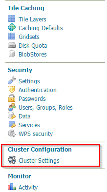
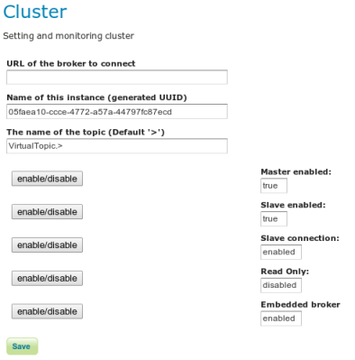

.. module:: clustering.active.usage

.. _clustering.active.usage:

Configuring the GeoServer Active Clustering Extension
=====================================================

Each GeoServer instance with the Active Clustering Extension installed starts with a default configuration which can be managed using the provided GUI or modifying a specific file called **cluster.properties** placed inside the *cluster* directory inside the GeoServer Data Directory. When GeoServer starts, it automatically populates the configuration file **cluster.properties**, if not present, with default values to have a Master/Slave instance with embedded broker.

.. note:: To override the default location of this configuration file, which is crucial in case you are scaling up GeoServer with shared data directory, you have to set-up the **CLUSTER_CONFIG_DIR** variable defining the destination folder of the **cluster.properties** file. As mentioned, this is useful when you want to share the same data directory between multiple GeoServer instances.

Into the standalone package you may found the cluster.settings under:

.. code-block:: xml

  ${TRAINING_ROOT}/data/cluster/instance1/cluster.properties
  
Here is an example of its content (automatically generated):

.. code-block:: xml

    #Fri Mar 28 18:27:32 CET 2014
	toggleSlave=true
	topicName=VirtualTopic.>
	connection=enabled
	brokerURL=
	durable=true
	xbeanURL=./broker.xml
	toggleMaster=true
	embeddedBroker=enabled
	CLUSTER_CONFIG_DIR=%TRAINING_ROOT%\\data\\cluster\\instance1
	connection.retry=3
	readOnly=disabled
	instanceName=524463bd-f732-488c-a0a4-1127a57b8d12
	connection.maxwait=10000
  
These parameters are described more in detail below. Note that the GUI intentionally supports only the most commons settings and the status of the connections and listeners.

Accessing the Active Clustering Extension GUI
---------------------------------------------
To access to the Active Clustering Extension GUI setting page, log into GeoServer and click on the clustering menu:

   
   Illustration: Active Clustering Extension GUI

The setting page will be shown as below:

   
   Illustration: Active Clustering Extension settings
   
.. warning:: Each change to this interface is immediately applied to the GeoServer cluster configuration however these changes are stored in memory, if you need to keep changes for the next reboot you need to persist them using the save button.

Configuring the Active Clustering Extension via the GUI
-------------------------------------------------------
The parameters we are going to describe are available in the **cluster.properties** file moreover some of them are also available in the user interface.

Name of this instance
+++++++++++++++++++++
The **instanceName** is used to distinguish from which GeoServer instance the message is coming from, so each GeoServer instance should use a different, unique (for a single cluster of GeoServer instances) name.

URL of the broker
+++++++++++++++++
The **brokerURL** field is used to instruct the internal message exchange machinery where to publish messages to (Master GeoServer Instance) or where to consume messages from (Slave GeoServer Instance). Many options are available for configuring the connection between the GeoServer instance and the message broker, for a complete list, please, check the ActiveMQ documentation or the last page of this section.

The Broker URL is by default empty which allows you to try and connect to the embedded broker, which is started by GeoServer with the default configuration and that runs inside the same JVM instance, sharing memory and threads with it (bear that in mind when configuring the Heap memory for the GeoServer JVM process).

The Topic Name
++++++++++++++

The **topicName** parameter can be used to set-up the target name of the used topic.
The default setting leverage on an ActiveMQ specific feature called **virtual destinations**.
This allow producers to be decoupled from consumers so that they do not even know how many consumers are interested in the messages they publish.
For more info about this take a look `here <http://activemq.apache.org/virtual-destinations.html>`_

.. warning:: Do not change the Topic Name unless you are an expert of ActiveMQ

Slave connection
++++++++++++++++
The slave connection setting forces a GeoServer instance to connect to the Broker as a Slave in order to receive message bearing configuration changes.

Clicking on it you will try to connect to the configured broker:

  .. figure:: images/Clustering_slave_connection_on.png
   :align: center
   :alt: Illustration: Active Clustering Extension connection as Slave 
   
   Illustration: Active Clustering Extension connection as Slave 
   
When you connect the first time to the broker the instance name is registered as consumer and all the messages sent to the broker will be made persistent so if your GeoServer goes down or if you disconnect for any reason on reconnection all the messages will be retrieved (this is known as *durable subscription*).

.. note:: It is worth pointing out that by default the GeoServer Clustering Extension starts the connection to the broker as Slave immediately, hence you don't need to do anything when starting with the default configuration.
   
   
In case you disconnect the Slave connection, thus not receiving configuration changes messages from the Master instances the following will appear:

  .. figure:: images/Clustering_slave_connection_off.png
   :align: center
   :alt: Illustration: Active Clustering Extension, disconnecting a Slave
   
   Active Clustering Extension connection, disconnecting a Slave	

Master enabled
++++++++++++++++++
Configure the GeoServer instance as Master which means that each change made to the configuration of this instance will be sent to all the registered Slave instances.

.. note:: By default the GeoServer Active Clustering Extension starts with the Master setting checked, hence an instance is a Master instance unless reconfigured.

Slave enabled
++++++++++++++++++
Configure the GeoServer instance as slave which means that each change made by any Master GeoServer instance in the cluster will be applied on this instance.

.. note:: By default the GeoServer Active Clustering Extension starts with the Slave setting set to true, hence an instance is a Slave instance unless reconfigured.

Read Only
+++++++++
Enable the **Read Only** mode. When true the GeoServer instance will not persists changes to the GeoServer Data Directory which means that changes are only applied in memory. 

This can be useful if you  want to share the GeoServer Data Directory between multiple Slave instances, to avoid having concurrency problem with the configuration files.
   
Embedded broker
+++++++++++++++++++

The **Embedded broker** parameter tells GeoServer to start an embedded broker, which is a version ot the broker that runs inside the same JVM of the GeoServer Instance.

.. note:: By default the GeoServer Active Clustering Extension starts an embedded broker unless reconfigured.

Other Parameters from cluster.properties 
----------------------------------------

Some of the cluster parameters are intentionally hidden to keep the GUI as simple as possible.
So the below settings can be changed only using the cluster.properties (or overridden by the system properties or JVM properties).

xbeanURL
++++++++

This parameter represents the complete URL of the xml file which may represent a valid ActiveMQ broker and all of its configurations which will be loaded when the **embedded broker** is enabled.
The default URI is ./broker.xml (which is relative to the classPath of GeoServer) points to the default configuration which can be used as is or overriding the main parameters via system properties.

If you want to use your own configuration be sure to specify an absolute path. Moreover this is going to be used only if you are using the *Embedded Broker*.

Durability
++++++++++

With this setting you can enable (by default) or disable the topic durability. When the durability is true all the registered instances of GeoServer slave which are temporarily down will receive all the missing message when they reconnect to the broker network.
Consider to switch this to false you want to share the data dir or use other backup/restore mechanisms.
This is used when you enable the **slave connection**

.. note:: By default the GeoServer Active Clustering Extension starts with a durable topic.

Connection
++++++++++

Some times the connection may take few seconds to be established some time instead the connection fails due to a network timeout.
This may depend on the type (LAN or WAN) and the load of the network you are using.
The following parameters can be used to wait for the connection and to try to automatically reconnect::

 * connection.retry=3
   
 * connection.maxwait=1000

These parameters are used only once by the enable/disable button of the **slave connection** or by the **embedded broker**.
Note that if you want to add reconnect on fail capability to your configuration you have to use the activemq settings like **failover** or **discover**, you will find some more details in the next pages.

In case of connection failure:

  .. figure:: images/Clustering_slave_connection_fails.png
   :align: center
   :alt: Illustration: Active Clustering Extension connection fails
   
   Active Clustering Extension connection fails

The Active Clustering Extension REST interface
----------------------------------------------

The REST interface for the Active Clustering Extension is quite simple since since it simply maps a properties file to the \*/rest/cluster URL.

All the changes to the configuration can be applied via the rest interface using a POST. Note that each change is immediately applied to the target GeoServer and stored into the configuration file so those changes will be used also at the next reboot.

To check the status of the cluster you can call the GET request at:

.. code-block:: xml

  http://localhost:8083/geoserver/rest/cluster[.{xml|html|json}]

To modify the cluster configuration use a POST at the \*/rest/cluster url.

Here is a configuration example using curl:

.. code-block:: xml

  curl -u admin:Geos -X POST -H "Content-type: text/xml" http://localhost:8083/geoserver/rest/cluster -d "<properties><property name=\"connection.retry\" value=\"5\"/></properties>"

Perform again the GET request described above, the value of the **connection.retry** property is now equal to 5.
