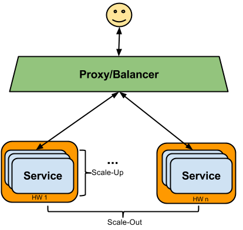
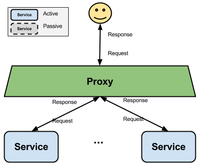
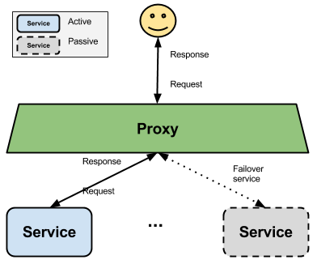

.. module:: clustering.introduction

.. _clustering.introduction:

Introduction To Clustering and High Availability
====================================================

Clustering techniques are used to improve performance and availability of a complex system. Generally speaking a cluster is intended as a redundant set of services providing the same set of functionalities.

Cluster quality can be measured by:

 * **Reliability** the ability to successfully provide responses on each incoming request
 * **Availability** the uptime of the server (usually measured as % of annual uptime)
 * **Performance** measured by the average of the time spent by the service to provide responses or by the throughput
 * **Scalability** is the ability to handle a growing amount of work in a capable manner without degradation in the quality of service (e.g. non-decreasing throughput)

High-availability
-----------------
High-availability (**HA**) clusters  are groups of services that can be reliably utilized with a minimum (or null) down-time. Without clustering, if a service crashes or is too busy, the user asking for that service will never get a quick response.
HA clustering should be designed to remedies this situation by detecting service down (using a **watchdog**), and immediately restarting it. During this operation the service will be provided by a failover instance of the same service.

Scalability
-----------------
Scaling a software usually means adding more instances of the product. We can distinguish two different ways of scaling:
 * **Horizontal Scalability** also known as *scale out* which can be performed by adding additional HW resources to the existing pool. In our context this means adding more physical or virtual machines with GeoServer installed.
 * **Vertical Scalability** also known as *scale up* which can be performed by getting more powerful hardware 
   (single box with more CPUs/memory), and that normally needs to be compounded by adding more SW instances as well on the same boxes (as
   in practice no software is 100% linearly scalable) 
   In our context this means installing more GeoServer instances on the existing HW to fully utilize available resources,
   in particular the extra CPUs.
 
.. note::
  Notice that in our context saying a *GeoServer instance* means a separate Java process running GeoServer (e.g. a Tomcat running instance).
  It is to be noticed that the main scalability bottleneck, the Java own rasterizer, is an issue in Oracle JDK, and can be reduced/eliminated
  by either installing OpenJDK instead of Oracle JDK, or by installing the `Marlin renderer <https://github.com/bourgesl/marlin-renderer>`_ in
  a Oracle JDK.

Here below you can find an illustration showing both scalability mode at the same time.

   
   Illustration: Horizontal VS Vertical Scalability

Cluster Configurations
----------------------
A cluster can be configured as:

* **Active/active** All the node of the cluster are active at the same time. The traffic is distributed on all the services.

   
   Illustration: Active/Active cluster configuration
   
This gives maximum performance but if a single HW instance fails the overall throughput and response time may suffer. On the other side this set-up provide maximum performance.

* **Active/passive** Provides a fully redundant instance of each node, which is only brought on-line when its associated primary node fails.

   
   Illustration: Active/Passive cluster configuration
   
This gives maximum availability but does not fully utilize all the resources available since at most times part of them will be not utilized.

