.. module:: load_balancing.iis

.. _load_balancing.iis:

Load Balancer Setup with IIS
^^^^^^^^^^^^^^^^^^^^^^^^^^^^
We are now going to configure Microsoft IIS webserver to act as a load balancer in front of the Tomcat instances we just configured.
This is a common set up on Windows systems, although it is possible to use Apache HTTPd on Windows as well.

Microsoft IIS implementation works with Virtual Directories and ISAPI Filters instead of Location and Modules like Apache HTTP.
The concept is very similar, despite the configuration is slightly more complex.

Let us now proceed with the configuration steps;
however before proceeding let us mention that most of the information we are going to report here can be found at this links 
(http://tomcat.apache.org/connectors-doc/reference/iis.html, http://tomcat.apache.org/connectors-doc/webserver\_howto/iis.html and http://tomcat.apache.org/connectors-doc/generic\_howto/workers.html).

Moreover we are assuming that IIS is properly installed together with the extension needed to create ISAPI filters on websites (we will use this feature extensively in the following).

It is eventually worth remarking that the prepackaged Apache Tomcat we configured contains already the ISAPI filter and its own configuration for both 32 and 64 bits.
They are located within the bin directory of the CATALINA\_HOME folder.

What's a Tomcat worker
""""""""""""""""""""""

A Tomcat worker is a Tomcat instance that is waiting to execute servlets on behalf of some web server.
For example, we can have a web server such as Apache forwarding servlet requests to a Tomcat process (the worker) running behind it.
The scenario described above is a very simple one; infact one can configure multiple Tomcat workers to serve servlets on behalf of a certain web server.
The reasons for such configuration can be:

  #. We want different contexts to be served by different Tomcat workers to provide a development environment where all the developers share the same web server but own a Tomcat worker of their own.
  #. We want different virtual hosts served by different Tomcat processes to provide a clear separation between sites belonging to different companies.
  #. We want to provide load balancing, meaning run multiple Tomcat workers each on a machine of its own and distribute the requests between them.

Step 1: Prepare isapi\_redirect folder
""""""""""""""""""""""""""""""""""""""

Download ISAPI redirector DLLs from here (http://www.apache.org/dist/tomcat/tomcat-connectors/jk/binaries/windows/), matching the architecture of the machine on which we will install.
This notice is to be taken into proper account as well:

“Note that in a 64 Bit environment - at least for IIS 7 - the used IIS Application Pool should have "Enable 32-bit Applications" set to "False".
Otherwise the redirector will not be called and returns an http code 404.
If you think, the 32bit version of isapi\_redirect.dll would do the job instead, you will get an http code 500, because the library is not loadable into a 64 Bit IIS.”

Once the file has been downloaded, extract the content into a folder which will be used to link the IIS virtual directory.
From now on we will assume the directory is::

  %TRAINING_ROOT%\Apache2.2\bin\win64

Create the following files inside the folder, modify them accordingly to your system setup

    * isapi\_redirect.properties
    * worker.properties
    * uriworkermap.properties
    * logs directory (where we will place the log files for the JK connector) 

Configure Properties Files
""""""""""""""""""""""""""

**isapi\_redirect.properties**

The ISAPI redirector read it's configuration from this properties file. The redirector will check for the properties file during initialization and will use it accordingly. The properties file must be placed in the same directory as the ISAPI redirector and named isapi\_redirect.properties i.e. with the same name as the ISAPI redirector DLL but with a .properties extension. A sample isapi\_redirect.properties can be found here below.

.. code-block:: xml

  # Configuration file for the Jakarta ISAPI Redirector

  # The path to the ISAPI Redirector Extension, relative to the website
  # This must be in a virtual directory with execute privileges
  extension_uri=\jakarta\isapi_redirect.dll

  # Full path to the log file for the ISAPI Redirector
  log_file=%TRAINING_ROOT%\Apache2.2\bin\win64\logs\isapi_redirect.%Y-%m-%d-%H.log
  # Log level (debug, info, warn, error or trace)
  log_level=error
  # Rotate the log file at 5 MB
  log_filesize=5M

  worker_file=%TRAINING_ROOT%\Apache2.2\bin\win64\worker.properties
  worker_mount_file=%TRAINING_ROOT%\Apache2.2\bin\win64\uriworkermap.properties
  uri_select=unparsed

  # A DWORD value representing the watchdog thread interval in seconds. The workers are maintained periodically by a background thread running periodically every watchdog_interval seconds. Worker maintenance checks for idle connections, corrects load status and is able to detect backend health status.
  watchdog_interval=5

It is worth to point out that additional information can be found at this (http://tomcat.apache.org/connectors-doc/reference/iis.html) link.
It is however worth to point out that in this file we can configure the logging for the redirector (here we have configured log rotation with level set to error) as well as the configuration for the workers that is instrumental to load balance the Tomcat instances we created.

**uriworkermap.properties**

This file maps URL-Path patterns to workers.
A sample uriworkermap.properties for mapping GeoServer URLs can be found here below.
Additional information can be found at this (http://tomcat.apache.org/connectors-doc/reference/uriworkermap.html) link.

.. code-block:: xml

  # *********** Begin uriworkermap.properties ***
  #
  # Simple worker configuration file
  #

  # Mount the Servlet context to the ajp13 worker
  /geoserver*=wlb
  /geoserver/*=wlb

  # ************* End uriworkermap.properties ****

**worker.properties**

This  file describes the host(s) and port(s) used by the workers (Tomcat instances). A sample workers.properties can be found here below. Additional information can be found here (http://tomcat.apache.org/connectors-doc/reference/workers.html).

It is worth to remark the following points:
* we are defining a load balancer worker to load balance between two workers that map to two different instances of Tomcat running on the same machine but on different ports for the AJP connectors
* we are using round robin with the same load factor (same load on both Tomcat instances)
* we also a defined a Status Worker which is responsible for the worker management. It is especially useful when combined with load balancer workers and as such it should be protected from external access (not performed in this configuration)
More on load balancing here (http://tomcat.apache.org/connectors-doc/generic_howto/loadbalancers.html).

.. code-block:: xml
  
  # ************ Begin worker.properties **************
  # Specifies the load balance factor when used with a load balancing worker.
  # Note:
  #  ----> lbfactor must be > 0
  #  ----> Low lbfactor means less work done by the worker.
  #worker.ajp13w.lbfactor=1

  # Specify the size of the open connection cache.
  #worker.ajp13.cachesize

  #------ DEFAULT LOAD BALANCER WORKER DEFINITION ----------------------
  #---------------------------------------------------------------------
  # The loadbalancer (type lb) worker perform weighted round-robin
  # load balancing with sticky sessions.
  # Note:
  #  ----> If a worker dies, the load balancer will check its state
  #        once in a while. Until then all work is redirected to peer
  #        worker.
  worker.wlb.type=lb
  worker.wlb.balanced_workers=ajp13w1, ajp13w2
  #  the balancer will pick the worker with the lowest current load, based on 
  #  how many requests the worker is currently serving
  worker.wlb.method=B

  # You should configure your environment slash... ps=\ on NT and / on UNIX
  # and maybe something different elsewhere.
  ps=\

  #------ ADVANCED MODE ------------------------------------------------
  #---------------------------------------------------------------------

  #------ DEFAULT worker list ------------------------------------------
  #---------------------------------------------------------------------
  #
  # The worker that your plugins should create and work with
  worker.list=wlb,jkstatus

  # Define a status Worker
  worker.jkstatus.type=status

  #------ DEFAULT ajp13 WORKER DEFINITION ------------------------------
  #---------------------------------------------------------------------

  # Defining a worker named ajp13 and of type ajp13
  # Note that the name and the type do not have to match.
  worker.ajp13w1.type=ajp13
  worker.ajp13w1.host=localhost
  worker.ajp13w1.port=8009
  worker.ajp13w1.lbfactor=1
  worker.ajp13w2.type=ajp13
  worker.ajp13w2.host=localhost
  worker.ajp13w2.port=8010
  worker.ajp13w2.lbfactor=1

  # ************ End worker.properties **************

  /jkmanager=jkstatus

Configuring IIS as the webserver
""""""""""""""""""""""""""""""""

Now we need to configure IIS. Start by creating a virtual directory and give it an alias of ‘jakarta’ as shown here. Incidentally, you don’t have to call the virtual directory ‘jakarta’ - you can actually give it any name you like, just so long as the name you choose appears in the extension\_uri line of your isapi\_redirect.properties file.

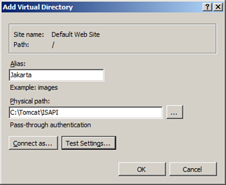

Next we need to configure the virtual directory to have execute permission. This was a simple tick-box option in IIS 6.0 but in IIS 7.0 we need to click on the Jakarta virtual directory and then double-click Handler Mappings. 

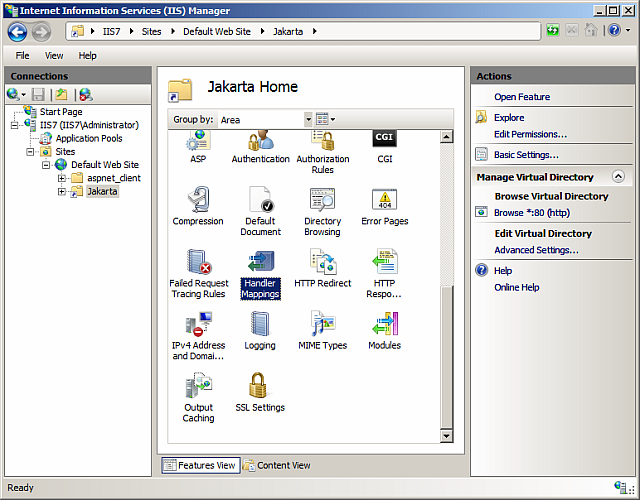

Within the Handler Mappings feature click Edit Feature Permissions in the Actions Pane.

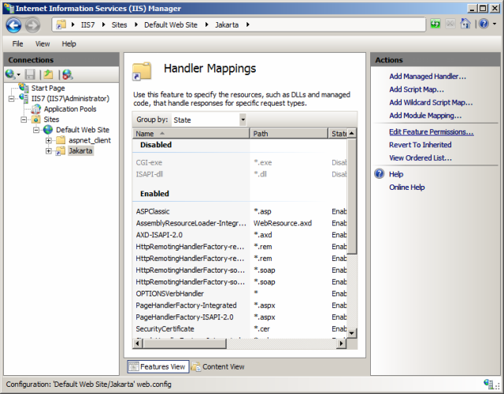

Click Execute in the Edit Feature Permissions dialog box and click OK.

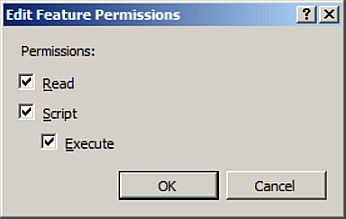

In the Handler Mappings feature you can now see that calls to ISAPI-dll files are enabled.

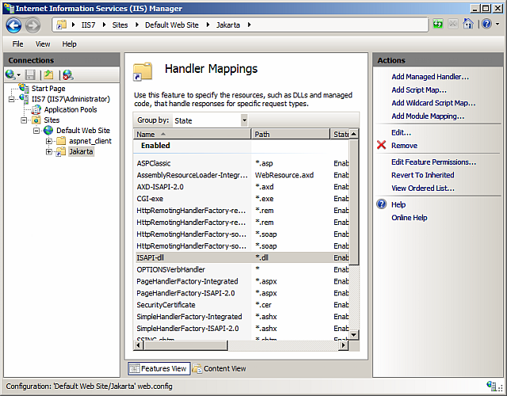
   

The next step is to add an ISAPI filter on the web site. To do this click on the web site and then double-click the ISAPI Filters feature.

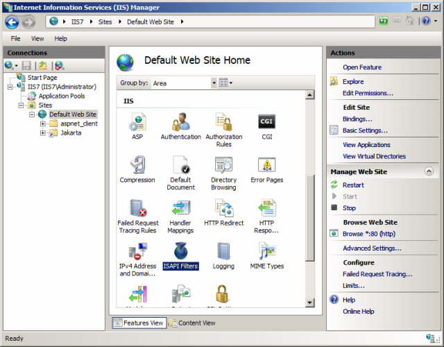

In the Actions pane click Add.

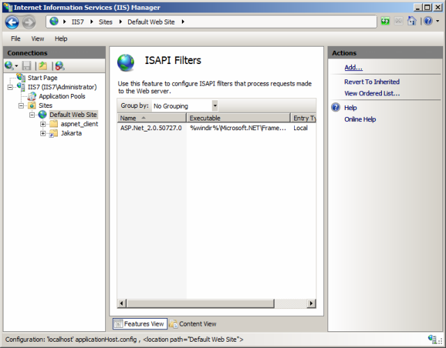

In the Add ISAPI Filter dialog box enter a name and the path to the isapi\_redirect.dll file and click OK.

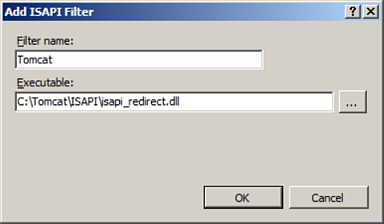
   

The Tomcat ISAPI filter should now appear in the ISAPI Filters list as shown here.

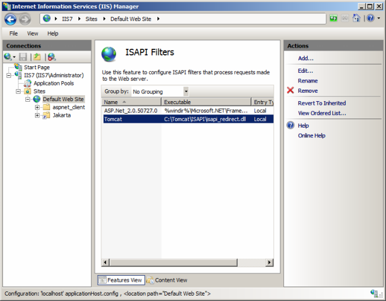

The final step we need to take is to configure the ISAPI and CGI Restrictions feature in IIS 7.0. This is analogous to adding or allowing a Web Service Extension in IIS 6.0. In IIS Manager navigate to the Server Home and then double-click on the ISAPI and CGI Restrictions feature.

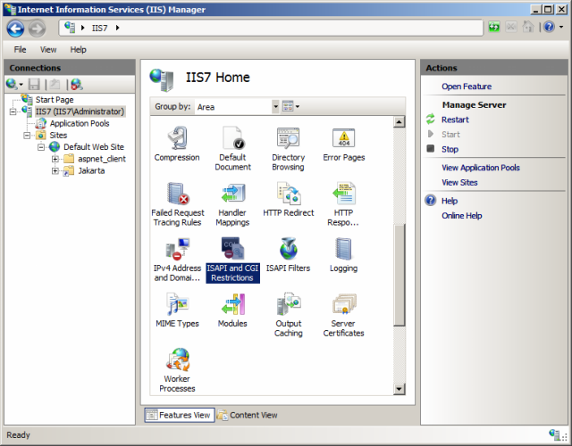

In the ISAPI and CGI Restrictions feature click Add on the Actions pane.

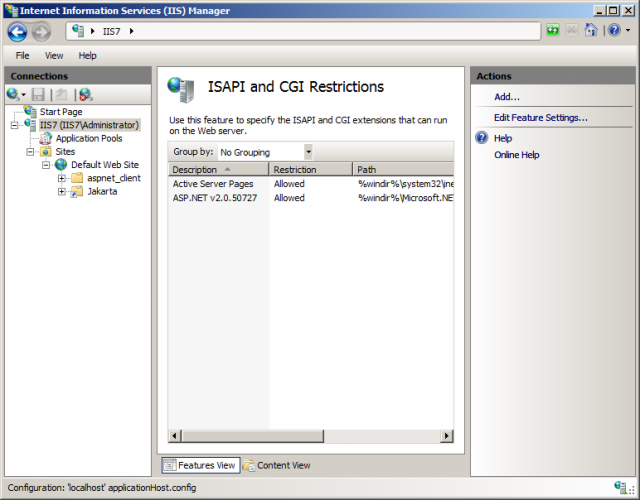

In the Add ISAPI or CGI Restriction dialog box enter a name and the path to the isapi\_redirect.dll file, tick the Allow extension path to execute option and click OK.

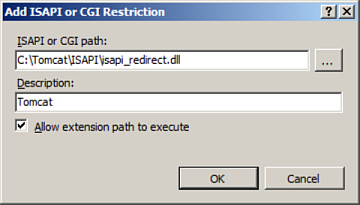

The Tomcat ISAPI extension should now appear in the list with a Restriction status of allowed.

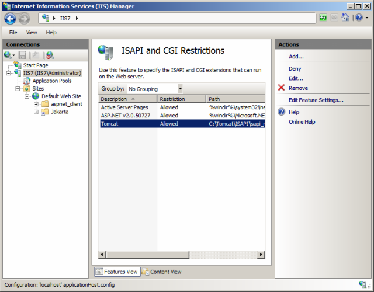

On “Application Pool”

* “DefaultAppPool” or “Advanced Settings” -> **Make sure 32 bit application is disabled if the target architecture is 64 bits**
  
Restart both IIS web site and from “Services” the IIS Administration Service Check the logs both under

* iis\_redirect dll folder
* inetpub/Logs/LogFiles

Annex: Cluster Basic Authentication with IIS 
""""""""""""""""""""""""""""""""""""""""""""""""""""""""""""""""

1) Enable IIS Basic Authentication on redirect Virtual Folder and DISABLE the Anonymous one

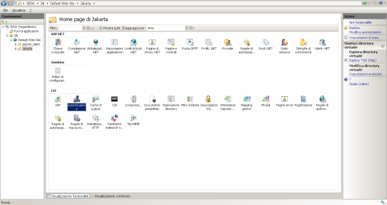
   
   
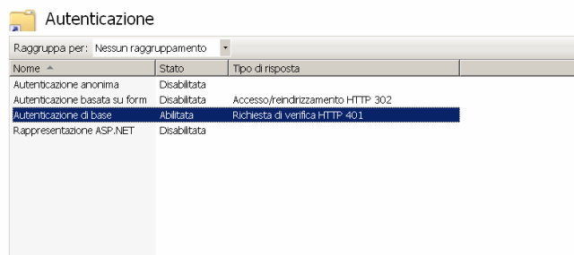
   

2) Access the GeoServer ADMIN page through the MASTER Instance and go to the “Authorization” Menu

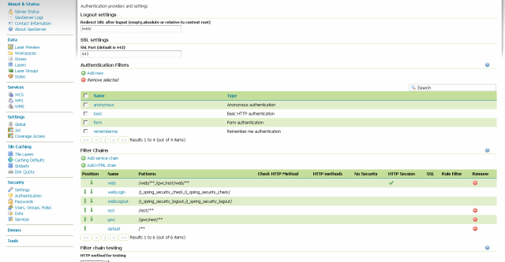

Look for the “Filter Chains”, and one by one (except for webLogout) make sure the “basic” interceptor is the first one for each chain

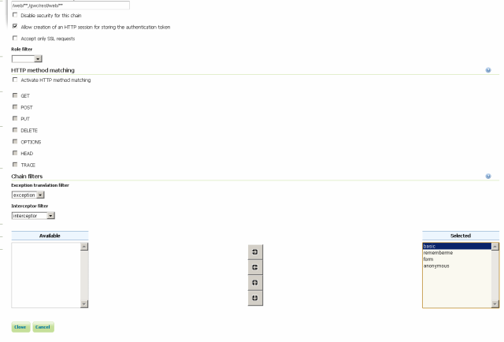
   
   

  