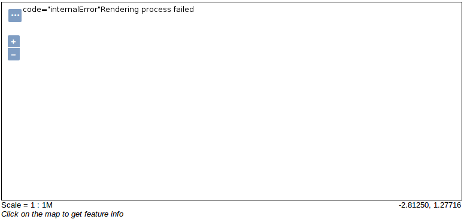
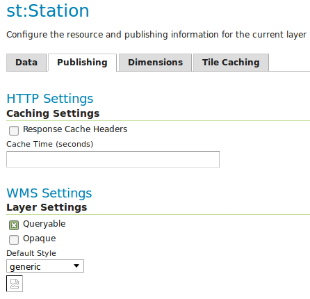
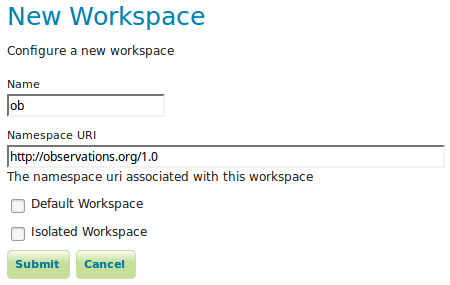
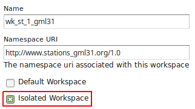
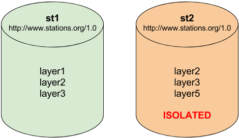

.. module:: hale.faq
   :synopsis: Frequently asked questions about HALE, App-Schema, GML and GeoServer.

.. _hale.faq:

.. include:: <isonum.txt>

Frequently Asked Questions
==========================

WMS *GetMap* request throws a rendering exception
-----------------------------------------------

This usually happens when GeoServer can't decide automatically which attribute of the complex feature type is the default geometry.

If that's the case, the result of a WMS *GetMap* request will produce a result similar to this one:

... and the log of GeoServer should contain a stack trace similar to this one:

.. include:: includes/default_geometry_stack_trace.txt

If the complex feature type has an attribute that can be used as the default geometry, then we can overcome this situation by explicitly setting the default geometry attribute |2018| in the App-Schema mappings file.

Consider the following complex feature represented in GML:

.. include:: includes/default_geometry_station.txt

... in this case, attribute ``st:location\st:position`` of *Station* feature type should be used as the default geometry attribute:

.. include:: includes/default_geometry_mapping.txt

Configuration element ``<defaultGeometry>st:location/st:position</defaultGeometry>`` instructs GeoServer to use ``st:location/st:position`` attribute of *Station* feature type as the default geometry.

WMS *GetMap* throws a *generic.sld* style not found exception
-------------------------------------------------------------

When the following exception is returned by a WMS *GetMap* request:

.. include:: includes/default_style_error.txt

... it means that a style needs to be selected for the complex feature layer.

When configuring a layer, GeoServer tries to automatically select a style based on the geometry type of the featrue type. If this automatic guess fails is up tot he user to select a valid style:

To overcome this issue just select a style that is compatible with the layer.

NULL name-spaces in GML output
-----------------------------

It may happen that when querying a complex feature type and requesting a GML output that some name-spaces may appear as ``null``:

.. include:: includes/gml_null_namespaces.txt

... the usual cause of this is that all the necessary names-paces were not defined in GeoServer. In this case three name-spaces are necessary:

  * st |rarr| http://stations.org/1.0
  * ob |rarr| http://observations.org/1.0
  * pr |rarr| http://parameters.org/1.0

To overcome this issue we just need to define the missing name-space *http://observations.org/1.0* in Geoserver:

Is worth mentioning that when using HALE this issue should not happen, since HALE should automatically create all the necessary names-spaces.

.. note:: There was a long standing issue in GeoServer introducing ``null`` name-spaces in GML when virtual services were used, that issue as been fixed |2018| in recent versions of GeoServer.

Publishing the same complex feature type multiple times
-------------------------------------------------------

Sometimes the same complex feature type needs to be published multiple times with a different mapping and with the same name. This can be done in GeoServer using isolated workspaces |2018| functionality. To create an isolated workspace we just need to check the Isolated Workspace check-box:

The concept of isolated workspaces was introduced to allow multiple workspaces with the same name-space. The resources contained by an workspace can be referenced by the workspace prefix or by the workspace name-space. If two workspaces have the same name-space we need to have a way to prioritize which workspace should be considered. This is where isolated workspaces come in.

Consider the following image which shows to workspaces (*st1* and *st2*) that use the same name-space (http://www.stations.org/1.0) and several layers contained by them:

It is only possible to create two or more workspaces with the same name-space in GeoServer if at least one of them is marked as isolated, in the example above *st2* is the isolated workspace. Consider the following WFS *GetFeature* requests:

  #. ``http://<host>/geoserver/ows?service=WFS&version=2.0.0&request=DescribeFeatureType&`` **typeName=layer2**
  #. ``http://<host>/geoserver/st2/ows?service=WFS&version=2.0.0&request=DescribeFeatureType&`` **typeName=layer2**
  #. ``http://<host>/geoserver/ows?service=WFS&version=2.0.0&request=DescribeFeatureType&`` **typeName=st1:layer2**
  #. ``http://<host>/geoserver/st2/ows?service=WFS&version=2.0.0&request=DescribeFeatureType&`` **typeName=st2:layer2**
  #. ``http://<host>/geoserver/ows?service=WFS&version=2.0.0&request=DescribeFeatureType&`` **typeName=st2:layer2**
  #. ``http://<host>/geoserver/ows?service=WFS&version=2.0.0&request=DescribeFeatureType&`` **typeName=layer5**

The first request is targeting WFS global service and requesting *layer2*, this request will use *layer2* contained by workspace *st1*. The second request is targeting *st2* workspace WFS virtual service, *layer2* belonging to workspace *st2* will be used. Requests three and four will use *layer2* belonging to workspace, respectively, *st1* and *st2*. The last two requests will fail saying that the layer was not found.

.. note:: The rule of thumb is that resources (layers, styles, etc ...) belonging to an isolated workspace can only be retrieved when using the workspace virtual service and will only show up in that virtual service capabilities document.

JSON-LD and GeoJSON output formats support
------------------------------------------

GeoServer App-Schema plugin now supports JSON-LD and GeoJSON output formats on WFS GetFeature requests.  GeoJSON is supported on the core meanwhile JSON-LD is supported via the `JSON-LD community plugin <https://docs.geoserver.org/latest/en/user/community/json-ld/index.html>`_.

* *GeoJSON output format:* application/json
* *JSON-LD output format:* application/ld+json

HTTP Filter body and mapping files are still XML based only.