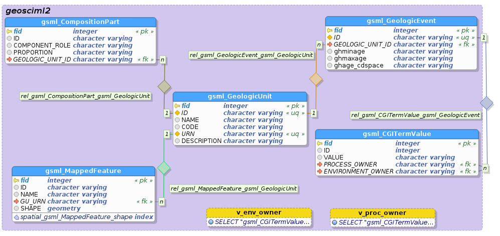
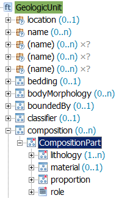
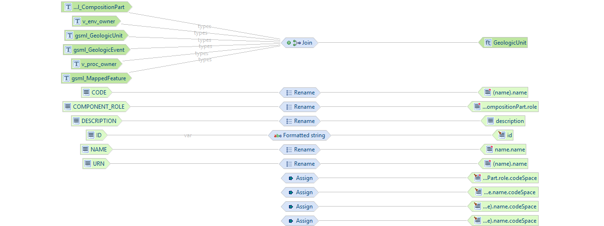
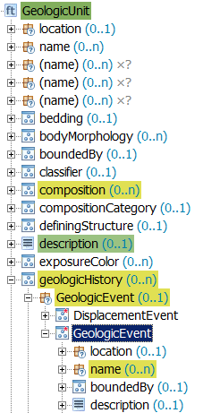
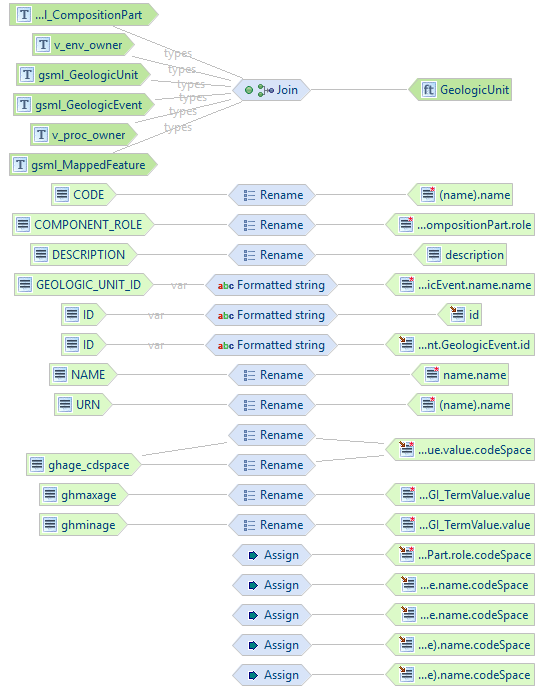
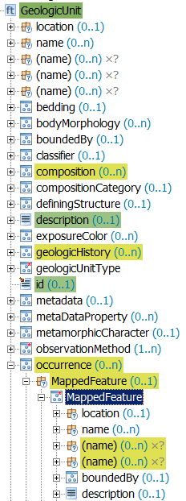
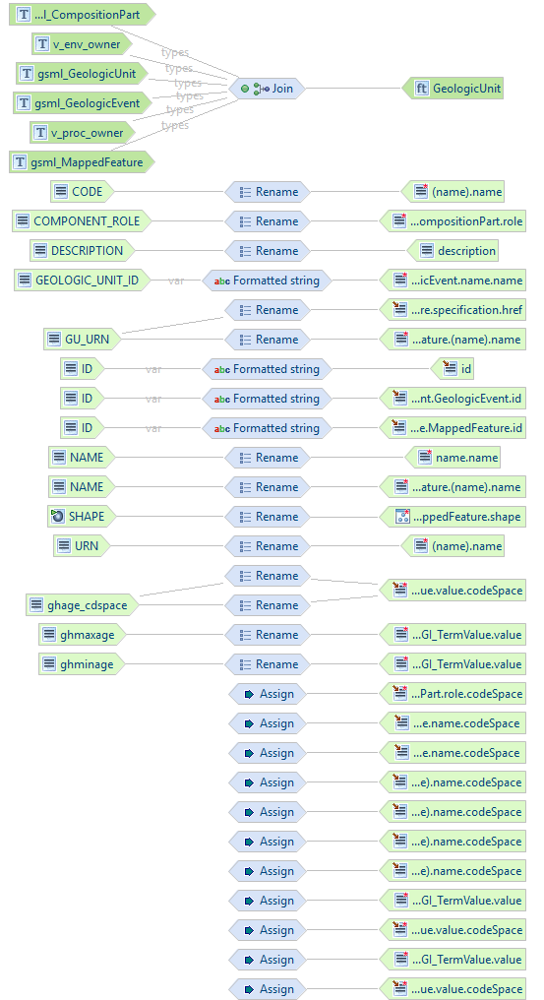
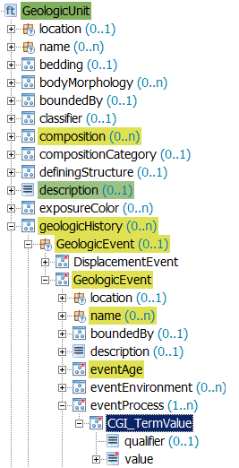
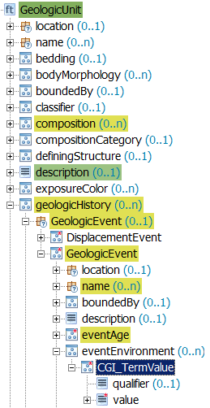
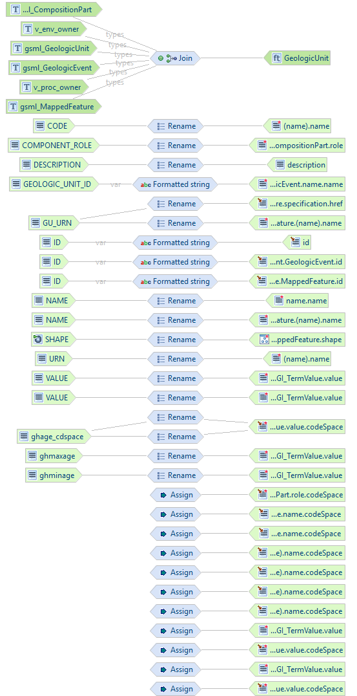

.. module:: hale.gsml_alignment
.. _hale.gsml_alignment:

.. include:: <isonum.txt>

Defining the alignment
----------------------

.. include:: ../common/alignment_intro.txt

This example follows closely the mapping described in the `GeoServer Application Schema <http://docs.geoserver.org/latest/en/user/data/app-schema/feature-chaining.html>`_ documentation to illustrate Feature Chaining. The data model is also taken from there, but we will read the input data from a single PostGIS database, instead of separate property files, which is also a good practice performance-wise.

.. _er_descr:

The structure of the database is illustrated in the following E/R diagram:

The tables roughly have a 1:1 correspondence to types in the GeoSciML 2.0 schema: **CGI_TermValue**, **CompositionPart**, **GeologicUnit**, **GeologicEvent** and **MappedFeature** and are linked by several relationships:

* a *GeologicUnit* is composed of one or more *CompositionPart* instances
* a *GeologicUnit* can be associated to many *GeologicEvent* instances, that make up its geological history
* a *GeologicUnit* can be associated to many *MappedFeature* instances, that represent distinct occurrences of it on the Earth's surface
* *GeologicEvent* has two attributes, *eventEnvironment* and *eventProcess**, whose value is taken from a controlled vocabulary, whose terms are stored in the *gsml_CGITermValue* table

*v_env_onwer* is a view of *gsml_CGITermValue* which selects only the terms describing a geologic environment; *v_proc_onwer* is a view of *gsml_CGITermValue* which selects only the terms describing a geologic process. The meaning and purpose of these views will be clear later, as we proceed with the mapping.

*GeologicUnit*, *GeologicEvent* and *MappedFeature* are the feature types that we want to define. Once the App-Schema datastore has been created in GeoServer, they will be individually accessible and at the same time properly nested in the generated GML output. Non-feature types, *CompositionPart* and *CGI_TermValue*, won't be individually accessible, but will nonetheless be properly nested in their container feature types.

.. include:: ../common/compatibility.txt

Joining the tables
++++++++++++++++++

From the :ref:`description above <er_descr>` it should be evident that all source types (i.e. the database tables) are linked to one another and that all target types may be nested into *GeologicUnit*, either directly (*CompositionPart*, *GeologicEvent*, *MappedFeature*) or indirectly (*CGI_TermValue*). The best way to express this situation in HALE is to define a **Join** relation, which merges multiple instances of different source types into one instance of the target type (in our case, *Geologicunit*).

If the trasfromed data is exported, HALE will generate a target dataset having one **GeologicUnit** instance for each record in the **gsml_GeologicUnit** table, inside of which **CompositionPart**, **GeologicEvent** and **MappedFeature** instances are nested (one for each record in the corresponding source table). However, after the alignment is exported to an App-Schema configuration and uploaded to GeoServer, three distinct feature types will be added to the catalog, *GeologicUnit*, *GeologicEvent* and *MappedFeature*: each will be qeryable individually, and nested features will be properly lined inside the containing feature.

To define the *Join* relation, follow these steps

#. Select the *gsml_CompositionPart*, *gsml_GeologicUnit*, *gsml_GeologicEvent*, *gsml_MappedFeature*, *v_env_owner* and *v_proc_owner* types in the *Source* section of the *Schema Explorer* view
   
.. note:: You may be wondering why we are selecting *v_env_owner* and *v_proc_owner*, leaving out *gsml_CGITermValue*; the reason is that *gsml_CGITermValue* should be joined to *gsml_GeologicEvent* twice, once to get to the environment term, and once to get to the process term, but HALE does not allow to specify the same source type twice in a single *Join* relation, so we had to create two separate views.
	     
#. Select the *GeologicUnit* type in the *Target* section of the *Schema Explorer* view
#. Click on the blue double-pointing arrow icon in between the *Source* and *Target* sections of the *Schema Explorer* view and select *Join* from the popup menu

   .. figure:: img/hale_join_gsml.png
      :align: center       
	       
#. A wizard will open. Verify the first screen looks like the figure below, and click on the **Next** button:

   .. figure:: img/hale_join_sel_entities_gsml.png
      :align: center

#. Configure the join order. The join order should follow the nesting order, i.e. the container (base) type should always precede the nested (join) type (see figure below).

   .. figure:: img/hale_join_order_gsml.png
      :align: center

.. _join_gsml:

#. For each pair of tables to join, define the join conditions, specifying which columns contain equal values (i.e. define a foreing key constraint).

   .. figure:: img/hale_join_first_cond_gsml.png
      :align: center

      *Join condition between gsml_GeologicUnit (base type) and gsml_CompositionPart (join type)*

   .. figure:: img/hale_join_second_cond_gsml.png
      :align: center
	      
      *Join condition between gsml_GeologicUnit (base type) and gsml_MappedFeature (join type)*

   .. figure:: img/hale_join_third_cond_gsml.png
      :align: center
	      
      *Join condition between gsml_GeologicUnit (base type) and gsml_GeologicEvent (join type)*

   .. figure:: img/hale_join_fourth_cond_gsml.png
      :align: center
	      
      *Join condition between gsml_GeologicEvent (base type) and v_proc_owner (join type)*

   .. figure:: img/hale_join_fifth_cond_gsml.png
      :align: center
	      
      *Join condition between gsml_GeologicEvent (base type) and v_env_owner (join type)*

.. include:: ../common/note_single_cond_join.txt
	     
#. Click on the **Finish** button and the *Alignment* view should now look like the following:

   .. figure:: img/hale_join_complete_gsml.png
      :align: center

      *Join mapping is now complete*

Now that the type relations have been defined, it is time to configure the relations between source and target properties.

Mapping gsml_GeologicUnit to GeologicUnit
+++++++++++++++++++++++++++++++++++++++++
The **gsml_GeologicUnit** properties will be mapped to properties of the **GeologicUnit** target type.

First, We will use the **ID** source property to populate the **gml:id** target property, but, instead of using the value of the property as is, we will prepend the string **gu.** to it, using the **Formatted String** transformation function:

#. Select the *gsml_GeologicUnit/ID* property in the *Source* section of the *Schema Explorer* view
#. Select the *GeologicUnit/id* property in the *Target* section of the *Schema Explorer* view
#. Click on the blue double-pointing arrow icon in between the *Source* and *Target* sections of the *Schema Explorer* view and select *Formatted string* from the popup menu
#. A wizard will open. Click **Next** on the first screen and, on the second screen, define the format pattern by typing **gu.** and then double-clicking on *ID* in the **Available variables** section, as shown in the figure below:

   .. figure:: img/hale_format_pattern_gsml.png
	       
#. Click on the **Finish** button and the alignment should now look like the following:

   .. figure:: img/hale_after_id_mapping_gsml.png

Now we will directly map the **DESCRIPTION** source property to the **gml:description** target property, using the **Rename** transformation function, which simply copies source to target.

#. Select the *gsml_GeologicUnit/DESCRIPTION* property in the *Source* section of the *Schema Explorer* view
#. Select the *GeologicUnit/description* property in the *Target* section of the *Schema Explorer* view
#. Click on the blue double-pointing arrow icon in between the *Source* and *Target* sections of the *Schema Explorer* view and select *Rename* from the popup menu
#. A wizard will open. Click on the **Finish** button and the alignment should now look like the following:

   .. figure:: img/hale_after_description_mapping_gsml.png
      
Finally, we will map three properties, **NAME**, **CODE** and **URN** to the same multi-valued target property **GeologicUnit/name**.

.. include:: ../common/instance_context_expl.txt

.. _create_instance_contexts:

Follow these steps to create the required instance contexts:

#. In the *Target* section of the *Schema Explorer* view, navigate to the *GeologicUnit/name* property.
#. Right-click on the property name and select *Add instance context* from the popup menu (see figure below).

   .. figure:: img/hale_name_instance_context_gsml.png
      :align: center

#. Repeat the previous step two times more, and now three copies of the *name* property should be visible in your *Schema Explorer* view:

   .. figure:: img/hale_name_instance_context_created_gsml.png
      :align: center

We are now ready to define the missing relations:

#. Map the *gsml_GeologicUnit/NAME* source property to the *GeologicUnit/name* target property of the **first** instance context, using the *Rename* transformation function.
#. We will now assign a constant value to the *GeologicUnit/name/codeSpace* target property of the **first** instance context, using the **Assign** transformation function:

   * Select the property in the *Target* section of the *Schema Explorer* view
   * Click on the button in between the *Source* and *Target* sections of the *Schema Explorer* view and select *Assign* from the popup menu.
   * A wizard will open. Click **Next** on the first screen and, on the second screen, type the value *urn:x-test:classifierScheme:TestAuthority:GeologicUnitName* in the text field.
   * Click on the **Finish** button.

#. Map the *gsml_GeologicUnit/CODE* source property to the *GeologicUnit/name* target property of the **second** instance context, using the *Rename* transformation function.
#. Map the constant value *urn:x-test:classifierScheme:TestAuthority:GeologicUnitName* to the *GeologicUnit/name/codeSpace* target property of the **second** instance context, using the *Assign* transformation function.
#. Map the *gsml_GeologicUnit/URN* source property to the *GeologicUnit/name* target property of the **third** instance context, using the *Rename* transformation function.
#. Map the constant value *urn:x-test:classifierScheme:TestAuthority:GeologicUnitName* to the *GeologicUnit/name/codeSpace* target property of the **third** instance context, using the *Assign* transformation function.

Mapping gsml_CompositionPart to CompositionPart
+++++++++++++++++++++++++++++++++++++++++++++++
The **gsml_CompositionPart** properties will be mapped to properties of the **CompositionPart** target type. Be careful, though, because we will not pick the properties of the top level *CompositionPart* type (which is immediately visible in the *Target* section of the *Schema Explorer* view), but we will reach for the *CompositionPart* property nested under the *composition* property of the *GeologicUnit* type (see figure below), and map to its child properties.

   *We want to map to the child properties of the CompositionPart property nested in the GeologicUnit type*

Since at this stage you should be familiar with the process of defining a relation, from now on we will describe the required steps more succintly.

#. Map the *gsml_CompositionPart/COMPONENT_ROLE* source property to the *CompositionPart/composition/role* target property using the *Rename* transformation function.
#. We will now assign a constant value to the *CompositionPart/composition/role/codeSpace* target property, using the **Assign** transformation function. Select the property in the *Target* section of the *Schema Explorer* view, click on the button in between the *Source* and *Target* sections of the *Schema Explorer* view and select *Assign* from the popup menu
#. A wizard will open. Click **Next** on the first screen and, on the second screen, type the value *urn:cgi:classifierScheme:GSV:CompositionpartRole* in the text field.
#. Click on the **Finish** button and the alignment should now look like the following:

Mapping gsml_GeologicEvent to GeologicEvent
+++++++++++++++++++++++++++++++++++++++++++
The **gsml_GeologicEvent** properties will be mapped to properties of the **GeologicEvent** target type. Similarly to what we did for *CompositionPart*, we will not pick the properties of the top level *GeologicEvent* type (which is immediately visible in the *Target* section of the *Schema Explorer* view), but we will reach for the *GeologicEvent* property nested under the *geologicHistory* property of the *GeologicUnit* type, and map to its child properties.

   *We want to map to the child properties of the GeologicEvent property nested in the GeologicUnit type*

Define the following relations:

#. Map the *gsml_GeologicEvent/ID* source property to the *GeologicUnit/geologicHistory/GeologicEvent/GeologicEvent/id* target property using the *Formatted string* transformation function. Use **ge.{ID}** as format pattern.
#. Map the *gsml_GeologicEvent/GEOLOGIC_UNIT_ID* source property to the *GeologicUnit/geologicHistory/GeologicEvent/GeologicEvent/name/name* target property using the *Formatted string* transformation function. Use **gu.{GEOLOGIC_UNIT_ID}** as format pattern.
#. Map the constant value *urn:cgi:classifierScheme:GSV:GeologicalUnitId* to the *GeologicUnit/geologicHistory/GeologicEvent/GeologicEvent/name/name/codeSpace* target property using the *Assign* transformation function.
#. Map the *gsml_GeologicEvent/ghminage* source property to the *GeologicUnit/geologicHistory/GeologicEvent/GeologicEvent/eventAge/CGI_Value /CGI_TermRange/lower/CGI_TermValue/value* target property using the *Rename* transformation function.
#. Map the *gsml_GeologicEvent/ghage_cdspace* source property to the *GeologicUnit/geologicHistory/GeologicEvent/GeologicEvent/eventAge/CGI_Value /CGI_TermRange/lower/CGI_TermValue/value/codeSpace* target property using the *Rename* transformation function.
#. Map the *gsml_GeologicEvent/ghmaxage* source property to the *GeologicUnit/geologicHistory/GeologicEvent/GeologicEvent/eventAge/CGI_Value /CGI_TermRange/upper/CGI_TermValue/value* target property using the *Rename* transformation function.
#. Map the *gsml_GeologicEvent/ghage_cdspace* source property to the *GeologicUnit/geologicHistory/GeologicEvent/GeologicEvent/eventAge/CGI_Value /CGI_TermRange/upper/CGI_TermValue/value/codeSpace* target property using the *Rename* transformation function.
#. The alignment should now look like the following:

Mapping gsml_MappedFeature to MappedFeature
+++++++++++++++++++++++++++++++++++++++++++
The **gsml_MappedFeature** properties will be mapped to properties of the **GeologicEvent** target type. As we did before, we will not pick the properties of the top level *MappedFeature* type (which is immediately visible in the *Target* section of the *Schema Explorer* view), but we will reach for the *MappedFeature* property nested under the *occurrence* property of the *GeologicUnit* type, and map to its child properties.

   *We want to map to the child properties of the MappedFeature property nested in the GeologicUnit type*

Define the following relations:

#. Map the *gsml_MappedFeature/ID* source property to the *GeologicUnit/occurrence/MappedFeature/MappedFeature/id* target property using the *Formatted string* transformation function. Use **mf.{ID}** as format pattern.
#. Map the *gsml_MappedFeature/GU_URN* source property to the *GeologicUnit/occurrence/MappedFeature/MappedFeature/specification/href* target property using the *Rename* transformation function.
#. Map the *gsml_MappedFeature/NAME* and *gsml_MappedFeature/GU_URN* source properties to the multi-valued *GeologicUnit/occurrence/MappedFeature/MappedFeature/name* target property using the *Rename* transformation function. Create two instance contexts :ref:`as shown above <create_instance_contexts>`.
#. Map the constant value *urn:cgi:classifierScheme:GSV:GeologicalUnitLabel* to the *GeologicUnit/occurrence/MappedFeature/MappedFeature/name/codeSpace* target property of both instance contexts, using the *Assign* transformation function.
#. Map the *gsml_MappedFeature/SHAPE* source property to the *GeologicUnit/occurrence/MappedFeature/MappedFeature/shape* target property using the *Rename* transformation function.   
#. Map the constant value *urn:ogc:def:nil:OGC:missing* to the *GeologicUnit/occurrence/MappedFeature/MappedFeature/observationMethod/ CGI_TermValue/value* target property using the *Assign* transformation function.
#. Map the constant value *urn:ietf:rfc:2141* to the *GeologicUnit/occurrence/MappedFeature/MappedFeature/observationMethod/ CGI_TermValue/value/codeSpace* target property using the *Assign* transformation function.
#. Map the constant value *urn:ogc:def:nil:OGC:missing* to the *GeologicUnit/occurrence/MappedFeature/MappedFeature/positionalAccuracy/ CGI_Value/CGI_TermValue/value* target property using the *Assign* transformation function.
#. Map the constant value *urn:ietf:rfc:2141* to the *GeologicUnit/occurrence/MappedFeature/MappedFeature/positionalAccuracy/ CGI_Value/CGI_TermValue/value/codeSpace* target property using the *Assign* transformation function.
#. The alignment should now look like the following:

Mapping controlled vocabulary terms
+++++++++++++++++++++++++++++++++++

Mapping v_proc_owner to CGI_TermValue
^^^^^^^^^^^^^^^^^^^^^^^^^^^^^^^^^^^^^
The **v_proc_owner** properties will be mapped to properties of the **CGI_TermValue** target type nested under the *eventProcess* property of the *GeologicEvent* type, which is itself nested under the *geologicHistory* property of the *GeologicUnit* type.

   *We want to map to the child properties of the CGI_TermValue property nested in the eventProcess property of the GeologicEvent type*

We will define just one relation:

#. Map the *v_proc_owner/VALUE* source property to the *GeologicUnit/geologicHistory/GeologicEvent/GeologicEvent/eventProcess/CGI_TermValue/value* target property using the *Rename* transformation function.

Mapping v_env_owner to CGI_TermValue
^^^^^^^^^^^^^^^^^^^^^^^^^^^^^^^^^^^^

The **v_env_owner** properties will be mapped to properties of the **CGI_TermValue** target type nested under the *eventEnvironment* property of the *GeologicEvent* type, which is itself nested under the *geologicHistory* property of the *GeologicUnit* type.

   *We want to map to the child properties of the CGI_TermValue property nested in the eventEnvironment property of the GeologicEvent type*

We will define just one relation:

#. Map the *v_env_owner/VALUE* source property to the *GeologicUnit/geologicHistory/GeologicEvent/GeologicEvent/eventEnvironment/CGI_TermValue/value* target property using the *Rename* transformation function.

The final version of the alignment should look like the following:

Mapping table overview
++++++++++++++++++++++
The following table summarizes the mappings performed previously

.. csv-table:: GeoSciML mappings
    :header: "source property", "target property", "type of mapping"
    :widths: 40, 40, 10

    "gsml_GeologicUnit/ID", "GeologicUnit/id ", "Formatted string (**gu.{ID}**)"
    "gsml_GeologicUnit/DESCRIPTION", "GeologicUnit/description", "Rename"
    "*gsml_GeologicUnit/NAME*", "GeologicUnit/name", "Rename"
    "urn:x-test:classifierScheme:TestAuthority:GeologicUnitName", "GeologicUnit/name/codeSpace", "Assign"
    "*gsml_GeologicUnit/CODE*", "GeologicUnit/name", "Rename"
    "urn:x-test:classifierScheme:TestAuthority:GeologicUnitName", "GeologicUnit/name/codeSpace", "Assign"
    "*gsml_GeologicUnit/URN*", "GeologicUnit/name", "Rename"
    "urn:x-test:classifierScheme:TestAuthority:GeologicUnitName", "GeologicUnit/name/codeSpace", "Assign"
    "gsml_CompositionPart/COMPONENT_ROLE", "CompositionPart/composition/role", "Rename"
    "urn:cgi:classifierScheme:GSV:CompositionpartRole", "CompositionPart/composition/role/codeSpace", "Assign"
    "gsml_GeologicEvent/ID", "/GeologicEvent/GeologicEvent/id", "Formatted string (**ge.{ID}**)"
    "gsml_GeologicEvent/GEOLOGIC_UNIT_ID", "GeologicUnit/geologicHistory/GeologicEvent/GeologicEvent/name/name", "Formatted string (**gu.{ID}**)"
    "urn:cgi:classifierScheme:GSV:GeologicalUnitId", "GeologicUnit/geologicHistory/GeologicEvent/GeologicEvent/name/name/codeSpace", "Assign"
    "gsml_GeologicEvent/ghminage", "GeologicUnit/geologicHistory/GeologicEvent/GeologicEvent/eventAge/CGI_Value/CGI_TermRange/lower/CGI_TermValue/value", "Rename"
    "gsml_GeologicEvent/ghage_cdspace", "GeologicUnit/geologicHistory/GeologicEvent/GeologicEvent/eventAge/CGI_Value/CGI_TermRange/lower/CGI_TermValue/value/codeSpace", "Rename"
    "gsml_GeologicEvent/ghmaxage", "GeologicUnit/geologicHistory/GeologicEvent/GeologicEvent/eventAge/CGI_Value /CGI_TermRange/upper/CGI_TermValue/value", "Rename"
    "gsml_GeologicEvent/ghage_cdspace", "GeologicUnit/geologicHistory/GeologicEvent/GeologicEvent/eventAge/CGI_Value /CGI_TermRange/upper/CGI_TermValue/value/codeSpace", "Rename"
    "gsml_MappedFeature/ID", "GeologicUnit/occurrence/MappedFeature/MappedFeature/id ", "Formatted string (**mf.{ID}**)"
    "gsml_MappedFeature/GU_URN", "GeologicUnit/occurrence/MappedFeature/MappedFeature/specification/href", "Rename"
    "*gsml_MappedFeature/NAME*", "GeologicUnit/occurrence/MappedFeature/MappedFeature/name", "Rename"
    "urn:cgi:classifierScheme:GSV:GeologicalUnitLabel", "GeologicUnit/name/codeSpace", "Assign"
    "*gsml_MappedFeature/GU_URN*", "GeologicUnit/occurrence/MappedFeature/MappedFeature/name", "Rename"
    "urn:cgi:classifierScheme:GSV:GeologicalUnitLabel", "GeologicUnit/occurrence/MappedFeature/MappedFeature/name/codeSpace", "Assign"
    "gsml_MappedFeature/SHAPE", "GeologicUnit/occurrence/MappedFeature/MappedFeature/shape", "Rename"
    "urn:ogc:def:nil:OGC:missing", "GeologicUnit/occurrence/MappedFeature/MappedFeature/observationMethod/CGI_TermValue/value", "Assign"
    "urn:ietf:rfc:2141", "GeologicUnit/occurrence/MappedFeature/MappedFeature/observationMethod/CGI_TermValue/value/codeSpace", "Assign"
    "urn:ogc:def:nil:OGC:missing", "GeologicUnit/occurrence/MappedFeature/MappedFeature/positionalAccuracy/CGI_Value/CGI_TermValue/value", "Assign"
    "urn:ietf:rfc:2141", "GeologicUnit/occurrence/MappedFeature/MappedFeature/positionalAccuracy/CGI_Value/CGI_TermValue/value/codeSpace", "Assign"

.. note:: Source properties items marked in *italic* are created using the :ref:`instance contexts <create_instance_contexts>`.

   
Congratulations, the mapping is now complete. You can jump to the :ref:`next section <hale.gsml_upload>` to learn how your alignment can be exported to an App-Schema mapping configuration and uploaded to GeoServer.
