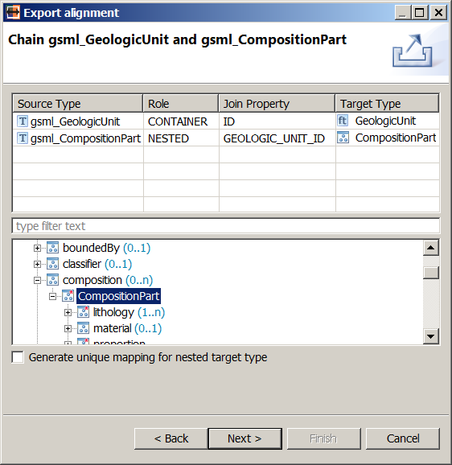
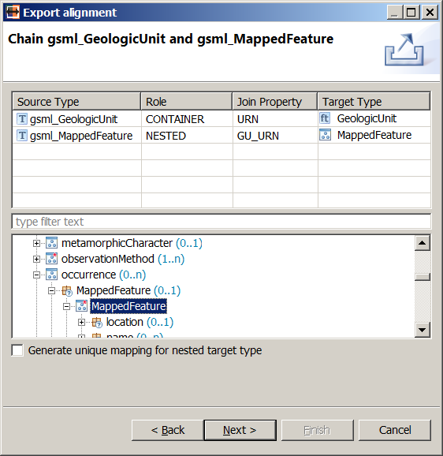
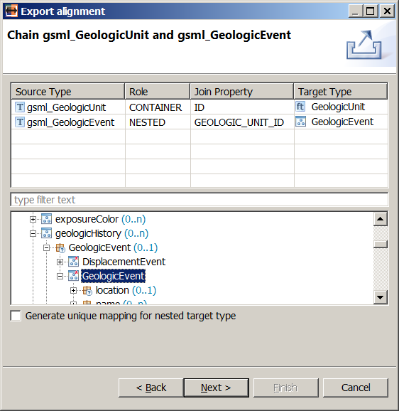
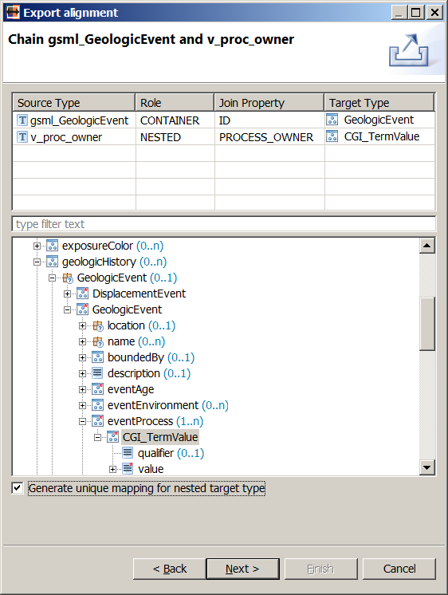
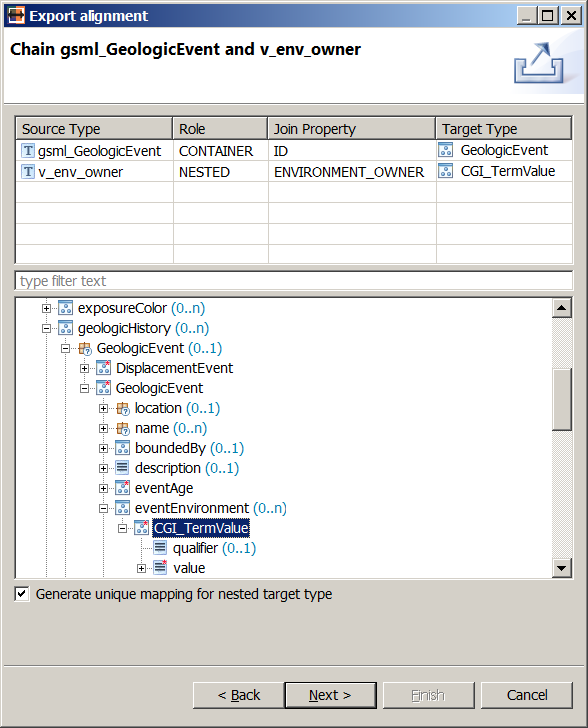
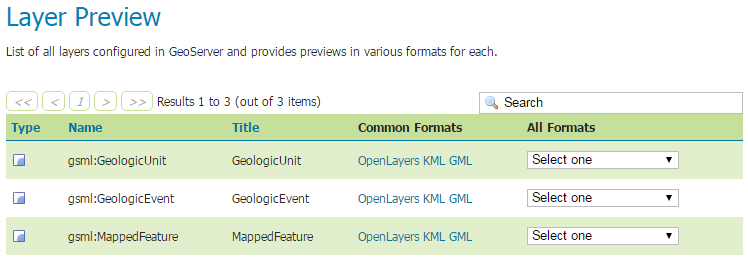
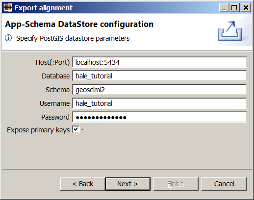

.. module:: hale.gsml_upload
.. _hale.gsml_upload:

.. include:: <isonum.txt>

Configuring GeoServer
---------------------
.. include:: ../common/upload_intro.txt

.. include:: ../common/appschema_export_format.txt

.. include:: ../common/include_target_schema_1.txt
	    
If the *Include target schema in the archive* option is checked, the target schema that was imported in the project :ref:`at the beginning of the example <import_target_gsml>`, including all its dependencies, will be added to the exported archive and uploaded to GeoServer along with the mapping configuration.

.. include:: ../common/include_target_schema_2.txt

Configuring feature chaining
++++++++++++++++++++++++++++

.. include:: ../common/chaining_intro.txt

We will be presented with one configuration dialog for each join condition that :ref:`we defined <join_gsml>`. The first dialog is shown in the figure below:

   *Feature chaining configuration for gsml_GeologicUnit and gsml_CompositionPart*

.. include:: ../common/chaining_descr_1.txt

.. include:: ../common/chaining_descr_2.txt

As the dialog is opened the first time, all cells in the table are filled automatically, except the nested type's target: that is what we will select in the schema explorer view. Navigate to the *GeologicUnit/composition/CompositionPart* property and click on it: the *Target Type* column in the second table row will be populated with the value *CompositionPart*, as shown in the figure above. In this way, we are telling GeoServer both that the *gsml_CompositionPart* source type should be mapped to the *CompositionPart* type and that *CompositionPart* instances should be nested under the *composition* attribute of the *GeologicUnit* type.

Leave the *Generate unique mapping for nested target type* checkbox unchecked, and hit **Next**.

The second feature chaining configuration dialog will appear. Select the *GeologicUnit/occurrence/MappedFeature/MappedFeature* property in the schema explorer view and the dialog should now look like the figure below:

   *Feature chaining configuration for gsml_GeologicUnit and gsml_MappedFeature*

In this way, we are telling GeoServer both that the *gsml_MappedFeature* source type should be mapped to the *MappedFeature* type, and that *MappedFeature* instances should be nested under the *occurrence* attribute of the *GeologicUnit* type.

Leave the *Generate unique mapping for nested target type* checkbox unchecked, and hit **Next**.

The third feature chaining configuration dialog will appear. Select the *GeologicUnit/geologicHistory/GeologicEvent/GeologicEvent* property in the schema explorer view and the dialog should now look like the figure below:

   *Feature chaining configuration for gsml_GeologicUnit and gsml_GeologicEvent*

In this way, we are telling GeoServer both that the *gsml_GeologicEvent* source type should be mapped to the *GeologicEvent* type, and that *GeologicEvent* instances should be nested under the *geologicHistory* attribute of the *GeologicUnit* type.

Leave the *Generate unique mapping for nested target type* checkbox unchecked, and hit **Next**.

The fourth feature chaining configuration dialog will appear. Select the *GeologicUnit/geologicHistory/GeologicEvent/GeologicEvent/eventProcess/CGI_TermValue* property in the schema explorer view **and** check the *Generate unique mapping for nested target type* checkbox. The dialog should now look like the figure below:

   *Feature chaining configuration for gsml_GeologicEvent and v_proc_owner*

In this way, we are telling GeoServer both that the *v_proc_owner* source type should be mapped to the *CGI_TermValue* type, and that *CGI_TermValue* instances should be nested under the *eventProcess* attribute of the *GeologicEvent* type.

.. _unique_mapping_check:

Since we are going to map the *CGI_TermValue* target type twice (once with *v_proc_owner* as source, another with *v_env_owner* as source), we must generate two distinct mappings for it: that's what the checkbox is for.

Press the **Next** button to proceed.

The fifth feature chaining configuration dialog will appear. Select the *GeologicUnit/geologicHistory/GeologicEvent/GeologicEvent/eventEnvironment/CGI_TermValue* property in the schema explorer view **and** check the *Generate unique mapping for nested target type* checkbox. The dialog should now look like the figure below:

   *Feature chaining configuration for gsml_GeologicEvent and v_env_owner*

In this way, we are telling GeoServer both that the *v_env_owner* source type should be mapped to the *CGI_TermValue* type, and that *CGI_TermValue* instances should be nested under the *eventEnvironment* attribute of the *GeologicEvent* type. As :ref:`explained above <unique_mapping_check>`, we are going to generate a unique mapping for this type as well.

The feature chaining configuration is now complete; press the **Next** button to proceed to the DataStore configuration screen.

.. include:: ../common/datastore_conf.txt

.. include:: ../common/rest_credentials.txt

Visit GeoServer's *Layer Preview* page and you should see three new layers in the list, *gsml:GeologicUnit*, *gsml:GeologicEvent* and *gsml:MappedFeature*.

Congratulations, you successfully created a new App-Schema DataStore in GeoServer! In the :ref:`next section <hale.gsml_query>`, we will issue a few WFS requests to demonstrate how your data can be queried.
