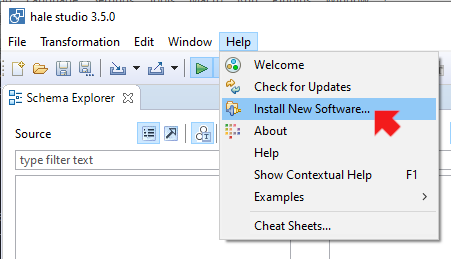
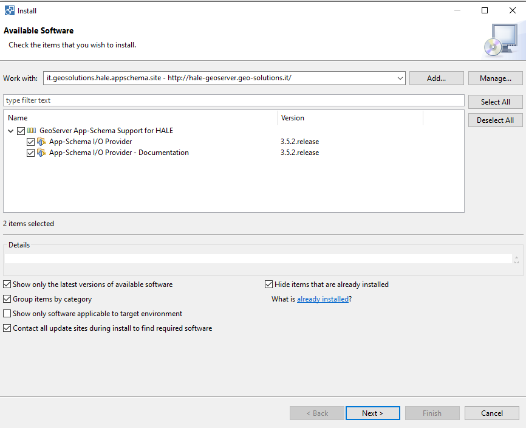
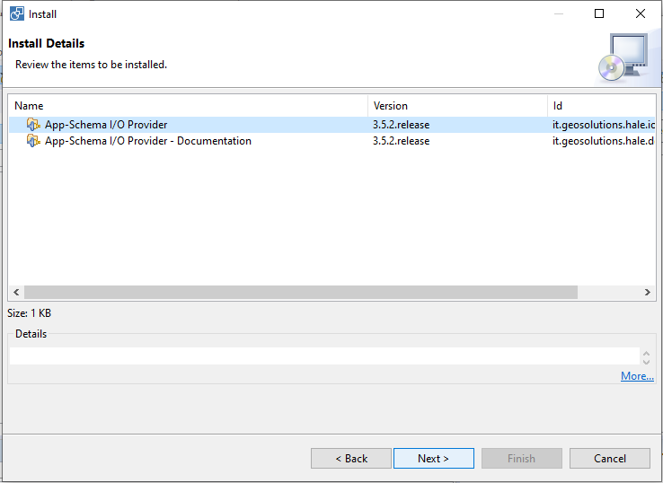
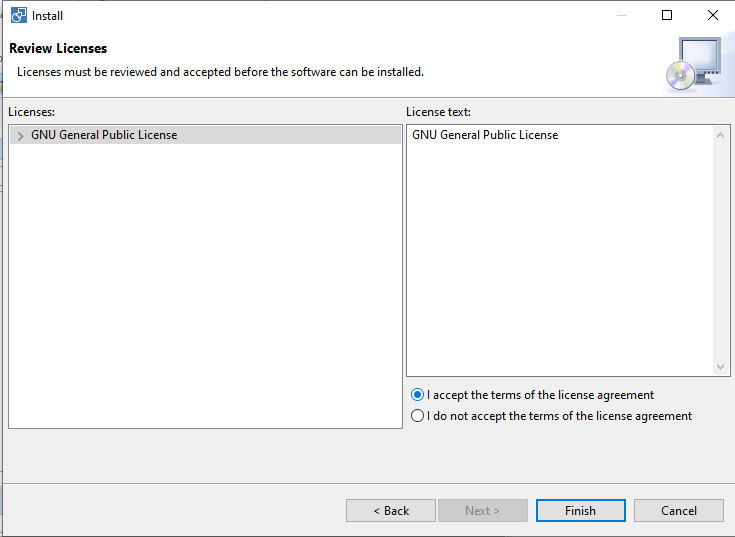
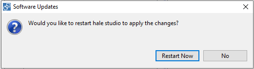
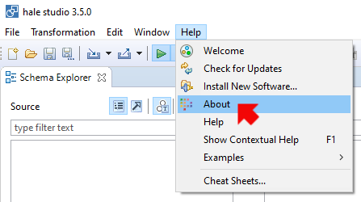
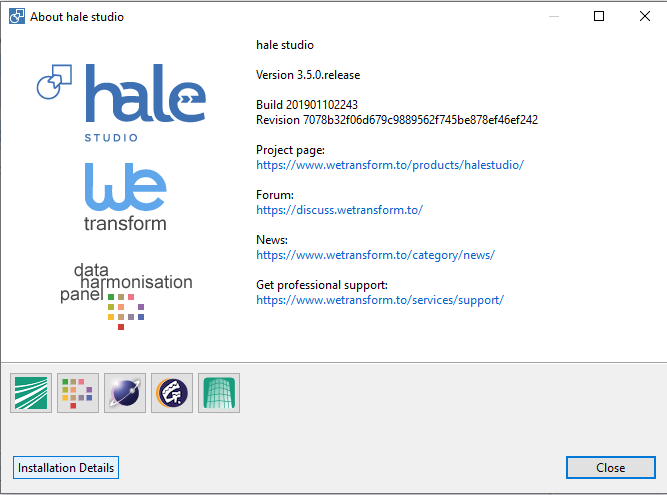
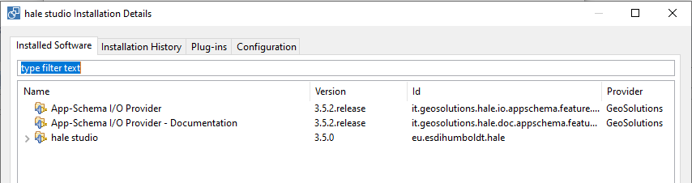

.. module:: hale.installation
   :synopsis: Shows how to configure the App-Schema plugin on Hale Studio.
.. include:: <isonum.txt>

.. _hale.installation:

Configuring HALE App-Schema plugin
==================================

Hale Studio 3.5.0 installer can be downloaded from this `downloads page <https://github.com/halestudio/hale/releases/tag/3.5.0>`_.

Geoserver App-Schema plugin is automatically installed from `its official download site <http://hale-geoserver.geo-solutions.it/index.html>`_ using the Hale Studio plugin manager, so the only requirement to achieve the installation is having an internet conection and follow these steps.

Open **Help** |rarr| **Install new software**.

Select **it.geosolutions.hale.appschema.site** on *Work with* and pick both items: *App-Schema I/O provider* and *App-Schema I/O provider -Documentation*. Then click *Next* button.

   
You will see the Install Details window, click *Next*.

   
Pick **I accept the terms of the license agreement** and click *Finish*.

   
The plugin will be downloaded from the GeoSolutions repository and Hale will ask for restarting the application.  Proceed to click on *Restart now*.

   
After Hale restart, let's check if the App-Schema plugin was installed succesfully. Click on **Help** |rarr| **About**.

Click on **Installation details**.

If App-Schema plugin was succesfully installed, it will be listed on the **Installed Software** tab.

   
HALE App-Schema plugin version strategy
---------------------------------------

Since Hale 3.5.0, App-Schema plugin adopted a matching version strategy, following the first two version number from Hale (3.5) and using the third subversion number for versioning features and fixes releases compatible with the main Hale version (3.5.0).  For example the latest App-Schema plugin versions are:

* 3.5.0.release
* 3.5.1.release
* 3.5.2.release