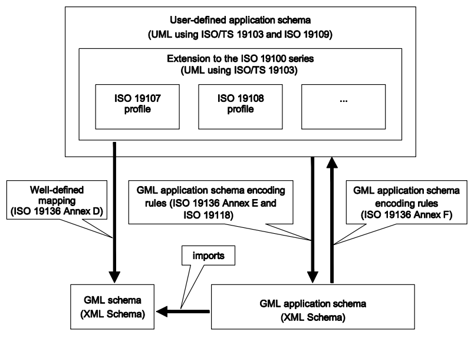
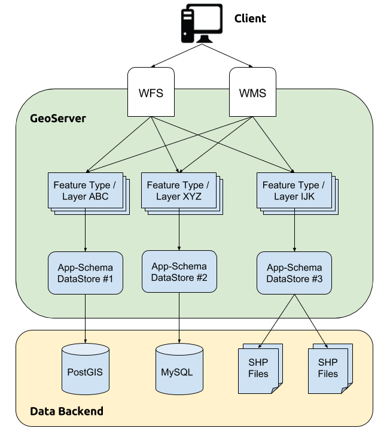
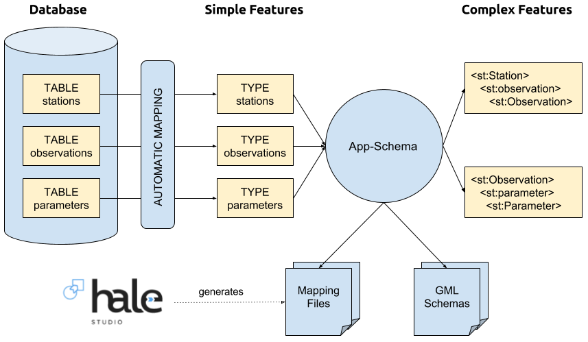
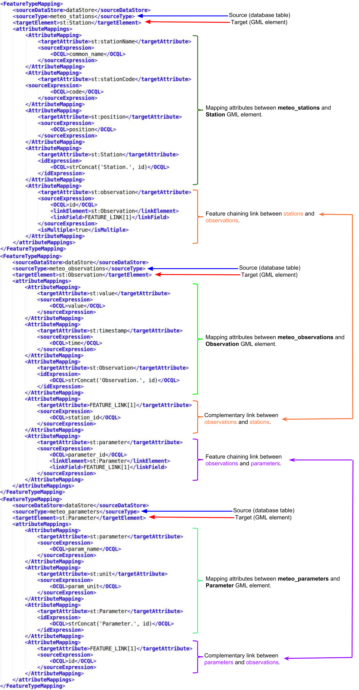
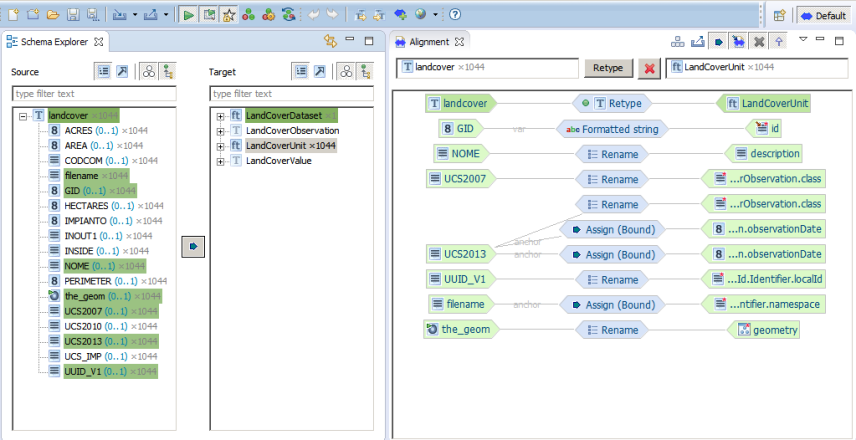

.. module:: hale.intro
   :synopsis: Introduction providing some background information about features, application schemas, GML and GeoServer.

.. _hale.intro:

Introduction
============

Definition of Feature
---------------------

The ISO19100-series of standards establish a reference conceptual framework to model digital geographic information about real world objects and phenomena. In ISO 19101 we find the definition of a feature as *“an abstraction of a real world phenomenon”*; a geographic feature is any feature associated with a location relative to the Earth. So a digital representation of the real world may be thought of as a set of features. A feature can have properties, which capture information about its measurable or describable state (feature attribute), or about the associations it has with other features (feature association role). Each property has a name, a type and a value. The number of properties a feature may have, together with their names and types, is determined by its type definition. Geographic features with geometry are those with properties that may be geometry-valued.

Information Communities and Application Schemas
-----------------------------------------------

Typically, geographic features - such as “road”, “river”, or “viewpoint” - are defined in the context of an Information Community, i.e. a group of people who share a common understanding of information and processes for their specific domain, including definitions, vocabularies, interests, mutual awareness, and common technology. For example, a state Department of Transportation, or a group or researchers in the field of Geology can be considered information communities. In order to be able to share and use the information, any given community must reach a shared agreement on how they define any geographic feature. Thus, an information model is defined to unambiguously describe all the feature types relevant to the community’s particular domain of interest. Following ISO 19109, all the information about the feature types of an application or application domain is usually captured in an application schema (typically expressed in UML), i.e. a conceptual schema for data required by one or more applications.

The process of developing a shared consensus over which feature types are actually of interest to a particular domain, what are the semantics of their properties and how things should be called becomes even more involved and necessary when geographic information is to be shared between individuals belonging to different information communities. Obstacles found on the way to successful information sharing include:

#. Ignorance of the existence of information outside one’s own information community
#. Modeling of phenomena not of mutual interest
#. Modeling of phenomena in two representations different from each other such that each is not recognized by the other.

The third issue is very common in the geospatial community. For example, Departments of Transportation belonging to different countries (hence, different information communities) may define and collect road features differently (different naming conventions, different metadata accuracy, different semantics of a road’s properties, and so forth).

INSPIRE
-------

The need to cope with different understandings of the same real world phenomena by different information communities is undoubtedly one of the driving forces behind INSPIRE, *"an EU initiative to establish an infrastructure for spatial information in Europe that is geared to help to make spatial or geographical information more accessible and interoperable for a wide range of purposes supporting sustainable development"* [#f1]_. The legal framework for setting up and operating a European Spatial Data Infrastructure (ESDI) based on the infrastructures for spatial information (SDIs) of the Member States (MSs) of the European Union is established in the INSPIRE directive, which entered into force on May, 15th 2007. The directive addresses 34 spatial data themes, significant to a high number of environmental applications, such as Hydrography, Transport networks, Geology, Land cover / use, Meteorological geographic feature, and others.

Interoperability between the spatial services and data sets provided by different member states being one of the main objectives of INSPIRE, the directive required that common Implementing Rules (IR) be adopted in a number of specific areas; for example, the INSPIRE Implementing Rules on interoperability of spatial data sets and services (IRs) and the related non-binding Data Specification Technical Guidelines (TG) documents specify common data models, code lists, map layers and additional metadata on the interoperability to be used when exchanging spatial datasets. The UML data models which are at the core of the IR and TG documents have been developed by the INSPIRE Thematic Working Groups, whose members belong to different EU countries, and are organized in more than fifty application schemas, based on the conceptual framework defined in the ISO 19100 series of standards regarding geospatial information. Adoption of the implementing rules and conformity to the provided application schemas ensures that spatial data and services from different sources across the European Community can be combined in a consistent way without involving specific efforts.

GML
---

In order to enable the sharing (e.g. across the web) and storing of digital geographic information, the Open Geospatial Consortium (OGC) defined the Geography Markup Language (GML), an XML grammar written in XML schema according to the rules of ISO 19118  for encoding geographic information in XML documents. GML specifies XML encodings, conformant with ISO 19118, of several of the conceptual classes defined in the ISO 19100 series of International Standards and the OpenGIS Abstract Specification. These conceptual models include those defined in:

* ISO/TS 19103 - Conceptual schema language (units of measure, basic types);
* ISO 19107 - Spatial schema (geometry and topology objects);
* ISO 19108 - Temporal schema (temporal geometry and topology objects, temporal reference systems);
* ISO 19109 - Rules for application schemas (features);
* ISO 19111 - Spatial referencing by coordinates (coordinate reference systems);
* ISO 19123 - Schema for coverage geometry and functions.

The aim is to provide a standardized encoding (i.e. a standardized implementation in XML) of types specified in the conceptual models specified by the International Standards listed above. By providing fixed encoding rules for core geographic information concepts commonly used in application schemas, GML greatly enhances interoperability and consistency. In addition, GML provides XML encodings for additional concepts not yet modelled in the ISO 19100 series of International Standards or the OpenGIS Abstract Specification, such as dynamic features, simple observations or value objects.

A GML application schema is specified in XML Schema and can be constructed in two different and alternative ways:

* By adhering to the rules specified in ISO 19109 for application schemas in UML, and conforming to both the constraints on such schemas and the rules for mapping them to GML application schemas specified in the GML Encoding Standard.

  An instance of this approach in action can be found in the context of INSPIRE: the UML data models defined in the Data Specification Technical Guidelines have been translated into GML application schemas following the encoding rules described in the document Guidelines for the encoding of spatial data, which in turn rests upon the ISO 19118 (Geographic information - Encoding) and ISO 19136 (Geographic information - GML) standards.

* By adhering to the rules for GML application schemas specified in the GML Encoding Standard for creating a GML application schema directly in XML Schema.

  For example, an application schema for meteorological data may define object types including stations, sensors, sensor networks, and observations. Those object types in turn reference the primitive object types defined in the GML standard, typically extending them by means of XML Schema’s inheritance mechanism.

   *Relationship between the ISO 19100 series of International Standards and ISO 19136 - GML*

In a GML instance document, a feature is encoded as an XML element with the name of the feature type. Other identifiable objects are encoded as XML elements with the name of the object type. Each feature attribute and feature association role is a property of a feature. Feature properties are encoded in an XML element. Furthermore, the property semantics, which is indicated by the name of the element representing the property, is distinguished from the property value, which is given by the content of the property element. The value of a property may be simple, or it may be a feature or other complex object. The result is a layered XML document, in which XML elements corresponding to features, objects or values occur interleaved with XML elements corresponding to the properties that relate them. This encoding pattern, often referred to as the “object-property model”, implies that no element can be both a GML object and a GML property and may result in increased verbosity of instance documents, as extra levels of nested elements are needed, but brings with it the significant advantage of making instance documents understandable on their own, as the function of a feature, object or value in context can always be determined by inspecting the name of the property element which directly contains it.

A brief description of the most basic object types defined in the GML schema follows:

**gml:AbstractGML** - abstract element of type **gml:AbstractGMLType** representing *“any GML object having identity”*. A GML object is an XML element of a type derived directly or indirectly from ``AbstractGMLType``. Whenever an ``AbstractGML`` element is found in GML core and application schemas, it can be substituted by any other element, be it a GML feature or another object with identity. ``AbstractGMLType`` defines several child XML elements and XML attributes, so any GML object inherits them as standard properties. The most common are:

* **gml:description**: element containing a simple textual description of the object (simple content of string type);
* **gml:name**: provides a label or identifier for the object, commonly a descriptive name. An object may have several names, typically assigned by different authorities. The content model of ``gml:name`` is not a plain string, but a string extension called ``gml:CodeType``, which provides an optional ``codeSpace`` attribute that can be used to specify the authority responsible for assigning the name;
* **gml:identifier**: holds a special identifier assigned to an object by the authority that maintains the feature with the intention that it is used in references to the object. That identifier is usually unique either globally or within an application domain (e.g. UUIDs and URNs are commonly used globally unique identifiers);
* **gml:id**: supports provision of a (possibly synthetic) handle for the XML element representing a GML object. Its use is mandatory for all GML objects. It is of XML type ``ID``, so is constrained to be unique in the XML document within which it occurs. An external identifier for the XML element representing the GML object in the form of a URI may be constructed using standard methods (IETF RFC 2396). This is done by concatenating the URI for the document, a fragment separator ``#``, and the value of the attribute of XML type ID.

**gml:AbstractGeometry** - abstract element of type **gml:AbstractGeometryType** representing *“any GML geometry element”*, whether it be defined in the GML standard or user-defined. All geometry elements are derived directly or indirectly from the abstract supertype ``AbstractGeometryType``. The content model of ``AbstractGeometryType`` extends the content model of ``AbstractGMLType`` by adding to it the attribute group ``gml:SRSReferenceGroup``, an optional reference to the CRS used by this geometry, with optional additional information to simplify the processing of the coordinates when a more complete definition of the CRS is not needed:

* **srsName**: attribute containing a URI pointing to a CRS instance; if no srsName attribute is given, the CRS shall be specified in the larger context this geometry is part of (e.g. geometry  aggregate or feature collection);
* **srsDimension**: specifies the number of coordinate values in a position;
* **axisLabels**: an ordered list of labels for all the axes of this CRS;
* **uomLabels**: an ordered list of unit of measure (uom) labels for all the axes of this CRS.

The GML schema includes predefined geometry property types, the most common of which are listed in the following table:

.. csv-table:: **Standard GML Geometry Types**
   :header: "XML Schema property type", "Associated geometry object types"
   :file: geometry_types.csv

|

**gml:AbstractFeature** - abstract element of type **gml:AbstractFeatureType** representing *“anything that is a GML feature”*. The content model for ``AbstractFeatureType`` adds two specific properties suitable for geographic features to the content model defined in ``AbstractGMLType``:

* **gml:boundedBy**: describes an envelope that encloses the entire feature instance, and is primarily useful for supporting rapid searching for features that occur in a particular location;
* **gml:location**: describes the extent, position or relative location of the feature.

Usage of the ``gml:location`` property is deprecated in favor of geometry properties with application specific names more apt to conveying the semantics of the value. For example, a **RadioTower** feature type may have a ``position`` property returning a point geometry to identify its location through a representative point, a second geometry property called ``floorSpace`` that returns a surface geometry describing its physical structure, and a third geometry property called ``serviceArea`` that returns a surface geometry describing the area in which its transmissions can be received reliably.

All specific feature types defined in application schemas must be implemented as global XML elements whose content model (XML Schema types) are derived from ``AbstractFeatureType``, and thus all GML features inherit the properties defined by it and by its parent, ``AbstractGMLType``, unless any property is suppressed in a derivation by restriction. In particular, they inherit ``gml:id``, which is the preferred means of supporting database identifiers in GML.

For example, the definition of a generic FooFeature would be:

.. include:: foofeature_definition.txt

The specific set of properties a GML feature may have is defined by its feature type. Properties may have simple values, using XML Schema simple content types, or complex values, using XML Schema complex types, defined either in the GML standard itself, or in a particular application schema. The value of a property element may be encoded inline, or by reference. If the value is a simple type, it is usually encoded inline as a literal value (text with no additional markup). If the value is a complex, additional constructs are introduced to support both encoding modes. The basic pattern for defining a generic GML property element ``FooProperty``, whose value is a ``FooObject`` element of (complex) type ``FooObjectType``, is:

.. include:: fooproperty_definition.txt

``gml:AssociationAttributeGroup`` provides a uniform manner of encoding the value of a property by reference; it contains, among others, the ``xlink:href`` attribute, taken from the **XLink** specification, which is used to indicate that the value of a GML property is the resource returned by traversing the link. From these definitions, it follows that an instance of ``FooProperty`` will either contain a single ``FooObject`` element (inline encoding), or serve as a pointer to a remote object.

The GML standard declares a large number of XML elements and attributes meant to support a wide variety of capabilities. For example, the GML standard can be used to encode dynamic features, spatial and temporal topology, complex geometric property types and coverages. Although on the one hand such a wide scope confers great expressive power and flexibility, on the other it obviously imposes quite a heavy burden on the shoulders of implementers of software dealing with GML content. Thus, in order to facilitate the adoption of the GML standard by reducing the amount of development time and effort required to support it, the OGC has defined a restricted subset of the GML standard, the **Simple Features (SF) profile**, which deals only with some of its capabilities. The Simple Features profile defines rigid coding patterns for the use of a subset of XML Schema and GML constructs, so that client applications do not need to deal with the entire scope of XML Schema and GML but only need to understand a restricted subset of both standards in order to be able to interpret schema documents referenced by data encoded in GML. This limits the number of GML object types that can appear in compliant schemas, which are consequently easier to process and can be readily used for data exchange via WFS.

The SF profile defines three compliance levels called **SF-0**, **SF-1**, and **SF-2**.

Level SF-0 is the most restrictive, but experience has proven that it is enough to represent much of the existing geospatial data:

#. non-spatial properties are limited to being of type: integer, measurement, date, boolean, binary, URI, character or real (predefined set of simple XML types);
#. the cardinality of non-spatial properties is limited to at most one (single-valued properties only);
#. spatial properties are limited to being of type: point, curve with linear and/or circular arc interpolation (LineString), planar surface (Polygon), or aggregates thereof (MultiPoint, MultiCurve, MultiSurface);
#. values for a particular property may be encoded inline or by-reference but not both.

Level SF-1 removes restrictions 1 and 2 of compliance level SF-0, thus allowing user defined non-spatial property types of arbitrary cardinality, and has been found to be useful in projects requiring multi-valued (non-spatial) properties of features.

Finally, compliance level SF-2 places no restrictions on non-spatial properties; spatial properties, however, are limited to the set of geometric types supported by compliance levels SF-0 and SF-1.

.. _application_schema_extension:

The Application Schema Extension
--------------------------------

GeoServer distinguishes between **Simple Features**, i.e. features whose properties may contain only values of XML simple types, and **Complex Features**, i.e. features whose properties may contain values of XML complex types. The former roughly correspond to compliance level SF-0 of OGC’s Simple Features profile, while the latter correspond to level SF-1.

By default, GeoServer only supports simple features. In the most common use case, GeoServer is connected to a data source such as a relational database and each table containing geographic data is automatically mapped to a simple feature type. The mapping from a database table or similar structure to a “flat” XML representation is, in fact, straightforward:

* the name of the feature type defaults to the name of the table;
* the name of each element is the name of the column, in the namespace of the data store;
* GeoServer manufactures an XSD type definition for every simple feature type it serves.

For example, a database table holding data for meteorological stations could have the following structure:

.. csv-table::
   :header: "id", "code", "name", "position"
   :file: stations_data.csv

Supposing that the table’s name is ``stations`` and that the namespace of the data store is ``http://www.stations.org/1.0``, GeoServer would automatically translate this structure into the following XML Schema (can be retrieved by issuing a WFS *DescribeFeatureType* request):

.. include:: stations_xsd_simple.txt

GeoServer has declared a new XML complex type, ``stationsType``, derived from the core GML type ``AbstractFeatureType``, whose attributes correspond  1:1 to the columns of the stations table, and a new XML element, ``stations`` (the name of the source table), which is used to instantiate station features in GML documents, like the following:

.. include:: stations_gml_simple.txt

The XML snippet above has been extracted from the output of a WFS *GetFeature* request.

The advantages of this approach are ease of implementation and performance, but there are also drawbacks: since the format of the automatically generated XSD is tied to the database schema, in order to make information sharing possible participants in the community must either use the same database schema or translate between different schemas, which quickly becomes unpractical as more and more data producers are added to the community. Furthermore, such a rigid and simplistic application schema is difficult to maintain and evolve into more complex information models.

Thanks to the **Application Schema extension** (App-Schema from  now on), support for complex features can be added to GeoServer. Complex features can have properties, either single- or multi-valued, that contain further nested properties to arbitrary depth. In particular, complex features can contain properties that are other complex features. Complex features represent information not as an XML view of a single table, but as a collection of related objects of different types and are thus the building blocks for the definition of rich, object-oriented information models. Hence, complex features are especially useful in the context of information communities aiming at achieving interoperability by enshrining their common understanding of their information domain in a GML application schema.

For example, suppose that the database containing the ``stations`` table presented earlier also contained another couple of tables, storing the measured values of a number of environmental parameters at different time points, the ``parameters`` table:

.. csv-table::
   :header: "id", "param_name", "param_unit"
   :file: parameters_data.csv

|

And the ``observations`` table:

.. csv-table::
   :header: "id", "parameter_id", "station_id", "time", "value"
   :widths: 10, 20, 20, 30, 20
   :file: observations_data.csv

The ``observations`` table has two foreign keys, associating each measurement with the physical property that was measured and the station where the sample was taken.

The simple features approach to deliver these data would be to create a giant view joining the three tables into one, from which GeoServer would infer a single feature type with properties corresponding to all the columns in the source tables and then serve features from the view as “flat” XML data. On the other hand, the complex features approach would be to keep different concepts separate, modeling them as different, mutually related  entities (either object or feature types) in the GML application schema that the community would agree to use as the common ground for sharing meteorological data.

An oversimplified example of such application schema could be the following:

.. include:: stations_xsd_complex.txt

*Stations* and *Observations*, having different types, maintain their individuality and can be queried independently; association properties model the relationships between the entities, i.e. a *Station* is linked to the *Observations* that were sampled by it (one-to-many association), an *Observation* is associated both to the *Station* it originated from and to the physical *Parameter* it measures (many-to-one). Derivation of new types provides an extension point, allowing us to reuse and extend the information model in a way that supports backwards compatibility.

A sample GML document containing the result of a WFS *GetFeature* request on the *Station* feature type would look like the following:

.. include:: stations_gml_complex.txt

In this example, associated objects are encoded inline: each *Station* feature contains its associated *Observation* objects, nested in distinct observation elements, and each *Observation* in turn contains the associated *Parameter* object, inside a nested parameter element.

It is now time to dig a little deeper into how the App-Schema extension works. To GeoServer, the App-Schema module looks just like any other data store and so can be loaded and used to service WFS and WMS requests.

   *App-Schema's role inside GeoServer*

In effect, the app-schema data store is a wrapper or adapter that reads simple features from one or more simple feature data stores and assembles them into complex features, based on a user-specified mapping configuration. The mapping works both ways, so queries against properties of complex features are supported and translated, whenever possible, to native queries of the backing data source (e.g. SQL queries).

   *Diagram showing how App-Schema can map database tables to complex feature types*

The mapping configuration is specified in one or more XML files called **mapping files**. The most important sections of a mapping file are:

* The **namespaces** section, listing all the XML namespaces used in the mapping file and the prefixes they are mapped to, for example:

  .. include:: mappingfile_namespaces.txt

  To avoid issues in the encoding of WFS responses, it is generally a good idea to create a namespace in GeoServer for every namespace listed in the mapping file. This can be achieved by creating a workspace with name and URI corresponding to the namespace prefix and URI.

* The **sourceDataStores** section, containing configuration settings for each data store from which input data is to be read. Every mapping file requires at least one data store to provide data for features. The content of each **DataStore** entry essentially consists of a list of named connection parameters, that are used to instantiate a GeoServer data store using the regular lookup mechanism inherited from GeoTools. What this means in practice is that any data store type available to GeoServer may be used as an App-Schema source data store, although most often a database back-end is to be preferred for performance reasons.

  For example, a DataStore entry for a PostGIS database would look like this:

  .. include:: mappingfile_datastores.txt

* The **targetTypes** section, listing all the application schemas required to define the mapping. Typically only one is required. For example:

  .. include:: mappingfile_targettypes.txt

* The **typeMappings** section, the heart of the App-Schema module. It defines the mapping from simple features to the nested structure of one or more complex features. It consists of a list of **FeatureTypeMapping** elements, which each define one output complex feature type. For example, the mapping for the Station feature defined in the sample XML Schema reported above is the following:

  .. include:: mappingfile_typemapping_station.txt

  Where:

  #. ``sourceDataStore`` specifies the id of a data store configuration provided in the ``sourceDataStores`` section;
  #. ``sourceType`` is the name of a simple feature type in the source data store. In this case, since the data store is a database, it corresponds to the name of the ``stations`` table;
  #. ``targetElement`` is the qualified element name in the target application schema, in this case ``st:Station``. This is the same as the WFS feature type name;
  #. the ``attributeMappings`` collection contains a list of ``AttributeMapping`` elements, each defining how the value of the specified attribute of the output feature type (i.e. the ``targetAttribute``) is computed from the attributes of the source feature type (i.e. the ``sourceExpression``). In other words, ``AttributeMapping`` can be thought of as a transformation function, taking as input the attributes (of properties) of the source type and returning as output the value of one attribute (or property) of the target type.

  The mapping shown above is very simple, but it should be noted that ``targetAttribute`` can hold **any valid XPath expression** pointing to the output element, in the context of the target element. Also, the OCQL element inside ``sourceExpression`` can hold any valid CQL expression involving an arbitrary number of attributes of the source feature type. For example, the expression::

    strConcat(strConcat(strConcat(‘Code: ’, code), ‘; Name: ‘), name)

  if used as source expression of the ``st:stationName`` target attribute, would yield a value of ``‘Code: ALS; Name: Alessandria’`` for the station feature with ``gml:id`` equal to ``station.13``.

  The example has been deliberately simplified by removing all attributes related to *Feature Chaining*, a concept which deserves a more involved explanation.

.. _feature_chaining:

**Feature Chaining** is the mechanism by which App-Schema builds more complex feature types by composing simpler types; in effect, feature chaining uses types as the building blocks of arbitrarily complex hierarchies of nested objects.

As we have seen, a feature type mapping establishes a mapping between a simple type (source), automatically inferred by GeoServer by looking at the structure of the source data store, and a complex type (target), defined in a GML application schema. The relationship is 1:1, i.e. for each instance of the source type, one instance of the target type is created and its attributes are populated with values derived from the source instance’s attributes. This works fine when it is possible to formulate a CQL expression combining the attributes of the source type so that its evaluation yields the value of the target attribute; however, there are cases where this is not possible nor desirable, notably when the target attribute is actually an association property, i.e. its content is an instance of a related type. If the related type has its own individuality (e.g. it is another feature type that should be exposed via WFS / WMS, or it represents a common concept that can be reused in several contexts), it is best modeled in the source data store as a separate entity, related to the other type by some sort of link (e.g. in a normalized database schema, two separate tables and a foreign key constraint between them). App-Schema allows us to leave the source model unaltered (except in a few edge cases, e.g. many-to-many associations still require a denormalization step) and build our mapping in two steps:

#. first, each individual type is mapped independently;
#. then, for each association that is to be modeled, a special attribute mapping configuration is added, holding the necessary information to determine which instances of the related types are linked.

In this way, the mapping configuration of each type is specified once and reused every time the type is referred to.

Taking again the simple application described above as an example, the *Station* type and the *Observation* type are modeled in the source data store (i.e. the relational database) as separate tables, and the one-to-many relationship between them is modeled in the source schema (i.e. the database’s DDL) as a foreign key constraint from the ``observations`` table to the ``stations`` table. We have already seen that the mapping of the ``stations`` table to the *Station* type is straightforward. The same goes for the mapping of the ``observations`` table to the ``st:Observation`` type:

.. include:: mappingfile_typemapping_observation.txt

As defined in the sample XML Schema, the ``st:Station`` type has an association property, ``st:observation``, that contains an ``st:Observation`` instance. The property is multi-valued, thus expressing a one-to-many association. As we have seen, this means that inside a GML document, a ``st:Station`` element will have as many ``st:observation`` child elements as it has related observations, each containing a nested ``st:Observation`` element (or an ``xlink:href`` attribute pointing to a remote object, if by reference encoding is used):

.. include:: featurechaining_example_1.txt

To make this possible, feature chaining must be properly set-up in the mapping of the feature types to be chained. The feature chaining configuration is in effect equivalent to the foreign key relation that exists in the database between the ``station_id`` column of the ``observations`` table and the ``id`` column of the ``stations`` table. In the feature type mapping targeting the container type (Station), the following ``AttributeMapping`` element must be added:

.. include:: featurechaining_attrmapping_station.txt

The configuration is completed by adding the following AttributeMapping element to the feature type mapping targeting the nested type (Observation):

.. include:: featurechaining_attrmapping_observation.txt

The presence of the ``linkElement`` / ``linkField`` elements changes the meaning of ``sourceExpression`` to a feature chaining mapping, where ``linkElement`` specifies the name of the related type, while ``linkField`` specifies which property of the related type should match the result of the source expression, in order to establish a link between two instances of the related types. In this case, there is no property in the XML Schema definition of the nested type that can hold the identifier of the related station (i.e. the foreign key value), so the special ``FEATURE_LINK`` property is used. This property doesn’t exist in the schema (it is for internal use only), and so it is not encoded in the output document.

The sample XML Schema also defines the ``st:Parameter`` type, which is associated to the ``st:Observation`` type via its ``st:parameter`` property. The mapping configuration for this type is again straightforward:

.. include:: featurechaining_typemapping_parameter.txt

We would like to chain the ``st:Observation`` type to the ``st:Parameter`` type, so that each ``st:Observation`` element encoded in a GML document would contain the associated *Parameter* object as a nested element. This is achieved by adding the following to the mapping configuration of the ``st:Observation`` type:

.. include:: featurechaining_attrmapping_observation_2.txt

The complementary configuration required on the nested type’s side is:

.. include:: featurechaining_attrmapping_parameter.txt

Again, the feature chaining configuration is equivalent to the foreign key relation that exists in the database between the ``parameter_id`` column of the ``observations`` table and the ``id`` column of the ``parameters`` table.

The configuration is applied universally by App-Schema, so a query on the ``st:Station`` feature type would yield a GML document showing a 3-level deep hierarchy of objects:

.. include:: featurechaining_example_2.txt

whereas a query on the ``st:Observation`` feature type would return a GML document showing a 2-level deep hierarchy of objects:

.. include:: featurechaining_example_3.txt

.. note:: There is no theoretical limit to how deeply nested a feature type hierarchy can be. However, on the practical side,
          the amount of work App-Schema must perform to construct the output features is proportional to the number of chained feature types (i.e. the number of tables that need to be joined),
          so overly complicated object graphs should be avoided to keep performance reasonably high.

In the next figure we can see the feature types mappings along some visual indicators that help follow the features chaining links. Data sources and other definitions where excluded, the full App-Schema mappings file can be download here :download:`full_mapping.xml`.

   *Feature types mappings*

More information on the App-Schema extension can be found in `GeoServer's official documentation <http://docs.geoserver.org/stable/en/user/data/app-schema/index.html>`_.

HALE and GeoServer
------------------

The `Humboldt ALignment Editor (HALE) <https://www.wetransform.to/products/halestudio>`_ is a visual editor for defining and evaluating conceptual schema mappings.

   *The HALE workbench*

In a typical work session with HALE, a user defines a set of relations (mappings) between entities (either types or properties) in a source schema and entities in a target schema. Considered as a whole, these relations constitute what HALE calls an **Alignment**. Every mapping is created entirely through the graphical user interface, and its effects can be seen immediately, thanks to the live preview window that displays the output of the transformation either in tabular form or on a map.

Here is a brief summary of HALE's main features:

* import existing source schema(s) and data in various formats (Shapefile, databases, XSD / XML)
* import existing target schema(s) (XSD, databases, INSPIRE schemas)
* graphically design transformation mappings from source schema to target schema
* interactively execute data transformations to verify the result of the mappings
* interactively view data transformation that involve geographic features on a map

From version **2.9.4**, HALE's official package includes a **GeoServer plug-in**, developed by `GeoSolutions <http://www.geo-solutions.it/>`_, that makes it possible to convert a HALE alignment to a GeoServer App-Schema mapping configuration. Once uploaded to a live GeoServer instance, this configuration will enable WMS / WFS access to the transformed GML data.

The usage of a graphical and user-friendly tool such as HALE to configure App-Schema data stores is a significant improvement over the entirely manual approach of writing all the required XML files by hand (which has been for a long time the only available option for users); however, due to current limitations of the plug-in, for some use cases it may still be necessary to tweak the generated mapping files manually (e.g. polymorphic mappings are not supported by the plug-in at the time of writing).

More information can be found in `HALE's official guide <http://help.halestudio.org/latest/index.jsp>`_.

.. rubric:: Footnotes
.. [#f1] http://inspire.ec.europa.eu/reports/Registration_form.pdf
