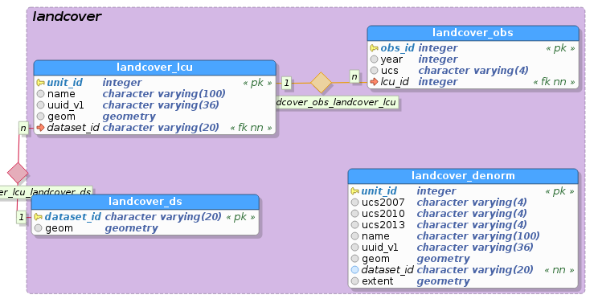
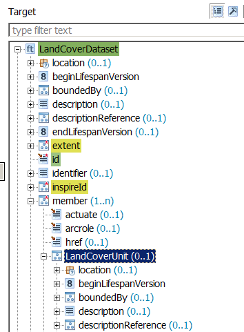
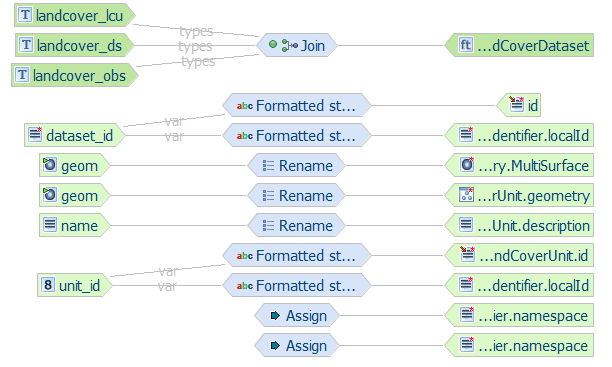
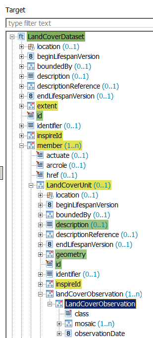
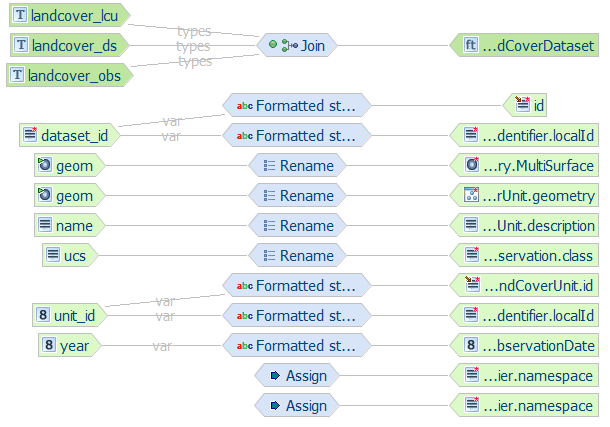

.. module:: hale.lcv_alignment
.. _hale.lcv_alignment:

.. include:: <isonum.txt>

Defining the alignment
----------------------

.. include:: ../common/alignment_intro.txt

The land cover data stored in the database is organized in two different ways, to show different mapping strategies in action:

#. Three normalized tables:

   * **landcover_ds**: contains information about the entire dataset, namely ID and extent
   * **landcover_lcu**: each record in this table corresponds to a single land cover unit
   * **landcover_obs**: each record in this table corresponds to a single land cover classification information, relative to a specific year

   A one-to-many relationship exists between *landcover_ds* and *landcover_lcu* (a dataset may contain many units), as well as between *landcover_lcu* and *landcover_obs* (many observations may exist for the same unit).
#. A single denormalized table:
   
   * **landcover_denorm**: a denormalized version of the three tables described above: dataset ID and extent are repeated for each record, and classification information for years 2007, 2010 and 2013 has been added to the table as separate columns.

   *E/R diagram of the land cover schema*

We would like to define the mapping so that the resulting GML will have **LandCoverObservation**, **LandCoverUnit** and **LandCoverDataset** elements properly nested inside each other: **LandCoverDataset** will contain related **LandCoverUnit** instances in its multi-valued **member** property, and **LandCoverUnit** will contain related **LandCoverObservation** instances in its multi-valued **landCoverObservation** property.

.. include:: ../common/compatibility.txt

.. _mapping_normalized:

Mapping the normalized tables
+++++++++++++++++++++++++++++

The three source tables, **landcover_ds**, **landcover_lcu** and **landcover_obs**, should be combined and mapped to a single target type, **LandCoverDataset**, using a **Join** relation.

This will translate to a target dataset having one **LandCoverDataset** instance for each record in the **landcover_ds** table, inside of which **LandCoverUnit** and **LandCoverObservation** instances are nested. 

.. _join_lcv:

Joining landcover_ds, landcover_lcu and landcover_obs
^^^^^^^^^^^^^^^^^^^^^^^^^^^^^^^^^^^^^^^^^^^^^^^^^^^^^

#. Select the landcover_ds, landcover_lcu and landcover_obs types in the *Source* section of the *Schema Explorer* view
#. Select the LandCoverDataset type in the *Target* section of the *Schema Explorer* view
#. Click on the blue double-pointing arrow icon in between the *Source* and *Target* sections of the *Schema Explorer* view and select *Join* from the popup menu

   .. figure:: img/hale_join_lcv.png	
      :align: center       
	       
#. A wizard will open. Verify the first screen looks like the figure below, and click on the **Next** button:

   .. figure:: img/hale_join_sel_entities_lcv.png
      :align: center

#. Configure the join order. The join order should follow the nesting order, i.e. the container (base) type should always precede the nested (join) type (see figure below).

   .. figure:: img/hale_join_order_lcv.png
      :align: center

#. For each pair of tables to join, define the join conditions, specifying which coloumns contain equal values (i.e. define a foreing key constraint).

   .. figure:: img/hale_join_first_cond_lcv.png
      :align: center

      *Join condition between landcover_ds (base type) and landcover_lcu (join type)*

   .. figure:: img/hale_join_second_cond_lcv.png
      :align: center
	      
      *Join condition between landcover_lcu (base type) and landcover_obs (join type)*

   .. note:: In HALE, multiple join conditions can be specified for each source type, whereas the GeoServer App-Schema extension only supports single-condition joins; thus, in order to be translateable to a GeoServer App-Schema configuration, an alignment should not contain more than one join condition for the same source type.

#. Click on the **Finish** button and the *Alignment* view should now look like the following:

   .. figure:: img/hale_join_complete_lcv.png
      :align: center

      *Join mapping is now complete*

Now that the type relations have been defined, it is time to configure the relations between source and target properties.

.. _mapping_landcover_ds:

Mapping landcover_ds to LandCoverDataset
^^^^^^^^^^^^^^^^^^^^^^^^^^^^^^^^^^^^^^^^
The **landcover_ds** properties will be mapped to properties of the **LandCoverDataset** target type. We will use the **dataset_id** source property to populate both the **gml:id** and **inspireId** target properties, but, instead of using the value of the *dataset_id* property as is, we will prepend the string *lcv.* to it, using the **Formatted String** transformation function.

We will also use the **geom** source property to populate the **extent** target property.

Let's start with the *dataset_id* property:

#. Select the *landcover_ds/dataset_id* property in the *Source* section of the *Schema Explorer* view
#. Select the *LandCoverDataset/id* property in the *Target* section of the *Schema Explorer* view
#. Click on the blue double-pointing arrow icon in between the *Source* and *Target* sections of the *Schema Explorer* view and select *Formatted string* from the popup menu
#. A wizard will open. Click **Next** on the first screen and, on the second screen, define the format pattern by typing **lcv.** and then double-clicking on *dataset_id* in the **Available variables** section, as shown in the figure below:

   .. figure:: img/hale_format_pattern_lcv.png
	       
#. Click on the **Finish** button and the alignment should now look like the following:

   .. figure:: img/hale_after_id_mapping_lcv.png
	       
#. Repeat the same steps to map the *LandCoverDataset/inspireId/Identifier/localId* target property

We will now assign a constant value to the *LandCoverDataset/inspireId/Identifier/namespace* target property, using the **Assign** transformation function.

#. Select the property in the *Target* section of the *Schema Explorer* view, click on the button in between the *Source* and *Target* sections of the *Schema Explorer* view and select *Assign* from the popup menu
#. A wizard will open. Click **Next** on the first screen and, on the second screen, type the value *http://it.geosolutions.hale-training* in the text field.
#. Click on the **Finish** button and the alignment should now look like the following:

   .. figure:: img/hale_after_namespace_mapping_lcv.png
   
Now we will directly map the *geom* source property, which contains the extent of the entire dataset, to the *extent* target property, using the **Rename** transformation function, which simply copies source to target.

#. Select the *landcover_ds/geom* property in the *Source* section of the *Schema Explorer* view
#. Select the *LandCoverDataset/extent/EX_Extent/geographicElement/AbstractEX_GeographicExtent/ EX_BoundingPolygon/polygon/AbstractGeometry/MultiSurface* property in the *Target* section of the *Schema Explorer* view
   
   .. note:: Usually, it's not necessary to map a geometry property down to the specific GML geometry type (in this case, *MultiSurface*), since both HALE and GeoServer are able to detect it automatically when the geometry is actually encoded, i.e. normally one would not select *polygon/AbstractGeometry/MultiSurface* as target property, but simply *polygon*; however, in this particular case, it is required, due to a GeoServer issue with the encoding of geometry properties that do not inherit from *gml:GeometryPropertyType*.

#. Click on the blue double-pointing arrow icon in between the *Source* and *Target* sections of the *Schema Explorer* view and select *Rename* from the popup menu
#. A wizard will open. Click on the **Finish** button and the alignment should now look like the following:

   .. figure:: img/hale_after_extent_mapping_lcv.png

Mapping landcover_lcu to LandCoverUnit
^^^^^^^^^^^^^^^^^^^^^^^^^^^^^^^^^^^^^^
The **landcover_lcu** properties will be mapped to properties of the **LandCoverUnit** target type. Be careful, though, because we will not pick the properties of the top level *LandCoverUnit* type (which is immediately visible in the *Target* section of the *Schema Explorer* view), but we will reach for the *LandCoverUnit* property nested under the *member* property of the *LandCoverDataset* type (see figure below), and map to its child properties.

   *We want to map to the child properties of the LandCoverUnit property nested in the LandCoverDataset type*

Since at this stage you should be familiar with the process of defining a relation, we will describe the required steps more succintly.

#. Map the *landcover_lcu/unit_id* source property to the *LandCoverDataset/member/LandCoverUnit/id* and the *LandCoverDataset/member/LandCoverUnit/inspireId/Identifier/localId* target properties using the *Formatted string* transformation function. Use **lcu.{unit_id}** as format pattern.
#. Map the constant value *http://it.geosolutions.hale-training* to the *LandCoverDataset/member/LandCoverUnit/inspireId/Identifier/namespace* target property using the *Assign* transformation function.
#. Map the *landcover_lcu/name* source property to the *LandCoverDataset/member/LandCoverUnit/description* target property using the *Rename* transformation function.
#. Map the *landcover_lcu/geom* source property to the *LandCoverDataset/member/LandCoverUnit/geometry* target property using the *Rename* transformation function.
#. The alignment should now look like the following:

Mapping landcover_obs to LandCoverObservation
^^^^^^^^^^^^^^^^^^^^^^^^^^^^^^^^^^^^^^^^^^^^^
The **landcover_obs** properties will be mapped to properties of the **LandCoverObservation** target type. Similarly to what we did for *LandCoverUnit*, we will not pick the properties of the top level *LandCoverObservation* type (which is immediately visible in the *Target* section of the *Schema Explorer* view), but we will reach for the *LandCoverObservation* property nested under the *landCoverObservation* property of the *LandCoverUnit* property, which is itself nested under the *member* property of the *LandCoverDataset* type (see figure below), and map to its child properties.

   *We want to map to the child properties of the LandCoverObservation property nested in the LandCoverDataset type*

Define the following relations:

#. Map the *landcover_obs/ucs* source property to the *LandCoverDataset/member/LandCoverUnit/landCoverObservation/LandCoverObservation/class* target property using the *Rename* transformation function.
#. Map the *landcover_obs/year* source property to the *LandCoverDataset/member/LandCoverUnit/landCoverObservation/LandCoverObservation/observationDate* target property using the *Formatted String* transformation function. Use **{year}-01-01 00:00:00.0** as format pattern.
#. The alignment should now look like the following:

Mapping table overview (normalized)
^^^^^^^^^^^^^^^^^^^^^^^^^^^^^^^^^^^
The following table summarizes the mappings performed previously

.. csv-table:: Land Cover normalized tables mappings
    :header: "source property", "target property", "type of mapping"
    :widths: 40, 40, 10

    "landcover_ds/dataset_id", "LandCoverDataset/id", "Formatted string (**lcv.{dataset_id}**)"
    "http://it.geosolutions.hale-training", "LandCoverDataset/inspireId/Identifier/namespace", "Assign"
    "http://it.geosolutions.hale-training", "LandCoverDataset/inspireId/Identifier/namespace", "Assign"
    "landcover_ds/geom", "LandCoverDataset/extent/EX_Extent/geographicElement/AbstractEX_GeographicExtent/EX_BoundingPolygon/polygon/AbstractGeometry/MultiSurface", "Rename"
    "landcover_lcu/unit_id", "LandCoverDataset/member/LandCoverUnit/id", "Formatted string (**lcu.{unit_id}**)"
    "landcover_lcu/unit_id", "LandCoverDataset/member/LandCoverUnit/inspireId/Identifier/localId", "Formatted string (**lcu.{unit_id}**)"
    "http://it.geosolutions.hale-training", "LandCoverDataset/member/LandCoverUnit/inspireId/Identifier/namespace", "Assign"
    "landcover_lcu/name", "LandCoverDataset/member/LandCoverUnit/description", "Rename"
    "landcover_lcu/geom", "LandCoverDataset/member/LandCoverUnit/geometry", "Rename"
    "landcover_obs/ucs", "LandCoverDataset/member/LandCoverUnit/landCoverObservation/LandCoverObservation/class", "Rename"
    "landcover_obs/year", "LandCoverDataset/member/LandCoverUnit/landCoverObservation/LandCoverObservation/observationDate", "Formatted string (**{year}-01-01 00:00:00.0**)"

Congratulations, the mapping is now complete. You can jump to the :ref:`next section <hale.lcv_upload>` to learn how your alignment can be exported to an App-Schema mapping configuration and uploaded to GeoServer.

Mapping the denormalized tables
+++++++++++++++++++++++++++++++

In the :ref:`"normalized" version <mapping_normalized>` of the mapping we defined a *Join* relation between the three source types and the target type, *LandCoverDataset*; this time we have just one source type, **landcover_denorm**, so a *Join* relation doesn't make sense.

We are left with two alternatives:

* **Retype**: establishes a 1:1 relationship between source type and target type, so for each instance of the source type, an instance of the target type will be created.
* **Merge**: establishes a N:1 relationship between source type and target type, so multiple instances of the source type will be merged into a single instance of the target type, based on one or more matching properties.

Since each record in the *landcover_denorm* table corresponds to a single *LandCoverUnit* instance, we are going to define a *Retype* relation between *landcover_denorm* and *LandCoverUnit*.
Conversely, we would like to have just one *LandCoverDataset* instance for all records in the *landcover_denorm* table belonging to the same dataset  (i.e. with the same *dataset_id*), thus *Merge* is the correct choice here. The resulting *LandCoverDataset* will reference its child *LandCoverUnit* instances via the **xlink:href** attribute of its multi-valued **lcv:member** property. Please note that we have no *Join* here, so the two feature types will not be chained by App-Schema (see :ref:`Feature chaining configuration <feature_chaining_lcv>` in the next section) and you won't be able to filter a dataset based on the properties of the units contained in it.

Merging landcover_denorm instances
^^^^^^^^^^^^^^^^^^^^^^^^^^^^^^^^^^
The steps required to define the *Merge* relation are:

#. Select the *landcover_denorm* type in the *Source* section of the *Schema Explorer* view
#. Select the *LandCoverDataset* type in the *Target* section of the *Schema Explorer* view
#. Click on the blue double-pointing arrow icon in between the *Source* and *Target* sections of the *Schema Explorer* view and select *Merge* from the popup menu

  .. figure:: img/hale_merge_lcv.png
    :align: center

#. A wizard will open. Verify the first screen looks like the figure below, and click on the **Next** button:
#. Select *dataset_id* as the only matching property, as shown in the figure below:

  .. figure:: img/hale_merge_property_lcv.png
    :align: center

  .. note:: Merge relations with multiple matching properties cannot be translated to a working App-Schema configuration, so you should always select just one property here.

#. In the next dialog, check the *Auto detect and merge properties with equal values* option, as shown in the figure below:

  .. figure:: img/hale_merge_equal_props_lcv.png
    :align: center

#. Click on the **Next** button in the following wizard screens, until the last screen appears and you can click on the **Finish** button. The *Alignment* view should now look like the following:

  .. figure:: img/hale_merge_complete_lcv.png
    :align: center

 *Merge mapping is now complete*

Mapping landcover_denorm properties (Merge)
^^^^^^^^^^^^^^^^^^^^^^^^^^^^^^^^^^^^^^^^^^^
Define the following relations (if you are not familiar with this process yet, check out the :ref:`previous paragraphs <mapping_landcover_ds>`):

#. Map the *landcover_denorm/dataset_id* source property to the *LandCoverDataset/id* and the *LandCoverDataset/inspireId/Identifier/localId* target properties using the *Formatted string* transformation function. Use **lcd.{dataset_id}** as format pattern.
#. Map the constant value *http://it.geosolutions.hale-training* to the *LandCoverDataset/inspireId/Identifier/namespace* target property using the *Assign* transformation function.
#. Map the *landcover_denorm/extent* source property to the *LandCoverDataset/extent/EX_Extent/geographicElement/AbstractEX_GeographicExtent/ EX_BoundingPolygon/polygon/AbstractGeometry/MultiSurface* target property using the *Rename* transformation function.
#. Map the *landcover_denorm/unit_id* source property to the *LandCoverDataset/member/href* target property using the *Formatted string* transformation function. Use **lcu.{unit_id}** as format pattern.
#. At this stage, the *Alignment* view should look like this:

  .. figure:: img/hale_merge_stage1_lcv.png
    :align: center

Retyping landcover_denorm instances
^^^^^^^^^^^^^^^^^^^^^^^^^^^^^^^^^^^
The steps required to define the *Retype* relation are:

#. Select the *landcover_denorm* type in the *Source* section of the *Schema Explorer* view
#. Select the *LandCoverUnit* type in the *Target* section of the *Schema Explorer* view
#. Click on the blue double-pointing arrow icon in between the *Source* and *Target* sections of the *Schema Explorer* view and select *Retype* from the popup menu

  .. figure:: img/hale_retype_lcv.png
    :align: center

#. A wizard will open. Verify the first screen looks like the figure below, and click on the **Finish** button:

  .. figure:: img/hale_retype_dialog_lcv.png
    :align: center

#. The *Alignment* view should now look like the following:

  .. figure:: img/hale_retype_complete_lcv.png
    :align: center

 *Retype mapping is now complete. Please note that you have to click on the LandCoverUnit type to have the Alignment view display the Retype relation*

Mapping landcover_denorm properties (Retype)
^^^^^^^^^^^^^^^^^^^^^^^^^^^^^^^^^^^^^^^^^^^^
Define the following relations (if you are not familiar with this process yet, check out the :ref:`previous paragraphs <mapping_landcover_ds>`):

#. Map the *landcover_denorm/unit_id* source property to the *LandCoverUnit/id* and the *LandCoverUnit/inspireId/Identifier/localId* target properties using the *Formatted string* transformation function. Use **lcu.{unit_id}** as format pattern.
#. Map the constant value *http://it.geosolutions.hale-training* to the *LandCoverUnit/inspireId/Identifier/namespace* target property using the *Assign* transformation function.
#. Map the *landcover_denorm/name* source property to the *LandCoverUnit/description* target property using the *Rename* transformation function.
#. Map the *landcover_denorm/geom* source property to the *LandCoverUnit/geometry* target property using the *Rename* transformation function.
#. At this stage, the *Alignment* view should look like this (make sure the *Retype* cell is being shown in the *Alignment* view):

  .. figure:: img/hale_retype_stage1_lcv.png
    :align: center

Now we are going to map land cover observations. In the source type, we have three properties, *ucs2007*, *ucs2010*, *ucs2013*: for each one, we would like to create an instance of the multi-valued property *LandCoverUnit/landCoverObservation*.

.. include:: ../common/instance_context_expl.txt

.. _create_instance_contexts:

Follow these steps to create the required instance contexts:

#. In the *Target* section of the *Schema Explorer* view, navigate to the *LandCoverUnit/landCoverObservation* property.
#. Right-click on the property name and select *Add instance context* from the popup menu (see figure below).

  .. figure:: img/hale_lco_instance_context_lcv.png
    :align: center

#. Repeat the previous step two times more, and now three copies of the *landCoverObservation* property should be visible in your *Schema Explorer* view:

  .. figure:: img/hale_lco_instance_context_created_lcv.png
    :align: center

We are now ready to define the missing relations:

#. Map the *landcover_denorm/ucs2007* source property to *landCoverObservation/LandCoverObservation/class* target property of the **first** instance context, using the *Rename* transformation function.
#. Map the constant value *2007-01-01 00:00:00.0* to the *landCoverObservation/LandCoverObservation/observationDate* target property of the **first** instance context, using the *Assign* transformation function.
#. Map the *landcover_denorm/ucs2010* source property to *landCoverObservation/LandCoverObservation/class* target property of the **second** instance context, using the *Rename* transformation function.
#. Map the constant value *2010-01-01 00:00:00.0* to the *landCoverObservation/LandCoverObservation/observationDate* target property of the **second** instance context, using the *Assign* transformation function.
#. Map the *landcover_denorm/ucs2013* source property to *landCoverObservation/LandCoverObservation/class* target property of the **third** instance context, using the *Rename* transformation function.
#. Map the constant value *2013-01-01 00:00:00.0* to the *landCoverObservation/LandCoverObservation/observationDate* target property of the **third** instance context, using the *Assign* transformation function.
#. Your *Alignment* view should now look like the following (make sure the *Retype* cell is being shown in the *Alignment* view):

  .. figure:: img/hale_retype_stage2_lcv.png
    :align: center

Mapping table overview (denormalized)
^^^^^^^^^^^^^^^^^^^^^^^^^^^^^^^^^^^^^
The following table summarizes the mappings performed previously

.. csv-table:: Land Cover denormalized tables mappings
    :header: "source property", "target property", "type of mapping"
    :widths: 40, 40, 10

    "**Merge Mapping**"
    "landcover_denorm/dataset_id", "LandCoverDataset/id", "Formatted string (**lcd.{dataset_id}**)"
    "landcover_denorm/dataset_id", "LandCoverDataset/inspireId/Identifier/localId", "Formatted string (**lcd.{dataset_id}**)"
    "http://it.geosolutions.hale-training", "LandCoverDataset/inspireId/Identifier/namespace", "Assign"
    "landcover_denorm/extent", "LandCoverDataset/extent/EX_Extent/geographicElement/AbstractEX_GeographicExtent/EX_BoundingPolygon/polygon/AbstractGeometry/MultiSurface", "Rename"
    "landcover_denorm/unit_id", "LandCoverDataset/id", "Formatted string (**lcu.{unit_id}**)"
    "**Retype Mapping**"
    "landcover_denorm/unit_id", "LandCoverUnit/id and the LandCoverUnit/inspireId/Identifier/localId", "Formatted string (**lcu.{unit_id}**)"
    "http://it.geosolutions.hale-training", "LandCoverUnit/inspireId/Identifier/namespace", "Assign"
    "landcover_denorm/name", "LandCoverUnit/description", "Rename"
    "landcover_denorm/geom", "LandCoverUnit/geometry", "Rename"
    "*landcover_denorm/ucs2007*", "landCoverObservation/LandCoverObservation/class", "Rename"
    "2007-01-01 00:00:00.0", "landCoverObservation/LandCoverObservation/observationDate", "Assign"
    "*landcover_denorm/ucs2010*", "landCoverObservation/LandCoverObservation/class", "Rename"
    "2010-01-01 00:00:00.0", "landCoverObservation/LandCoverObservation/observationDate", "Assign"
    "*landcover_denorm/ucs2013*", "landCoverObservation/LandCoverObservation/class", "Rename"
    "2013-01-01 00:00:00.0", "landCoverObservation/LandCoverObservation/observationDate", "Assign"

.. note:: Source properties items marked in *italic* are created using the :ref:`instance contexts <create_instance_contexts>`.

Congratulations, the mapping is now complete. You can jump to the :ref:`next section <hale.lcv_upload>` to learn how your alignment can be exported to an App-Schema mapping configuration and uploaded to GeoServer.
