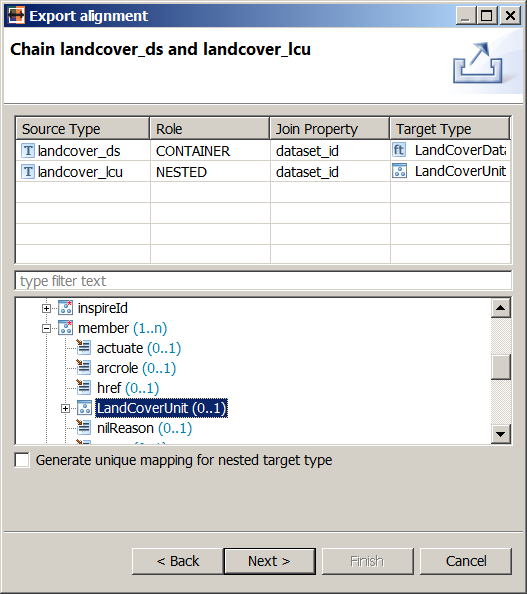
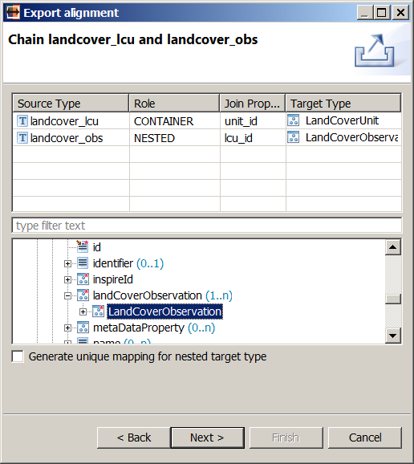
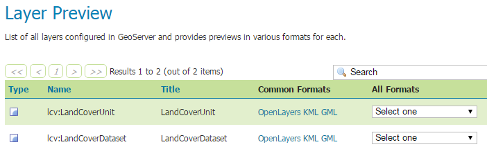
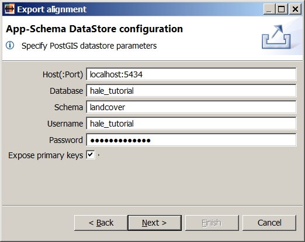

.. module:: hale.lcv_upload
.. _hale.lcv_upload:

.. include:: <isonum.txt>

Configuring GeoServer
---------------------
.. include:: ../common/upload_intro.txt

The export procedure is mostly the same regardless of the alignment in question, so we will go through it only for the :ref:`mapping based on normalized tables <mapping_normalized>`.

.. include:: ../common/appschema_export_format.txt

.. include:: ../common/include_target_schema_1.txt
	    
If the *Include target schema in the archive* option is checked, the target schema that was imported in the project :ref:`at the beginning of the example <import_target_lcv>`, including all its dependencies, will be added to the exported archive and uploaded to GeoServer along with the mapping configuration.

.. include:: ../common/include_target_schema_2.txt

.. _feature_chaining_lcv:

Configuring feature chaining
++++++++++++++++++++++++++++

.. include:: ../common/chaining_intro.txt

We will be presented with one configuration dialog for each join condition that :ref:`we defined <join_lcv>`. The first dialog is shown in the figure below:

   *Feature chaining configuration for landcover_ds and landcover_lcu*

.. include:: ../common/chaining_descr_1.txt

We will forget about the checkbox for now, as it is not relevant for this example, and focus on the table and the schema explorer view.

.. include:: ../common/chaining_descr_2.txt

As the dialog is opened the first time, all cells in the table are filled automatically, except the nested type's target: that is what we will select in the schema explorer view. Navigate to the *LandCoverDataset/member/LandCoverUnit* property and click on it: the *Target Type* column in the second table row will be populated with the value *LandCoverUnit*, as shown in the figure above. In this way, we are telling GeoServer both that the *landcover_lcu* source type should be mapped to the *LandCoverUnit* type and that *LandCoverUnit* instances should be nested under the *member* attribute of the *LandCoverDataset* type.

Leave the *Generate unique mapping for nested target type* checkbox unchecked, and hit **Next**.

The second feature chaining configuration dialog will appear. Select the *LandCoverDataset/member/LandCoverUnit/landCoverObservation/LandCoverObservation* property in the schema explorer view and the dialog should now look like the figure below:

   *Feature chaining configuration for landcover_lcu and landcover_obs*

In this way, we are telling GeoServer both that the *landcover_obs* source type should be mapped to the *LandCoverObservation* type, and that *LandCoverObservation* instances should be nested under the *landCoverObservation* attribute of the *LandCoverUnit* type.

Again, leave the *Generate unique mapping for nested target type* checkbox unchecked, and hit **Next** to proceed to the DataStore configuration screen.

.. include:: ../common/datastore_conf.txt

.. include:: ../common/rest_credentials.txt

Visit GeoServer's *Layer Preview* page and you should see two new layers in the list, *lcv:LandCoverDataset* and *lcv:LandCoverUnit*.

Congratulations, you successfully created a new App-Schema DataStore in GeoServer! In the :ref:`next section <hale.lcv_query>`, we will issue a few WFS requests to demonstrate how your data can be queried.

