.. module:: hale.meteo_alignment
.. _hale.meteo_alignment:

.. include:: <isonum.txt>

Defining the alignment
----------------------

.. include:: ../common/alignment_intro.txt

The meteorological database structure is depicted in the following E/R diagram:

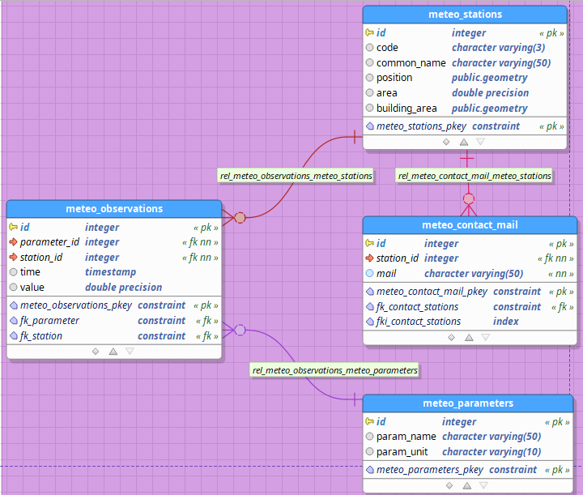

Three normalized tables are present:

* **meteo_stations**: holds basic information about the meteorological stations where measurements occur;
* **meteo_observations**: each record in this table stores the value of one environmental parameter (e.g. temperature, pressure, etc.) and the time instant when the sample was taken;
* **meteo_parameters**: holds the list of environmental parameters that can be measured by the stations.

A one-to-many relationship exists between *meteo_stations* and *meteo_observations* (a station may produce many observations); a many-to-one relationship exists between *meteo_observations* and *meteo_parameters* (many observations may refer to the same environmental parameter, sampled at different time instants).

We would like to define the mapping so that the resulting GML will have **Station**, **Observation** and **Parameter** elements properly nested inside each other: **Station** will contain related **Observation** instances in its multi-valued **observation** property, and **Observation** will contain the related **Parameter** instance in its single-valued **parameter** property.

.. include:: ../common/compatibility.txt

Mapping strategies
++++++++++++++++++

There can be different ways to define an alignment in HALE that would correctly translate to the desired App-Schema mapping configuration.

.. _first_approach_meteo:

One possible approach is this:

#. first, 1:1 relations between source types and their correspondent target type are established using the *Retype* function. In this example, the *meteo_stations* source type corresponds to the *Station* target type, so that for each record in the *meteo_stations* table, a *Station* feature should be created; the same applies to *meteo_observations* |rarr| *Observation* and *meteo_parameters* |rarr| *Parameter*;
#. then, for each *Retype* relation, the properties of the source are mapped to the properties of the target;
#. finally, the necessary *Join* relations between pairs of container |hyphen| nested types are introduced. In this example, the *meteo_stations* and *meteo_observations* source types need to be joined into the *Station* target type, so that each generated *Station* feature will contain its related *Observation* instances; the same applies to the *meteo_observations* and *meteo_parameters* source types, which will be joined into the *Observation* target type.

This approach has the advantage of mapping each type separately, thus resulting in simpler mapping cells. On the other hand, it produces a higher number of relations compared to other viable approaches. It also has the drawback that the transformed data as seen in HALE's live preview (or exported to an external file) do not look as we expect; hence, this approach is valid only if all we want to do with the alignment is to export it to an App-Schema mapping configuration.

.. _second_approach_meteo:

Another possible approach is the following:

#. first, clusters of related source types forming separate, single-root object hierarchies are identified and a single *Join* relation between all source types and the target type corresponding to the root of the hierarchy is established. In this example, there is clearly a single object hierarchy, whose root is the *Station* type, so only one *Join* relation must be defined, combining the *meteo_stations*, *meteo_observations* and *meteo_parameters* source type into the *Station* target type;
#. then, for each *Join* relation, the properties of the source types are mapped to the properties of the single target type, which contains the nested target types in its association properties. For example, the *value* property of the *meteo_observations* source type should be mapped to the *st:observation/st:Observation/st:value* property of the *Station* target type;
#. finally, source type that are unrelated to any other type and thus are not part of any cluster are mapped using *Retype* relations, as outlined in the first approach.

This approach is clearly more complicated in the definition of each mapping cell, but generally requires fewer relations. Another advantage is that the transformed data will look the same in HALE and GeoServer, so HALE's live preview can be used as an aid during the definition of the alignment.

Introductory HALE Mapping Exercise
++++++++++++++++++++++++++++++++++

During this introductory exercise we will complete an already half-done alignment of the meteo uses case using HALE.
Let's start this exercise by importing the existing ``$TRAINING_ROOT\data\hale_projects\introductory_hale_ex.halez`` HALE project.

Import existing HALE project
^^^^^^^^^^^^^^^^^^^^^^^^^^^^

.. note:: If you have not started it already, do so by double clicking on the **hale.bat** batch script (windows) or on the **HALE** link (linux) in the root folder of the training (i.e. the folder where the training package was extracted).

After startup, you should see a welcome screen like the following:

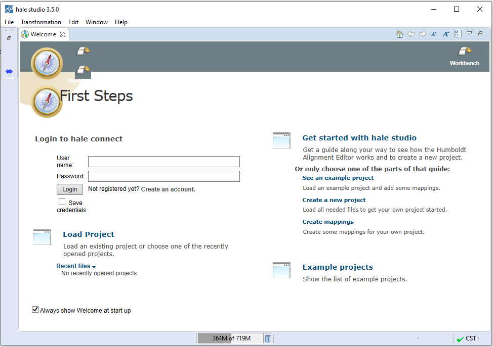

The **Welcome** tab can be safely closed by clicking on the cross next to the tab's name, which will reveal HALE's workbench:

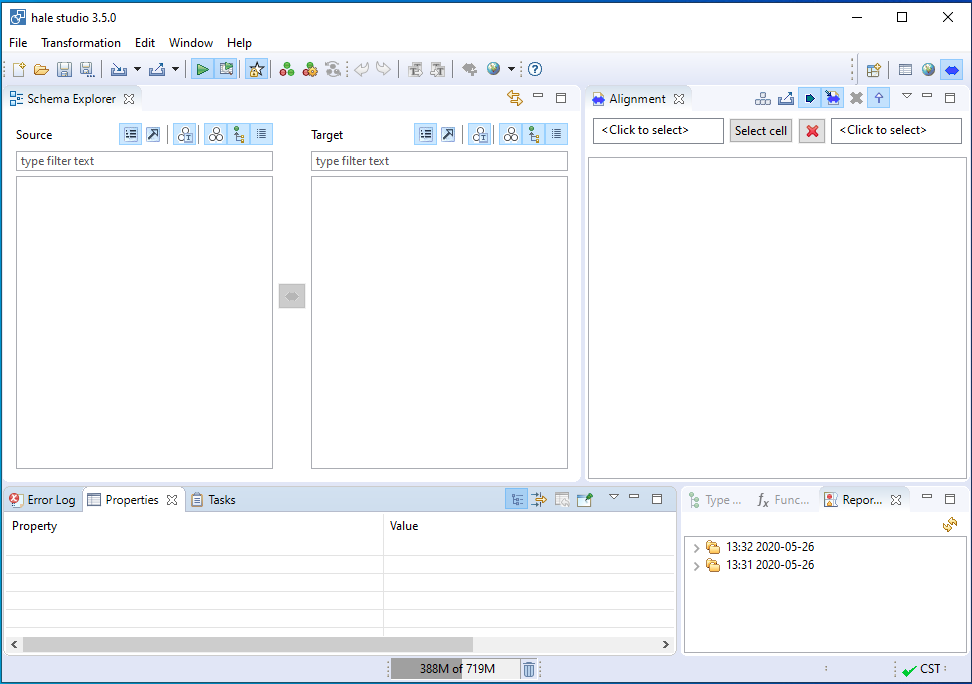

An empty project is already open at this point, but if, for any reason, one would wish to start from scratch, all one needs to do is select **File** |rarr| **New Alignment Project** in the menu bar at the top of the workbench.

.. warning:: Before importing the existing HALE project make sure that the PostgreSQL database was started and that the first GeoServer instance is running.

To import an existing project select **File** |rarr| **Open Alignment Project** in the menu bar at the top of the workbench:

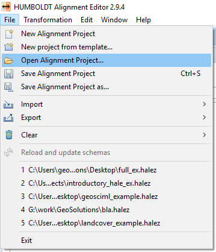

Then select or introduce the existing HALE project file path:

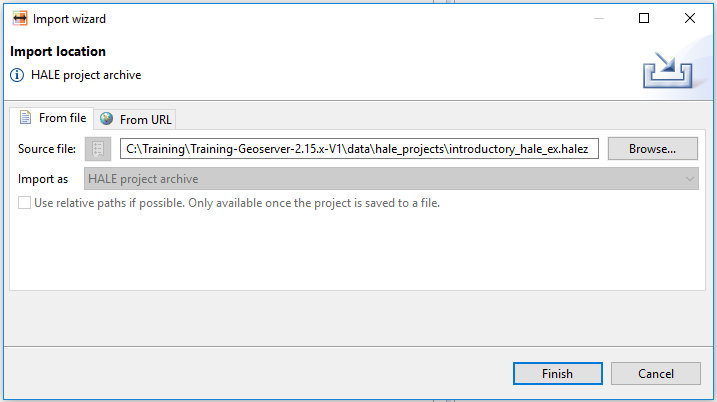

After the import is done, you should see a screen like the following:

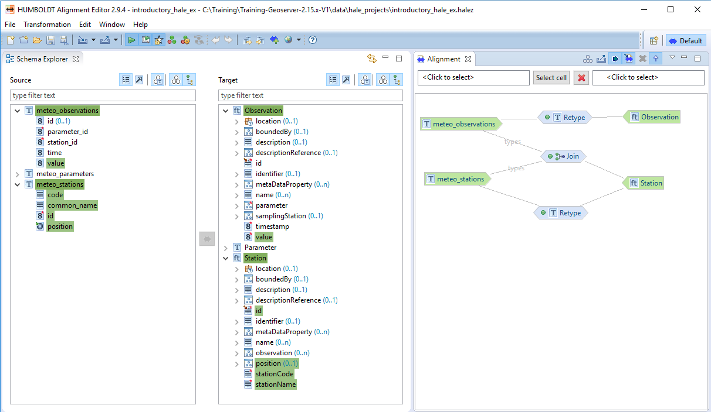

As you can see the source and target schemas have already been imported and part of the alignments are already done.

Retyping meteo_parameters
^^^^^^^^^^^^^^^^^^^^^^^^^

Relations *meteo_stations* |rarr| *Station* and *meteo_observations* |rarr| *Observation* have already been defined:

   .. figure:: img/hale_retype_observations_complete_meteo.png
      :align: center

We will now define the *meteo_parameters* |rarr| *Parameter* relation:

* Select the **meteo_parameters** type in the *Source* section of the *Schema Explorer* view;

* Select the **Station** type in the *Target* section of the *Schema Explorer* view;

* Click on the blue double-pointing arrow icon in between the *Source* and *Target* sections of the *Schema Explorer* view and select *Retype* from the popup menu;

     .. figure:: img/intro-ex-2.png
        :align: center

* A wizard will open. Verify the first screen looks like the figure below, and click on the **Next** button:

     .. figure:: img/intro-ex-3.png
        :align: center

* Click on the **Finish** button, the relationships between the root source types and target types are now defined:

     .. figure:: img/hale_retype_parameters_complete_meteo.png
        :align: center

Now that the type relations have been defined, it is time to configure the relations between source and target properties.

Mapping meteo_observations to Observation
^^^^^^^^^^^^^^^^^^^^^^^^^^^^^^^^^^^^^^^^^

The mappings between source and and target properties of relation *meteo_stations* |rarr| *Station* have already been done:

     .. figure:: img/intro-ex-4.png
        :align: center

The mappings between source and and target properties of relation *meteo_observations* |rarr| *Observation* have already been partially done:

   .. figure:: img/intro-ex-5.png
      :align: center

Let's finish the mappings of relation *meteo_observations* and *Observation*:

* Expand the list arrow of *meteo_observations* and *Observation* types. Select the *meteo_observations/id* attribute in the *Source* section of the *Schema Explorer* view, then
  Select the *Observation/id* attribute in the *Target* section of the *Schema Explorer* view:

   .. figure:: img/intro-ex-10.png
       :align: center

* Click on the blue double-pointing arrow icon in between the *Source* and *Target* sections of the *Schema Explorer* view and select *Formatted string* from the popup menu.

* A wizard will open. Click *Next* on the first screen and, on the second screen, define the format pattern by typing *observation.* and then double-clicking on id in the *Available variables* section, as shown in the figure below:

     .. figure:: img/intro-ex-11.png
         :align: center

* Click on the *Finish* button.

* Select the *meteo_observations/time* attribute in the *Source* section of the *Schema Explorer* view then select the *Observation/timestamp* attribute in the *Target* section of the *Schema Explorer* view.

     .. figure:: img/intro-ex-12.png
         :align: center

* Click on the blue double-pointing arrow icon in between the *Source* and *Target* sections of the *Schema Explorer* view and select *Rename* from the popup menu.

* A wizard will open:

     .. figure:: img/intro-ex-13.png
         :align: center

* Click on the *Finish* button, the final alignment for the observations should be as the following:

     .. figure:: img/intro-ex-14.png
         :align: center

Mapping meteo_parameters to Parameter
^^^^^^^^^^^^^^^^^^^^^^^^^^^^^^^^^^^^^

Remains mapping properties of **meteo_parameters** to properties of the **Parameter** target type.

Since the steps to follow are almost the same as those for the *meteo_observations* |rarr| *Observation* mapping, we will describe them more succintly.

#. Map the *meteo_parameters/id* source property to the *Parameter/id* target property using the *Formatted string* transformation function. Use **parameter.{id}** as format pattern.
#. Map the *meteo_parameters/param_name* source property to the *Parameter/parameter* target property using the *Rename* transformation function.
#. Map the *meteo_parameters/param_unit* source property to the *Parameter/unit* target property using the *Rename* transformation function.
#. The alignment should now look like the following:

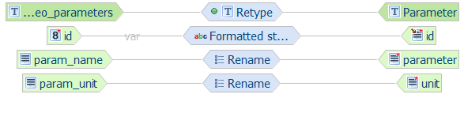

The last step remaining to complete the alignment is to define the join relations existing in our model.

Joining meteo_observations and meteo_parameters
^^^^^^^^^^^^^^^^^^^^^^^^^^^^^^^^^^^^^^^^^^^^^^^

We already joined the *meteo_stations* and *meteo_observations* source types; the join target type must be the container type, in this case it was the *Station* type:

   .. figure:: img/hale_join_complete_station_meteo.png
      :align: center

Let's now join the **meteo_observations** and **meteo_parameters** source types; the container type in this case is the **Observation** type:

* Select both *meteo_observations* and *meteo_parameters* types in the *Source* section of the *Schema Explorer* view by holding *ctrl* key.

* Holding *ctrl* key, select the *Observation* type in the *Target* section of the *Schema Explorer* view, you can now release the *ctrl* key.

* Click on the blue double-pointing arrow icon in between the *Source* and *Target* sections of the *Schema Explorer* view and select *Join* from the popup menu:

   .. figure:: img/hale_join_observation_meteo.png
      :align: center

* A wizard will open. Verify the first screen looks like the figure below, and click on the **Next** button:

   .. figure:: img/hale_join_sel_entities_observation_meteo.png
      :align: center

* Configure the join order. The join order should follow the nesting order, i.e. the container (base) type should always precede the nested (join) type (see figure below).

   .. figure:: img/hale_join_order_observation_meteo.png
      :align: center

* Define the join condition, specifying which columns contain equal values (i.e. define a foreign key constraint).

   .. figure:: img/hale_join_cond_observation_meteo.png
      :align: center

* Click on the **Finish** button.

* Make sure no cell is selected in the *Alignment* view by clicking on the red cross symbol |red_cross|

* The *Alignment* view should now look like the following:

   .. figure:: img/hale_join_complete_observation_meteo.png
      :align: center

The alignment for this introductory exercise is done, you can find below the detailed steps necessary to perform, from scratch, the alignment we have just done.

.. _mapping_first_approach_meteo:

Mapping each type separately
++++++++++++++++++++++++++++

We will now demonstrate how the :ref:`first approach <first_approach_meteo>` works in practice. First, the *meteo_stations* |rarr| *Station*, *meteo_observations* |rarr| *Observation* and *meteo_parameters* |rarr| *Parameter* relations will be defined; then *meteo_stations* and *meteo_observations* will be joined into *Station*, and *meteo_observations* and *meteo_parameters* will be joined into *Observation*.

Retyping meteo_stations, meteo_observations and meteo_parameters
^^^^^^^^^^^^^^^^^^^^^^^^^^^^^^^^^^^^^^^^^^^^^^^^^^^^^^^^^^^^^^^^

#. Select the **meteo_stations** type in the *Source* section of the *Schema Explorer* view
#. Select the **Station** type in the *Target* section of the *Schema Explorer* view
#. Click on the blue double-pointing arrow icon in between the *Source* and *Target* sections of the *Schema Explorer* view and select *Retype* from the popup menu

   .. figure:: img/hale_retype_stations_meteo.png
      :align: center

#. A wizard will open. Verify the first screen looks like the figure below, and click on the **Next** button:

   .. figure:: img/hale_retype_stations_dialog_meteo.png
      :align: center

#. Click on the **Finish** button and the *Alignment* view should now look like the following:

   .. figure:: img/hale_retype_stations_complete_meteo.png
      :align: center

      *The meteo_stations source type has been retyped to the Station target type*

#. Repeat steps 1. through 5. for the **meteo_observations** type in the *Source* section of the *Schema Explorer* view and the **Observation** type in the *Target* section of the *Schema Explorer* view
#. Make sure no cell is selected in the *Alignment* view by clicking on the red cross symbol |red_cross|
#. The *Alignment* view should now look like the following:

   .. figure:: img/hale_retype_observations_complete_meteo.png
      :align: center

#. Repeat steps 1. through 5. for the **meteo_parameters** type in the *Source* section of the *Schema Explorer* view and the **Parameter** type in the *Target* section of the *Schema Explorer* view
#. Make sure no cell is selected in the *Alignment* view by clicking on the red cross symbol |red_cross|
#. The *Alignment* view should now look like the following:

   .. figure:: img/hale_retype_parameters_complete_meteo.png
      :align: center

Now that the type relations have been defined, it is time to configure the relations between source and target properties.

.. _mapping_meteo_stations:

Mapping meteo_stations to Station
^^^^^^^^^^^^^^^^^^^^^^^^^^^^^^^^^
The **meteo_stations** properties will be mapped to properties of the **Station** target type.

We will use the **id** source property to populate the **gml:id** target property, but, instead of using the value of the source property as is, we will prepend the string ``station.`` to it, using the **Formatted String** transformation function.

#. Select the *meteo_stations/id* property in the *Source* section of the *Schema Explorer* view
#. Select the *Station/id* property in the *Target* section of the *Schema Explorer* view
#. Click on the blue double-pointing arrow icon in between the *Source* and *Target* sections of the *Schema Explorer* view and select *Formatted string* from the popup menu
#. A wizard will open. Click **Next** on the first screen and, on the second screen, define the format pattern by typing **station.** and then double-clicking on *id* in the **Available variables** section, as shown in the figure below:

   .. figure:: img/hale_format_pattern_stations_meteo.png

#. Click on the **Finish** button and the alignment should now look like the following:

   .. figure:: img/hale_after_id_mapping_stations_meteo.png

Now we will map:

* the **code** source property to the **stationCode** target property
* the **common_name** source property to the **stationName** target property
* the **position** source property to the **position** target property

All the mappings will use the **Rename** transformation function, which simply copies source to target. Note that the geometry column in the source table (position) is directly mapped to a geometry property (of type *gml:GeometryPropertyType*) in the target feature type, no further configuration is necessary to properly encode the geometry in the output features.

#. Select the *meteo_stations/code* property in the *Source* section of the *Schema Explorer* view
#. Select the *Station/stationCode* property in the *Target* section of the *Schema Explorer* view
#. Click on the blue double-pointing arrow icon in between the *Source* and *Target* sections of the *Schema Explorer* view and select *Rename* from the popup menu
#. A wizard will open:

   .. figure:: img/hale_rename_stations_code_meteo.png

#. Click on the **Finish** button and the alignment should now look like the following:

   .. figure:: img/hale_after_code_mapping_stations_meteo.png

#. Select the *meteo_stations/common_name* property in the *Source* section of the *Schema Explorer* view
#. Select the *Station/stationName* property in the *Target* section of the *Schema Explorer* view
#. Click on the blue double-pointing arrow icon in between the *Source* and *Target* sections of the *Schema Explorer* view and select *Rename* from the popup menu
#. A wizard will open:

   .. figure:: img/hale_rename_stations_name_meteo.png

#. Click on the **Finish** button and the alignment should now look like the following:

   .. figure:: img/hale_after_name_mapping_stations_meteo.png

#. Select the *meteo_stations/position* property in the *Source* section of the *Schema Explorer* view
#. Select the *Station/position* property in the *Target* section of the *Schema Explorer* view
#. Click on the blue double-pointing arrow icon in between the *Source* and *Target* sections of the *Schema Explorer* view and select *Rename* from the popup menu
#. A wizard will open:

   .. figure:: img/hale_rename_stations_position_meteo.png

#. Click on the **Finish** button and the alignment should now look like the following:

   .. figure:: img/hale_after_position_mapping_stations_meteo.png

Mapping meteo_observations to Observation
^^^^^^^^^^^^^^^^^^^^^^^^^^^^^^^^^^^^^^^^^

The **meteo_observations** properties will be mapped to properties of the **Observation** target type.

Since the steps to follow are exactly the same as those for the *meteo_stations* |rarr| *Station* mapping, we will describe them more succintly.

#. Map the *meteo_observations/id* source property to the *Observation/id* target property using the *Formatted string* transformation function. Use **observation.{id}** as format pattern.
#. Map the *meteo_observations/time* source property to the *Observation/timestamp* target property using the *Rename* transformation function.
#. Map the *meteo_observations/value* source property to the *Observation/value* target property using the *Rename* transformation function.
#. The alignment should now look like the following:

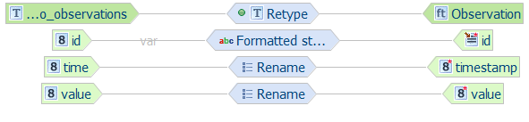

Mapping meteo_parameters to Parameter
^^^^^^^^^^^^^^^^^^^^^^^^^^^^^^^^^^^^^

The **meteo_parameters** properties will be mapped to properties of the **Parameter** target type.

Since the steps to follow are exactly the same as those for the *meteo_stations* |rarr| *Station* mapping, we will describe them more succintly.

#. Map the *meteo_parameters/id* source property to the *Parameter/id* target property using the *Formatted string* transformation function. Use **parameter.{id}** as format pattern.
#. Map the *meteo_parameters/param_name* source property to the *Parameter/parameter* target property using the *Rename* transformation function.
#. Map the *meteo_parameters/param_unit* source property to the *Parameter/unit* target property using the *Rename* transformation function.
#. The alignment should now look like the following:

Mapping table overview
^^^^^^^^^^^^^^^^^^^^^^

The following table summarizes the defined mappings:

.. csv-table::
    :header: "source property", "target property", "type of mapping"
    :widths: 40, 40, 20
    :file: stations_mappings.csv

.. _join_meteo:

Joining meteo_stations and meteo_observations
^^^^^^^^^^^^^^^^^^^^^^^^^^^^^^^^^^^^^^^^^^^^^

It is now time to define the two *Join* relations existing in our model. We will begin by joining the **meteo_stations** and **meteo_observations** source types; the *Join* target type must be the container type, so in this case it is the **Station** type.

#. Select the *meteo_stations* and *meteo_observations* types in the *Source* section of the *Schema Explorer* view
#. Select the *Station* type in the *Target* section of the *Schema Explorer* view
#. Click on the blue double-pointing arrow icon in between the *Source* and *Target* sections of the *Schema Explorer* view and select *Join* from the popup menu

   .. figure:: img/hale_join_station_meteo.png
      :align: center

#. A wizard will open. Verify the first screen looks like the figure below, and click on the **Next** button:

   .. figure:: img/hale_join_sel_entities_station_meteo.png
      :align: center

#. Configure the join order. The join order should follow the nesting order, i.e. the container (base) type should always precede the nested (join) type (see figure below).

   .. figure:: img/hale_join_order_station_meteo.png
      :align: center

#. Define the join condition, specifying which coloumns contain equal values (i.e. define a foreing key constraint).

   .. figure:: img/hale_join_cond_station_meteo.png
      :align: center

      *Join condition between meteo_stations (base type) and meteo_observations (join type)*

   .. note:: In HALE, multiple join conditions can be specified for each source type, whereas the GeoServer App-Schema extension only supports single-condition joins; thus, in order to be translatable to a GeoServer App-Schema configuration, an alignment should not contain more than one join condition for the same source type.

#. Click on the **Finish** button.
#. Make sure no cell is selected in the *Alignment* view by clicking on the red cross symbol |red_cross|
#. The *Alignment* view should now look like the following:

   .. figure:: img/hale_join_complete_station_meteo.png
      :align: center

      *Join mapping is now complete*

Joining meteo_observations and meteo_parameters
^^^^^^^^^^^^^^^^^^^^^^^^^^^^^^^^^^^^^^^^^^^^^^^

We will now join the **meteo_observations** and **meteo_parameters** source types; as noted previously, the *Join* target type must be the container type, so in this case it is the **Observation** type.

#. Select the *meteo_observations* and *meteo_parameters* types in the *Source* section of the *Schema Explorer* view
#. Select the *Observation* type in the *Target* section of the *Schema Explorer* view
#. Click on the blue double-pointing arrow icon in between the *Source* and *Target* sections of the *Schema Explorer* view and select *Join* from the popup menu

   .. figure:: img/hale_join_observation_meteo.png
      :align: center

#. A wizard will open. Verify the first screen looks like the figure below, and click on the **Next** button:

   .. figure:: img/hale_join_sel_entities_observation_meteo.png
      :align: center

#. Configure the join order. The join order should follow the nesting order, i.e. the container (base) type should always precede the nested (join) type (see figure below).

   .. figure:: img/hale_join_order_observation_meteo.png
      :align: center

#. Define the join condition, specifying which columns contain equal values (i.e. define a foreign key constraint).

   .. figure:: img/hale_join_cond_observation_meteo.png
      :align: center

      *Join condition between meteo_observations (base type) and meteo_parameters (join type)*

#. Click on the **Finish** button.
#. Make sure no cell is selected in the *Alignment* view by clicking on the red cross symbol |red_cross|
#. The *Alignment* view should now look like the following:

   .. figure:: img/hale_join_complete_observation_meteo.png
      :align: center

      *Join mapping is now complete*

Mapping 1..n cardinality
++++++++++++++++++++++++

Mapping 1..n cardinality (also known as JDBC multi-value attributes) is an App-Schema functionality that allows to generate several child simple properties on a feature, getting the data from a database relationship (a join).
On the Schema Stationtype definition we have a multi(unbounded) simple property named **contactMail**:

.. code-block:: xml

  <complexType name="StationType">
    <complexContent>
      <extension base="gml:AbstractFeatureType">
        <sequence>
          <element name="stationCode" minOccurs="1" maxOccurs="1"
                   type="string" />
          <element name="stationName" minOccurs="1" maxOccurs="1"
                   type="string" />
          <element name="observation" minOccurs="0" maxOccurs="unbounded"
                   type="st:ObservationPropertyType" />
          <element name="contactMail" minOccurs="0" maxOccurs="unbounded"
                   type="string"/>
          <element name="position" type="gml:GeometryPropertyType"
                   minOccurs="0" maxOccurs="1" />
          <element name="buildingSite" minOccurs="0" maxOccurs="1"
                   type="st:BuildingSitePropertyType" />
        </sequence>
      </extension>
    </complexContent>
  </complexType>
  
The desired output for this **st:contactMail** multi simple property is:
  
.. code-block:: xml

  <st:Station gml:id="station.7">
  <st:stationCode>BOL</st:stationCode>
  <st:stationName>Bologna</st:stationName>
  <st:observation>
    (...)
  </st:observation>
  <st:contactMail>station1@stations1.org</st:contactMail>
  <st:contactMail>info@station1.org</st:contactMail>
  <st:position>
    <gml:Point srsName="http://www.opengis.net/gml/srs/epsg.xml#404000">
      <gml:pos>11.34 44.5</gml:pos>
    </gml:Point>
  </st:position>
</st:Station>

The required data for the **st:contactMail** property is located on the **meteo_contact_mail** database table |rarr| **mail** field.  The **station_id** field on **meteo_contact_mail** table joins to **meteo_stations** table by its **id** primary key fied (see the database ER diagram).

On the following steps we will setup the cardinality 1..n simple attribute using this database relathionship, specifically we will connect Station/contactMail type multiple attributes to meteo_contact_mail.mail table field, and join meteo_stations with meteo_contact_mail database tables with one-to-many relathionship.

#. Select *meteo_contact_mail* and *meteo_stations* on Source.
#. Select Station on Target.
#. Click the linking button and select *Join*.

   .. figure:: img/cardinality_01.png
      :align: center

#. Click *Next* button on the Join wizard window.

   .. figure:: img/cardinality_02.png
      :align: center

#. Put *meteo_stations* first on the join order step and click *Next*.

   .. figure:: img/cardinality_03.png
      :align: center
   
#. Click *Finish*.
   
   .. figure:: img/cardinality_04.png
      :align: center

Now lets link the attributes.

#. On Source, select *mail* attribute on *meteo_contact_mail* table.
#. On Target, select *contactMail* attribute on *Station* type.
   
   .. figure:: img/cardinality_05.png
      :align: center

#. Click on *Finish* button.

   .. figure:: img/cardinality_06.png
      :align: center

Congratulations, the mapping is now complete. You can jump to the :ref:`next section <hale.meteo_upload>` to learn how your alignment can be exported to an App-Schema mapping configuration and uploaded to GeoServer. Otherwise, read on to explore an alternative mapping strategy, based on a single *Join* relation.

Single-join mapping
+++++++++++++++++++

We will now demonstrate how the :ref:`second approach <second_approach_meteo>` works in practice. First, the three source tables, **meteo_stations**, **meteo_observations** and **meteo_parameters** are combined and mapped to the **Station** type, using a single **Join** relation; then, the properties of the source types are mapped to the properties of the target type and of the types nested in it.

Joining meteo_stations, meteo_observations and meteo_parameters
^^^^^^^^^^^^^^^^^^^^^^^^^^^^^^^^^^^^^^^^^^^^^^^^^^^^^^^^^^^^^^^

#. Select the *meteo_stations*, *meteo_observations* and *meteo_parameters* types in the *Source* section of the *Schema Explorer* view
#. Select the *Station* type in the *Target* section of the *Schema Explorer* view
#. Click on the blue double-pointing arrow icon in between the *Source* and *Target* sections of the *Schema Explorer* view and select *Join* from the popup menu

   .. figure:: img/hale_join_single_meteo.png
      :align: center

#. A wizard will open. Verify the first screen looks like the figure below, and click on the **Next** button:

   .. figure:: img/hale_join_sel_entities_single_meteo.png
      :align: center

#. Configure the join order. The join order should follow the nesting order, i.e. the container (base) type should always precede the nested (join) type (see figure below).

   .. figure:: img/hale_join_order_single_meteo.png
      :align: center

#. For each pair of tables to join, define the join conditions, specifying which columns contain equal values (i.e. define a foreign key constraint).

   .. figure:: img/hale_join_cond_station_meteo.png
      :align: center

      *Join condition between meteo_stations (base type) and meteo_observations (join type)*

   .. figure:: img/hale_join_cond_observation_single_meteo.png
      :align: center

      *Join condition between meteo_observations (base type) and meteo_parameters (join type)*

#. Click on the **Finish** button and the *Alignment* view should now look like the following:

   .. figure:: img/hale_join_complete_single_meteo.png
      :align: center

      *Join mapping is now complete*

Now that the type relations have been defined, it is time to configure the relations between source and target properties.

Mapping meteo_stations to Station
^^^^^^^^^^^^^^^^^^^^^^^^^^^^^^^^^

The **meteo_observations** properties will be mapped to properties of the **Observation** target type.

The steps to follow are exactly the same :ref:`as those described in the first approach <mapping_meteo_stations>`, so we will not repeat them here.

In the end, the alignment should look like the following:

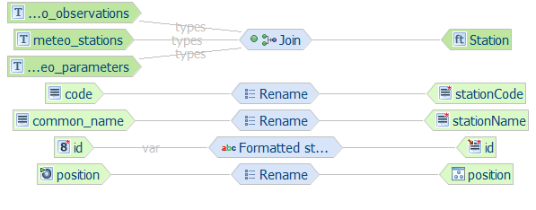

Mapping meteo_observations to Observation
^^^^^^^^^^^^^^^^^^^^^^^^^^^^^^^^^^^^^^^^^

The **meteo_observations** properties will be mapped to properties of the **Observation** target type. **Be careful**, though, because we will not pick the properties of the top level *Observation* type (which is immediately visible in the *Target* section of the *Schema Explorer* view), but we will reach for the *Observation* type nested under the *observation* property of the *Station* type (see figure below), and map to its child properties.

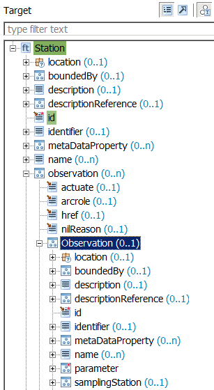

   *We want to map to the child properties of the Observation type nested in the Station type*

Here is a brief summary of the actions that should be taken:

#. Map the *meteo_observations/id* source property to the *Station/observation/Observation/id* target property using the *Formatted string* transformation function. Use **observation.{id}** as format pattern.
#. Map the *meteo_observations/time* source property to the *Station/observation/Observation/timestamp* target property using the *Rename* transformation function.
#. Map the *meteo_observations/value* source property to the *Station/observation/Observation/value* target property using the *Rename* transformation function.
#. The alignment should now look like the following:

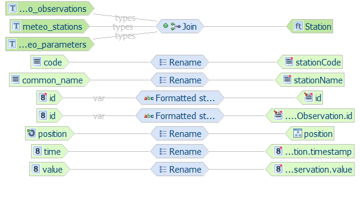

Mapping meteo_parameters to Parameter
^^^^^^^^^^^^^^^^^^^^^^^^^^^^^^^^^^^^^

The **meteo_parameters** properties will be mapped to properties of the **Parameter** target type. Again, **be careful**, because we will not pick the properties of the top level *Parameter* type (which is immediately visible in the *Target* section of the *Schema Explorer* view), but we will reach for the *Parameter* type nested under the *parameter* property of the *Observation* type, which is itself nested under the *observation* property of the *Station* type (see figure below), and map to its child properties.

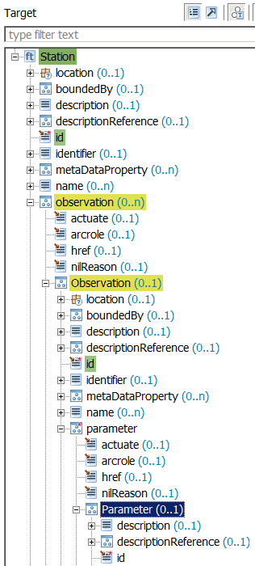

   *We want to map to the child properties of the Parameter type nested in the Station type*

Here is a brief summary of the actions that should be taken:

#. Map the *meteo_parameters/id* source property to the *Station/observation/Observation/parameter/Parameter/id* target property using the *Formatted string* transformation function. Use **parameter.{id}** as format pattern.
#. Map the *meteo_parameters/param_name* source property to the *Station/observation/Observation/parameter/Parameter/parameter* target property using the *Rename* transformation function.
#. Map the *meteo_parameters/param_unit* source property to the *Station/observation/Observation/parameter/Parameter/unit* target property using the *Rename* transformation function.
#. The alignment should now look like the following:

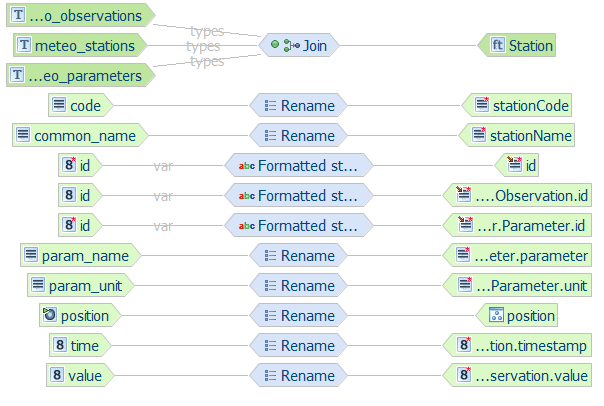

Mapping table overview
^^^^^^^^^^^^^^^^^^^^^^

The following table summarizes the defined mappings:

.. csv-table::
    :header: "source property", "target property", "type of mapping"
    :widths: 40, 40, 20
    :file: stations_mappings_single.csv

Congratulations, the mapping is now complete. You can jump to the :ref:`next section <hale.meteo_upload>` to learn how your alignment can be exported to an App-Schema mapping configuration and uploaded to GeoServer. Otherwise, if you would like to practice a little bit more on your own to consolidate your understanding of the material, read on and try to complete the following bonus exercise.

Bonus exercise
++++++++++++++

To test your newly acquired skills, you could try to create a new alignment where the nesting order of the *Station* and *Observation* types is inverted: each *Observation* feature should contain the related *Station* feature nested in its *samplingStation* property. You can follow either one of the two approaches described above to accomplish the task.

