.. module:: hale.meteo_isolated
.. _hale.meteo_isolated:

.. include:: <isonum.txt>

Exporting Complex features to an Isolated Workspace
---------------------------------------------------

Introduction
++++++++++++

Sometimes the same complex feature type needs to be published multiple times with a different mapping and with the same name. This can be done in GeoServer using isolated workspaces |2018| functionality. To create an isolated workspace we just need to check the Isolated Workspace check-box:

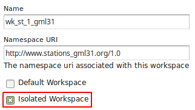

The concept of isolated workspaces was introduced to allow multiple workspaces with the same name-space. The resources contained by an workspace can be referenced by the workspace prefix or by the workspace name-space. If two workspaces have the same name-space we need to have a way to prioritize which workspace should be considered. This is where isolated workspaces come in.

Consider the following image which shows to workspaces (*st1* and *st2*) that use the same name-space (http://www.stations.org/1.0) and several layers contained by them:

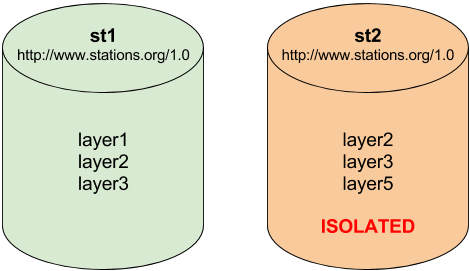

It is only possible to create two or more workspaces with the same name-space in GeoServer if at least one of them is marked as isolated, in the example above *st2* is the isolated workspace. Consider the following WFS *GetFeature* requests:

  #. ``http://<host>/geoserver/ows?service=WFS&version=2.0.0&request=DescribeFeatureType&`` **typeName=layer2**
  #. ``http://<host>/geoserver/st2/ows?service=WFS&version=2.0.0&request=DescribeFeatureType&`` **typeName=layer2**
  #. ``http://<host>/geoserver/ows?service=WFS&version=2.0.0&request=DescribeFeatureType&`` **typeName=st1:layer2**
  #. ``http://<host>/geoserver/st2/ows?service=WFS&version=2.0.0&request=DescribeFeatureType&`` **typeName=st2:layer2**
  #. ``http://<host>/geoserver/ows?service=WFS&version=2.0.0&request=DescribeFeatureType&`` **typeName=st2:layer2**
  #. ``http://<host>/geoserver/ows?service=WFS&version=2.0.0&request=DescribeFeatureType&`` **typeName=layer5**

The first request is targeting WFS global service and requesting *layer2*, this request will use *layer2* contained by workspace *st1*. The second request is targeting *st2* workspace WFS virtual service, *layer2* belonging to workspace *st2* will be used. Requests three and four will use *layer2* belonging to workspace, respectively, *st1* and *st2*. The last two requests will fail saying that the layer was not found.

.. note:: The rule of thumb is that resources (layers, styles, etc ...) belonging to an isolated workspace can only be retrieved when using the workspace virtual service and will only show up in that virtual service capabilities document.

Using Isolated Workspaces
+++++++++++++++++++++++++

On this exercise we'll export modified Stations complex features to a new Isolated Workspace using a slightly different schema.  An Isolated workspace can share the same namespace URI with other workspaces, but have its own name and any type definition outside the isolated workspace doesn't affect its behavior.
In this approach we can have Type names (namespace and name) without the name restriction from other workspaces as happens on regular GeoServer workspaces.

We will start adding a new BuildingSite Type definition with a geometry property to the schema:

.. code-block:: xml

    <element name="BuildingSite" type="st:BuildingSiteType" substitutionGroup="gml:AbstractFeature" />

    <complexType name="BuildingSiteType">
      <complexContent>
        <extension base="gml:AbstractFeatureType">
          <sequence>
            <element name="area" minOccurs="1" maxOccurs="1"
                     type="double" />
            <element name="station" minOccurs="0" maxOccurs="1"
                     type="st:StationPropertyType" />
            <element name="buildingArea" type="gml:GeometryPropertyType"
                     minOccurs="1" maxOccurs="1" />
          </sequence>
        </extension>
      </complexContent>
    </complexType>
	
	<complexType name="BuildingSitePropertyType">
      <sequence minOccurs="0">
        <element ref="st:BuildingSite" />
      </sequence>
      <attributeGroup ref="gml:AssociationAttributeGroup" />
    </complexType>

And then add a **buildingSite** property to the **StationType** definition using the new **BuildingSitePropertyType**:

.. code-block:: xml

    <complexType name="StationType">
      <complexContent>
        <extension base="gml:AbstractFeatureType">
          <sequence>
            <element name="stationCode" minOccurs="1" maxOccurs="1"
                     type="string" />
            <element name="stationName" minOccurs="1" maxOccurs="1"
                     type="string" />
            <element name="observation" minOccurs="0" maxOccurs="unbounded"
                     type="st:ObservationPropertyType" />
            <element name="contactMail" minOccurs="0" maxOccurs="unbounded"
                     type="string"/>
            <element name="position" type="gml:GeometryPropertyType"
                     minOccurs="0" maxOccurs="1" />
            <element name="buildingSite" minOccurs="0" maxOccurs="1"
                     type="st:BuildingSitePropertyType" />
          </sequence>
        </extension>
      </complexContent>
    </complexType>

We will name this new file as **meteo-isolated.xsd**, our final schema definition will be:

.. code-block:: xml

  <?xml version="1.0"?>
  <schema version="1.0"
          xmlns="http://www.w3.org/2001/XMLSchema"
          xmlns:xs="http://www.w3.org/2001/XMLSchema"
          xmlns:gml="http://www.opengis.net/gml/3.2"
          xmlns:st="http://www.stations.org/1.0"
          targetNamespace="http://www.stations.org/1.0"
          elementFormDefault="qualified" attributeFormDefault="unqualified">
  
    <import namespace="http://www.opengis.net/gml/3.2" schemaLocation="http://schemas.opengis.net/gml/3.2.1/gml.xsd" />
  
    <element name="Parameter" type="st:ParameterType" substitutionGroup="gml:AbstractGML" />
  
    <element name="Observation" type="st:ObservationType" substitutionGroup="gml:AbstractFeature" />
  
    <element name="Station" type="st:StationType" substitutionGroup="gml:AbstractFeature" />
  
    <element name="BuildingSite" type="st:BuildingSiteType" substitutionGroup="gml:AbstractFeature" />
  
    <complexType name="ParameterType">
      <complexContent>
        <extension base="gml:AbstractGMLType">
          <sequence>
            <element name="parameter" minOccurs="1" maxOccurs="1"
                     type="string" />
            <element name="unit" minOccurs="1" maxOccurs="1" type="string" />
          </sequence>
        </extension>
      </complexContent>
    </complexType>
  
    <complexType name="ObservationType">
      <complexContent>
        <extension base="gml:AbstractFeatureType">
          <sequence>
            <element name="timestamp" minOccurs="1" maxOccurs="1"
                     type="dateTime" />
            <element name="value" minOccurs="1" maxOccurs="1"
                     type="double" />
            <element name="parameter" minOccurs="1" maxOccurs="1"
                     type="st:ParameterPropertyType" />
            <element name="samplingStation" minOccurs="0" maxOccurs="1"
                     type="st:StationPropertyType" />
          </sequence>
        </extension>
      </complexContent>
    </complexType>
  
    <complexType name="StationType">
      <complexContent>
        <extension base="gml:AbstractFeatureType">
          <sequence>
            <element name="stationCode" minOccurs="1" maxOccurs="1"
                     type="string" />
            <element name="stationName" minOccurs="1" maxOccurs="1"
                     type="string" />
            <element name="observation" minOccurs="0" maxOccurs="unbounded"
                     type="st:ObservationPropertyType" />
            <element name="contactMail" minOccurs="0" maxOccurs="unbounded"
                     type="string"/>
            <element name="position" type="gml:GeometryPropertyType"
                     minOccurs="0" maxOccurs="1" />
            <element name="buildingSite" minOccurs="0" maxOccurs="1"
                     type="st:BuildingSitePropertyType" />
          </sequence>
        </extension>
      </complexContent>
    </complexType>
  
    <complexType name="BuildingSiteType">
      <complexContent>
        <extension base="gml:AbstractFeatureType">
          <sequence>
            <element name="area" minOccurs="1" maxOccurs="1"
                     type="double" />
            <element name="station" minOccurs="0" maxOccurs="1"
                     type="st:StationPropertyType" />
            <element name="buildingArea" type="gml:GeometryPropertyType"
                     minOccurs="1" maxOccurs="1" />
          </sequence>
        </extension>
      </complexContent>
    </complexType>
  
    <complexType name="ParameterPropertyType">
      <sequence minOccurs="0">
        <element ref="st:Parameter" />
      </sequence>
      <attributeGroup ref="gml:AssociationAttributeGroup" />
    </complexType>
  
    <complexType name="ObservationPropertyType">
      <sequence minOccurs="0">
        <element ref="st:Observation" />
      </sequence>
      <attributeGroup ref="gml:AssociationAttributeGroup" />
    </complexType>
  
    <complexType name="StationPropertyType">
      <sequence minOccurs="0">
        <element ref="st:Station" />
      </sequence>
      <attributeGroup ref="gml:AssociationAttributeGroup" />
    </complexType>
  
    <complexType name="BuildingSitePropertyType">
      <sequence minOccurs="0">
        <element ref="st:BuildingSite" />
      </sequence>
      <attributeGroup ref="gml:AssociationAttributeGroup" />
    </complexType>
  
  </schema>

With this new schema we will publish the Station type (with same URI) on a new workspace making it isolated. 

Import the **http://localhost:8083/geoserver/www/meteo/meteo-isolated.xsd** new schema, and click **Finish**:

.. figure:: img/newtype_01.png
   :align: center

The imported types should now show the **BuildingSite** type:

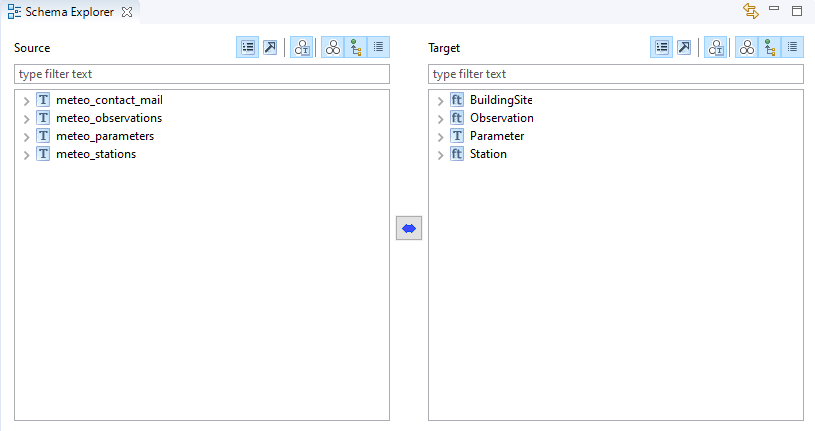
   
Select **meteo_stations** source type and **Station** target type, click the double arrow button and select **ReType**:

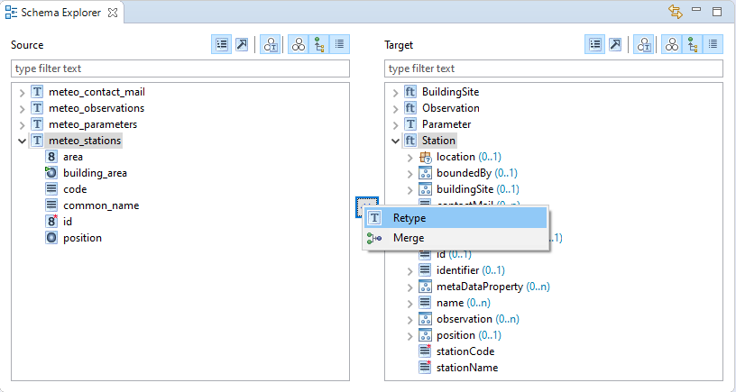
   
Click on **Finish** button:

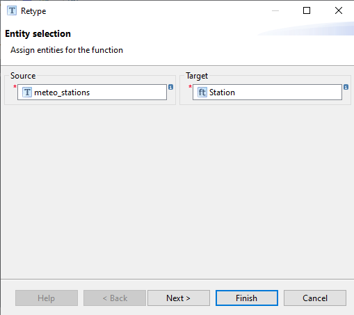
   
Select **meteo_stations** |rarr| **id** on source types and **Station** |rarr| **id** on target types and select **Formatted String**:

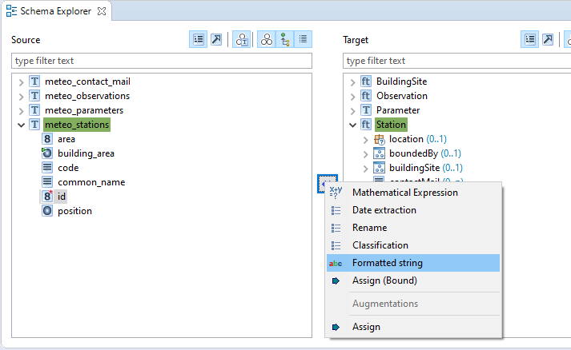
   
Click **next**:

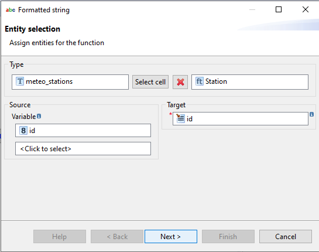
   
Write **station.{id}** and click **Finish**:

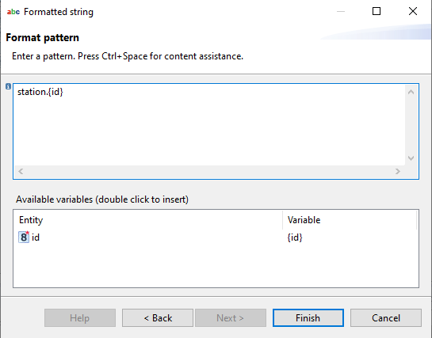
   
Select **meteo_stations** |rarr| **position** on source types and **Station** |rarr| **position** on target types, then click the double arrow button and select **Rename**:

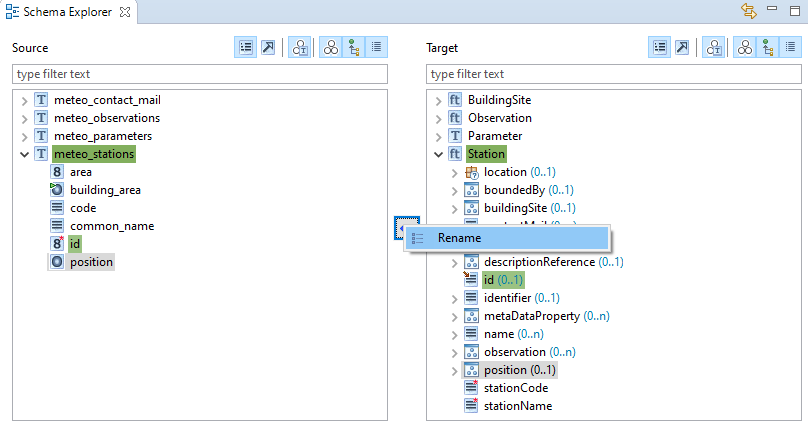

Click on **Finish**:

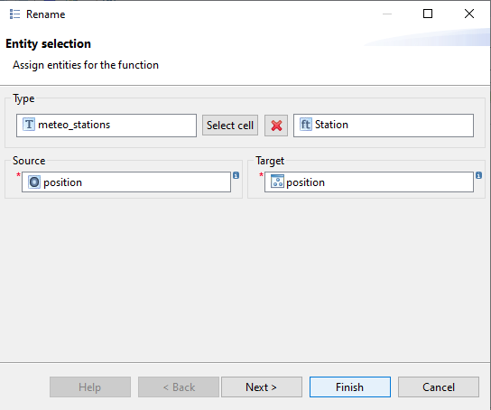

In the same way, apply **Rename** transformation for **meteo_stations.code** |rarr| **Station/stationCode** and **meteo_stations.common_name** |rarr| **Station/stationName**.

Now we will connect the nested feature attributes.  Select **meteo_stations.building_area** on source types and **Station/buildingSite/BuildingSite/buildingArea** on target types, click on the double arrow button and select **Rename**.  Click on **Finish** button:

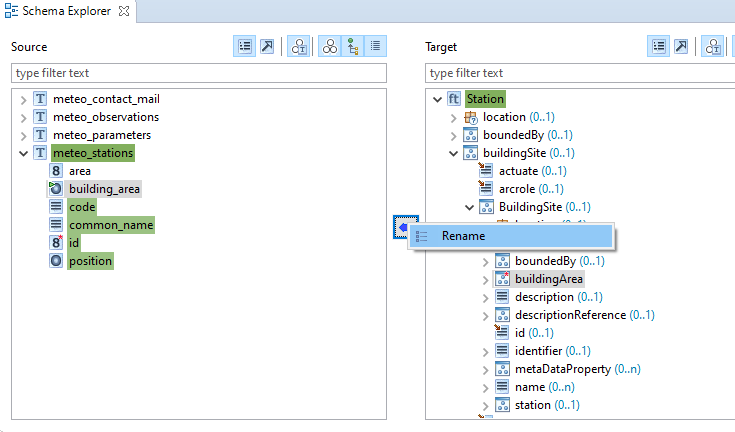

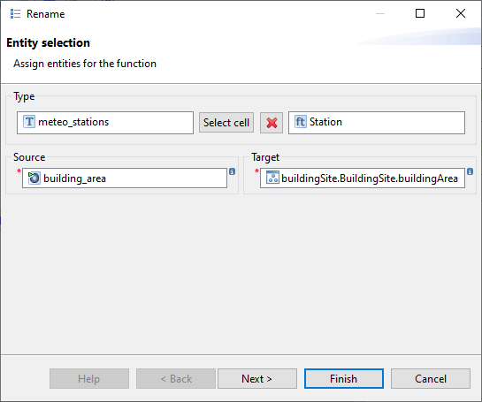

Now we will connect the nested feature attributes.  Select **meteo_stations.area** on source types and **Station/buildingSite/BuildingSite/area** on target types, click on the double arrow button and select **Rename**.  Click on **Finish** button:

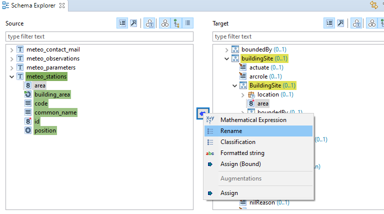

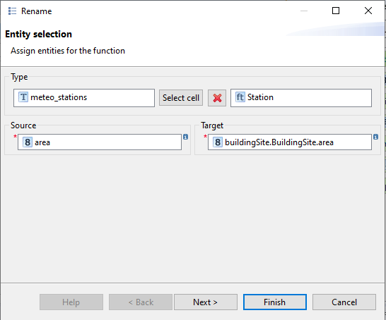

Let's export this new mapping to Geoserver, on Hale main menu click on **File** |rarr| **Export** |rarr| **Alignment**, select **App-Schema Configuration [Direct Upload]**:

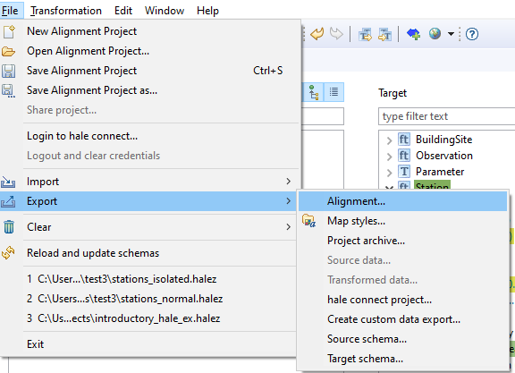

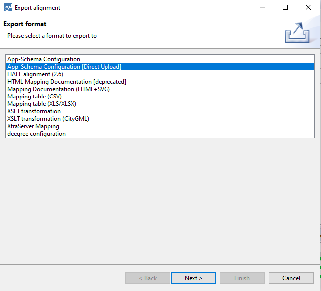

Write **http://localhost:8083/geoserver** on Target Url, click Next:

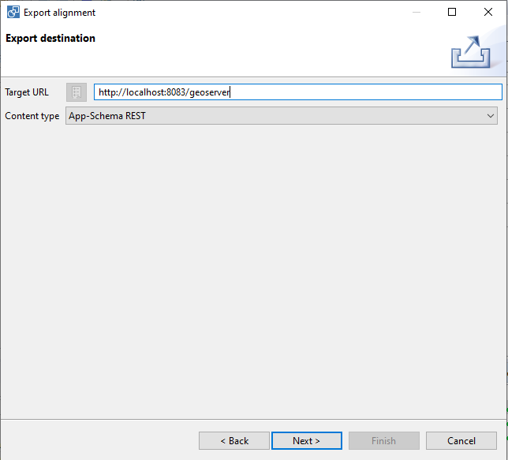
   
Change the workspace name to **stations2**, mark it as **Isolated** and click on **Next** button:

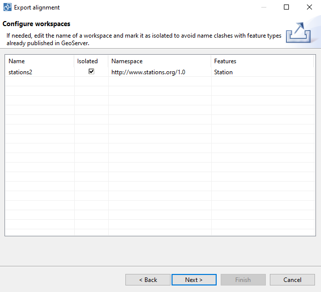
   
Select **Relational Database**, fill the database connection parameters and click on **Next** button:

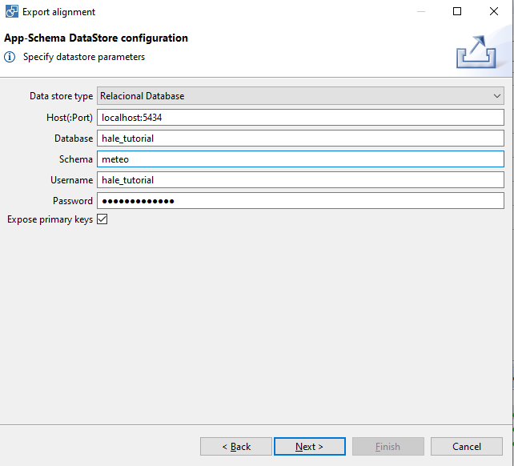
   
Fill the Geoserver authentication parameters and click on **Finish** button:

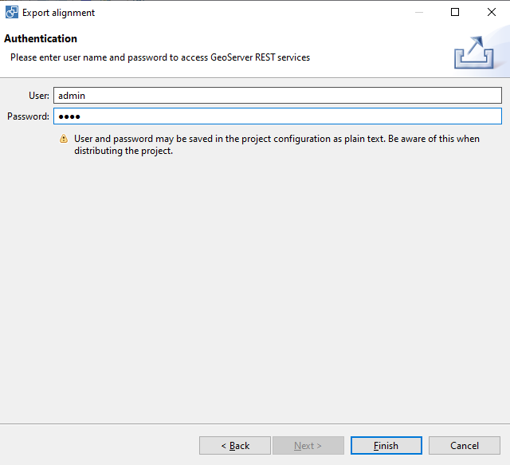
   
On GeoServer, go to **Workspaces** section and we should see the new isolated workspace available:

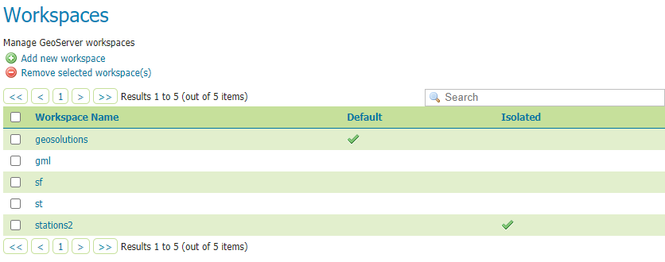
   
Go to **Preview Layers** GeoServer menu, locate **stations2:Station** layer and click on **OpenLayers** link:

.. figure:: img/newtype_21.png
   :align: center

The layer preview will show the configured points on a preview map:

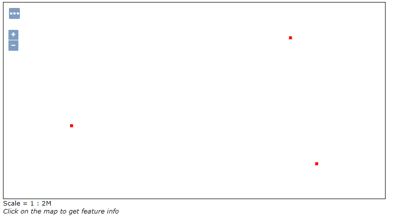

Set the default geometry
++++++++++++++++++++++++

The BuildingSite type contains a geometry connected to the **meteo_stations.building_area** polygons.  Now we will use App-Schema Default Geometry configuration for making these polygons the default geometry GeoServer WMS will draw (and WFS will use as well).  

We will set the **defaultGeometry** XML attribute to define which property will be used as default geometry on GeoServer, writting the XPATH string pointing to the property (it could be a nested property). On our case we will set the default property to the **stations2:buildingSite/stations2:BuildingSite/stations2:buildingArea** XPATH:

.. code-block:: xml

  <defaultGeometry>stations2:buildingSite/stations2:BuildingSite/stations2:buildingArea</defaultGeometry>

Let's open the **Training-Geoserver-2.17.x-V3\geoserver_data\data\stations2\meteo-isolated\meteo-isolated.appschema** mapping file and add a this new line after the **<targetElement>** attribute:

.. code-block:: xml

  <FeatureTypeMapping>
    <mappingName>Station-c3ce3917-81b2-45ca-b963-16dfdfa04517</mappingName>
    <sourceDataStore>dataStore</sourceDataStore>
    <sourceType>meteo_stations</sourceType>
    <targetElement>stations2:Station</targetElement>
    <defaultGeometry>stations2:buildingSite/stations2:BuildingSite/stations2:buildingArea</defaultGeometry>
    <attributeMappings>
      <AttributeMapping>
        <targetAttribute>stations2:Station</targetAttribute>
        <idExpression>
          <OCQL>strConcat('station.', id)</OCQL>
        </idExpression>
      </AttributeMapping>
   
Save the file and return to GeoServer, go to the **Stores** section and click on **meteo-isolated** (from the stations2 workspace).  Now click on **Save** to refresh the store mapping file:

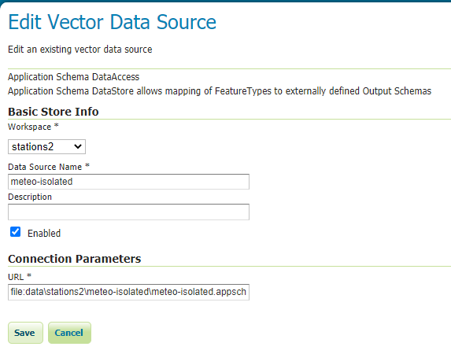

Go again to the **Preview Layers** section, locate **stations2:Station** and click on **OpenLayers** link, now GeoServer will display the nested polygons:

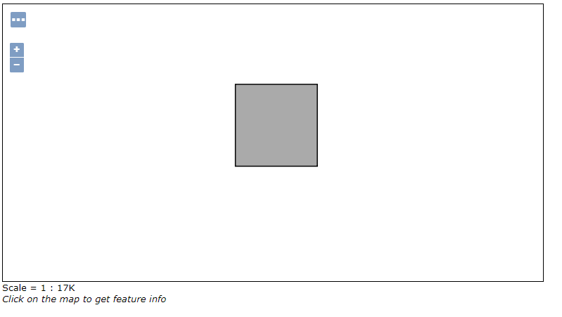
   
Change layer featureType name on GeoServer
++++++++++++++++++++++++++++++++++++++++++

Now it is possible to change the layer name for App-Schema complex features.  Go to the **station2:Stations** layer configuration page and change the *Name* to *StationsEnhanced*.  Then click on *save*.

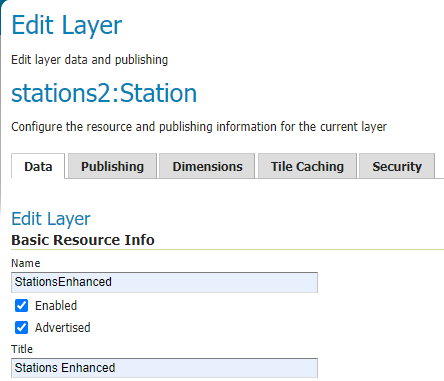

Go to the **Preview Layers** section, locate **stations2:StationsEnhanced** and click on **OpenLayers** link to double check the new layer name is working.