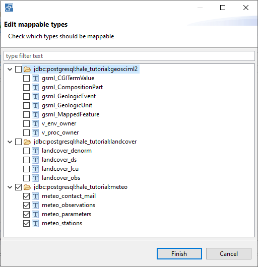
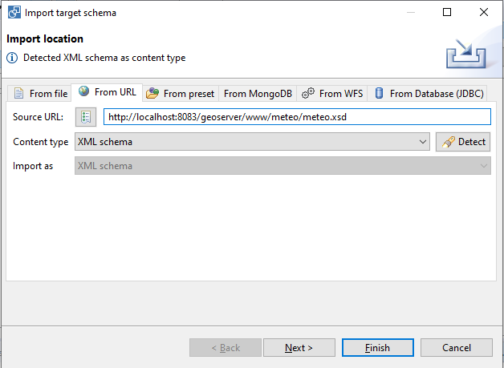
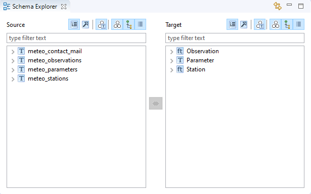

.. module:: hale.meteo_schemas
.. _hale.meteo_schemas:

.. include:: <isonum.txt>

.. include:: ../common/schemas.txt

.. include:: ../common/schemas_source.txt

.. _import_target_meteo:

Importing the target schema
+++++++++++++++++++++++++++

See this :ref:`introductory part <application_schema_extension>` for a detailed description of the ``meteo`` target schema.

.. note:: Before importing the target schema, make sure GeoServer is actually running by visiting the URL http://localhost:8083/geoserver. If it's not running start it by double clicking on the **tomcat_start_1.bat** batch script. This step also requires internet connectivity.

To import the target schema, follow these steps:

1. Select **File** |rarr| **Import** |rarr| **Target schema...** from the menu bar on top.
2. A wizard will open. On the first page of the wizard, click on the **From URL** tab, copy the URL |schema_url| in the *Source URL* field and click on the **Detect** button.
3. The *Content type* option should display **XML schema**. Click on the **Finish** button.

  |import_schema_url|

4. After the schema has been imported, the **Schema Explorer** view should look like the figure below.

  |import_schema_expl|

.. |schema_url| replace:: http://localhost:8083/geoserver/www/meteo/meteo.xsd

