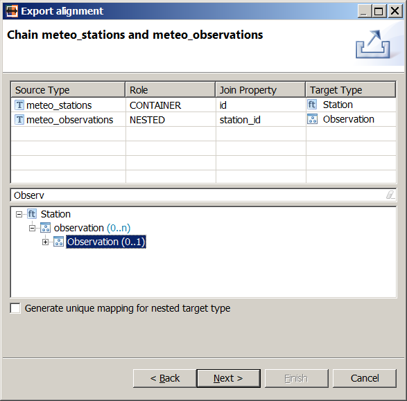
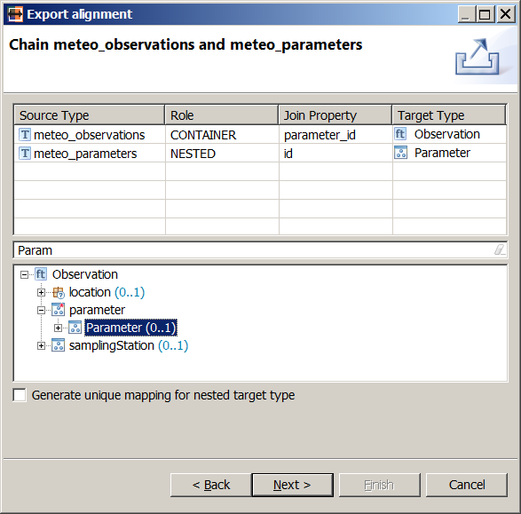
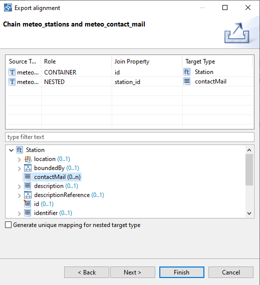
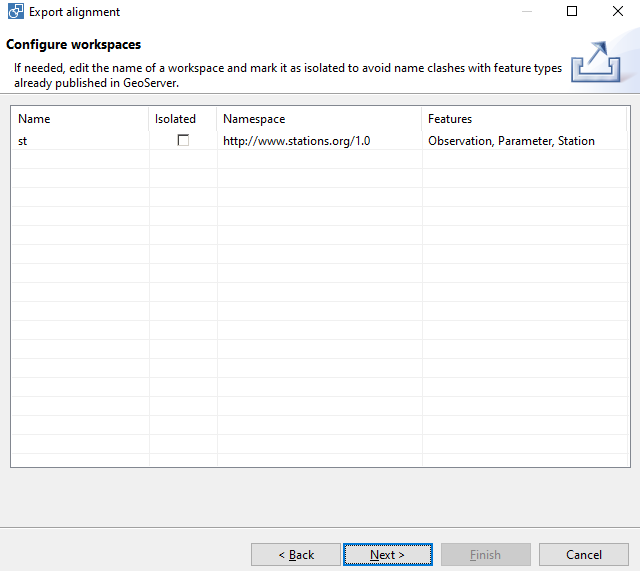
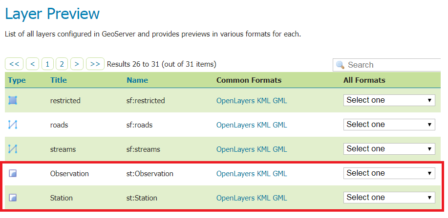
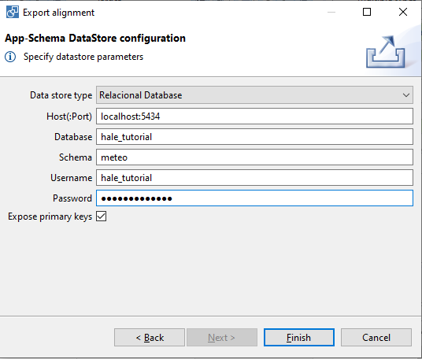
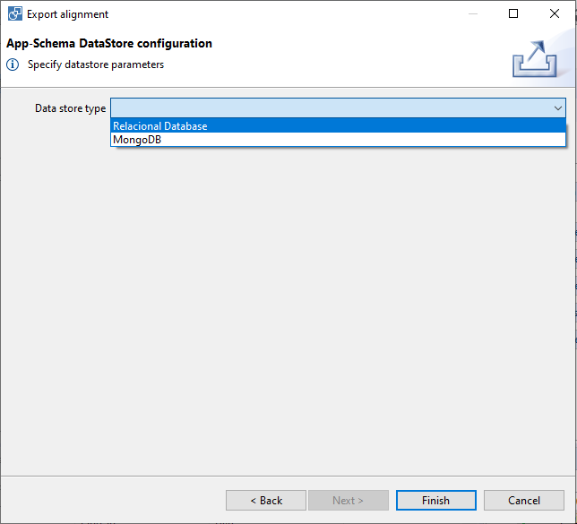

.. module:: hale.meteo_upload
.. _hale.meteo_upload:

.. include:: <isonum.txt>

Configuring GeoServer
---------------------
.. include:: ../common/upload_intro.txt

The export procedure is mostly the same regardless of the alignment in question, so we will go through it only for the :ref:`alignment with separate mappings for each type <mapping_first_approach_meteo>`.

.. include:: ../common/appschema_export_format.txt

.. include:: ../common/include_target_schema_1.txt

If the *Include target schema in the archive* option is checked, the target schema that was imported in the project :ref:`at the beginning of the example <import_target_meteo>`, including all its dependencies, will be added to the exported archive and uploaded to GeoServer along with the mapping configuration.

.. include:: ../common/include_target_schema_2.txt

.. _feature_chaining_meteo:

Configuring feature chaining
++++++++++++++++++++++++++++

See this :ref:`introductory part <feature_chaining>` for detailed information about how feature chaining works.

.. include:: ../common/chaining_intro.txt

We will be presented with one configuration dialog for each join condition that :ref:`we defined <join_meteo>`. The first dialog is shown in the figure below:

   *Feature chaining configuration for meteo_stations and meteo_observations*

.. include:: ../common/chaining_descr_1.txt

We will forget about the checkbox for now, as it is not relevant for this example, and focus on the table and the schema explorer view.

.. include:: ../common/chaining_descr_2.txt

As the dialog is opened the first time, all cells in the table are filled automatically, except the nested type's target: that is what we will select in the schema explorer view. Navigate to the *Station/observation/Observation* property and click on it: the *Target Type* column in the second table row will be populated with the value *Observation*, as shown in the figure above. In this way, we are telling GeoServer two things:

#. the *meteo_observations* source type should be mapped to the *Observation* type; this is crucial in the single-join approach, but actually redundant here, as the *Retype* relation *meteo_observations* |rarr| *Observation* conveys the same information already;
#. *Observation* instances should be nested under the *observation* attribute of the *Station* type.

Leave the *Generate unique mapping for nested target type* checkbox unchecked, and hit **Next**.

The second feature chaining configuration dialog will appear. Select the *Observation/parameter/Parameter* property in the schema explorer view and the dialog should now look like the figure below:

   *Feature chaining configuration for meteo_observations and meteo_parameters*

In this way, we are telling GeoServer both that the *meteo_parameters* source type should be mapped to the *Parameter* type (again, redundant in this particular case), and that *Parameter* instances should be nested under the *parameter* attribute of the *Observation* type.

Leave the *Generate unique mapping for nested target type* checkbox unchecked, and hit **Next**.

The third feature chaining configuration dialog will appear. Select the *Station/contactMail* property in the schema explorer view and the dialog should now look like the figure below:

   *Feature chaining configuration for meteo_contact_mail and meteo_stations using cardinality 1..n*

A *Configure Workspaces wizard windows will appear, it is useful for making a workspace isolated on Geoserver.  On this case let the default configuration and click on *Next* button.

Hit **Next** to proceed to the DataStore configuration screen.

.. include:: ../common/datastore_conf.txt

.. include:: ../common/rest_credentials.txt

Visit GeoServer's *Layer Preview* page and you should see two new layers in the list, *st:Station* and *st:Observation*.

Congratulations, you successfully created a new App-Schema DataStore in GeoServer! In the :ref:`next section <hale.meteo_query>`, we will issue a few WFS requests to demonstrate how your data can be queried.

