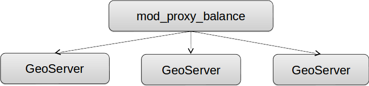

.. _geoserver.jmeter_jvm:

JVM and deploy configuration
==================================================

This section introduces some finishing touches that can improve the GeoServer performance.

Please keep in mind that the options discussed here are not going to help visibly if you did not prepare the data and the styles.

For more details you can also check the *Running in production* instructions from the GeoServer documentation `here <http://docs.geoserver.org/latest/en/user/production/index.html>`_.

JVM settings
----------------

Java programs are compiled to Java bytecode. This code can only be run through the use of a *Java Virtual Machine* (JVM).
Below are some settings that can be used to tune the JVM (of the webapplication server the GeoServer runs on):

* ``--server`` JVM is running in **server mode**; enables the server JIT compiler, which is optimized for operating speed (instead of quick startup or small memory footprint)

* ``--Xms2048m`` (or ``--Xms2g``) sets the amount of memory given to JVM at startup to two gigabytes (**Initial heap**)

* ``--Xmx2048m`` specifies that the heap memory can grow to two gigabytes (**Maximum heap**)

* ``--XX:+UseParallelOldGC --XX:+UseParallelGC`` enables multi-threaded, i.e. **parallel garbage collection**, useful if you have more than two cores

* ``--XX:NewRatio=2`` informs the JVM there will be a high number of short lived objects

* ``--XX:+AggressiveOpts`` enables experimental optimizations that will be defaults in future versions of the JVM

Setup a local cluster
---------------------

As Oracle Java2D locks when drawing antialiased vectors, the scalability is limited severely.

To address this problem, there are two options:

* Use *OpenJDK*, which is slower at rendering but scales up well.

* Use Apache *mod_proxy_balance* and setup a GeoServer each 2 (or 4) cores

	 *Local cluster with mod_proxy_balance*

You will find a lot of detailed information in the :doc:`../clustering/index` module.

Using the Marlin Renderer
--------------------------------

This section explains how GeoServer performances are improved when using the **Marlin** renderer.

The Oracle JDK and OpenJDK come with two different anti-aliased renderers:

* Oracle JDK uses **Ductus**, a fast native renderer that has scalability issues (good for desktop use, less so on the server side)

* OpenJDK uses **Pisces**, a pure java renderer that is not as fast as "Ductus", but has good scalability (anecdotally, it becomes faster than Ductus above the 4 concurrent requests)

The `Marlin <https://github.com/bourgesl/marlin-renderer>`_ renderer is an improved version of Pisces that is as fast, if not faster, than Ductus, and scales just as well as Pisces.

Configure JMeter
++++++++++++++++++++++

#. Go to ``$TRAINING_ROOT/data/jmeter_data`` ( or ``%TRAINING_ROOT%\data\jmeter_data`` on Windows ) and copy the file ``template.jmx`` file creating a ``marlin.jmx`` file

#. From the training root, on the command line, run ``jmeter.bat`` (or ``jmeter.sh`` if you're on Linux) to start JMeter

#. On the top left go to :guilabel:`File --> Open` and search for the new *jmx* file copied

#. Disable **View Results Tree** section

#. In the ``CSV Data Set Config`` element, modify the **path** of the CSV file by setting the path for the file ``controlflow.csv`` in the ``$TRAINING_ROOT/data/jmeter_data`` ( or ``%TRAINING_ROOT%\data\jmeter_data`` on Windows ) directory

#. In the **HTTP Request Default** element modify the following parameters:

	.. list-table::
		  :widths: 30 50

		  * - **Name**
		    - **Value**
		  * - layers
		    - boulder
		  * - srs
		    - EPSG:2876

Test without Marlin
++++++++++++++++++++++

#. Run the test

	.. note:: Remember to run and stop the test a few times for having stable results

#. When the test is completed, Save the results in a text file.

   .. figure:: img/no_marlin.png
      :align: center

      *Throughput without Marlin (Note the results may be different in other machines)*

#. Remove the result from JMeter by clicking on :guilabel:`Run --> Clear All` on the menu

#. Stop GeoServer

Setup Marlin
++++++++++++++++++++++

#. Stop GeoServer

#. Download the latest Marlin rasterizer library at `https://github.com/bourgesl/marlin-renderer/releases/ <https://github.com/bourgesl/marlin-renderer/releases/>`_ and save it in ``$TRAINING_ROOT/data`` ( ``%TRAINING_ROOT%\data`` on Windows )

   .. note:: "Unsafe" in he JAR name does not mean the library is unsafe to use, it merely refers to the usage of the sun.misc.Unsafe class, which allows Java code to perform a few native operations that normally would not be permitted. Safety wise, Marlin is being integrated in Java 9, where it will be the default rasterizer.

#. If you are on Linux open ``/opt/tomcat_geoserver/conf/setenv.sh`` and add the following lines after the existing JAVA_OPTS definition to enable the Marlin renderer::

            JAVA_OPTS="$JAVA_OPTS -Xbootclasspath/p:"$TRAINING_ROOT/data/marlin-0.9.1Unsafe-OpenJDK9.jar"
            JAVA_OPTS="$JAVA_OPTS -Dsun.java2d.renderer=org.marlin.pisces.PiscesRenderingEngine"

#. If you are on Windows ``%TRAINING_ROOT%\setenv.bat`` and add the following lines to enable the Marlin renderer, right before the "Tomcat options for the JVM" section::

            REM Marlin support
            set JAVA_OPTS=%JAVA_OPTS% -Xbootclasspath/p:"%ROOT%\data\marlin-0.9.1Unsafe-OpenJDK9.jar.jar"
            set JAVA_OPTS=%JAVA_OPTS% -Dsun.java2d.renderer=org.marlin.pisces.PiscesRenderingEngine

#. Start GeoServer again

#. Go to the map preview and open the ``boulder`` layer, you should see the following in the Tomcat console::

            INFO: ===============================================================================
            INFO: Marlin software rasterizer           = ENABLED
            INFO: Version                              = [marlin-0.4.4]
            INFO: sun.java2d.renderer                  = org.marlin.pisces.PiscesRenderingEngine
            INFO: sun.java2d.renderer.useThreadLocal   = true
            INFO: sun.java2d.renderer.useRef           = soft
            INFO: sun.java2d.renderer.pixelsize        = 2048
            INFO: sun.java2d.renderer.subPixel_log2_X  = 3
            INFO: sun.java2d.renderer.subPixel_log2_Y  = 3
            INFO: sun.java2d.renderer.tileSize_log2    = 5
            INFO: sun.java2d.renderer.useFastMath      = true
            INFO: sun.java2d.renderer.useSimplifier    = false
            INFO: sun.java2d.renderer.doStats          = false
            INFO: sun.java2d.renderer.doMonitors       = false
            INFO: sun.java2d.renderer.doChecks         = false
            INFO: sun.java2d.renderer.useJul           = false
            INFO: sun.java2d.renderer.logCreateContext = false
            INFO: sun.java2d.renderer.logUnsafeMalloc  = false
            INFO: ===============================================================================

Test with Marlin renderer
++++++++++++++++++++++++++++++++++++++++++++

#. Run again the test.

	You may see that the throughput got significantly higher, especially at mid-high thread counts

   .. figure:: img/marlin.png
      :align: center

      *Throughput with Marlin (Note the results may be different in other machines)*
