.. module:: geoserver.esri.agol
   :synopsis: Learn how to consume GeoServer resources from ESRI ArcGIS OnLine.

.. _geoserver.esri.agol:

Accessing GeoServer from ESRI AGOL
=============================

This module introduces how to access GeoServer resources from ESRI ArcGIS OnLine.

To consume GeoServer OGC service from ArcGIS OnLine some steps are required:
  1. Move HTTP Server to **HTTPS** (the HTTP protocol is not more supported by ArcGIS OnLine).
  2. Add GeoServer as Trusted server (if no OGC requested will be proxed by ArcGIS OnLine).
  3. Enable CORS in GeoSever

Add GeoServer as a Trusted Server
#################################

To add a server in ArcGIS OnLine as trusted we need to configure it in the security settings section of your ArcGIS OnLine organization:

As administrator of your AOL organization go to the home organization page and click the menu setting (upper right):

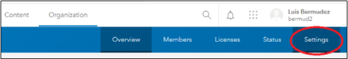

In the settings page click on security on the left side panel:

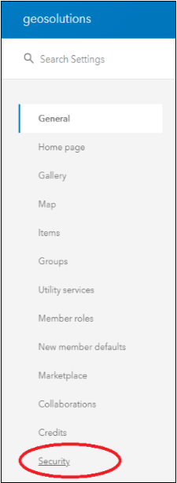

Then in the section named “Trusted servers”, click the button “Add” to add the url of the trusted server:

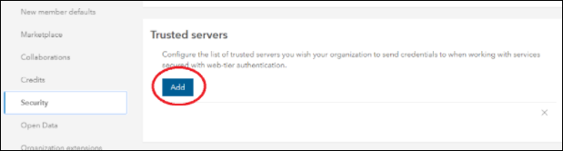

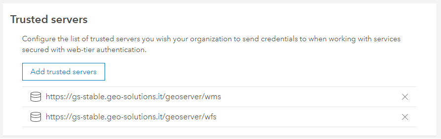

Enabling CORS in GeoServer
#################################
To enable CORS, you need to change the **web.xml** file config in your GeoServer:

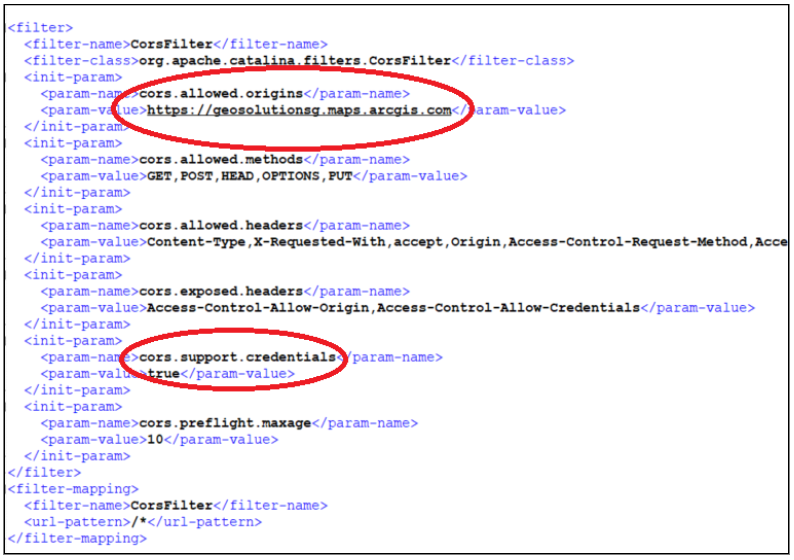

The parameters that need to change are:
   * cors.allowed.origins: Add the organization domain of your customer organizations: <organization_name>.maps.arcgis.com (e.g.,  geosolutionsg.maps.arcgis.com).
   * cors.support.credentials: true

Consume WMS services
#################################

Connect to ArcGIS OnLine and open a new map.

Click **Add** > **Add Layer from Web** menu:

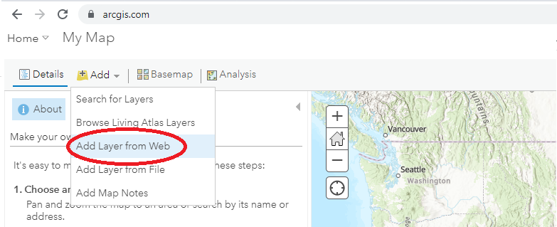

Select **A WMS OGC Web Service** as data type and enter the URL of the WMS service.
If the URL of the server is using HTTP ArcGIS OnLine should show a warning message. 

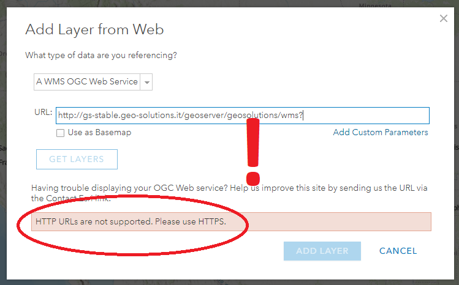

Enter a valid HTTPS GeoServer URL, then click the **GET LAYERS** button.
ArcGIS OnLine will send a GetCapabilities request to GeoServer and then display the list of available layers.   

If the resource is protected GeoServer will return from this request a 401 HTTP response.

In this case the browser will show a username/password window (enter here the credentials to access the OCG resources):

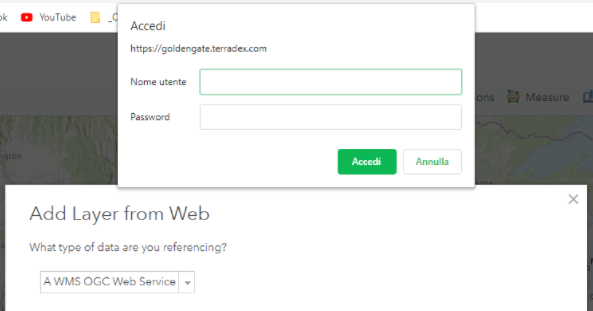

Select the layers of interest and finally click the **ADD LAYER** button:

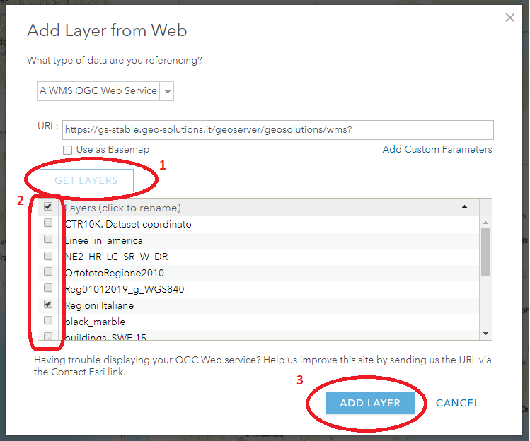

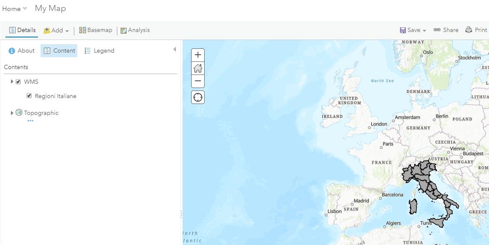

Consume WFS services
#################################

Connect to ArcGIS OnLine and open a new map.

Click **Add** > **Add Layer from Web** menu:   

Select **A WFS OGC Web Service** as data type and enter the URL of the WMS service.

Enter the WFS URL of your GeoServer, then click the **GET LAYERS** button.

Select the layer of interest to load into your map (eg. Regioni Italiane).

.. figure:: img/add-wfs-layer-aol.png
   :align: center      

In the above window the **Show advanced Options** allows the user to define the maximum number of features to load (default is 3000).

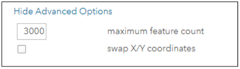

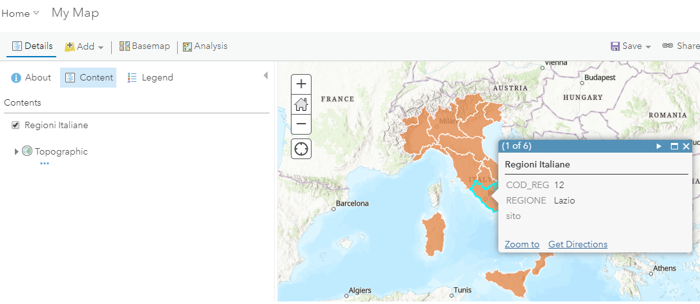
