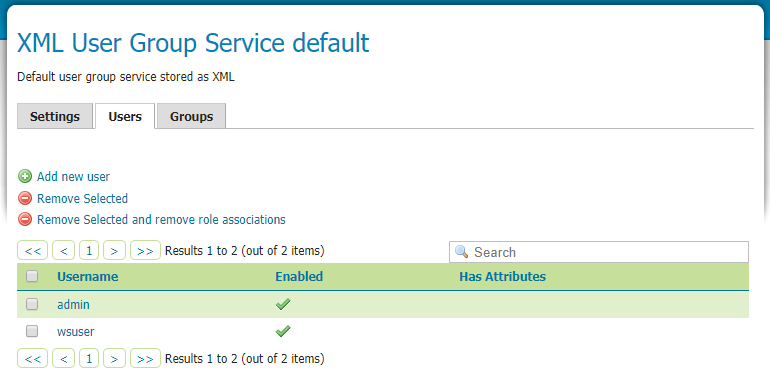

.. module:: geoserver.esri.arcgis
   :synopsis: Learn how to consume GeoServer resources from ESRI ArcGIS Desktop/Pro.

.. _geoserver.esri.arcgis:

Accessing GeoServer from ESRI ArcGis Desktop and ArcGIS Pro
=============================

This module introduces how to access GeoServer resources from ESRI ArcGIS Desktop/Pro.

We are going to provide some additional information on how to secure access to certain workspaces 
for both WMS and WFS services using Basic Authentication and how to access them using ESRI Desktop clients.
   Notice that we do recommend enabling SSL and therefore HTTPS, in the case it was not already 
   enabled, because this would make the whole handshake much more secure (SSL encryption) 
   since otherwise passwords would move around in a simple base64 encoding (which is reversible).

Authentication
^^^^^^^^^^^^^^^^^^^^^^^^^^   
In GeoServer we have 3 sets of resources involved in authentication:
   * Web Admin Interface
   * OWS Services
   * REST services

In this section we will use a default username/password authentication that works against a user/group service managed by GeoServer using XML files. 
This is fine as long as the number of users is low (<=50) and the frequency of new users to be created is small. 

If these conditions are not met, we shall ideally revert to more enterprise means to store users credentials, like LDAP or a DBMS.

Default User Group service
###########################
The default user/group service currently contains the following users:
   * admin (with ADMIN role)
   * wsuser

Roles
****************************
Security in GeoServer is based on a role-based system, with roles created to serve particular functions. 
Roles are assigned to users and groups of users, and determine what actions those users or groups are permitted to do. 
GeoServer **roles** are keys associated with performing certain tasks or accessing particular resources.
A **role service** provides the following information for roles:
   * List of roles
   * Calculation of role assignments for a specific user
   * Mapping of a role to the system role ROLE_ADMINISTRATOR
   * Mapping of a role to the system role ROLE_GROUP_ADMIN
  
Data Access
###########################
The data security page allows us to edit, add and remove access rules to layers, groups and workspaces. 

We want to give acees permission to resources from a specific workspace to a spcecif ROLE.

   * Select the rule **\*.\*.r**, then click **Remove Selected(s)** menu
   * Click the **Add new Rule** menu: we want to create a new rule to give access to all layers in the **geosolutions workspace** to role **ROLE_WS**. 

   .. figure:: img/ws-geosolutions-rule.png
      :align: center

   * Select the **MIXED** option from the **Catalog Mode** section:
   .. figure:: img/catalog-mode.png
      :align: center
      
   The Catalog Mode option is a directive  that specifies how GeoServer will advertise secured layers and behave when a secured layer is accessed without the necessary privileges.  
   Currently we have changed this value to mixed to simplify tests.

   With this value GeoServer hides the layers the user cannot read from the capabilities documents, but triggers authentication for any other attempt to access the data or the metadata. 
   This option is useful if you don’t want the world to see the existence of some of your data, but you still want selected people who have data access links to get the data after authentication.
         

Consuming data with ArcMap
^^^^^^^^^^^^^^^^^^^^^^^^^^
ESRI products are not avaialble with this course for obvious licensing reason.
In this section we explain how to configure ArcMap to add WMS and WFS layers with credentials. 
   
WMS connection
###########################
Open the Catalog window and click under **GIS Servers** the menu item named **Add WMS Server**:
   .. figure:: img/add-wms-server.png
      :align: center

In the window properties, set:
   * the url to the wms service in Dataset (e.g. http://localhost:8083/geoserver/geosolutions/wms). Notice that the URL is workspace qualified as we are using the workspace in it (geosolutions).
   * the **version** of the service: 1.3.0
   * In the **Account** section provide user and password and check the Save Password option.
   .. figure:: img/add-wms-server-2.png
      :align: center            

Then click OK.
Now, we can use the WMS layers available for this user:
   .. figure:: img/wms-layers.png
      :align: center  
      
   .. figure:: img/wms-arcmap.png
      :align: center  

WFS connection
###########################
Open the Catalog window and click under **Interoperability Connection** the menu item named **Add Interoperability Connection**:
   .. figure:: img/add-wfs-server.png
      :align: center      

In the window properties, set:
   * **WFS (Web Feature Service)** for the Format property
   * the **url** to the wfs service in Dataset (e.g. http://localhost:8083/geoserver/geosolutions/wfs).
   .. figure:: img/add-wfs-server-2.png
      :align: center 

Now, click the “Parameters…” button, and in the configuration window:
   * select the **Use Network Authentication** option
   * select the **Basic** authentication method
   * insert the **username**
   * insert the **password**     

In the **Constraints** section choose the “Feature Types” you want (e.g. Counties) and the **Max Features** to fetch (default is 30,000).
   .. figure:: img/wfs-params.png
      :align: center    

Click, OK.

Finally, you can add the layer on ArcMap.
   .. figure:: img/wfs-arcmap.png
      :align: center 

For this demo we have used the layer name **Counties** under the **geosolutions** workspace.
This layer is accessible just for the **wsuser** user via the Authentication/Password provider.      

Caching issues
###########################
Noticed that ArcGIS Desktop tends to cache credentials and GetCapabilities responses, 
hence when making tests, we had to constantly clean everything we configured in Arcgis and we had to restart it.
