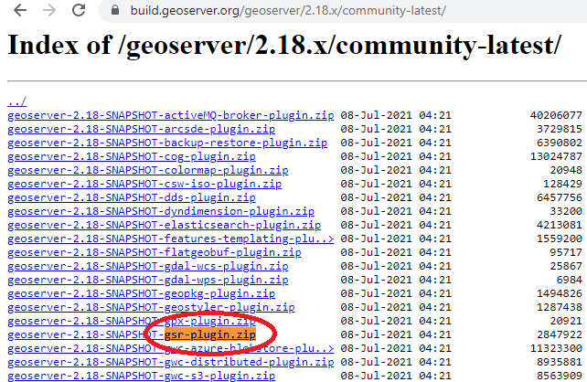
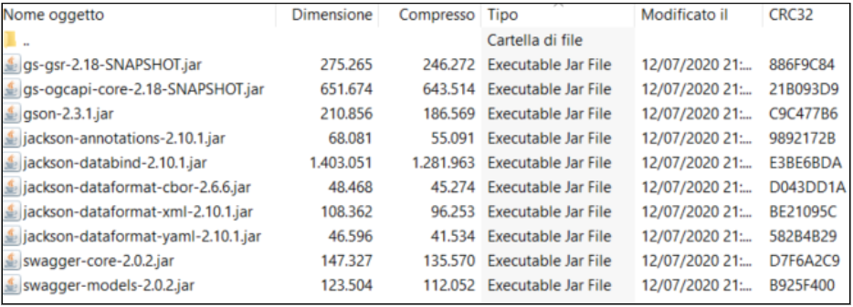
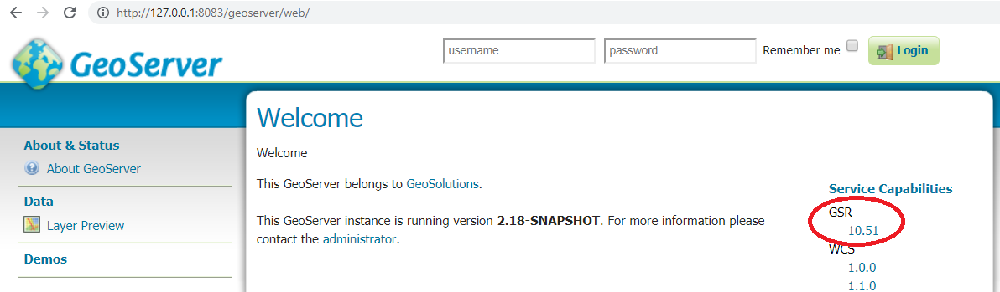
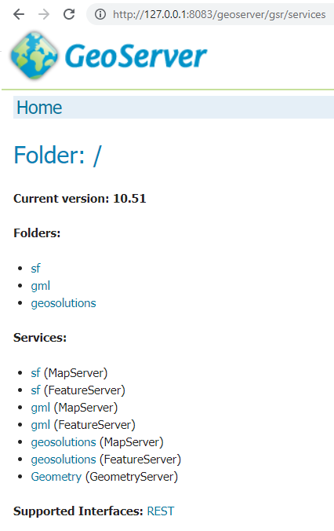
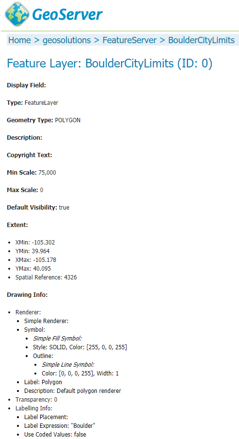
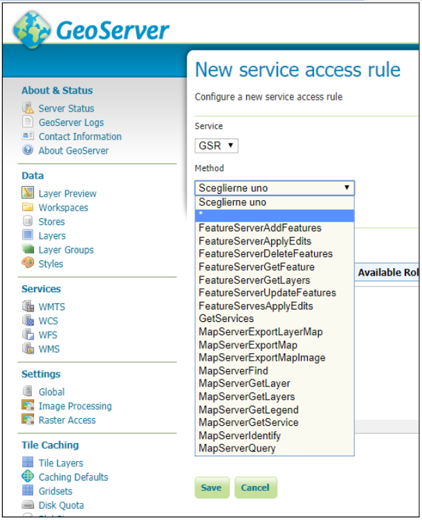

.. module:: geoserver.esri.esri_rest
   :synopsis: Learn how to consume GeoServer resources from ESRI ArcGIS OnLine.

.. _geoserver.esri.esri_rest:

GeoServer implementation of ESRI Rest Services
=================================

This module introduces GeoServer support for the ESRI Rest Services.

GSR Extension
#################################
This plugin provides a GeoService REST compatibility API.

Installing the GSR Extension
---------------------------------
To make GeoServer able to provide ESRI ReST Services it is necessary to install the GSR community module extension.
Currently the plugin allows basic FeatureServer and MapServer functionality.

From the community page download the archive matching your GeoServer version.

.. code-block:: console

   https://build.geoserver.org/geoserver/2.18.x/community-latest/

Extract the JARs files from the downloaded ZIP archive:

and copy them into the **WEB-INF/lib** folder of GeoServer.

When the plugin is installed, in the welcome page of GeoServer we can see it in the Service Capabilities list:

Clicking on the version of GSR (10.51 in the image above) we can see the list of the services available:

GSR Usage
---------------------------------
The term **ArcGIS service** (in the API context) is equivalent to the GeoServer **workspace**. 

URLs in GeoServer look like these:

.. code-block:: console

   http://localhost:8083/geoserver/gsr/services/<workspace>/MapServer/ 
   http://localhost:8083/geoserver/gsr/services/<workspace>/FeatureServer/

A full list of functionalities supported is available `here <https://docs.geoserver.org/stable/en/user/community/gsr/functionality.html>`_. 

The GSR plugin allows, at the moment, to obtain data in json format:

.. code-block:: console

   http://localhost:8083/geoserver/gsr/services/geosolutions/FeatureServer/0?f=json

.. figure:: img/gsr-feat-server-json.png
   :align: center 

From the GeoServer web interface we can show details about the FeatureServer for a specific layer in html format:   

.. code-block:: console

   http://localhost:8083/geoserver/gsr/services/geosolutions/FeatureServer/0

Acess rules
^^^^^^^^^^^^^^^^^^^^^^^^^^^^^^^^^
As with the other services, we can restrict access to specific GSR methods:

For example the following rule's definition allows just authenticated users to use all methods from the GSR service.
     
.. figure:: img/gsr-access-authenticated.png
   :align: center

Direct REST requests
---------------------------------
In this section you will see the main ArcGIS REST requests.

To use the REST API, we need to know the well-known endpoint, which represents the server catalog.

For GeoServer, the default endpoint is as follows:

.. code-block:: console

   <protocol>://<host>:<port>/geoserver/gsr/services/<workspace>/<service>

where:
   * **protocol**: the protocol over which data is sent (http/https)
   * **host**: geoserver host name or its IP address
   * **port**: port number where GeoServer is listening
   * **workspace**: name of the workspace of interest
   * **service**: it represents the the name of the service type (e.g. FeatureServer)

Services Information
^^^^^^^^^^^^^^^^^^^^^^^^^^^^^^^^^
The following request shows the available services:

   .. code-block:: console

      http://127.0.0.1:8083/geoserver/gsr/services?f=json

   .. code-block:: json

      {
         "currentVersion": 10.51,
         "folders": ["sf", "gml", "geosolutions"],
         "services": [{
            "name": "sf",
            "type": "MapServer"
         }, {
            "name": "sf",
            "type": "FeatureServer"
         }, {
            "name": "gml",
            "type": "MapServer"
         }, {
            "name": "gml",
            "type": "FeatureServer"
         }, {
            "name": "geosolutions",
            "type": "MapServer"
         }, {
            "name": "geosolutions",
            "type": "FeatureServer"
         }, {
            "name": "Geometry",
            "type": "GeometryServer"
         }]
      }

Services Information by workspace
^^^^^^^^^^^^^^^^^^^^^^^^^^^^^^^^^
The following request shows the services available for a specific workspace.
      
   .. code-block:: console

      http://127.0.0.1:8083/geoserver/gsr/services/geosolutions?f=json

   .. code-block:: json

      {
         "currentVersion": 10.51,
         "folders": [],
         "services": [{
            "name": "geosolutions",
            "type": "MapServer"
         }, {
            "name": "geosolutions",
            "type": "FeatureServer"
         }]
      }

Feature Server information
^^^^^^^^^^^^^^^^^^^^^^^^^^^^^^^^^

   .. code-block:: console

      http://127.0.0.1:8083/geoserver/gsr/services/geosolutions/FeatureServer?f=json
   
   .. code-block:: json

      {
         "currentVersion": 10.51,
         "serviceDescription": "GeoSolutions GeoServer workshop WFS",
         "supportedQueryFormats": "JSON",
         "workspace": "geosolutions",
         "layers": [{
            "id": 0,
            "name": "BoulderCityLimits"
         }, {
            "id": 1,
            "name": "Counties"
         }, {
            "id": 2,
            "name": "Mainrd"
         }, {
            "id": 3,
            "name": "Parcels"
         }, {
            "id": 4,
            "name": "Trails"
         }, 
            ... 
         ],
         "tables": []
      }

Feature Layer information
^^^^^^^^^^^^^^^^^^^^^^^^^^^^^^^^^

   .. code-block:: console
      
      http://127.0.0.1:8083/geoserver/gsr/services/geosolutions/FeatureServer/0?f=json
   
   .. code-block:: json

      {
         "currentVersion": 10.51,
         "id": 0,
         "type": "Feature Layer",
         "name": "BoulderCityLimits",
         "defaultVisibility": true,
         "definitionExpression": "",
         "description": "",
         "copyrightText": "",
         "relationships": [],
         "subLayers": [],
         "types": [],
         "geometryType": "esriGeometryPolygon",
         "minScale": 75000.0,
         "maxScale": 0.0,
         "extent": {
            "geometryType": null,
            "spatialReference": {
               "wkid": 4326,
               "latestWkid": 4326
            },
            "xmin": -105.302,
            "ymin": 39.964,
            "xmax": -105.178,
            "ymax": 40.095
         },
         "drawingInfo": {
            "renderer": {
               "type": "simple",
               "symbol": {
                  "type": "esriSFS",
                  "style": "esriSFSSolid",
                  "color": [255, 0, 0, 255],
                  "outline": {
                     "type": "esriSLS",
                     "style": "esriSLSSolid",
                     "color": [0, 0, 0, 255],
                     "width": 1.0
                  }
               },
               "label": "Polygon",
               "description": "Default polygon renderer"
            },
            "labelingInfo": [{
               "labelExpression": "\"Boulder\"",
               "useCodedValues": false,
               "symbol": {
                  "type": "esriTS",
                  "angle": 0.0,
                  "xoffset": 0.0,
                  "yoffset": 0.0,
                  "color": [0, 0, 0, 255],
                  "verticalAlignment": "middle",
                  "horizontalAlignment": "left",
                  "rightToLeft": false,
                  "font": {
                     "family": "Arial",
                     "size": 14,
                     "style": "normal",
                     "weight": "normal"
                  }
               },
               "minScale": 0,
               "maxScale": 75000,
               "placement": "center-center"
            }]
         },
         "hasM": false,
         "hasZ": false,
         "hasAttachments": false,
         "htmlPopupType": "esriServerHTMLPopupTypeNone",
         "fields": [{
            "name": "objectid",
            "type": "esriFieldTypeOID",
            "alias": "Feature Id",
            "length": 4000,
            "editable": false,
            "nullable": false
         }, {
            "name": "Id",
            "type": "esriFieldTypeInteger",
            "alias": "Id",
            "nullable": true
         }],
         "capabilities": "Query,Time,Data",
         "syncCanReturnChanges": false,
         "supportsRollbackOnFailureParameter": true,
         "supportsStatistics": false,
         "supportsAdvancedQueries": false,
         "supportsCoordinatesQuantization": true,
         "allowGeometryUpdates": true,
         "objectIdField": "objectid",
         "globalIdField": "",
         "geometryField": {
            "name": "the_geom",
            "type": "esriFieldTypeGeometry",
            "alias": "the_geom",
            "editable": true,
            "nullable": true
         },
         "templates": []
      }

Feature Query IdsOnly
^^^^^^^^^^^^^^^^^^^^^^^^^^^^^^^^^

   .. code-block:: console

      http://127.0.0.1:8083/geoserver/gsr/services/geosolutions/FeatureServer/0/query?f=json&returnIdsOnly=true&returnCountOnly=true
      
   .. code-block:: json

      {
         "objectIdFieldName":"objectid",
         "objectIds":[1,2,3,4,5,6]
      }

Feature Query
^^^^^^^^^^^^^^^^^^^^^^^^^^^^^^^^^
   
   .. code-block:: console
   
      http://127.0.0.1:8083/geoserver/gsr/services/geosolutions/FeatureServer/0/query?f=json&where=objectid=2

   .. code-block:: json

      {
         "objectIdFieldName": "objectid",
         "globalIdFieldName": "",
         "geometryType": "esriGeometryPolygon",
         "spatialReference": {
            "wkid": 4326,
            "latestWkid": 4326
         },
         "fields": [{
            "name": "Id",
            "type": "esriFieldTypeInteger",
            "alias": "Id",
            "nullable": true
         }, {
            "name": "objectid",
            "type": "esriFieldTypeOID",
            "alias": "objectid"
         }],
         "features": [{
            "geometry": {
               "geometryType": "esriGeometryPolygon",
               "spatialReference": {
                  "wkid": 4326,
                  "latestWkid": 4326
               },
               "rings": [
                  [
                     [-105.24238159476572, 40.04050970882338],
                     [-105.24289953484967, 40.040256934382334],
                     [-105.24409153918523, 40.040260957205476],
                     [-105.24408329439814, 40.04198114174503],
                     [-105.24182246909132, 40.043853469213126],
                     [-105.24107907521743, 40.04444544986711],
                     [-105.23912655202311, 40.04598281682582],
                     [-105.23906868003635, 40.04593807668883],
                     [-105.2402817116495, 40.043965308973135],
                     [-105.24060609629, 40.043431756793666],
                     [-105.24238159476572, 40.04050970882338]
                  ]
               ]
            },
            "attributes": {
               "Id": 0,
               "objectid": 2
            },
            "id": "BoulderCityLimits.2"
         }]
      }

MapServer Information
^^^^^^^^^^^^^^^^^^^^^^^^^^^^^^^^^

   .. code-block:: console
      
      http://127.0.0.1:8083/geoserver/gsr/services/geosolutions/MapServer?f=json
    
   .. code-block:: json

      {
         "mapName": "FOSS4G 2011 styling examples",
         "layers": [{
            "id": 0,
            "name": "13tde815295_200803_0x6000m_cl"
         }, {
            "id": 1,
            "name": "BoulderCityLimits"
         }, {
            "id": 2,
            "name": "Counties"
         }, {
            "id": 3,
            "name": "Mainrd"
         }, {
            "id": 4,
            "name": "Parcels"
         }, {
            "id": 5,
            "name": "Trails"
         }, 
            ...
         ],
         "singleFusedMapCache": false,
         "capabilities": "Query",
         "spatialReference": {
            "wkid": 4326,
            "latestWkid": 4326
         },
         "workspace": "geosolutions"
      }

MapServer query using WHERE statement
^^^^^^^^^^^^^^^^^^^^^^^^^^^^^^^^^
This section explains how to use the query method with WHERE syntax.

   .. code-block:: console

      http://127.0.0.1:8083/geoserver/gsr/services/geosolutions/MapServer/6/query?where=SOVEREIGNT='Netherlands'&f=json
      
   .. code-block:: json

      {
         "objectIdFieldName": "objectid",
         "globalIdFieldName": "",
         "geometryType": "esriGeometryPolygon",
         "spatialReference": {
            "wkid": 4326,
            "latestWkid": 4326
         },
         "fields": [{
            "name": "ScaleRank",
            "type": "esriFieldTypeInteger",
            "alias": "ScaleRank",
            "nullable": true
         }, {
            "name": "LabelRank",
            "type": "esriFieldTypeInteger",
            "alias": "LabelRank",
            "nullable": true
         }, {
            "name": "FeatureCla",
            "type": "esriFieldTypeString",
            "alias": "FeatureCla",
            "length": 50,
            "nullable": true
         }, {
            "name": "SOVEREIGNT",
            "type": "esriFieldTypeString",
            "alias": "SOVEREIGNT",
            "length": 32,
            "nullable": true
         }, 
            ...
         ],
         "features": [{
            "geometry": {
               "geometryType": "esriGeometryPolygon",
               "spatialReference": {
                  "wkid": 4326,
                  "latestWkid": 4326
               },
               "rings": [
                  [
                     [-69.89913876003575, 12.452005113164361],
                     [-69.89567643907213, 12.42301463464861],
                     [-69.94215938991869, 12.438517564336166],
                     [-70.0041452704528, 12.500503444870262],
                     [-70.06613115098688, 12.546986395716814],
                     [-70.05086076524458, 12.597086696823766],
                     [-70.03512529161179, 12.614114081263963],
                     [-69.97313941107768, 12.56763113041741],
                     [-69.91179948594723, 12.480478827357217],
                     [-69.89913876003575, 12.452005113164361]
                  ]
               ]
            },
            "attributes": {
               "ADM0_DIF": 1.0,
               "GDP_MD_EST": 2258.0,
               "POSTAL": "AW",
               "GEOU_DIF": 0.0,
               "POP_EST": 103065.0,
               "ABBREV": "Aruba",
               "TERR_": "Neth.",
               "SOV_A3": "NL1",
               "GU_A3": "ABW",
               "LabelRank": 3,
               "ADM0_A3": "ABW",
               "ADMIN": "Aruba",
               "TYPE": "Country",
               "FIPS_10_": 0.0,
               "SOVEREIGNT": "Netherlands",
               ...
            },
            "id": "WorldCountries.1"
         },  
            ...
         ]
      }

MapServer query using ENVELOPE statement
^^^^^^^^^^^^^^^^^^^^^^^^^^^^^^^^^
This section explains how to use the query method with an ENVELOPE filter.
      
   .. code-block:: console

      http://127.0.0.1:8083/geoserver/gsr/services/geosolutions/MapServer/0/query?geometry=-105.27,40.07,-105.25,40.08&geometryType=esriGeometryEnvelope

   .. figure:: img/gsr-boulder-query-envelope.png
      :align: center       

   .. code-block:: json

      {
         "objectIdFieldName": "objectid",
         "globalIdFieldName": "",
         "geometryType": "esriGeometryPolygon",
         "spatialReference": {
            "wkid": 4326,
            "latestWkid": 4326
         },
         "fields": [{
            "name": "Id",
            "type": "esriFieldTypeInteger",
            "alias": "Id",
            "nullable": true
         }, {
            "name": "objectid",
            "type": "esriFieldTypeOID",
            "alias": "objectid"
         }],
         "features": [{
            "geometry": {
               "geometryType": "esriGeometryPolygon",
               "spatialReference": {
                  "wkid": 4326,
                  "latestWkid": 4326
               },
               "rings": [
                  [
                     [-105.26349223715587, 40.08020079753432],
                     [-105.26346508409019, 40.07824343333578],
                     ...
                  ],
                  [
                     [-105.2656227396715, 40.07613576631772],
                     [-105.2656319850513, 40.07746812505805],
                     ...
                  ]
               ]
            },
            "attributes": {
               "Id": 0,
               "objectid": 4
            },
            "id": "BoulderCityLimits.4"
         }]
      }

Consuming data from ArcGIS Javascript API
---------------------------------
In this section you will see some examples of how to consume GeoServer Rest services from ArcGIS Javascript API. 

Documentation about this API is available `here <https://developers.arcgis.com/javascript/latest/guide/secure-resources/index.html>`_.

FeatureLayer
^^^^^^^^^^^^^^^^^^^^^^^^^^^^^^^^^
The following example uses the ArcGIS Javascript API to access GeoServer Rest service as FeatureServer:

   .. code-block:: html

      <html>
         <head>
            <meta charset="utf-8">
            <meta name="viewport" content="initial-scale=1,maximum-scale=1,user-scalable=no">
            <title>FeatureLayer - 4.5</title>
            <link rel="stylesheet" href="https://js.arcgis.com/4.11/esri/css/main.css">
            
            
            
         </head>
         <body>
            

         </body>
      </html>

   Deploying the page in a web server and opening the page in a browser we can see the following Web GIS page and interact with the map:

   .. figure:: img/gsr-argis-api-feature-layer.png
      :align: center 

FeatureTable
^^^^^^^^^^^^^^^^^^^^^^^^^^^^^^^^^
The following example uses the ArcGIS Javascript API to access GeoServer Rest service 
as FeatureServer and display information in a popup when the user click an object in the map:

   .. code-block:: html
   
      <html>
      <head>
         <meta charset="utf-8">
         <meta name="viewport" content="initial-scale=1,maximum-scale=1,user-scalable=no">
         <title>Intro to PopupTemplate - 4.8</title>
         
         <link rel="stylesheet" href="https://js.arcgis.com/4.8/esri/css/main.css">
         
         
      </head>
      <body>
         

      </body>
      </html>

   Deploying the page in a web server and opening the page in a browser we can see the following Web GIS page and interact with the map: 

   .. figure:: img/gsr-argis-api-feature-table.png
      :align: center 