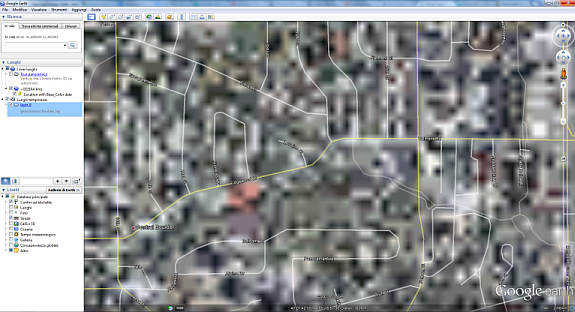
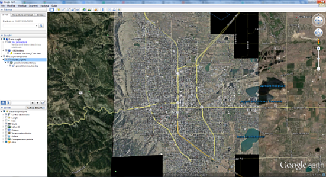
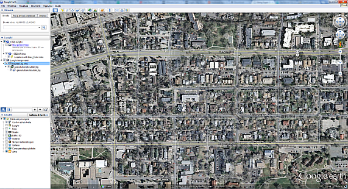

.. module:: geoserver.overlays

.. _geoserver.overlays:

GeoServer automatic refresh mode
--------------------------------

When using the KML reflector GeoServer serves the data **switching between raster and vector mode** to avoid Google Earth being overwhelmed by too many vector data.

GeoServer starts serving a **raster** WMS overlay and when close enough to the ground it switches to **vector mode**. Raster wise it makes sure the data is refreshed with higher resolution versions as the user zooms in.

.. warning:: Some of next examples uses the layer **geosolutions:boulder_bg**, the imagemosaic loaded in :ref:`Maps - Raster <geoserver.mosaic>` section. Be sure to have already published it on the training GeoServer. 
   
Vector automatic refresh
^^^^^^^^^^^^^^^^^^^^^^^^

1. **No Automatic Refresh**

Open your browser and enter this request, after the download open the KML file with Goolge Earth::

	http://localhost:8083/geoserver/wms?LAYERS=bbuildings&STYLES=&FORMAT=application/vnd.google-earth.kml+XML&SERVICE=WMS&VERSION=1.1.1&REQUEST=GetMap&SRS=EPSG%3A2876&BBOX=3058804.9140732,1249104.7323407,3061878.061057,1251955.7964371&WIDTH=512&HEIGHT=475

.. note:: Since the ``geosolutions:bbuildings`` is a large dataset we filtered on a small area through the BBOX; be aware because the feature information can take a very long time to download and use a lot of client-side resources (the resulting KML file may have a size of hundread of MBs). This also means only that portion of data is ever available in Google Earth.

2.  **Using Automatic Refresh**

Now enter in your browser this request, after the download oper the KML file with Goolge Earth::

	http://localhost:8083/geoserver/wms/kml?layers=geosolutions:bbuildings&styles=polygon

In this case GeoServer takes little time to produce a small KML file containing a dynamic link that gets automatically refreshed by Google Earth when the zoom changes: GeoServer uses the zoom level to determine whether to send back a WMS overlay or plain vector data, and makes sure the current view area is always covered.

Raster automatic refresh
^^^^^^^^^^^^^^^^^^^^^^^^

1. **No Automatic Refresh**
	
Open your browser and enter this request::

	http://localhost:8083/geoserver/wms?service=WMS&version=1.1.0&request=GetMap&layers=geosolutions:boulder_bg&styles=&bbox=474000.0,4425000.0,483000.0,4435500.0&width=438&height=512&srs=EPSG:26913&format=application/vnd.google-earth.kml+XML

  Standard KML request

Zooming in:

  Google earth zooming with standard KML request

2.  **Using Automatic Refresh**

Open your browser and enter this request::

	http://localhost:8083/geoserver/wms/kml?layers=geosolutions:boulder_bg

  KML Reflector request

Zooming in:

  Google earth zooming with KML Reflector request and automatic refresh
