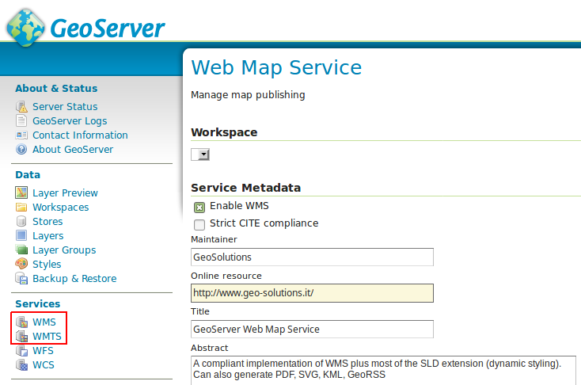
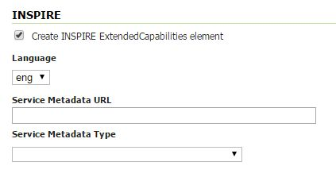
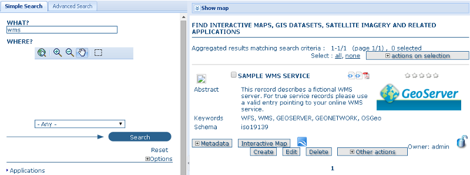
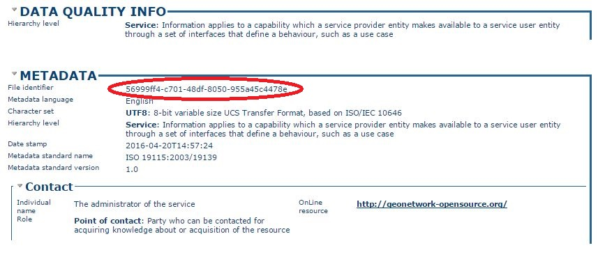
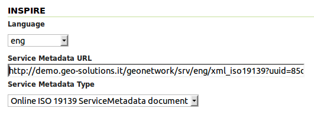
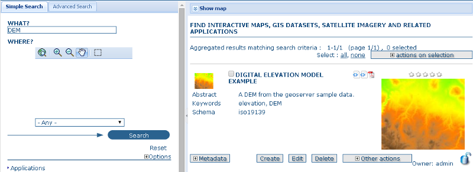
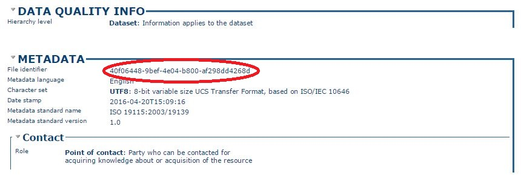
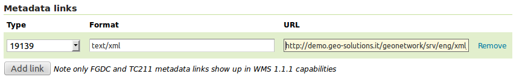
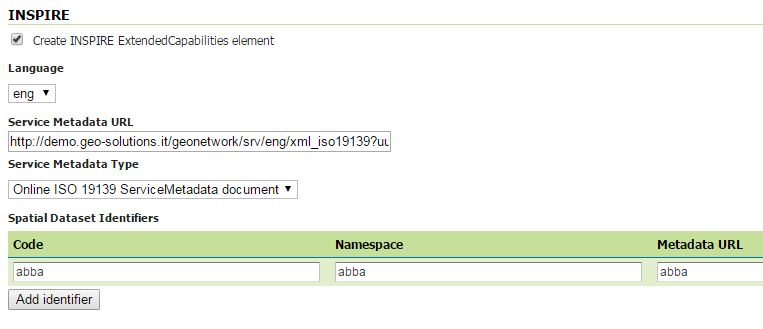

.. module:: inspire.inspire_ext

The INSPIRE GeoServer Extension
-------------------------------

Installing the extension
^^^^^^^^^^^^^^^^^^^^^^^^

From GeoServer version ``2.4.0`` the INSPIRE plugin has been graduated as an official extension and can be downloaded from the `GeoServer download pages <http://geoserver.org/download/>`_, the download link could be found in extensions section of the choosen version.

.. warning::
    
      In the training GeoServer the inspire module should be already installed.

      If the inspire module is not available (see next section to know how), before doing the exercise install the GeoServer Inspire plugin zip file from :file:`%TRAINING_ROOT%\\data\\plugins\\`. Just decompress the zip file into  :file:`%TRAINING_ROOT%\\webapps\\geoserver\\WEB-INF\\lib\\` and restart GeoServer.

Using the INSPIRE extension
^^^^^^^^^^^^^^^^^^^^^^^^^^^

When the INSPIRE extension has been properly installed, the **WMS settings**, **WFS settings**, **WMTS settings** and **WCS settings** sections of the Web administration interface will show an extra INSPIRE configuration section. 

If the data directory has not been configured with INSPIRE parameters before, this section will just contain a check box to enable the creation of an **INSPIRE ExtendedCapabilities element**.

.. note:: If you do not see this content in the WMS, WMTS, WFS and WCS sections, the INSPIRE extension is not installed properly.  Check again the previous section and verify that the correct file was saved to the correct directory.

Once the INSPIRE extension is enabled for a certain service its capabilities document will be changed accordingly. 

In the rest of this exercise it will be shown how to activate the INSPIRE extension for the **WMS**, **WMTS** and **WFS** services and check how the related capabilities documents will change.

Extended WMS and WMTS configuration
^^^^^^^^^^^^^^^^^^^^^^^^^^^^^^^^^^^

WMS and WMTS services can both be used as **View Services** and they share the same INSPIRE related capabilities and configuration. This services settings page in the Web administration interface is extended to activate and configure the INSPIRE extension. 

INSPIRE-specific configuration is accessed on the main WMS / WMTS page in the web admin.  This is accessed by clicking on the ``WMS`` / ``WMTS`` link on the sidebar as shown here below.

.. note:: You must be logged in as an administrator to edit WMS / WMTS configuration.

Once on the service configuration page, there will be a block named ``INSPIRE``.  

Select the checkbox under the title of the block and the following three settings will be available:

* ``Language`` select box, for setting the Supported, Default, and Response language
* ISO 19139 ``Service Metadata URL`` field, a URL containing the location of the metadata associated with the WMS
* ``Service Metadata Type`` select box, for detailing whether the metadata came from a CSW (Catalog Service) or a standalone metadata document

   *INSPIRE WMS and WMTS related options*

The metadata link should be a ISO compliant metadata document describing the WMS / WMTS service as a whole. Normally this comes from a CSW service such as GeoNetwork, but it can also be a static file.

For the sake of the exercise we are going to link an existing metadata on a GeoNetwork server, which does not describe the WMS server used in this workshop.

In the real case you should be linking to your CSW with information pertaining to your actual server.

* go to http://demo.geo-solutions.it/geonetwork
* under the ``WHAT?`` field type ``WMS``
* press the search button

You should find a single metadata record titled "Sample WMS Service" with a full description of a WMS service.

By clicking on "Metadata" we are going to expand the result and see all the metadata about the WMS service. In order to 
build a request linking the WMS service with the catalog we are going to need the identifier of that metadata record, which
is to be found at the bottom, in the metadata section:

Once the id is known the link to the ISO 19139 document can be built as follows: ``http://demo.geo-solutions.it/geonetwork/srv/eng/xml_iso19139?uuid=56999ff4-c701-48df-8050-955a45c4478e``.
Now we can fill the INSPIRE section in the WMS GeoServer panel as follows:

A similar thing can be done for WMTS service. After clicking :guilabel:`Submit` on the service configuration page, any changes will be immediately reflected in the WMS 1.3.0 or WMTS 1.0.0 capabilities document.

.. note:: Currently GeoServer does not offer the ability to configure alternate languages, as there is no way for an administrator to configure multiple responses.  There is an `open issue <https://osgeo-org.atlassian.net/browse/GEOS-4502>`__ on the GeoServer issue tracker.  If you are interested in implementing or funding this improvement, please raise the issue on the GeoServer mailing list.

Extended WMS and WMTS Capabilities
^^^^^^^^^^^^^^^^^^^^^^^^^^^^^^^^^^

After the INSPIRE extension is activated the **WMS 1.3.0** and **WMTS 1.0.0** capabilities document will be extended.

.. note:: In the case of **WMS** the INSPIRE directive is relevant to **WMS 1.3.0 only**, so please make sure that you are viewing the correct capabilities document.

Those changes are:

#. Two additional entries in the ``xsi:schemaLocation`` of the root ``<WMS_Capabilities>`` tag:

     * ``http://inspire.ec.europa.eu/schemas/inspire_vs/1.0``
     * ``http://inspire.ec.europa.eu/schemas/inspire_vs/1.0/inspire_vs.xsd``

#. An additional ExtendedCapabilities block.  This tag block shows up in between the tags for ``<Exception>`` and ``<Layer>``.  It contains the following information:

     * Metadata URL and MIME type
     * Default Language
     * Supported Language(s)
     * Response Language(s)
  
  this block will contain the following content:

   .. code-block:: xml
      
    <inspire_vs:ExtendedCapabilities>
        <inspire_common:MetadataUrl>
            <inspire_common:URL>
                http://demo.geo-solutions.it/geonetwork/srv/eng/xml_iso19139?uuid=56999ff4-c701-48df-8050-955a45c4478e
            </inspire_common:URL>
            <inspire_common:MediaType>application/vnd.iso.19139+xml</inspire_common:MediaType>
        </inspire_common:MetadataUrl>
        <inspire_common:SupportedLanguages>
            <inspire_common:DefaultLanguage>
                <inspire_common:Language>eng</inspire_common:Language>
            </inspire_common:DefaultLanguage>
        </inspire_common:SupportedLanguages>
        <inspire_common:ResponseLanguage>
            <inspire_common:Language>eng</inspire_common:Language>
        </inspire_common:ResponseLanguage>
    </inspire_vs:ExtendedCapabilities>

Linking layers
^^^^^^^^^^^^^^

In the INSPIRE view not only the service needs to be linked to proper ISO metadata, but also the layers published by the WMS / WMTS should
be described by complete metadata entries. Each layer can be linked to the metadata describing it.

As we did before, we are going to search on the GeoNetwork instance for some metadata (again, the layer we are going to search is a sample one,
you should be using the real metadata for the layer at hand):

* go to http://demo.geo-solutions.it/geonetwork
* under the ``WHAT?`` field, type ``DEM``
* press the search button

You should find a metadata record titled "DIGITAL ELEVATION MODEL EXAMPLE" with a short description and a preview.

As we did before we are going to locate the metadata identifier at the bottom of the metadata description:

This tells us the ISO metadata record can be located at ``http://demo.geo-solutions.it/geonetwork/srv/eng/xml_iso19139?uuid=40f06448-9bef-4e04-b800-af298dd4268d``.

Let's link the "srtm" layer to that metadata following these steps:

* locate the "srtm" layer in the GeoServer "Layers" panel
* open the layer definition, scroll down to the "Metadata links section"
* press the "Add link" button, set the format to ``text/xml`` and the URL to ``http://demo.geo-solutions.it/geonetwork/srv/eng/xml_iso19139?uuid=40f06448-9bef-4e04-b800-af298dd4268d``.

* scroll to the bottom and press the "Save" button.

If you followed all the steps the metadata link will appear in the WMS 1.3 or WMTS 1.0.0 capabilites document:

  .. code-block:: xml

    <Layer queryable="1" opaque="0">
        <Name>geosolutions:srtm</Name>
        <Title>srtm</Title>
        <Abstract/>
        <KeywordList>
          <Keyword>WCS</Keyword>
          <Keyword>GeoTIFF</Keyword>
          <Keyword>srtm_boulder2</Keyword>
        </KeywordList>
        ...
        <MetadataURL type="19139">
          <Format>text/plain</Format>
          <OnlineResource xlink:type="simple" xlink:href="http://demo.geo-solutions.it/geonetwork/srv/eng/xml_iso19139?uuid=40f06448-9bef-4e04-b800-af298dd4268d"/>
        </MetadataURL>
        ...
      </Layer>

Extended WFS configuration
^^^^^^^^^^^^^^^^^^^^^^^^^^

As with the WMS service, the WFS configuration in the Web administration interface is extended to activate and configure the INSPIRE extension.

INSPIRE-specific configuration is accessed on the main WFS settings page.  This is accessed by clicking on the ``WFS`` link on the sidebar.

.. note:: You must be logged in as an administrator to edit WFS configuration.

Once on the WFS configuration page, there will be a block called ``INSPIRE``.

Select the checkbox under the title of the block and the following three settings will be available:

* ``Language`` combo box, for setting the Supported, Default, and Response language
* ISO 19139 ``Service Metadata URL`` field, a URL containing the location of the metadata associated with the WFS
* ``Service Metadata Type`` combo box, for detailing whether the metadata came from a CSW (Catalog Service) or a standalone metadata file
* ``Spatial dataset identifers`` table, where you can specify a code (mandatory) and a namespace (optional) for each spatial data set the WFS server is offering

   *INSPIRE WFS-related options*

.. note:: If you do not see this content in the WFS configuration page, the INSPIRE extension may not be installed properly.  Reread the section on :ref:`inspire_installing` and verify that the correct file was saved to the correct directory.

After clicking :guilabel:`Submit` on this page, any changes will be immediately reflected in the WFS 1.1 and WFS 2.0 capabilities documents.

Extended WFS Capabilities
^^^^^^^^^^^^^^^^^^^^^^^^^

.. note:: The INSPIRE directive is relevant to **WFS 1.1** and **2.0 only**, so please make sure that you are viewing the correct capabilities document.

The WFS 1.1.0 capabilities document will be extended once the INSPIRE extension is installed.  Those changes are:

#. Two additional entries in the ``xsi:schemaLocation`` of the root element tag:

     ``http://inspire.ec.europa.eu/schemas/common/1.0/common.xsd``
     ``http://inspire.ec.europa.eu/schemas/inspire_dls/1.0/inspire_dls.xsd``

#. If you have enabled the check box to create the INSPIRE ExtendedCapabilities element and entered the values described in the previous section then there will also be an additional ExtendedCapabilities block with the following information:

     * Metadata URL and MIME type
     * Default Language
     * Supported Language(s)
     * Response Language(s)
     * Spatial data identifiers

  By default, this block will contain the following content::

        <inspire_dls:ExtendedCapabilities>
            <inspire_common:MetadataUrl>
                <inspire_common:URL>
                    http://demo.geo-solutions.it/geonetwork/srv/eng/xml_iso19139?uuid=56999ff4-c701-48df-8050-ddvzdzdvsdf955a45c4478e
                </inspire_common:URL>
                <inspire_common:MediaType>application/vnd.iso.19139+xml</inspire_common:MediaType>
            </inspire_common:MetadataUrl>
            <inspire_common:SupportedLanguages>
                <inspire_common:DefaultLanguage>
                <inspire_common:Language>eng</inspire_common:Language>
                </inspire_common:DefaultLanguage>
            </inspire_common:SupportedLanguages>
            <inspire_common:ResponseLanguage>
                <inspire_common:Language>eng</inspire_common:Language>
            </inspire_common:ResponseLanguage>
            <inspire_dls:SpatialDataSetIdentifier metadataURL="abba">
                <inspire_common:Code>abba</inspire_common:Code>
                <inspire_common:Namespace>abba</inspire_common:Namespace>
            </inspire_dls:SpatialDataSetIdentifier>
        </inspire_dls:ExtendedCapabilities>

The spatial data identifiers section is mandatory, but cannot be filled by default, it is your duty to provide at least one spatial dataset identifier (see the INSPIRE download service technical guidelines for more information).

.. note:: If you do not see this content in the WFS 1.1/2.0 capabilities document, the INSPIRE extension may not be installed properly.  Reread the section on :ref:`inspire_installing` and verify that the correct file was saved to the correct directory.

Extended WCS Capabilities
^^^^^^^^^^^^^^^^^^^^^^^^^

.. note:: The INSPIRE directive is relevant to **WCS 2.0.1 only**, so please make sure that you are viewing the correct capabilities document.

The WCS 2.0.1 capabilities document will be extended once the INSPIRE extension is installed.  Those changes are:

#. Two additional entries in the ``xsi:schemaLocation`` of the root element tag:

     ``http://inspire.ec.europa.eu/schemas/common/1.0/common.xsd``
     ``http://inspire.ec.europa.eu/schemas/inspire_dls/1.0/inspire_dls.xsd``

#. If you have enabled the check box to create the INSPIRE ExtendedCapabilities element and entered the values described in the previous section then there will also be an additional ExtendedCapabilities block with the following information:

     * Metadata URL and MIME type
     * Default Language
     * Supported Language(s)
     * Response Language(s)
     * Spatial data identifiers

  By default, this block will contain the following content::

        <inspire_dls:ExtendedCapabilities>
            <inspire_common:MetadataUrl>
                <inspire_common:URL>
                    http://demo.geo-solutions.it/geonetwork/srv/eng/xml_iso19139?uuid=56999ff4-c701-48df-8050-ddvzdzdvsdf955a45c4478e
                </inspire_common:URL>
                <inspire_common:MediaType>application/vnd.iso.19139+xml</inspire_common:MediaType>
            </inspire_common:MetadataUrl>
            <inspire_common:SupportedLanguages>
                <inspire_common:DefaultLanguage>
                <inspire_common:Language>eng</inspire_common:Language>
                </inspire_common:DefaultLanguage>
            </inspire_common:SupportedLanguages>
            <inspire_common:ResponseLanguage>
                <inspire_common:Language>eng</inspire_common:Language>
            </inspire_common:ResponseLanguage>
            <inspire_dls:SpatialDataSetIdentifier metadataURL="abba">
                <inspire_common:Code>abba</inspire_common:Code>
                <inspire_common:Namespace>abba</inspire_common:Namespace>
            </inspire_dls:SpatialDataSetIdentifier>
        </inspire_dls:ExtendedCapabilities>

The spatial data identifiers section is mandatory, but cannot be filled by default, it is your duty to provide at least one spatial dataset identifier (see the INSPIRE download service technical guidelines for more information).

.. note:: If you do not see this content in the WCS 2.0.1 capabilities document, the INSPIRE extension may not be installed properly.  Reread the section on :ref:`inspire_installing` and verify that the correct file was saved to the correct directory.