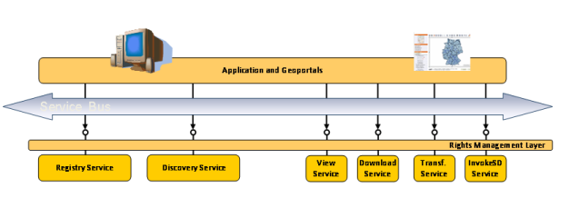

.. module:: inspire.inspire_ext

.. _inspire.inspire_ext:

The INSPIRE GeoServer Extension
-------------------------------

The INSPIRE directive
^^^^^^^^^^^^^^^^^^^^^

The INSPIRE Directive establishes the legal framework for setting up and operating a European Spatial Data Infrastructure (ESDI) based on the infrastructures for spatial information (SDIs) of the Member States (MSs) of the European Union. 

Specifically, the purpose of the INSPIRE Directive is described in the Article 1

.. topic:: Article 1
    
    #. The purpose of this Directive is to lay down general rules aimed at the establishment of the Infrastructure for Spatial Information in the European Community (hereinafter referred to as Inspire), for the purposes of Community environmental policies and policies or activities which may have an impact on the environment. 
    
    #. Inspire shall build upon infrastructures for spatial information established and operated by the Member States.*

The **2007/2/EC Directive** of the **European Parliament** and of the **Council of 14th March 2007** establishing an Infrastructure for Spatial Information in the European Community (INSPIRE) was published in the official Journal on the 25th April 2007. 

The Metadata Implementing Rules has been the first set of requirements to Member States for the creation and maintenance of metadata for spatial datasets, series and services corresponding to the themes of Annexes I, II and III to the above mentioned directive. The Metadata Implementing Rules was adopted as Commission Regulation on the 3rd December 2008 and entered into force on 24th December 2008.
In addition to the Metadata Regulation, on 19th October 2009 the Network Services Commission Regulation was adopted imposing precise dates to the Member States for the provision of an initial capability for the Discovery and View Services. 

As stated in the regulation and reported in the tender specification introduction the initial capability is: 

.. topic:: extracted from the tender specification

    [...] the ability of a Network Service to provide full functionality without guaranteeing quality of service in conformity with the rules set out in Annex I to this Regulation or access to the service for all users through the INSPIRE geo-portal.

The Implementing Rules are accompanied, where relevant, by non-binding Technical Guidance addressing implementation aspects and relations with standards (e.g. OGC, OASIS), technologies, and practices.
Both Metadata and Network Services drafting teams have issued Technical Guidelines for the implementation. In particular, for the network service we find:

* **The INSPIRE Discovery Services Technical Guidance** document maps and extends the abstract functions of the INSPIRE discovery service as described in the Implementing Rules to functions of the OGC Catalogue Service Implementation Specification. In particular, it extends its capabilities with respect to the requirements of the INSPIRE Directive and the Regulation on INSPIRE Network Services with:
  
  * Additional Queryables which relates to Quality of Data and Metadata (e.g. Degree of Conformity, Responsible Party, Specification for the resource, Lineage)
  
  * Discovery Service Multilingual aspects:
  
    * Indicate the current used language for the current GetCapabilities-Response
    
    * Contain a list of supported languages and indicate the service default language
  
  * Federation of Discovery service GetCapabilities 
 
* **The INSPIRE View Services Technical Guidance** document maps and extends the functions described in the Implementing Rules to the interface described by the WMS Specification (official ISO 19128:2005) international standard. In particular, additionally minimum requirements are: 

  * Quality of Service requirements 
  
  * INSPIRE profile of Tiling Web Map Service (WMS) is considered for future work 
  
  * Multilingualism capabilities is defined
  
  
* **The INSPIRE Download Services Technical Guidance**  provide technical guidance for the implementation of Download Services as per the abstract model provided in the Implementing Rules. It helps defining two different types of Download Services:
  
  * **Pre-defined dataset download services** which supports basic capabilities for downloading predefined (parts) of datasets with no ability to dynamically query or subset them. This definition encompasses both static files as well a predefined units downloadable from services without possibility of further interaction.
  * **Direct Access download services** which builds on top of the previous type to provide support for dynamic query and subsetting relying mainly on services for this purpose and specifically on the OGC Web Feature Service with proper additions/modifications.
  

  
The INSPIRE Services Types
^^^^^^^^^^^^^^^^^^^^^^^^^^
It is worth at this point to spend a few words introducing and describing the main categories of services identified within the INSPIRE official documents.

Discovery Services 
==================

The INSPIRE Directive requests Member States to <<*establish and operate a network of services*>> for the discovery of spatial data sets and services <<*for which metadata have been created*>>. The discovery services play a central role since they should enable users and application to search for spatial data sets  and services in order to bind to and to consume them, through the ability to index, manage and search through extensive sets of metadata describing such data and services. Summarising, discovery services consists of registries and catalogues that manage metadata about spatial datasets and the services that can serve.

Discovery Services for INSPIRE are based on Metadata Specifications from ISO as well as on, as per the respective technical guideline, on the OGC Catalogue Service for the Web 2.0.2 (CSW) ISO Application Profile.

Download Services 
=================

The INSPIRE Directive requests Member States to <<*establish and operate a network of services*>> for enabling copies of geospatial data sets, or parts of them, to be downloaded and, where applicable, accessed directly. 
A Download Service supports:

* download of a complete dataset(s)
* a part of a dataset(s)
* where practicable provides direct access to a complete dataset(s) or parts

Download Services for INSPIRE are based, for direct access services, on the OGC WFS 2.0 specification which translates into ISO/DIS 19142 and 19143 standards.

View Services 
=============

The INSPIRE directive requests Member States to <<*establish and operate view services making it possible, as a minimum, to display, navigate, zoom in and out, pan or overlay viewable spatial data sets and to display legend information and any relevant content of metadata. Member States shall ensure that e-commerce and geo right management services are available for view services if required*>>.

Summarising, view services can be identified with mapping services that allows user to *view* data on map.

View Services for INSPIRE are based on the OGC WMS 1.3.0 specification which translates into the ISO 19128 ISO/DIS standard. Moreover for tile oriented services OGC WMTS 1.0.0 specification, with specific INSPIRE extensions, is mandated.

Two different scenarios have been identified for publishing View Services:

* **Scenario 1** INSPIRE network service metadata in a Discovery Services is referenced through an extended capability.
* **Scenario 2** Use (extended) capabilities to map all INSPIRE metadata elements to the WMS 1.3.0 elements.

**Scenario 1** Involves adding references to external online INSPIRE metadata resources to the GetCapabilities WMS document, whilst **Scenario 2** involves highly enriching the GetCapabilities document itself with the required INSPIRE service metadata. Notice however that regardless of the type of Scenario implemented there shall always be a language section to fulfill the multilingualism requirements.

Transformation Service 
======================

The INSPIRE Directive requests Member States <<*to establish and operate a network of transformation services, enabling spatial data sets to be transformed with a view to achieving interoperability*>>.  The meaning of Transformation Services is not completely clear and under discussion, the actual understanding addresses web services that can be service-chained for schema transformation and coordinate transformation. These services are offered as *translating download service*, where the translation is configured in the service and the client has almost no control over the translation.  

Invoke Spatial Service Services
===============================

The INSPIRE Directive requests Member States <<*to establish and operate a network of services allowing spatial data services to be invoked*>>. The *Invoke Spatial Data Service* allows defining both the data inputs and data outputs expected by the spatial service and define a workflow or service chain combining multiple services.  It also allows defining the external web service interface of the workflow or service chain. The *Invoke Spatial Data Services*  service supports invoking individual (spatial) services as well as combinations of individual (spatial) services both synchronous and asynchronous, in service chains through a web service orchestration engine or *workflow engine*.  For spatial data services available on the Internet, the *Invoke Spatial Data Service* service will enable a user or client application to run them without requiring the availability of a GIS.  This requires that a client application can discover the service, bind to it and invoke it.

Coverage Services
=================

A WCS provides access to coverage data in forms that are useful for client-side rendering, as
input into scientific models, and for other clients. The WCS may be compared to the OGC
Web Feature Service (WFS)  and the Web Map Service (WMS). As WMS and WFS
service instances, a WCS allows clients to choose portions of a server's information holdings
based on spatial constraints and other query criteria.

Unlike WMS, which portrays spatial data to return static maps (rendered as pictures by the
server), the Web Coverage Service provides available data together with their detailed descriptions;
defines a rich syntax for requests against these data; and returns data with its
original semantics (instead of pictures) which may be interpreted, extrapolated, etc., and not
just portrayed.

Unlike WFS, which returns discrete geospatial features, the Web Coverage Service returns
coverages representing space/time-varying phenomena that relate a spatio-temporal domain
to a (possibly multidimensional) range of properties. As such, WCS focuses on coverages as
a specialized class of features and, correspondingly, defines streamlined functionality. 

In INSPIRE application schemas, coverages are defined according to ISO 19123. To improve alignment
with coverage standards on the implementation level (e.g. ISO 19136 and the OGC Web Coverage
Service) and to improve the cross-theme harmonisation on the use of coverages in INSPIRE.