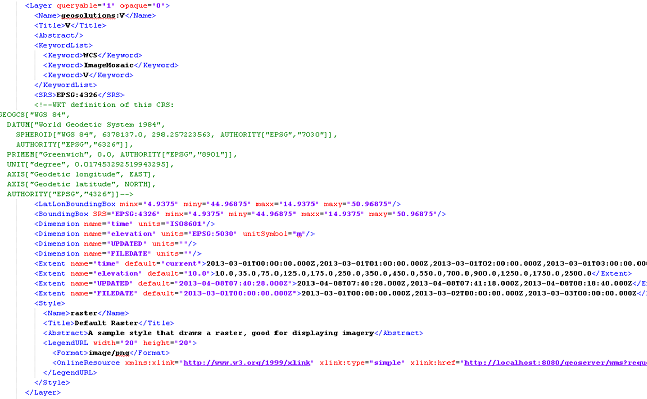
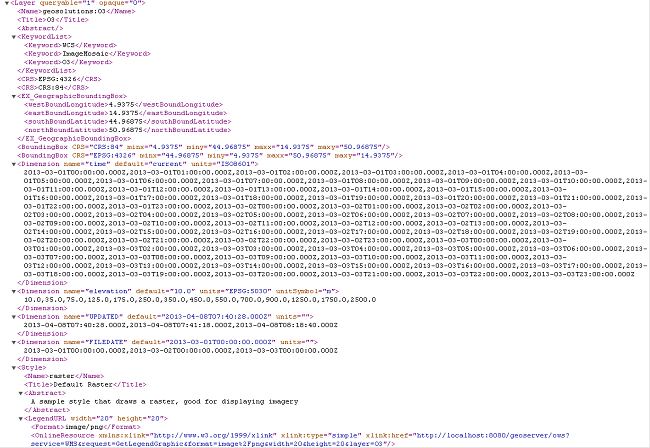
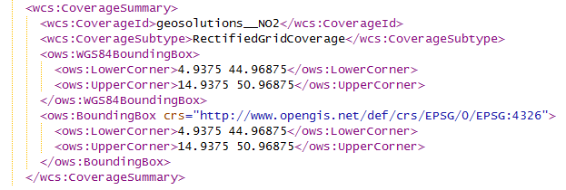

.. module:: geoserver.basic_requests
   :synopsis: Basic requests GetCapabilities WMS/WCS.

.. _geoserver.basic_requests:

Basic requests: GetCapabilities WMS/WCS
=======================================
In this section we will introduce the basic GetCapabilities requests that can be done against the WMS/WCS GeoServer's services in order to see the outcomes related to the multidimensional datasets and the additional dimensions previously introduced.

**WMS Sample requests**

*GetCapabilities*

KVP Encoding

**1.1.1**

.. code-block:: xml

  http://localhost:8083/geoserver/ows?service=wms&version=1.1.1&request=GetCapabilities

This request will download an XML file containing the WMS 1.1.1 GetCapabilities response. Search for multidimensional layers like `lamma`, `NO2`, `V` or `O3` and take a look at the `Dimension` nodes.

**1.3.0**
  
.. code-block:: xml
  
  http://localhost:8083/geoserver/ows?service=wms&version=1.3.0&request=GetCapabilities

This request will show an XML file containing the WMS 1.3.1 GetCapabilities response. Search for multidimensional layers like `lamma`, `NO2`, `V` or `O3` and take a look at the `Dimension` nodes.

You may notice the presence of all the dimensions (standard time and elevation, as well as custom FILEDATE or UPDATED ones), as well as their extent and default value. 

**WCS 2.0 Sample Requests**

*GetCapabilities*

KVP Encoding

.. code-block:: xml

  http://localhost:8083/geoserver/ows?service=WCS&version=2.0.1&request=GetCapabilities

This request will show an XML file containing the WCS 2.0.1 GetCapabilities response (the following picture contains the polyphemus-NO2 related sub-section).

   
