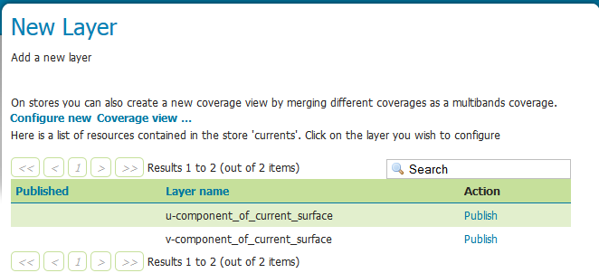

.. _coverage_views:

Coverage Views
==============

Coverage Views allow defining a new layer as a view made of different bands originally available inside coverages (either bands of the same coverage or different coverages) of the same Coverage Store. 
In the following sections, we will illustrate how to configure a layer containing both the u and v components of the water current, which are originally available as separated coverages (1 band coverages) of a coverage store.

Creating a Coverage Store
-------------------------
As illustrated in the previous sections, configure a new ImageMosaic coverageStore:

#. From the GeoServer Administration GUI, go to the `Stores > Add new Store` page and select `ImageMosaic` from the `Raster Data Sources` list

   .. figure:: img/imagemosaic_ds_001.png

#. Insert `currents` as `Data Source Name` and `file:coverages/REGIONAL/currents` as URL

   .. figure:: img/imagemosaic_ds_002.png

The coverage store is now configured and is it possible to configure a new coverage view.

Creating a Coverage View
------------------------

The usual list of coverages available for publication appears from the coverage store previously configured. 
A link :guilabel:`Configure new Coverage view...` also appears:

   
#. Selecting the :guilabel:`Configure new Coverage view...` link opens a new page where you can configure the coverage view:

   .. figure:: img/newcoverageview.png
   
#. The upper text box allows to specify the name to be assigned to this coverage view. (In the following picture we want to create as example, a **currents** view merging together both u and v components of the currents, which are exposed as separated 1band coverages).

   .. figure:: img/coverageviewname.png

#. Next step is defining the output bands to be put in the coverage view. It is possible to specify which input coverage bands need to be put on the view by selecting them from the :guilabel:`Composing coverages/bands...`.

   .. figure:: img/coverageviewselectbands.png

#. Once selected, they needs to be added to the output bands of the coverage view, using the :guilabel:`add` button. 

   .. figure:: img/coverageviewaddbands.png

   Optionally, is it possible to remove the newly added bands using the :guilabel:`remove` and :guilabel:`remove all` buttons.
#. Once done, clicking on the :guilabel:`save` button will redirect to the standard Layer configuration page.

   .. figure:: img/coveragevieweditlayer.png

   Scrolling down to the end of the page, is it possible to see the bands composing the coverage (and verify they are the one previously selected).

   .. figure:: img/coverageviewbandsdetails.png

   At any moment, the Coverage View can be refined and updated by selecting the :guilabel:`Edit Coverage view...` link available before the Coverage Bands details section.

   .. figure:: img/coveragevieweditlink.png

#. Once all the properties of the layer have been configured, by selecting the :guilabel:`Save` button, the coverage will be saved in the catalog and it will become visible as a new layer.

   .. figure:: img/coverageviewavailablelayers.png

Coverage View in action
-----------------------

A Layer preview of the newly created coverage view will show the rendering of the view.

#. Execute the following WMS request::

   http://localhost:8083/geoserver/geosolutions/wms?service=WMS&version=1.1.0&request=GetMap&layers=geosolutions:currents&bbox=339.9,-30.1,411.1,20.1&width=768&height=541&srs=EPSG:4326&styles=gray&format=application/openlayers

   .. note:: Note that we used a style called *gray* in order to see the coverageview.
	
#. Show the result

   .. figure:: img/coverageviewlayerpreview.png

   .. note:: Note that clicking on a point on the map will result into a GetFeatureInfo call which will report the values of the bands composing the coverage view.

The next chapter of this training will introduce how to leverage on GeoServer processing capabilities to customize the portrayal rendering of the configured data.
