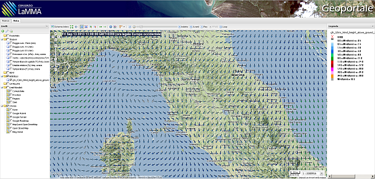
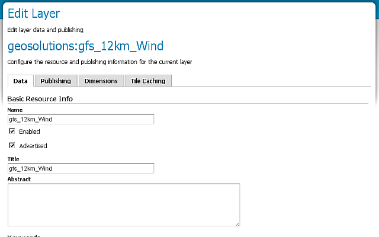
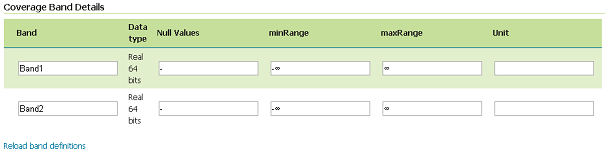
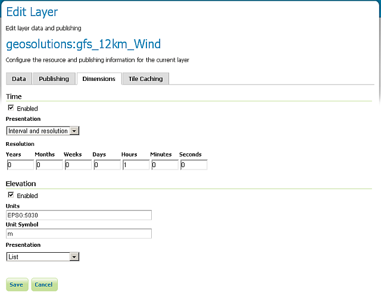
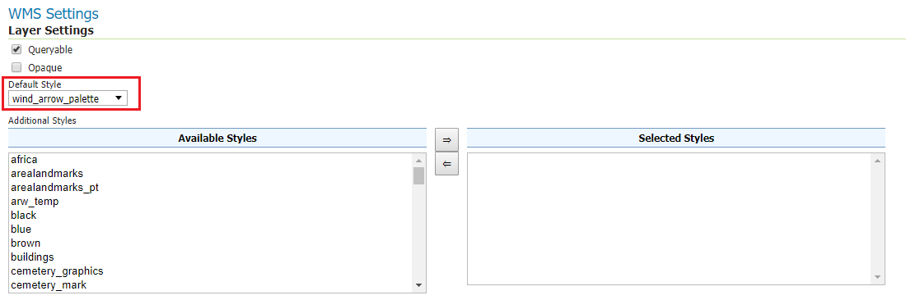
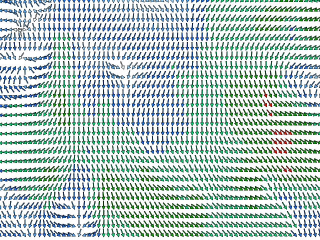
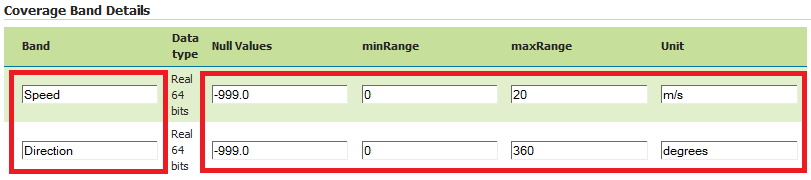
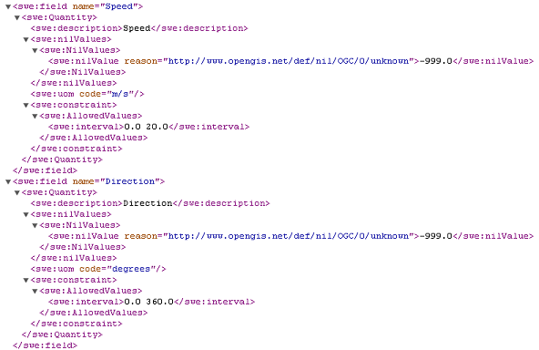

.. module:: geoserver.wind_arrows

.. _geoserver.wind_arrows:

Rendering Transformations: Wind arrows
======================================

In this section we will use a wind mosaic with two bands and we will apply a Rendering Transformation which will draw dynamically wind arrows.

Dataset description
-------------------

The dataset is taken from a run of the *GFS 12Km Wind model above ground* from **LAMMA** (http://geoportale.lamma.rete.toscana.it/MapStore/public/).

The layer :file:`geosolutions:gfs_12km_Wind` is an *ImageMosaic* with two Float Bands and two dimensions (time and elevation).

The granules are Float GeoTIFFs with two Bands, the wind speed and the wind direction expressed in degrees.

The ImageMosaic has two dimensions.

Rendering Transformation
------------------------

The :file:`wind_arrow_palette` SLD, is based on WKT Mark GeoTools plugin and has several rules to draw the arrows with a color and a direction accordingly to the bands values.

Here below a snippet of the SLD

.. code-block:: xml

    <StyledLayerDescriptor version="1.0.0"
      xmlns="http://www.opengis.net/sld" xmlns:gml="http://www.opengis.net/gml"
      xmlns:ogc="http://www.opengis.net/ogc" xmlns:xlink="http://www.w3.org/1999/xlink"
      xmlns:xsi="http://www.w3.org/2001/XMLSchema-instance"
      xsi:schemaLocation="http://www.opengis.net/sld ./StyledLayerDescriptor.xsd">
        <NamedLayer>
            <Name>Wind</Name>
            <UserStyle>
                <Title>Wind</Title>
                <FeatureTypeStyle>
                
                    <Transformation>
                        <ogc:Function name="gs:RasterAsPointCollection">
                            <ogc:Function name="parameter">
                                <ogc:Literal>data</ogc:Literal>
                            </ogc:Function>
                        </ogc:Function>
                    </Transformation>                 

                    <Rule>
                        <!-- <MaxScaleDenominator>2500000</MaxScaleDenominator> -->
                        <Filter>
                            <And>
                                <PropertyIsGreaterThanOrEqualTo>
                                    <PropertyName>Band1</PropertyName>
                                    <Literal>0</Literal>
                                </PropertyIsGreaterThanOrEqualTo>
                                <PropertyIsLessThanOrEqualTo>
                                    <PropertyName>Band1</PropertyName>
                                    <Literal>0.5</Literal>
                                </PropertyIsLessThanOrEqualTo>
                            </And>  
                        </Filter>  
                        <PointSymbolizer>
                            <Graphic>
                                <Mark>
                                    <WellKnownName>extshape://narrow</WellKnownName>
                                    <Stroke>
                                        <CssParameter name="stroke">#000000</CssParameter>
                                        <CssParameter name="stroke-width">0.6</CssParameter>
                                    </Stroke>                
                                    <Fill>
                                        <CssParameter name="fill">
                                            <ogc:Literal>#f5ffff</ogc:Literal>
                                        </CssParameter>
                                    </Fill>
                                </Mark>
                                <Size>4</Size>
                                <Rotation>
                                    <ogc:Function name="if_then_else">
                                        <ogc:Function name="greaterThan">
                                            <ogc:PropertyName>Band2</ogc:PropertyName>
                                            <ogc:Literal>180</ogc:Literal>
                                        </ogc:Function>
                                        <ogc:Sub><ogc:PropertyName>Band2</ogc:PropertyName><ogc:Literal>180</ogc:Literal></ogc:Sub>
                                        <ogc:Add><ogc:PropertyName>Band2</ogc:PropertyName><ogc:Literal>180</ogc:Literal></ogc:Add>
                                    </ogc:Function>
                                </Rotation>
                            </Graphic>
                        </PointSymbolizer>
                    </Rule>
                    ...
                </FeatureTypeStyle>
            </UserStyle>
        </NamedLayer>
    </StyledLayerDescriptor>

As you may notice there are several :file:`<Rules>` based on :file:`<ogc:Filter>`. The *Filter* makes checks against the :file:`Band1` values.

.. code-block:: xml

    <Filter>
            <And>
                    <PropertyIsGreaterThanOrEqualTo>
                            <PropertyName>Band1</PropertyName>
                            <Literal>0</Literal>
                    </PropertyIsGreaterThanOrEqualTo>
                    <PropertyIsLessThanOrEqualTo>
                            <PropertyName>Band1</PropertyName>
                            <Literal>0.5</Literal>
                    </PropertyIsLessThanOrEqualTo>
            </And>
    </Filter>
    
If the *Rule* matches a :file:`<PointSymbolizer>` is applied to the Raster values which have been grabbed using a :file:`<gs:RasterAsPointCollection>` Rendering Transformation.

.. code-block:: xml

    <Transformation>
            <ogc:Function name="gs:RasterAsPointCollection">
                    <ogc:Function name="parameter">
                            <ogc:Literal>data</ogc:Literal>
                    </ogc:Function>
            </ogc:Function>
    </Transformation>

Finally the :file:`<PointSymbolizer>` use a shape in order to render an arrow.

.. code-block:: xml

    <PointSymbolizer>
        <Graphic>
            <Mark>
                <WellKnownName>extshape://narrow</WellKnownName>
                                
It applies a color and dimension accordingly to the filter

.. code-block:: xml

    <Stroke>
        <CssParameter name="stroke">#000000</CssParameter>
        <CssParameter name="stroke-width">0.6</CssParameter>
    </Stroke>
    <Fill>
        <CssParameter name="fill">
            <ogc:Literal>#f5ffff</ogc:Literal>
        </CssParameter>
    </Fill>
        
and applies a rotation accordingly to the value of the *Band2*.

.. code-block:: xml

    <Rotation>
        <ogc:Function name="if_then_else">
            <ogc:Function name="greaterThan">
                <ogc:PropertyName>Band2</ogc:PropertyName>
                <ogc:Literal>180</ogc:Literal>
            </ogc:Function>
            <ogc:Sub><ogc:PropertyName>Band2</ogc:PropertyName><ogc:Literal>180</ogc:Literal></ogc:Sub>
            <ogc:Add><ogc:PropertyName>Band2</ogc:PropertyName><ogc:Literal>180</ogc:Literal></ogc:Add>
        </ogc:Function>
    </Rotation>

In the Publishing section, set the default style as **wind_arrow_palette**. 

    
The outcome can be seen from the *GeoServer Layer Preview* page, clicking on the **geosolutions:gfs_12km_Wind** layer.

Also the following WMS *GetMap* Request allows to download a slice of the wind dataset drawn using the Rendering Transformation above

.. code-block:: xml
  
  http://localhost:8083/geoserver/geosolutions/wms?SERVICE=WMS&VERSION=1.3.0&REQUEST=GetMap&FORMAT=image/png8&TRANSPARENT=true&tiled=true&STYLES&LAYERS=geosolutions:gfs_12km_Wind&exceptions=application%2Fvnd.ogc.se_inimage&tilesOrigin=25,-10&WIDTH=256&HEIGHT=256&CRS=EPSG:4326&BBOX=39.375,5.625,42.1875,8.4375

Optionally you can change the default parameters of the two bands in this way:

If the rename is carried out, the :file:`wind_arrow_palette` SLD file will have to be modified
to use the new band names, otherwise no WMS output will be generated anymore.

Changing the name of the bands affects WCS in a evident way, as they are exposed in the 
*DescribeCoverage* operation and will then be used in *GetCoverage* (we will delve into these
later in the training material):

.. code-block:: xml

    http://localhost:8083/geoserver/ows?service=WCS&version=2.0.1&request=DescribeCoverage&coverageId=geosolutions__gfs_12km_Wind

