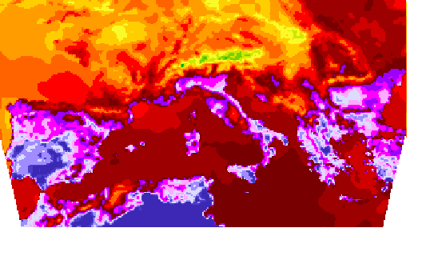
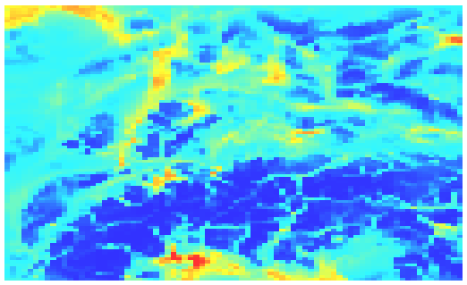
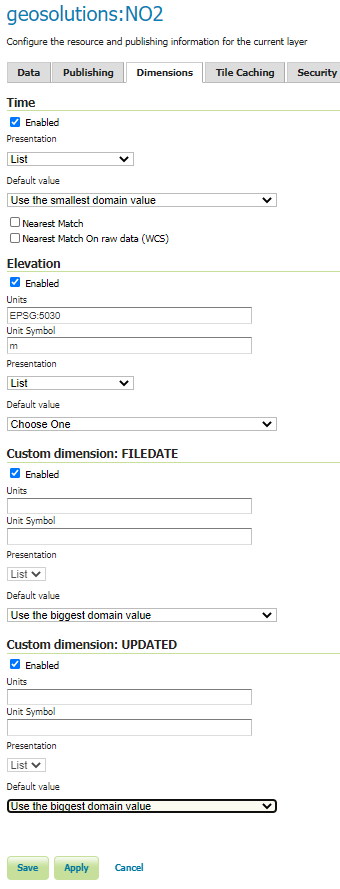
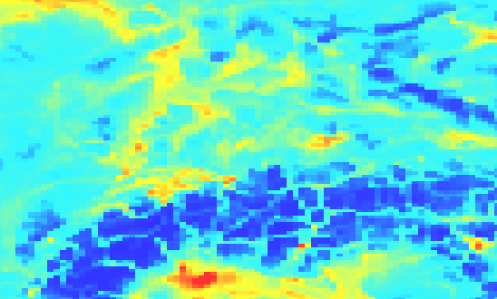
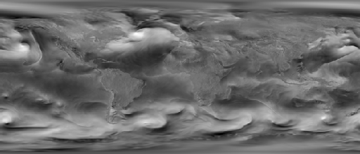
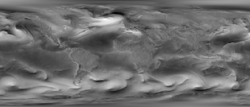

.. module:: geoserver.wms
   :synopsis: WMS requests for multidimensional coverages.

.. _geoserver.wMs:

WMS requests for multidimensional coverages
===========================================
WMS with multidimensional extensions allows to get portrayals of slices of multidimensional datasets specifying values on specific dimensions, as an instance, time.

WMS Sample Requests
-------------------

*GetMap*

GeoTiff
```````

GetMap over a layer with time and elevation enabled.

**Elevation(0.0) / Time(2013-09-09T12:00:00.000Z)**

.. code-block:: xml

   http://localhost:8083/geoserver/geosolutions/wms?service=WMS&version=1.1.0&request=GetMap&layers=geosolutions:lamma&styles=arw_temp&bbox=-10.0,29.959999106824398,33.0,51.959999576210976&width=548&height=330&srs=EPSG:4326&format=image/png&time=2013-09-09T12:00:00.000Z&elevation=0.0



NetCDF
``````

GetMap over a layer with time, elevation and the UPDATED custom dimension enabled. 
Mind the DIM\_ prefix for the custom dimension.

**Elevation(35.0) / Time(2013-03-01T00:00:00.000Z) / DIM_UPDATED=2018-07-02T07:52:08.000Z**

.. code-block:: xml

    http://localhost:8083/geoserver/geosolutions/wms?service=WMS&version=1.1.0&request=GetMap&layers=geosolutions:NO2&bbox=5.0,45.0,14.875,50.9375&width=548&height=330&srs=EPSG:4326&format=image/png&time=2013-03-01T00:00:00.000Z&elevation=35.0&DIM_UPDATED=2018-07-02T07:52:08.000Z&styles=NO2


.. warning:: On some systems, the previous link will produce a white image. In that case, use this alternative URL (where the DIM_UPDATED contains a rounded value). In any case, you will find the proper value in the WMS getCapabilities document.


.. code-block:: xml

    http://localhost:8083/geoserver/geosolutions/wms?service=WMS&version=1.1.0&request=GetMap&layers=geosolutions:NO2&bbox=5.0,45.0,14.875,50.9375&width=548&height=330&srs=EPSG:4326&format=image/png&time=2013-03-01T00:00:00.000Z&elevation=35.0&DIM_UPDATED=2018-07-02T07:00:00.000Z&styles=NO2



*Specifying only the custom dimension*

A result will be produced **only** if the defaults for time (current) and elevation (the lowest one) along with the specified custom dimensions value match any of the records in the dataset. For this example the last file date was chosen, which contains the "current" time.

.. code-block:: xml

    http://localhost:8083/geoserver/geosolutions/wms?service=WMS&version=1.1.0&request=GetMap&layers=geosolutions:NO2&bbox=5.0,45.0,14.875,50.9375&width=548&height=330&srs=EPSG:4326&format=image/png&time=2013-03-01T00:00:00.000Z&elevation=35.0&DIM_UPDATED=2018-07-02T07:52:08.000Z&styles=NO2

Most probably you will get a white image. You can avoid this behaviour by setting the default values to use when the input dimension parameters are not set. 
For the following example you can go to the :guilabel:`Layer Configuration Page --> Dimensions` section of the layer *NO2* and configure the following behaviour
for the default value.



If you execute the same request defined above, you should see the following result:




Grib
````

GetMap over a layer with time and elevation enabled.

**Elevation(10.0) / Time(2014-01-24T00:00:00.000Z)**

.. code-block:: xml

	http://localhost:8083/geoserver/geosolutions/wms?service=WMS&version=1.1.0&request=GetMap&layers=geosolutions:u-component_of_wind_height_above_ground&styles=&bbox=-180.000006108606,-90.1500076357524,180.000006108606,90.1500000063578&width=658&height=330&srs=EPSG:4326&format=image/png&time=2014-01-24T00:00:00.000Z&elevation=10



**Elevation(10.0) / Time(2014-01-24T21:00:00.000Z)**

.. code-block:: xml

	http://localhost:8083/geoserver/geosolutions/wms?service=WMS&version=1.1.0&request=GetMap&layers=geosolutions:u-component_of_wind_height_above_ground&styles=&bbox=-180.000006108606,-90.1500076357524,180.000006108606,90.1500000063578&width=658&height=330&srs=EPSG:4326&format=image/png&time=2014-01-24T21:00:00.000Z&elevation=10



As stated at the beginning of this sectio, WMS allows to get portrayals of the coverages configured in the server. 
The next chapter will introduce a GeoServer capability which can be used to combine somehow different coverages in order to aggregate them on the same map. Afterwards, we will illustrate GeoServer processing capabilities to allow customizations of the maps rendering. 
