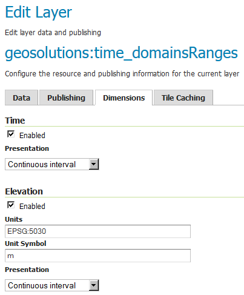
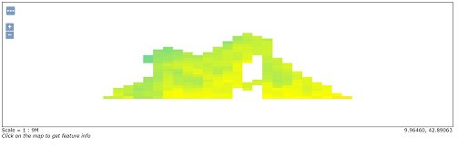
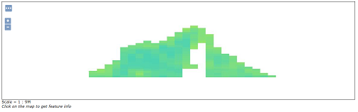

.. module:: geoserver.wxs_ranges
   :synopsis: WCS and WMS requests on Dimensions with Ranges.

.. _geoserver.wxs_ranges:

WCS and WMS requests on Dimensions with Ranges
----------------------------------------------
In this section, we will introduce how to deal with coverages having ranged dimensions, in terms of WMS and WCS requests.
A coverage having dimensions with ranges has data slices which are valid within an interval (as an instance a temporal interval or an altitude/depth interval). Let's take a look to a couple of water temperature sample datasets.

The folder :file:`%TRAINING_ROOT%/geoserver_data/coverages/time_domainsRanges` contains an example of a dataset with **ranged** `Dimensions`.

Each granule name is composed by several parts; examine two granules:

:file:`temp_020_099_20081101T000000_20081104T000000.tiff`

:file:`temp_100_150_20081105T000000_20081107T000000.tiff`

The same parts contains ranges of values

#. 020_099 / 100_150

#. 20081101T000000_20081104T000000 / 20081105T000000_20081107T000000

Each couple of values represents the start and the end values of a specific `Dimension` reported in the :file:`indexer.properties`

The :file:`indexer.properties` contains the following information:

.. code-block:: xml

  TimeAttribute=time;endtime
  ElevationAttribute=lowz;highz
  Schema=the_geom:Polygon,location:String,time:java.util.Date,endtime:java.util.Date,lowz:Integer,highz:Integer
  PropertyCollectors=TimestampFileNameExtractorSPI[timeregex](time),TimestampFileNameExtractorSPI[timeregexend](endtime),IntegerFileNameExtractorSPI[elevationregex](lowz),IntegerFileNameExtractorSPI[elevationregexhigh](highz)

#. **TimeAttribute=time;endtime** - specifies the attributes names for the time dimension.

#. **ElevationAttribute=lowz;highz** - specifies the attributes names for the elevation dimension.

#. **Schema=the_geom:Polygon,location:String,time:java.util.Date,endtime:java.util.Date,lowz:Integer,highz:Integer** - describes the schema on the DB and the attributes types.

#. **PropertyCollectors=TimestampFileNameExtractorSPI[timeregex](time),TimestampFileNameExtractorSPI[timeregexend](endtime),IntegerFileNameExtractorSPI[elevationregex](lowz),IntegerFileNameExtractorSPI[elevationregexhigh](highz)** - associates a regex name extractor to each attribute value.

Looking at the layer configuration, GeoServer automatically recognizes the available `Dimensions`. Setting the :file:`Continuous interval` on time and elevation, the `ImageMosaic Plugin` will read automatically the ranges using the data structure.

Take a look also to the WMS `GetCapabilities` and notice how time and elevation are represented as continuos intervals; notice how the ranges are automatically detected.

.. code-block:: xml

  <Layer queryable="1">
    <Name>geosolutions:time_domainsRanges</Name>
    <Title>time_domainsRanges</Title>
    <Abstract/>
    <KeywordList>
      <Keyword>WCS</Keyword>
      <Keyword>ImageMosaic</Keyword>
      <Keyword>time_domainsRanges</Keyword>
    </KeywordList>
    <CRS>EPSG:4326</CRS>
    <CRS>CRS:84</CRS>
    <EX_GeographicBoundingBox>
      <westBoundLongitude>0.2372206885127698</westBoundLongitude>
      <eastBoundLongitude>14.592757149389236</eastBoundLongitude>
      <southBoundLatitude>40.562080748421806</southBoundLatitude>
      <northBoundLatitude>44.55808294568743</northBoundLatitude>
    </EX_GeographicBoundingBox>
    <BoundingBox CRS="CRS:84" minx="0.2372206885127698" miny="40.562080748421806" maxx="14.592757149389236" maxy="44.55808294568743"/>
    <BoundingBox CRS="EPSG:4326" minx="40.562080748421806" miny="0.2372206885127698" maxx="44.55808294568743" maxy="14.592757149389236"/>
    <Dimension name="time" default="current" units="ISO8601">
    2008-11-01T00:00:00.000Z/2008-11-07T00:00:00.000Z/PT1S
    </Dimension>
    <Dimension name="elevation" default="20.0" units="EPSG:5030" unitSymbol="m">20.0/150.0/0</Dimension>

**WMS Sample Requests**
 
*GetMap*

.. code-block:: xml

  http://localhost:8083/geoserver/geosolutions/wms?service=WMS&version=1.1.0&request=GetMap&layers=geosolutions:time_domainsRanges&styles=temp&bbox=0.2372206885127698,40.562080748421806,14.592757149389236,44.55808294568743&width=1185&height=330&srs=EPSG:4326&format=application/openlayers&time=2008-11-01T00:00:00.000Z

.. code-block:: xml

  http://localhost:8083/geoserver/geosolutions/wms?service=WMS&version=1.1.0&request=GetMap&layers=geosolutions:time_domainsRanges&styles=temp&bbox=0.2372206885127698,40.562080748421806,14.592757149389236,44.55808294568743&width=1185&height=330&srs=EPSG:4326&format=application/openlayers&time=2008-11-07T00:00:00.000Z

**WCS 2.0 Sample Requests**

*DescribeCoverage*

KVP Encoding

Single Coverage

.. code-block:: xml

  http://localhost:8083/geoserver/ows?service=WCS&version=2.0.1&request=DescribeCoverage&coverageId=geosolutions__time_domainsRanges

The request will download an XML containing the details of the multidimensional coverage.
Notice the dimensions ranges of validity expressed in the XML document.

#. The `TimeDomain` reports the list of the available `TimePosition`'s

   .. code-block:: xml
   
	<wcsgs:TimeDomain default="2008-11-07T00:00:00.000Z">
		<gml:TimePeriod gml:id="geosolutions__time_domainsRanges_tp_0">
			<gml:beginPosition>2008-10-01T00:00:00.000Z</gml:beginPosition>
			<gml:endPosition>2008-11-07T00:00:00.000Z</gml:endPosition>
		</gml:TimePeriod>
	</wcsgs:TimeDomain>   

#. The `ElevationDomanin` reports the list values for the available elevations

   .. code-block:: xml

	<wcsgs:ElevationDomain uom="m" default="20.0">
		<wcsgs:Range>
			<wcsgs:start>20.0</wcsgs:start>
			<wcsgs:end>150.0</wcsgs:end>
		</wcsgs:Range>
	</wcsgs:ElevationDomain>

*GetCoverage*

KVP Encoding

The following request will get back a GeoTiff produced on top of raw data defined by this selection:

* Trimming on latitude [40 -> 50]
* Trimming on longitude [5 -> 20]
* Slicing on elevation [20]
* Slicing on time [2008-11-04T00:00:00.000Z]

GetCoverage request using KVP encoding

.. code-block:: xml
   
    http://localhost:8083/geoserver/wcs?request=GetCoverage&service=WCS&version=2.0.1&coverageId=geosolutions__time_domainsRanges&Format=geotiff&subset=http://www.opengis.net/def/axis/OGC/0/Long(5,20)&subset=http://www.opengis.net/def/axis/OGC/0/Lat(40,50)&subset=http://www.opengis.net/def/axis/OGC/0/elevation(20)&subset=http://www.opengis.net/def/axis/OGC/0/time("2008-11-04T00:00:00.000Z")

The browser should download a `geosolutions__time_domainsRanges.tif` containing the requested data.

As explained in the previous chapter, trimming on dimensions is only supported when the output format properly supports the creation of a dataset containing multiple results. 
Notice however that specifying a value of time or elevation inside the range will always return back data. In this case you don't have to specify the exact time position or elevation value.

Try for instance something like

* Trimming on latitude [40 -> 50]
* Trimming on longitude [5 -> 20]
* Slicing on elevation [20.5]
* Slicing on time [2008-11-01T00:15:00.000Z]

.. code-block:: xml
  
    http://localhost:8083/geoserver/wcs?request=GetCoverage&service=WCS&version=2.0.1&coverageId=geosolutions__time_domainsRanges&Format=geotiff&subset=http://www.opengis.net/def/axis/OGC/0/Long(5,20)&subset=http://www.opengis.net/def/axis/OGC/0/Lat(40,50)&subset=http://www.opengis.net/def/axis/OGC/0/elevation(20.5)&subset=http://www.opengis.net/def/axis/OGC/0/time("2008-11-01T00:15:00.000Z")

As explained in the `NetCDF output Format for WCS 2.0.1 requests`, a NetCDF output format has been developed to write down a NetCDF file with the proper contents coming from a multidimensional output request. 
Lets do a GetCoverage request involving trimming on these dimensions: latitude, longitude, elevation and time, by specifying these ranges of values:

* Trimming on latitude [40 -> 50]
* Trimming on longitude [5 -> 20]
* Trimming on elevation [20 -> 150]
* Trimming on time [2008-11-01T00:00:00.000Z -> 2008-11-07T00:00:00.000Z]

GetCoverage request using KVP encoding
^^^^^^^^^^^^^^^^^^^^^^^^^^^^^^^^^^^^^^

#. Paste the following link on the browser to send a getCoverage request asking for a NetCDF output containing the granules for the specified dimensions.

.. code-block:: xml
  
    http://localhost:8083/geoserver/wcs?request=GetCoverage&service=WCS&version=2.0.1&coverageId=geosolutions__time_domainsRanges&Format=application/x-netcdf&subset=http://www.opengis.net/def/axis/OGC/0/Long(5,20)&subset=http://www.opengis.net/def/axis/OGC/0/Lat(40,50)&subset=http://www.opengis.net/def/axis/OGC/0/elevation(20,150)&subset=http://www.opengis.net/def/axis/OGC/0/time("2008-11-01T00:00:00.000Z","2008-11-07T00:00:00.000Z")

The browser should download a `geosolutions__time_domainsRanges.nc` containing the requested data.

Seeing results on Panoply
^^^^^^^^^^^^^^^^^^^^^^^^^

#. Once the file has been saved to disk, navigate to the `%TRAINING_ROOT%/Panoply.bat` file and run it. 

#. Open the newly downloaded :file:`geosolutions__time_domainsRanges.nc` on Panoply. 

#. Double click on the time_domainRanges dataset and push on the lon-lat button.

#. You will see a map rendering the layer for a specific set of Time, Elevation, as reported in the bottom section of the interface. This time, the Time and Elevation dimensions will show range values.

   .. figure:: img/wxs_dimensions.png

#. As you can see, the image is really small so we can center it on the window. Switch to the `Map` tab and change the **Projection** from the drop down list switching from **Equirectangular** to **Equirectangular (Regional)**.
   Then adjust the region to see a bigger image by setting these values in the proper text boxes:

   #. Center on Lon = 9
   #. Lat = 42
   #. Width = 27
   #. Height = 10

  .. figure:: img/wxs_projection.png

#. Switch to the `Scale` tab and change the **Scale Range Min** to 10 and set *Invert colors*

   .. figure:: img/wxs_scale.png

#. Now, you can switch back to the `Array(s)` tab which also allows you to change the values of each dimension to see the related data.

   .. figure:: img/wxs_panoply.png

