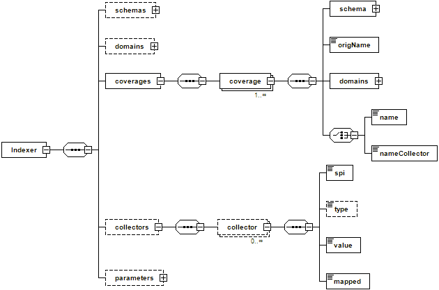

.. module:: geoserver.mosaic_indexer
   :synopsis: ImageMosaic file indexing options.

.. _geoserver.mosaic_indexer:

ImageMosaic file indexing options
---------------------------------
As introduced in the previous section, the set of dimensions available for the mosaic, the schema of the index, as well as the way to retrieve the values of the dimension values may be specified by properly configuring a set of auxiliary files composing the mosaic indexer. 

While improving the support for coverage stores dealing with multiple coverages and multiple dimensions, a new indexer (XML based) has been developed: it will be introduced at the end of this chapter.

.. note:: In case the user was interested, the ImageMosaic plugin uses internally a GeoTools DataStore to interact with the granule's index regardless of whether it is stored inside a DBMS or a Shapefile. The *datastore.properties* file is nothing more than the representation on disk of the configuration parameters that a GeoTools DataStore can be provided with to connect to a vector store. This will be introduced in the next section.

ImageMosaic indexer
^^^^^^^^^^^^^^^^^^^

The imageMosaic indexer specifies the schema of the underlying GeoTools DataStore storing the granule's index, as well as the name of the time/elevation/custom attributes (if any), the type of the attributes and the configuration params. Whenever a time/elevation/custom attribute is defined, a sidecar file is required specifying how that attribute should be populated. All the configuration files must be placed in the root of the mosaic directory. 

indexer.properties
""""""""""""""""""

.. list-table::
   :widths: 15 5 80

   * - **Parameter**
     - **Mandatory**
     - **Description**
   * - *TimeAttribute*
     - N
     - Specifies the name of the time-variant attribute.
   * - *ElevationAttribute*
     - N
     - Specifies the name of the elevation attribute.
   * - *Schema*
     - Y
     - A comma separated sequence that describes the mapping between attribute and the data type.
   * - *PropertyCollectors*
     - Y
     - Specifies the extractor classes.
   * - *Mosaic_Configuration_Param*
     - N
     - Specific mosaic configuration params (see below)

.. important:: **TimeAttribute** and **ElavationAttribute** are not mandatory params.

The following block represents an example of indexer.properties file which will be used in the next section of this training to configure some meteo datasets.

 .. include:: src/indexer.properties
   :literal:
  

* The **PropertyCollectors** section defines the extractor classes which are delegate to populate a specific attribute (reported between round brackets **(** **)**). The value between square brackets **[** **]** represents the file name (without the mandatory .properties suffix) containing the regular expression needed to extract the attribute value from the file name. The instance of the property collector also indicates the type of object computed by the specific collector, so a TimestampFileNameExtractorSPI will return Timestamps whilst a DoubleFileNameExtractorSPI will return Double numbers.

* The last 2 parameters (Caching and AbsolutePath) are Mosaic configuration parameters. They will be introduced afterwards in the **ImageMosaic Parameters** subsection.

	 
timeregex.properties
""""""""""""""""""""

.. list-table::
   :widths: 15 5 80

   * - **Parameter**
     - **Mandatory**
     - **Description**
   * - *regex*
     - Y
     - Specifies the pattern used for extracting the time information from the file.
     

The following block represents an example of indexer.properties file which will be used in the next section of this training to configure some meteo datasets.

.. include:: src/timeregex.properties
   :literal:

elevationregex.properties
"""""""""""""""""""""""""

.. list-table::
   :widths: 15 5 80

   * - **Parameter**
     - **Mandatory**
     - **Description**
   * - *regex*
     - Y
     - Specifies the pattern used for extracting the elevation information from the file.
     

The following block represents an example of indexer.properties file which will be used in the next section of this training to configure some meteo datasets.

.. include:: src/elevationregex.properties
   :literal:

ImageMosaic parameters
^^^^^^^^^^^^^^^^^^^^^^

* **AuxiliaryFile**: path to an auxiliaryFile to be used for internal purposes (As an instance, when dealing with NetCDF granules, it refers to the NetCDF XML Ancillary file previously discussed).
* **AbsolutePath**: A boolean flag stating whether the granules paths to be saved within the location attribute of the index should be absolute paths or relative ones.
* **Caching**: A boolean flag to disable/enable caching. When enabled the ImageMosaic will try to pin in memory the entire content of the index to reduce loading/query time. If we have a large granule index and/or we want to ingest in real time new granules (e.g. the index is on a database and we interact directly with it) we need to disable caching, otherwise we can enable it.
* **CanBeEmpty**: A boolean flag used for configuring empty mosaics. When enabled the ImageMosaic will not throw an exception caused by the absence of any coverage. By default it is set to false.
* **Envelope2D**: An imposed envelope (LLX, LLY ULX, ULY). It overrides any envelope information contained within the granules. 
* **ExpandToRGB**: A boolean flag to force (if set to true) color expansion from index color model (paletted datasets) to component color model (RGB). 
* **IndexingDirectories**: Comma separated values list of paths referring to directories containing granules to be indexed. If unspecified, the IndexingDirectory will be the mosaic configuration dir. This parameter allows to configure a mosaic on a folder which contains configuration files only whilst the real granules to be indexed are stored somewhere else.
* **Name**: The name to be assigned to the index. If unspecified, the index name will usually match the name of the folder containing the mosaic.
* **Recursive**: A boolean flag used at indexing time. When set the true, the indexer will look for granules by scanning any subdirectory contained in the indexing directory. If false, only the main folder will be analyzed. (Default value is “true”).
* **UseExistingSchema**: A boolean flag used for enabling/disabling the use of existing schemas. When enabled the ImageMosaic will start indexing granules using the existing database schema (from datastore.properties) instead of populating it. It is useful when you already have a database with a valid mosaic schema (the_geom, location and other attributes, f.e. take a look at `gdalindex <http://www.gdal.org/gdaltindex.html>`_) or when you do not want to rename the images to add times and dimensions (you should simply add them to the table, to AdditionalDomainAttributes and to PropertyCollectors). By default it is set to false.
* **Wildcard**: Wildcard used to specify which files should be scan by the indexer (As an instance: “*.*”).

Next step is focusing on the new indexer structure which has been developed in order to regroup most part of the information within a single XML file.

ImageMosaic indexer(XML) schema
^^^^^^^^^^^^^^^^^^^^^^^^^^^^^^^
The schema definition of the new XML indexer is depicted in the following picture:
   

   ImageMosaic indexer schema

The elements of the index are:

* **schemas**: an optional complex type made of a sequence of 0 or more schema objects.
   * **schema**: is composed of:
      * a *name* and a *ref* optional attributes. 
      * an *attributes* element listing the attribute+types composing the DB schema (As an instance: the_geom:Polygon,coverage:String,imageindex:Integer).
      
  The schemas are used to define the attributes composing the index of the mosaic catalog.

* **domains**: an optional complex type element describing the domains defining the coverages, which are represented by 1 or more domain objects.
   * **domain**: A complex type made of:
      * a *name* and a *ref* attributes.
      * a complex type *attributes* made of 1 or more *attribute* elements.
          * attribute: a name and a collectorRef attributes where the collectorRef may reference to a collector element which will be used to populate the value for that attribute.
          
  The domains define the dimensions composing the coverage's domain. (note that latitude/longitude X/Y aren't part of the domains definition since they are the minimal dimensions to define a coverage). The attribute elements define the attribute of the schema containing the values for that domain.

* **coverages**: a complex type made of a sequence of 1 or more coverage objects.
   * **coverage**: is composed of:
      * a *schema* object defining the schema for that coverage. The schema may be a fully defined schema (by its name and the attributes element being filled) or a reference to a schema defined in the schemas node, through the ref attribute specification.
      * *OrigName*: may be used to indicate the name of the underlying original variable name (GOME2 data has each variable named “z”).
      * one of *name*/*nameCollector* elements: where *name* specifies the coverage name WHILST *nameCollector* refers to a Collector element which will be used to determine the coverage name.
      
  The coverages sequence defines the coverages composing the store referred by this indexer. Coverage names which aren't listed on this section will be skipped.

* **collectors**: a complex type made of a sequence of 1 or more collector object.
   * **collector**: is composed of:
       * an *spi* element defining the SPI class name to instantiate the proper PropertyCollector.
       * an optional type *element* defining the type of property it will handle (for future usage).
       * a *value* element defining the mapping rule. As an instance, in case of regular expression mapping based property collector, it should contain the regex directly. 
       * a *mapped* element defining the name of the attribute or property it’s mapped to (for backward mapping if needed).
      
  Collectors allow to define rules (as an instance regular expressions) to collect a property/value to be assigned to an attribute from an information source. Common use cases are, as an instance, retrieving information like a time value from the name of the files representing a granule.

* **parameters**: an optional complex type made of parameter objects.
   * **parameter**: an element made of:
       * a *name* attribute.
       * a *value* element.

  Parameters allow to customize the ImageMosaic behaviour and configuration. The list of supported parameters and their meaning has been already illustrated. 
  
ImageMosaic XML indexer example
^^^^^^^^^^^^^^^^^^^^^^^^^^^^^^^

#. Navigate to the workshop directory :file:`%TRAINING_ROOT%/geoserver_data/coverages/polyphemus/indexer.xml` and open it in a text editor. You will see the content of the new XML indexer definition.

   .. code-block:: xml
   
    <?xml version="1.0" encoding="UTF-8" standalone="yes"?>
    <Indexer>
      <domains>
        <domain name="time">
           <attributes><attribute>time</attribute></attributes>
        </domain>
        <domain name="elevation">
           <attributes><attribute>elevation</attribute></attributes>
        </domain>
        <domain name="fileDate">
           <attributes><attribute ref="fileDateCollector">fileDate</attribute></attributes>
        </domain>
        <domain name="updated">
           <attributes><attribute ref="updatedCollector">updated</attribute></attributes>
        </domain>
      </domains>
      <schemas>
        <schema name="default">
          <attributes>the_geom:Polygon,location:String,imageindex:Integer,time:java.util.Date,elevation:Double,fileDate:java.util.Date,updated:java.util.Date</attributes>
        </schema>
      </schemas>
      <coverages>
        <coverage>
          <name>V</name>
          <schema ref="default"></schema>
          <domains>
            <domain ref="time" />
            <domain ref="elevation" />
            <domain ref="fileDate" />
            <domain ref="updated" />
          </domains>
        </coverage>
        <coverage>
          <name>O3</name>
          <schema ref="default" />
          <domains>
            <domain ref="time" />
            <domain ref="elevation" />
            <domain ref="fileDate" />
            <domain ref="updated" />
          </domains>
        </coverage>
        <coverage>
          <name>NO2</name>
          <schema ref="default" />
          <domains>
            <domain ref="time" />
            <domain ref="elevation" />
            <domain ref="fileDate" />
            <domain ref="updated" />
          </domains>
        </coverage>
      </coverages>
      <collectors>
      <collector name="fileDateCollector">
        <value>[0-9]{8}</value>
        <spi>TimestampFileNameExtractorSPI</spi>
        <mapped>fileDate</mapped>
      </collector>
      <collector name="updatedCollector">
        <value>MODIFY_TIME</value>
        <spi>RuntimeExtractorSPI</spi>
        <mapped>updated</mapped>
      </collector>
      </collectors>
      <parameters>
          <parameter name="AuxiliaryFile" value="polyphemus-test.xml" />
          <parameter name="AbsolutePath" value="true" />
      </parameters>
    </Indexer>

This represents a sample XML indexer used to configure an ImageMosaic for polyphemus data.

The next section will provide more details on the **datastore.properties** definition.