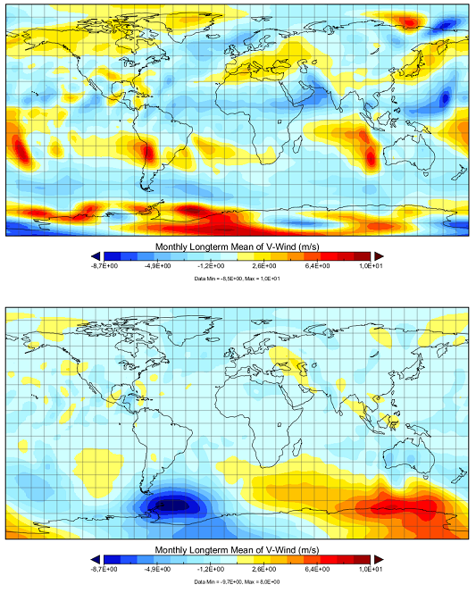
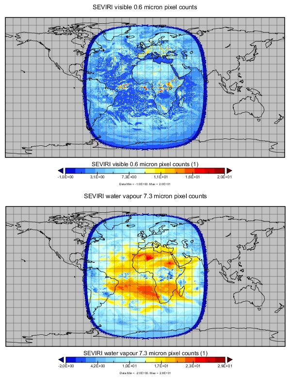
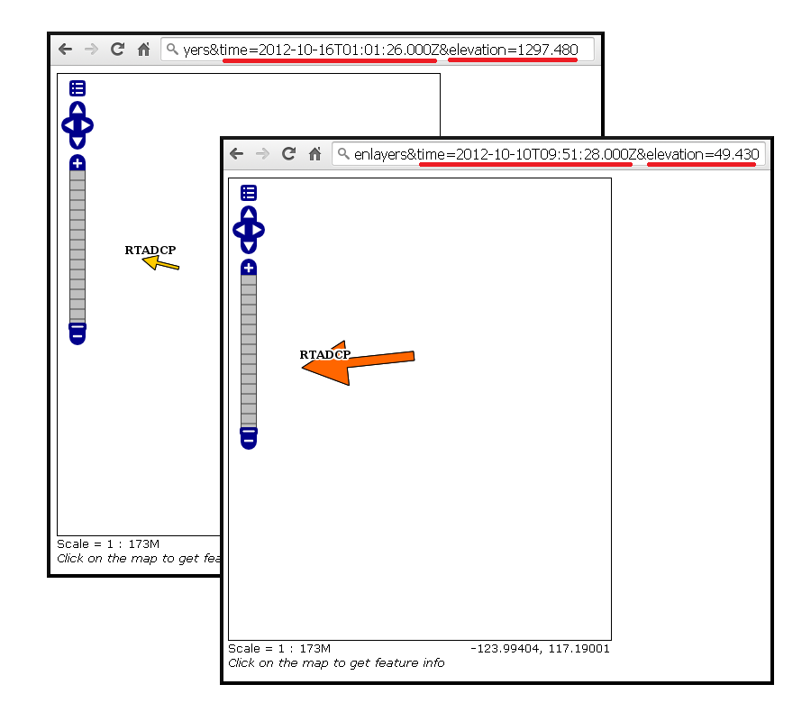

.. module:: geoserver.intro
   :synopsis: General introduction of Multidimensional data

.. _geoserver.intro:

Introducing Multidimensional data 
=================================

In Meteorological and Oceanographic (MetOc) context, geophysical parameters such as temperature, humidity, water current and the like are usually collected (through sensors/probes/buoys) or computed (by mathematical models) across multiple dimensions like time, depth, pressure and so on.

Let's think about an oceanographic model which models water temperature at different times in the future for a certain number depths or a meteorological model which produces forecasts for wind components at different times at different altitudes.

   
   Monthly mean of the v-component of the wind, at different times and different atmospheric pressure levels.

You can think about these entities as multidimensional data or hypercubes where the dimensions are: classic 2D (x,y) + z dimension (elevation/altitude/depth/pressure) + time dimension.

.. figure:: img/md.png
   :align: center
   
   Air temperature represented as a 4D hypercube.

Similar concepts may be applied to Remote Sensing data. As an instance, you can think about a satellite sensor which collects radiations at different times and different wavelengths. In that case the wavelength may be considered
as an additional dimension.

   
   2 Meteosat MSG3 channels (for different wavelenghts): 0.6 micron (visible) and 7.3 micron (water vapour)

Such a type of data requires specific management to be handled and served: the services dealing with them need to recognize the additional dimensions (time/depth/custom dimensions) beside the standard 2D spatial dimensions  
and allow users to request specific subsets of data across those dimensions. 

As an instance, a user interacting with these services may want to retrieve the data available for the water temperature current collected in a certain day and time at a certain depth. This is a request that will span over the time dimension in addition to the spatial dimension.

   OpenLayer preview of a vector dataset requested with different dimensions parameters
   

During this training we will provide information on how to achieve this using GeoServer, by also focusing on some data formats which are commonly used in MetOc/RemoteSensing contexts to store and serve scientific data.
  