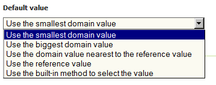

.. module:: geoserver.netcdf_mosaic
   :synopsis: Mosaicking NetCDF files with additional custom dimension.

.. _geoserver.netcdf_mosaic:

Mosaicking NetCDF files with additional custom dimensions
=========================================================
Custom dimensions
"""""""""""""""""
As previously illustrated, MetOc and remote sensing data commonly contains multidimensional coverages, where the further dimensions are usually time and elevation. Besides them, data may also contain additional dimensions or the user may want to define custom dimensions. 
You may think about a remote sensing dataset containing a 2D Array for different wavelengths (the wavelength may be considered as an additional dimension). 
Alternatively, the user may want to define an additional dimension representing the last modify time of a dataset being configured. 

On these cases, we refer them as custom dimensions. In this section, as well as in the following chapters, we will illustrate how to configure them and how to set parameters on the WMS/WCS request to deal with them.

Mosaicking multidimensional data
^^^^^^^^^^^^^^^^^^^^^^^^^^^^^^^^

ImageMosaic allows creating a mosaic of several NetCDF datasets to be served through a single coverage store.
As you learned in the NetCDF chapter, each NetCDF dataset can have an ancillary XML defining the coverages and, optionally, the schemas to be used by the dataset. When configuring a mosaic we may avoid defining an XML for each NetCDF dataset whilst we may share a single XML between all of them.

Preparing the indexers
^^^^^^^^^^^^^^^^^^^^^^

#. Navigate to the :file:`%TRAINING_ROOT%/geoserver_data/coverages/polyphemus/indexer.xml` file and open it. 

#. Go down to the **parameters** section definition. You will see this portion of definition:

   .. code-block:: xml
   
    <parameters>
        <parameter name="AbsolutePath" value="true" />
    </parameters>

#. Copy the following line and add it as a new *parameter* definition within the **parameters** block. It  specifies the shared NetCDF Indexer auxiliary files for all the polyphemus NetCDF granules:

   .. code-block:: xml
   
    <parameter name="AuxiliaryFile" value="_polyphemus.xml" />
    
#. Copy the following line and add it as a new *parameter* definition within the **parameters** block. It  specifies an external location where the NetCDF files to be mosaicked are located:

   .. code-block:: xml
   
    <parameter name="IndexingDirectories" value="%TRAINING_ROOT%/data/user_data/multidim/polyphemus" />
    
#. At the end of these steps you should have a **parameters** section like this:

   .. code-block:: xml
   
    <parameters>
        <parameter name="AuxiliaryFile" value="_polyphemus.xml" />
        <parameter name="AbsolutePath" value="true" />
        <parameter name="IndexingDirectories" value="%TRAINING_ROOT%/data/user_data/multidim/polyphemus" />
    </parameters>

.. note:: Remember that the **%TRAINING_ROOT%** placemark is defined as the absolute path of the training installation folder.

Configuring the NetCDF mosaic in GeoServer
^^^^^^^^^^^^^^^^^^^^^^^^^^^^^^^^^^^^^^^^^^

#. Look at the :file:`%TRAINING_ROOT%/geoserver_data/coverages/polyphemus`. The folder contains several files

   #. **indexer.xml**: An XML file containing the NetCDF ImageMosaic index definition previously updated, with structure of the `schema` of the database that will describe the mosaic structure, the domains, the coverages and the configuration parameters.
   
   #. **_polyphemus.xml**: An XML file representing the NetCDF ancillary file to be shared by all NetCDF granules.
   
   #. **datastore.properties**: A text file containing the connection parameters to an external *PostgreSQL* database.
   
..   #. **datastore.properties_oracle**; Another **datastore.properties** file containing the connection parameters to an external *Oracle* database.
   
..	 By default the ImageMosaic will be connected to the *Postgres* database. For connecting to the *Oracle* database, **datastore.properties** must be removed and **datastore.properties_oracle** must be renamed to **datastore.properties**. Also you must create the oracle database before configuring the mosaic. 

#. From the GeoServer Administration GUI, go to the `Stores > Add new Store` page and select `ImageMosaic` from the `Raster Data Sources` list

   .. figure:: img/imagemosaic_ds_001.png

#. Insert `polyphemus` as `Data Source Name` and `file:coverages/polyphemus` as URL

   .. figure:: img/imagemosaic_netcdf_ds_002.png

   .. note:: Notice that the `ImageMosaic` plug-in requires the folder name. Notice also that since the dataset is physically located under the `${geoserver_data}` you can use a relative path.

   .. note:: For Postgres version lower than 9.2.3 the following parameter must be added to the **datastore.properties** file:
   
		.. code-block:: xml
		
			create\ database\ params=WITH\ TEMPLATE\=template_postgis
	
		(Specifying the proper PostGIS template. In this example: template_postgis).
   
#. Publish the first layer NO2  

   .. figure:: img/imagemosaic_netcdf_ds_003.png

#. Switch on the `Dimensions` tab and configure the time, elevation dimensions as well as the custom dimensions, as depicted on the figure below

   .. figure:: img/imagemosaic_netcdf_ds_004.png

#. Click on the `save` button when done

#. Configure the other coverages. Click on the `Layers` link of the Menu.

   .. figure:: img/layers.png

#. Click on the `Add a new layer` link.

   .. figure:: img/addlayer.png

#. Choose the polyphemus store by selecting :file:`geosolutions:polyphemus` from the drop-down list.

   .. figure:: img/listbox.png

#. As you can see, the NO2 layer results as already published. Now, click on the `publish` link related to the O3 layer.

   .. figure:: img/imagemosaic_netcdf_ds_005.png

#. Repeat the same steps you previously did to configure the dimensions and save the configuration.

#. Repeat the Layer configuration steps to add the last layer contained within the polyphemus store: `V`

Notes on dimension's default value
^^^^^^^^^^^^^^^^^^^^^^^^^^^^^^^^^^

When configuring a default value for a dimension, you can choose between a set of values available in the list, as reported in the next picture.

   
   Default values for a dimension.

There are 5 available options:

* Use the smallest domain value: Select the MINIMUM value from the domain of the dimension. Note that it refers to actual value of that domain. As an instance, when dealing with a depth dimension in range *0m* ... *50m* (with depth axis being positive down), the smallest value will be 0, whilst a depth dimension in range *0m* ... *-50m* (with depth axis being positive up), the smallest value will be *-50m*.
* Use the biggest domain value: Select the MAXIMUM value from the domain of the dimension. Same notes reported in the previous case apply.
* Use the domain value nearest to the reference value: A new *"Reference value"* box will be present, to be populated with the reference value. The default value will be the nearest to the domain reference value specified in the box.

  .. figure:: img/referencevalue.png
     :align: center
     
     Default values for a dimension.

* use the reference value: The default will be set as a fixed user defined value, specified in the *"Reference value"* box as shown in the previous picture. 

   .. note:: For the temporal dimensions, only ISO8601 DateTimes or the string *"current"* are allowed. In that case, the reference value may be set as *"current"* and as a String, which will be resolved to current system time at the time of the request. For the elevation the given value must be parseable to Double.

* use the built-in method to select the value: This method is available for backwards capabilities. In that case, the default will be smallest value for numeric fields and "nearest to current" value for temporal fields.

Customizing NetCDF ancillary files location
^^^^^^^^^^^^^^^^^^^^^^^^^^^^^^^^^^^^^^^^^^^

By default, the NetCDF ancillary files are stored beside the original NetCDF file, within a folder having the same name of the file, preceded by a period, as seen in the previous sections.

#. In case there is no permissions to write new files on the original data folder or in case the user want to collect all these ancillary folders under a single main folder you may configure the ``NETCDF_DATA_DIR``. The first thing to do is to move this folder into a local persistent storage.
  
  
  * Move the ``NETCDF_DATA_DIR`` somewhere in the persistent storage.

  * Check that your ``setenv.bat`` has the following property set in the JAVA_OPTS section and update it with the new location::
  
    -DNETCDF_DATA_DIR=PATH/TO/NETCDF_DATA_DIR

	