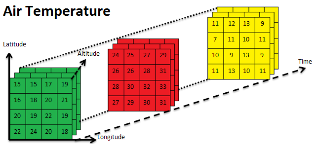
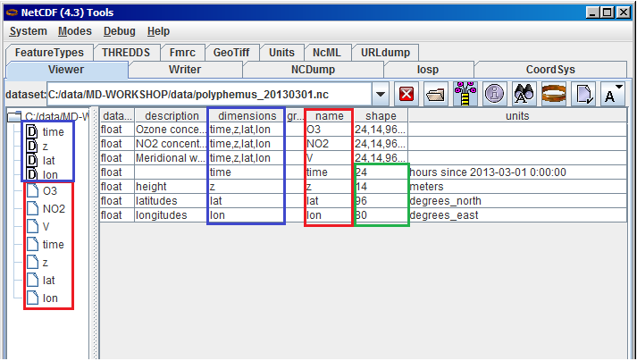
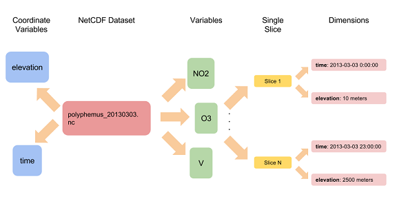
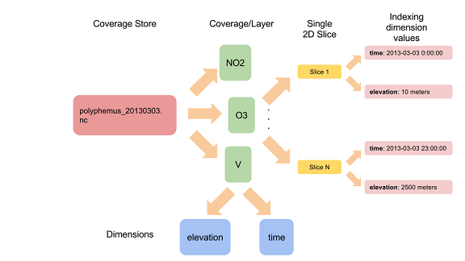

.. module:: geoserver.netcdf_basics
   :synopsis: NetCDF Serving basics

.. _geoserver.netcdf_basics:

NetCDF-family serving basics
============================

General Information
-------------------

In this section the two GeoServer plugins that allow us to serve data through the NetCDF library are:

	* *NetCDF*
	* *GRIB*
	
The GRIB format belongs to the NetCDF family because it has been developed following the **CDF** (Common Data Format) guidelines. It supports (with some limitations) serving GriB1 and GriB2 file formats (more below).
The two formats are conformant to the `CF Conventions <http://cfconventions.org/latest.html>`_. 

CF Conventions
^^^^^^^^^^^^^^

Climate and Forecast Conventions, *CF Conventions*, are a generalization of the `COARDS <https://ferret.pmel.noaa.gov/Ferret/documentation/coards-netcdf-conventions>`_ 
conventions for the NetCDF data. These conventions define the standard metadata that provide a description of the NetCDF variables.
This facilitates building NetCDF applications with powerful extraction, manipulation and display capabilities. The main purpose of 
the CF conventions is to define datasets containing a set of metadata which make each variable self-describing with their physical
position on the earth and other additional attributes, like time and elevation.

NetCDF Format
^^^^^^^^^^^^^^

NetCDF (*Network Common Data Form*) has been defined by the `Unidata program <http://www.unidata.ucar.edu/>`_ and it is widely used to 
store data and metadata for MetOc and Remote Sensing datasets. A NetCDF file may be considered as a multidimensional array, made of 
different variables and potentially different dimensions for each variables.

   
   NetCDF Air Temperature variable example

These *variables* are N-dimensional arrays of rasters and their dimensions could be:

	* Longitude
	* Latitude
	* Time
	* ...

Each variable can have various internal fields defining specific attributes, for example *missing_value* which defines the NoData 
for the variable. 
A NetCDF file also contains an header section with the description of the internal variables, dimensions and global attributes.

.. note:: NetCDF attributes should follow the CF Conventions to be fully supported by GeoServer.

The following is an example structure of a NetCDF header::

	netcdf file:XXX.nc {
	  dimensions:
		time = UNLIMITED;   
		z = 14;
		lat = 96;
		lon = 80;
	  variables:
		float O3(time=24, z=14, lat=96, lon=80);
		  :long_name = "Ozone concentration";
		  :standard_name = "mass_concentration_of_ozone_in_air";
		  :unit = "microgram/m3";
		  :missing_value = NaN; // double

		float NO2(time=24, z=14, lat=96, lon=80);
		  :long_name = "NO2 concentration";
		  :standard_name = "mass_concentration_of_nitrogen_dioxide_in_air";
		  :unit = "microgram/m3";
		  :missing_value = NaN; // double
		  
		....
	  // global attributes:
		 :Conventions = "CF-1.4";
		 :title = "File Title";
		 :summary = "Summary of the file";
		 :keywords = "KEYWORDS, TO, USE";
		 :history = "Long History";

A complete description of the NetCDF format is out of the scope of this training, we rather assume that the reader is familiar with the basic concepts of the format. 
In case the reader is interested in acquiring a deeper knowledge we advice to start with the `Unidata Ucar NetCDF website <http://www.unidata.ucar.edu/software/netcdf/>`_ which contains a huge amount of documentation about the matter.

GRIB Format
^^^^^^^^^^^^

`GRIB <http://en.wikipedia.org/wiki/GRIB>`_ (*GRIdded Binary* or *General Regularly-distributed Information in Binary form*) is a multidimensional format defined by the World 
Meteorological Organization (WMO) for storing meteorological data as a sequential byte array. A GRIB file is composed of a 
set of variables, called *Records*, organized in different sections. Each record contains a list of attributes like a NetCDF file. 

.. note:: GRIB internal attributes should follow the CF Conventions as for NetCDF.

Actually 2 versions of the GRIB format are available: `GRIB 1 <http://www.wmo.int/pages/prog/www/WMOCodes/Guides/GRIB/GRIB1-Contents.html>`_ and `GRIB 2 <http://www.wmo.int/pages/prog/www/WMOCodes/Guides/GRIB/GRIB2_062006.pdf>`_.
	
The main differences between the 2 versions are:

	* Possibility to compress GRIB2 data.
	* Different number of internal sections.
	* Larger list of available fields for the GRIB2 version.
	
	
In the next sections working examples on configuring NetCDF and GRIB files in GeoServer will be provided.

Basics of Serving NetCDF-family formats
--------------------------------------------

This example describes how a NetCDF file can be served through GeoServer.  

The NetCDF file we are going to serve is a sample data from the Polyphemus dataset containing informations about air quality.
It has been provided by `DLR <http://www.dlr.de/>`_, the German Aerospace Center. 
This file is an N-dimensional dataset and its internal structure is composed by various layers, each one mapping the air concentration
of a particular chemical component for every pixel location. These data are N-dimensional because they have been acquired at different elevations 
and times. 

Let's first start by inspecting the NetCDF file using the wonderful tools made available by Unidata UCAR.

#. Open the terminal and run::

		%TRAINING_ROOT%/toolsui.bat
     
   **ToolsUI** is the Unidata NetCDF Tools User interface.
   
   It can be used to perform a wide range of analysis on NetCDF/GRIB datasets such as, as an instance, checking the inner structure (in terms of variables, dimensions, coordinates, attributes), checking variable values and attributes content, and rendering variables.

#. Click on the :guilabel:`open dataset` icon to load a NetCDF sample.

   .. figure:: img/opendataset.png
     :align: center

     Opening a NetCDF file with the Unidata Tools UI

#. Navigate to the :file:`%TRAINING_ROOT%/data/user_data/multidim/polyphemus/polyphemus_20130301.nc` file and open it. 
   You will see the ToolsUI Viewer table which summarizes main information such as available variables and dimensions. See the following picture where: 

   * **Red rectangle** marks available variables
   * **Blue rectangle** marks available dimensions 
   * **Green rectangle** marks the number of available values for each dimension. 
   * Note that the values of each dimension are stored into specific coordinate variables (as an instance: time, z, lon, lat)

   Inspecting the content of a NetCDF file with the Unidata Tools UI	 
	 
.. warning:: The information in the following sections is very low-level since it details how the NetCDF plugin for GeoServer works internally.
  
High level reading
^^^^^^^^^^^^^^^^^^

The NetCDF GeoTools reader used by GeoServer, exposes each physical parameter present in the file (e.g. NO2, O3 and so on) as a GeoTools multidimensional coverage with support for Time and Elevation dimensions where present as respective coordinate variables according to the Climate and Forecast (CF) convention.

The support for the additional dimensions is achieved by mapping each of them to the NetCDf coordinate variable containing the associated values.
This procedure is executed with the help of another file called *schema* which contains the name and the class of all the 
dimensions for each parameter. This file can be defined by the user or created automatically by the reader.
When this file is available, the GeoTools internal reader is then able to handle the different dimensions as specific domains to associate 
to each coverage. 

The NetCDF reader behaves similarly to the `ImageMosaicReader` by implementing the same `StructuredGridCoverage2DReader` interface in order to provide access to the underlying granule source.

However, it is internally based on a new set of APIs used to access the data:

* `Driver`: which provides the ability to work with a new coverage format or service. Used to get a connection to a coverage store.
* `CoverageAccess`: which represents a physical storage of coverage data (that we have a connection to). Used to get access to a source of coverages.
* `CoverageSource`: which provides data access to a coverage.

Usage of these APIs is internally wrapped by classic GridCoverage Reader GeoTools APIs exposed by the NetCDF Reader.

Low level reading
^^^^^^^^^^^^^^^^^
On its underlying machinery, the NetCDF GeoTools reader uses a low level reader which implements the ImageIO API, based on the Unidata NetCDF java library.

A coverage may be considered as being composed of several 2D slices, each of them being associated to a specific subset of specified-values for each dimension composing it.

The NetCDF reader internally associates each of these 2D elements to an integer progressive index to access it through the ImageIO reader implementation.

By this way, once a variable is selected and a value for each dimension is specified, the low level reader may use that specific numeric index to individuate the 2D slice. Finally, this numeric index is translated into a NetCDF subsection which is a set of ranges of index values across each dimension.

NetCDF file structure in GeoServer 
----------------------------------

Below you can find a graphical description of the internal structure of a NetCDF file and its GeoServer counterpart.
The graph is related to the Polyphemus dataset described before:

	
	 NetCDF internal structure

	
	 GeoServer internal structure for a NetCDF file

.. note:: Latitude and Longitude have been omitted for a better graph presentation.
	 
As you may see, the major difference between the 2 structures is the fact that, in GeoServer, *time* and *elevation* dimensions are defined 
at the *Coverage* level and not at the *Store* level.

The next section provides some information about how this indexing system is organized within the NetCDF plug-in.