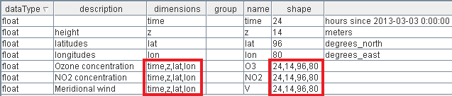
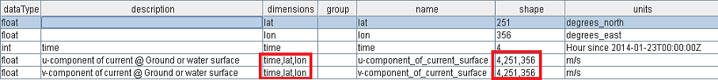

.. module:: geoserver.netcdf_config
   :synopsis: Learn how to configure NetCDF and Grib files.

.. _geoserver.netcdf_config:

NetCDF-family files configuration
=================================

In this sections two simple examples of configuration of a NetCDF and a Grib file are presented.

NetCDF
------

NetCDF file description
^^^^^^^^^^^^^^^^^^^^^^^

The following NetCDF file is part of the Polyphemus dataset already described. More specifically, this file contains
3 layers called *NO2*, *V*, *O3*. Each one of these 3 layers internally have *elevation* (called z) and *time* as additional 
dimensions.

From an abstract point of view, these layers can be seen as 2-dimensional arrays of 2D slices, where each array is composed by **T x E** slices where 

* **T** = number of temporal positions.
* **E** = number of elevation positions.

Here you can find how the file is structured:

.. note:: Note that the z-dimension will be referred as elevation in the next steps.

The GeoServer internal reader is able to parse the NetCDF file and configure the 3 different layers taking into account their 
additional dimensions. With the following example, we are going to understand how to access these layers.

Configuring a NetCDF file
^^^^^^^^^^^^^^^^^^^^^^^^^

#. Go to ``Stores`` -> ``Add new Store``. Then click on the :guilabel:`NetCDF` label:

	.. figure:: img/netcdf.png

#. Enter :file:`testNetCDF` for the :guilabel:`Data Source Name` field and :file:`$TRAINING_ROOT/data/user_data/multidim/polyphemus/polyphemus_20130303.nc` ( or :file:`%TRAINING_ROOT%/data/user_data/multidim/polyphemus/polyphemus_20130303.nc` on Windows, remind to use / in file selector ) for the :guilabel:`URL` field. Then press :guilabel:`Save`.

	.. figure:: img/storeNC.png
	
#. Click on the :guilabel:`Publish` button of the first layer called *NO2*

#. Then in the Layer configuration page you can see various parameters associated to the selected layer. Rename the layer *testNetCDF*, in order to avoid errors in the next sections.

	.. figure:: img/testNetCDF.png
	
#. For configuring the time and elevation dimensions, you have to go to the :guilabel:`Dimensions` page and enable them. Also you should configure the :guilabel:`Presentation` as *List* in order to see these dimensions as separate values. The following settings allow to set specific *time* and *elevation* parameters for accessing a particular slice of the layer.

	.. figure:: img/dimNC.png
	
#. Click on Publishing tab, and assign the N02 style as the default style of the layer.

#. Click on :guilabel:`Save`, for saving the configuration.

#. Execute the following requests::

		http://localhost:8083/geoserver/geosolutions/wms?service=WMS&version=1.1.0&request=GetMap&layers=geosolutions:testNetCDF&bbox=4.9375,44.96875,14.9375,50.96875&width=275&height=165&srs=EPSG:4326&format=image/png
		http://localhost:8083/geoserver/geosolutions/wms?service=WMS&version=1.1.0&request=GetMap&layers=geosolutions:testNetCDF&bbox=4.9375,44.96875,14.9375,50.96875&width=275&height=165&srs=EPSG:4326&format=image/png&elevation=10&time=2013-03-03T00:00:00.000Z

#. As you can see, the two images are different because they represents the same layer at two different time and elevation positions:
		
	Request without parameters
		
		.. figure:: img/defNC.png 
		
	Request with **elevation=10** and **time=2013-03-03T00:00:00.000Z**
		
		.. figure:: img/paramNC.png

	
Grib
----

Grib File description
^^^^^^^^^^^^^^^^^^^^^

The Grib file we used in the following example contains information about the marine currents on the African coast. This file is composed
by two layers:

	* *u-component_of_current_surface*.
	* *v-component_of_current_surface*.
	
It should be pointed out that the two layers contain an additional
time dimension, so we can see the following file as a 3D array where the 3 dimensions are: latitude, longitude, time. 

For a better comprehension, you can see the following screenshot of the image structure:

.. note:: All the Grib files used in the following training have been created by converting original WFS (Weather Research and Forecasting system) data in the Grib format.

Configuring a Grib File
^^^^^^^^^^^^^^^^^^^^^^^

The configuration of a Grib data is very similar to that of a NetCDF one. For this reason some steps will not be shown:

#. Go to ``Stores`` -> ``Add new Store``. Then click on the GRIB entry:

	.. figure:: img/grib.png
	
#. Enter :file:`testGrib` for the :guilabel:`Data Source Name` field and :file:`$TRAINING_ROOT/data/user_data/multidim/africa.grb2` ( or :file:`%TRAINING_ROOT%\\data\\user_data\\multidim\\africa.grb2`  ) for the :guilabel:`URL` field.

#. Click on the :guilabel:`Publish` button of the first layer called *u-component_of_current_surface*

#. Then in the Layer configuration page you can enable the additional parameters.

	.. figure:: img/dimGR.png
	
#. Click on :guilabel:`Save`, for saving the configuration.

#. Execute the following request::

	http://localhost:8083/geoserver/geosolutions/wms?service=WMS&version=1.1.0&request=GetMap&layers=geosolutions:u-component_of_current_surface&styles=africa&bbox=339.9,-30.1,411.09,20.1&width=256&height=180&srs=EPSG:4326&format=image/png
	http://localhost:8083/geoserver/geosolutions/wms?service=WMS&version=1.1.0&request=GetMap&layers=geosolutions:u-component_of_current_surface&styles=africa&bbox=339.9,-30.1,411.09,20.1&width=256&height=180&srs=EPSG:4326&format=image/png&time=2014-01-24T06:00:00.000Z

		
#. Compare the results:

	Request without parameters

		.. figure:: img/defGR.png
	
	Request with **time=2014-01-24T06:00:00.000Z**
	
		.. figure:: img/paramGR.png
	
.. note:: The following requests have been rendered with a style called *africa* for highlighting the differences between the two images.

	
