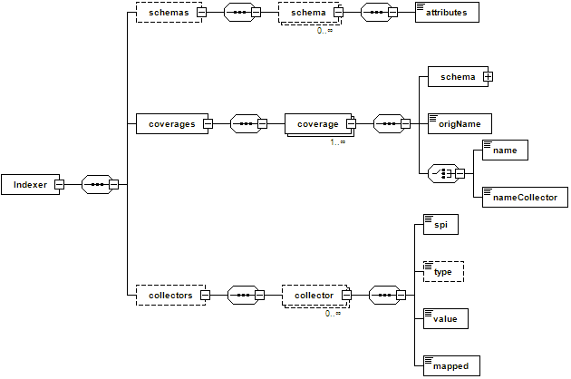

.. module:: geoserver.netcdf_indexer
   :synopsis: Learn how to deal with NetCDF ancillary files.

.. _geoserver.netcdf_indexer:

NetCDF Ancillary files overview
-------------------------------

In order to speed up the process of accessing a 2D element of such a multidimensional entity, the GeoTools NetCDF reader makes use of a set of ancillary files which are automatically generated during the first access to the dataset:

* An H2 DB containing attributes for dimensions as well as the associated numeric Index.

* A .idx file containing a binary index to quickly associate the numeric index to a NetCDF section which represents a selection of ranges along each dimension of the data array. 

.. warning:: The .idx index might disappear in future releases to simplify data ingestion.

.. #. Navigate to the workshop directory::
		
..		 %TRAINING_ROOT%/netcdf_data_dir/.20130103.METOPA.GOME2.O3.PGL

.. and find the following files::

..   20130103.METOPA.GOME2.O3.PGL.idx
..   20130103METOPAGOME2O3PGL.2.log.db
..   20130103METOPAGOME2O3PGL.data.db
..   20130103METOPAGOME2O3PGL.index.db
..   20130103METOPAGOME2O3PGL.trace.db
     
.. They represent the automatically created ancillary files for index mappings.

NetCDF indexer file
+++++++++++++++++++

The NetCDF reader supports an indexer file which is a simplified version of the indexer shown on the previous chapter about ImageMosaic to control the indexing process for a NetCDF file. 
The NetCDF Indexer can be used to specify the name of the underlying variables we are interested in serving, in order to allow us to ignore some of them (in case we are not interested in serving some of those variable, explicitly ignoring them will make the initial indexing much faster as we will tell the internal parser to skip them). 
In addition it can be used to define the schema to be used by the H2 DB mapping as well as specifying coverage names remapping when needed (this will be illustrated in the next subsection).

   NetCDF indexer schema
	
If the indexer file is not defined, the NetCDF reader automatically creates it.
  

NetCDF Sample Indexer File: customizing the internal H2 index schemas
^^^^^^^^^^^^^^^^^^^^^^^^^^^^^^^^^^^^^^^^^^^^^^^^^^^^^^^^^^^^^^^^^^^^^^^^^^

Attributes composing the internal H2 index schema are automatically detected by inspecting the dimensions contained within the NetCDF file.
By default, the schema contains the polygon geometry, the imageIndex column used to store the progressive index and the name of the dimensions composing the coverage.

However, you may want to manually specify  the schema depending on your needs or rename your coverages.

The following file contains information about the atmosphere quality. It has been provided by `EUMETSAT <http://www.eumetsat.int/>`_, European Organisation for the Exploitation of Meteorological Satellites.

#. Execute again :file:`%TRAINING_ROOT%/toolsui.bat` to open ToolsUI.

#. Click on the :guilabel:`open dataset` icon to load a NetCDF sample as seen in the previous section.
 
#. Navigate to the workshop directory :file:`%TRAINING_ROOT%/netcdf_data_dir/GOME2` and open the `20130102.METOPA.GOME2.NO2.PGL.nc` file. 

   .. figure:: img/netcdf_gome2no2.png
     :align: center

     Opening a NetCDF GOME2 dataset containing NO2 concentration.

   .. note:: As you can see, this dataset contains a variable with name = **z** which has nothing to do with an elevation since it actually contains NO2 concentration.

#. Navigate to the workshop directory :file:`%TRAINING_ROOT%/netcdf_data_dir/GOME2` and open the `20130102.METOPA.GOME2.O3.PGL.nc` file. 

   .. figure:: img/netcdf_gome2o3.png
     :align: center

     Opening a NetCDF GOME2 dataset containing O3 concentration.

   .. note:: As you can see, same situation of the other dataset. O3 concentration is stored within a variable having name = **z** .

In this case, you may consider defining an indexer to allow to specify a better coverage Name.

   .. code-block:: xml
   
    <?xml version="1.0" encoding="UTF-8" standalone="yes"?>
    <Indexer>
        <schemas>
            <schema name="default" >
                <attributes>
                the_geom:Polygon,coverage:String,imageindex:Integer
                </attributes>
            </schema>
        </schemas>
        <coverages>
            <coverage>
                <nameCollector>coverageNameCollector</nameCollector>
                <schema ref="default"></schema>
                <origName>z</origName>
            </coverage>
        </coverages>
        <collectors>
        <collector name="coverageNameCollector">
          <value>[A-z0-9]+(?=.PGL)</value>
          <spi>StringFileNameExtractorSPI</spi>
          <mapped>coverageName</mapped>
        </collector>
        </collectors>
    </Indexer>

On that indexer, we have defined a default schema containing the listed attributes and a coverage using that default schema through reference (see the *schema ref* part). About the coverage definition:
 * *origName* reports the original name of that variable in the dataset
 * *nameCollector* refers to a coverageNameCollector definition to extract a different coverageName to be assigned to the coverage. This is very similar to what has been illustrated on imageMosaic Indexer XML while introducing PropertyCollectors. 
     * *value* contains a regex to be applied to the file Name.
     * *spi* is the instance of Property collector used to extract the actual value.
     * *mapped* represents the property we are going to remap.
