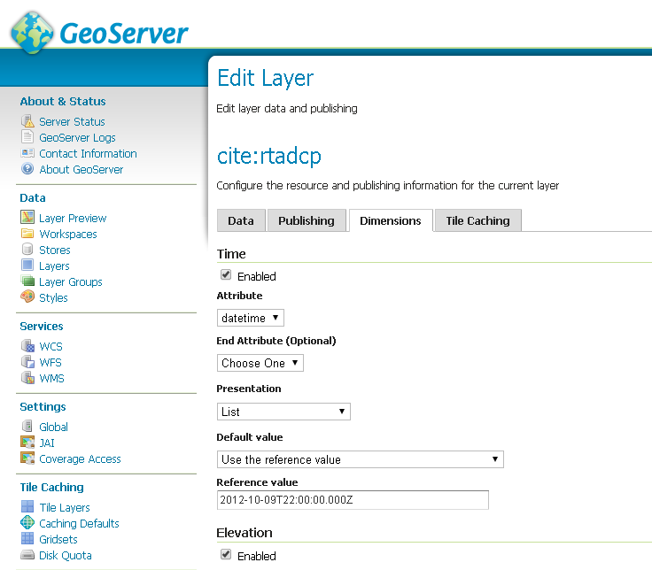
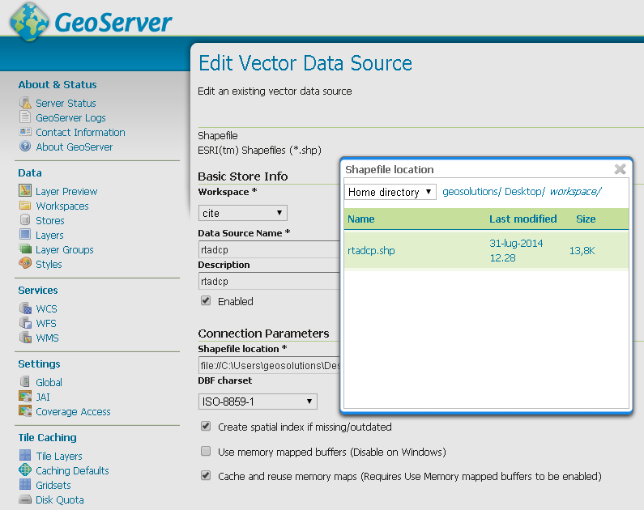
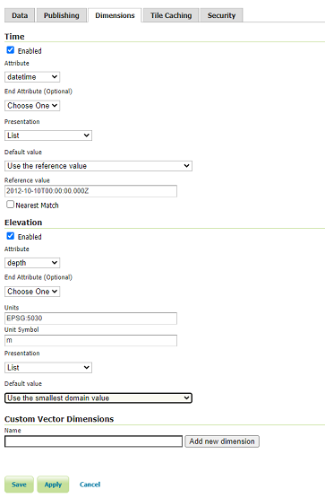

.. module:: geoserver.vector_multidim
   :synopsis: Load and configure multidimensional vector data

.. _geoserver.vector_multidim:

Vector Data dimensions
------------------------

Overview
^^^^^^^^^

This chapter introduce the concepts of **TIME** and **ELEVATION** dimensions related to Vector datasets in GeoServer.

In the following sections we are going to see how to load a shapefile containing valid time and elevations attributes and how to configure these dimensions in Geoserver.

Time and Elevation dimensions
^^^^^^^^^^^^^^^^^^^^^^^^^^^^^^

All vector data formats are composed of many **features**. A feature is a record on a database table that is spatially localizable. A feature, as a normal database record, is composed of many attributes, often one or many of them can be geometry attributes.

It's easy to guess how the **TIME** and **ELEVATION** dimensions can be implemented for a generic vector dataset: just use a Date and a Numeric attribute to store the time and elevation values but, **which dataformat that fields should have?**

* An elevation attribute can be modelled as an integer attribute as well as a float attribute, both can be reasonable choices. 

* A time attribute can be modelled with a format that supports both date and time, or only the date or only the time.

GeoServer doesn’t impose any limitation on the person who is in charge to model the dataset rather allows him to easily configure these parameters through its GUI.

   
   Overview of the GeoServer GUI Dimensions tab

Dataset description
^^^^^^^^^^^^^^^^^^^^^

In this training a dataset representing undersea marine informations gathered by marine probes will be used . 

Each feature is composed of several attributes including a field related to the **time of the acquisition** (TIME) and a field related to the **depth of the acquisition** (ELEVATION).

The vector format used is the **shapefile**. Anyway all the considerations and all the configurations which will be discussed here can be applied to any other type of vector datastores.

Load a shapefile with time and elevation dimensions
^^^^^^^^^^^^^^^^^^^^^^^^^^^^^^^^^^^^^^^^^^^^^^^^^^^^

The first step to do is a quite common task: load a shapefile into geoserver.

#. Locate the **rtadcp.shp** file into the folder ``$TRAINING_ROOT\data\user_data\multidim\shp\`` and load it as a shapefile datastore (%TRAINING_ROOT% in Windows).

   
   Shapefile loading

The publish datastore workflow lead the user directly in the **publish layer** section. 

#. In the **Data** tab Compute the Bounding Box if it isn't automatically computed and then switch to the **Dimensions** tab.

#. The Dimensions tab is where all the TIME and ELEVATION configurations must be defined, fill-in the form as shown in the screenshoot below.
   In particular:
   
   #. Choose the time attribute to be ``datetime``, with list presentation, and reference value set to ``2012-10-10T00:00:00.000Z``
   #. Choose the elevation attribute to be ``depth``, with list presentation, and as default value set to ``Use the smallest domain value``

   
   Dimensions for filled-in with the tutorial example settings

Next section explains the meaning of all the fields and the further one will show some layer visualization examples using Geoserver OpenLayer preview.

Dimensions configuration explanation
^^^^^^^^^^^^^^^^^^^^^^^^^^^^^^^^^^^^

The two sections have some common attributes name: **Attribute**, **End Attribute**, **Presentation**, **Default value**. The meaning of these attributes is similar between both dimensions:

* **Attribute**: Sets the feature attribute to use as the information field to retrieve the TIME and ELEVATION informations.

* **End Attribute**: Since Geoserver supports also **ranges** of TIME and ELEVATION this option allows to specify the upper end range value. This is an optional attribute, when it is specified the value of **Attribute** is taken as the lower end range value.

* **Presentation**: Specifies how to handle the set of dimension values:
	
	* **List** - handles the values as a list of all available values. When a dimension is set in the request, Geoserver search for an exact match between the values are presents in the list.
	
	* **Continuous interval** - handles the values as a continuous interval between the lower value (e.g. the lower TIME value or the lower ELEVATION value) to the higher value.
	
	* **Interval and resolution** - same as Continuous interval plus the possibility to specify an interval resolution.

* **Default value**: The default value used for dimensions params when no params are provided.
    
	* **Use the smallest domain value** - GeoServer uses by default the **lowest** TIME or ELEVATION value.
	
	* **Use the biggest domain value** - GeoServer uses by default the **higher** TIME or ELEVATION value.
	
	* **Use the reference value** - specify a reference value to use by default.
	
	* **Use domain value nearest the reference value** - instead of search for an exact match between the reference value and an existing value search for the nearest one.
   
   * **Use the built-in method to select the value** - this method is available for backwards capabilities.

A glance on the WMS Capabilities Document
^^^^^^^^^^^^^^^^^^^^^^^^^^^^^^^^^^^^^^^^^^^

Depending on how the presentation field is set, the capabilities document will change its content in order to describe properly the layers properties.

#. From the GeoServer HomePage open the **WMS 1.3.0 capability document** clicking on the link ``1.3.0`` located under the **WMS** label on the right-most column.

#. Search for the layer name **rtadcp**.

When Presentation is set to **List**, all mosaic times and elevations are listed:

.. code-block:: xml

     <Dimension name="time" default="2012-10-10T00:00:00Z" units="ISO8601">
       2012-10-10T00:00:00.000Z,2012-10-12T00:00:00.000Z,2012-10-13T00:00:00.000Z
     </Dimension>
     <Dimension name="elevation" default="49.44" units="EPSG:5030" unitSymbol="m">
       49.44,49.45,81.44,81.45,113.44,113.45,145.44,145.45,177.44,177.45,209.44,209.45,241.44, ...
     </Dimension>

When Presentation is set to **Continuous interval** only the start, end and interval extent times are listed:

.. code-block:: xml
   
     <Dimension name="time" default="2012-10-10T00:00:00Z" units="ISO8601">
        2012-10-10T00:00:00.000Z/2012-10-13T00:00:00.000Z/PT1S
     </Dimension>
     <Dimension name="elevation" default="49.44" units="EPSG:5030" unitSymbol="m">
        49.44/1265.47/0
     </Dimension>
     
.. warning:: Setting dimensions to **continuous interval** allows the client to request any value between the
            begin and end, but the WMS will respond only if exact values are met, so use this approach only
            if the client has some other means to figure out what the dimension values are.

Setting the presentation to **Interval and resolutions** allows the user to specify the resolution of the interval:

.. code-block:: xml

     <Dimension name="time" default="2012-10-10T00:00:00Z" units="ISO8601">
       2012-10-10T00:00:00.000Z/2012-10-13T00:00:00.000Z/P1D
     </Dimension>
     <Dimension name="elevation" default="49.44" units="EPSG:5030" unitSymbol="m">
       49.44/1265.47/0.1
     </Dimension>
     
.. warning:: Setting dimensions to **Interval and resolutions** allows the client to request any discrete value between the
            beginning and end, at the specified resolution, but the WMS will respond only if exact values are met, 
            so use this approach only if the dimension domain is truly regular and complete. 
            In the above example, *rtadcp* is actually missing one of the days and does not have most of 
            the elevation values found between 49.44 and 1265.47 at steps of 0.1m .

Playing with GeoServer OpenLayer preview
^^^^^^^^^^^^^^^^^^^^^^^^^^^^^^^^^^^^^^^^^

#. Open the GeoServer layer preview and visualize the preview for the layer **rtadcp**. 

	Since no TIME nor ELEVATION params are specified in the request, the reference values set previously will be taken as the values to use.

	.. figure:: img/7_default-value.png
		:align: center
   
		Layer preview using defaults TIME and ELEVATION.

	Click on each single point on the map to look at the feature info. All the points in the map have the fields **datetime** and **depth**, which are associated to the TIME and ELEVATION dimensions, set as the reference values.

	Note that there are more than 3 points on the map since many of them are overlapped.
   
#. Add the following string to the end of the layer preview URL::

	 &time=2012-10-13T00:00:00.000Z&elevation=1233.47
   
   It will be shown only the point at **datetime** (a.k.a. TIME) ``2012-10-12T22:00:00.000Z`` and **depth** (a.k.a. ELEVATION) ``1233.47``
   
   .. figure:: img/8_time-elev.png
		:align: center
   
		Layer preview specifying the TIME and ELEVATION dimensions