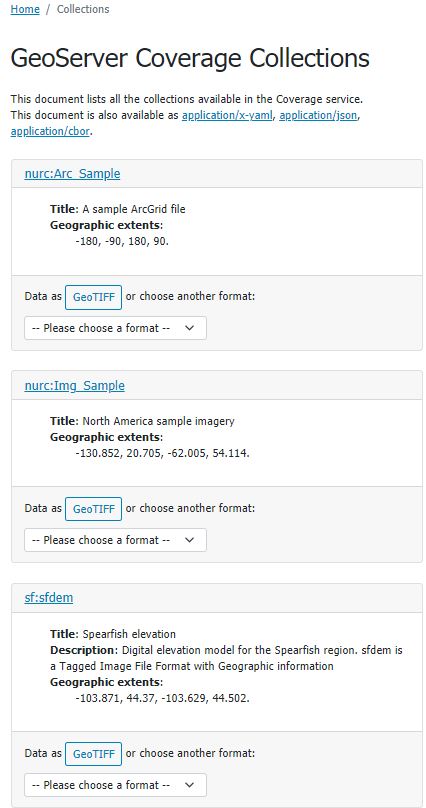
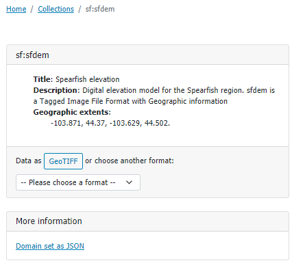

.. module:: geoserver.ogcapi.coverages.basics
   :synopsis: Introduction to ogcapi coverages service.

.. _geoserver.ogcapi.coverages.basics:

Coverages Service basics
=========================

The OGC API Coverages Service is accessed via the ``COVERAGES`` version ``1.0`` link on the home page.

 .. figure:: img/ogcapi-coverages.png

The landing page (at ``http://localhost:8080/geoserver/ogc/coverages``) provides clients with a starting point for using the API, through a collection of resources, with links for navigation between content. 
The following screenshot shows the HTML representation of the landing page.

 .. figure:: img/ogcapi-coverages-capabilities.png

The landing page  can also be represented as ``json``, e.g..``http://localhost:8080/geoserver/ogc/coverages?f=application/json``. This representation provides the same information, in a form suitable for programmatic access by web developers.

Additionally, GeoServer also provides a YAML representation of the landing page at ``http://localhost:8080/geoserver/ogc/coverages/api?f=application/x-yaml``.

The service title and description are provided by the existing Web Coverage Service (WCS) settings.

The :guilabel:`API definition` provides an `OpenAPI <https://www.openapis.org/>`__ description of the service is provided, that may be browsed as documentation, or used to generate a client to access the web services.

 .. figure:: img/api-definition.png

 .. figure:: img/api-links.png

Collections and coverages
-------------------------

``OGC API - Coverages`` provides access to collections of geospatial data. A collection is a generic concept for a set of related resources/items. 
A collection can thus be a Coverage Collection when each of its items is a Coverage.
For each configured coverage layer in GeoServer a collection is provided. Each collection entry is described using the corresponding layer details: title, description, geographic extent.

   
   Collections page available at http://localhost:8080/geoserver/ogc/coverages/collections?f=text/html

From the collection page it is possible to request a collection definition to retrieve more details and retrieve the collection data

   
   Spearfish collection page available at http://localhost:8080/geoserver/ogc/coverages/collections/sf:sfdem?f=text/html

Data can be downloaded in the available suggested format (i.e. GeoTIFF), or downloaded in a range of formats available from the drop down list.
Data can be requested by adding ``/coverage`` path to the collection url and specifing the requested format (f) parameter, eg. ``http://localhost:8080/geoserver/ogc/coverages/collections/sf:sfdem/coverage?f=image%2Fgeotiff``