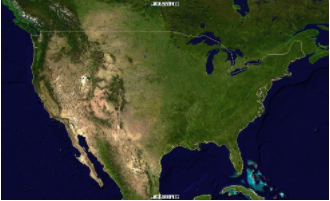
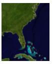

.. module:: geoserver.ogcapi.coverages.subsetting
   :synopsis: Subsetting coverages.

.. _geoserver.ogcapi.coverages.subsetting:

DomainSet and Subsetting
========================
The collection description also links to DomainSet, describing the detailed n-dimensional space covered by the data (referencing system, axis definitions, and grid limits).

The DomainSet can be retrieved as a JSON content at:
``http://localhost:8080/geoserver/ogc/coverages/collections/sf:sfdem/coverage/domainset?f=application%2Fjson``

JSON DomainSet
~~~~~~~~~~~~~~
The following is the ``JSON`` output for the above DomainSet call: 

.. code-block:: json

  {
     "type":"DomainSetType",
     "generalGrid":{
      "type":"GeneralGridCoverageType",
      "srsName":"http://www.opengis.net/def/crs/EPSG/0/26713",
      "axisLabels":[
       "E",
       "N"
      ],
      "axis":[
       {
        "type":"RegularAxis",
        "axisLabel":"E",
        "resolution":30.0,
        "lowerBound":589980.0,
        "upperBound":609000.0,
        "uomLabel":"m"
       },
       {
        "type":"RegularAxis",
        "axisLabel":"N",
        "resolution":30.0,
        "lowerBound":4913700.0,
        "upperBound":4928010.0,
        "uomLabel":"m"
       }
      ],
      "gridLimits":{
       "type":"GridLimitsType",
       "srsName":"http://www.opengis.net/def/crs/OGC/0/Index2D",
       "axisLabels":[
        "i",
        "j"
       ],
       "axis":[
        {
           "type":"IndexAxis",
           "axisLabel":"i",
           "lowerBound":0,
           "upperBound":633
        },
        {
           "type":"IndexAxis",
           "axisLabel":"j",
           "lowerBound":0,
           "upperBound":476
        }
       ]
      }
     }
  }

Subsetting
~~~~~~~~~~
The previously mentioned DomainSet resource allows to retrieve axis names and geospatial extent for a particular coverage.
From the above example we know axis names (E,N) and their extent.

Subsetting allows to request a subset of the DomainSet, by specifying reduced ranges for named axes.

So we can setup a subset request with a reduced extent of 10km by 10km on a specific area to be returned as a GeoTIFF:
``http://localhost:8080/geoserver/ogc/coverages/collections/sf:sfdem/coverage?f=image%2Fgeotiff&subset=E(590000:600000),N(4915000:4925000)``

This is a request of a full coverage (no subset being specified) requested in PNG:

``http://localhost:8080/geoserver/ogc/coverages/collections/nurc:Img_Sample/coverage?f=image%2Fpng``

which results into this:

This is a request of the same coverage with subset specified to cover a 20 degrees by 20 degrees region:

``http://localhost:8080/geoserver/ogc/coverages/collections/nurc:Img_Sample/coverage?f=image%2Fpng&subset=Lat(20:40),Long(-90:-70)``

which results into this:

