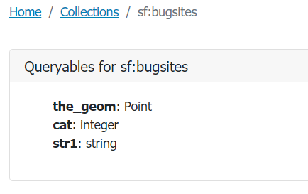

.. module:: geoserver.ogcapi.features.filtering
   :synopsis: Filtering and extracting data.

.. _geoserver.ogcapi.features.filtering:

Filtering and reprojecting data
================================

OGC API - Features CRS extension
--------------------------------

The ``OGC API Core`` specification states ``CRS-84`` is the only Coordinate Reference System an implementation must support. Therefore Geo-spatial data stored in a different CRS must be reprojected to ``CRS-84``.

This means that by default a collection of features will not be returned with the native ``CRS`` defined at layer configuration time.
E.g. the native ``CRS`` of the ``bugsites`` layer is ``EPSG:26713``, but by default the collection will be returned using ``EPSG:4326``.

GeoServer implementation of Feature Service supports reprojection as described by `Coordinate Reference Systems by Reference <https://docs.ogc.org/is/18-058/18-058.html>`_ specification.

..warning:: The GeoServer implementation of the CRS extension is still not complete, currently the collection metadata reports the possible target CRSs, but not the storage CRS.

To obtain a response with a CRS other than ``CRS-84`` the ``crs`` parameter needs to be specified, for example: 
``http://localhost:8080/geoserver/ogc/features/collections/sf:bugsites/items?f=application%2Fgeo%2Bjson&limit=50&crs=EPSG:26713``.

To clearly and unambiguously assert the ``CRS`` being used in a response document independent of the requested output format, the response will contain a header named ``OGC-CRS`` asserting the Coordinate Reference System that has been used.

.. warning:: In the updated specifications of OGC Services the header name is required to be ``Content-CRS``. Thus the actual name ``OGC-CRS`` will be likely changed to match the one indicated in the specs. 

.. warning:: The GeoJSON specification always assumes data in CRS84. Usage of other coordinate reference system is left to a "prior arrangement between parties". The OGC API - Features CRS extension is such arrangement, the client is explicitly asking for a different CRS.

BBOX filtering
---------------

The ``bbox`` parameter allows searching for features overlapping a user specified bounding box. 
By default the service will interpret the bbox coordinates as ``CRS-84``. 
If another CRS is needed, the CRS extension must be implemented by the server, and the parameter ``bbox-crs`` needs to be provided.

Using as an example the ``bugsites`` collection, a request with a ``bbox`` filter will look like the following:

``http://localhost:8080/geoserver/ogc/features/collections/sf:bugsites/items?f=application%2Fgeo%2Bjson&bbox=597650.6042788428,4919751.718018367,601315.4744029717,4922314.263925473&bbox-crs=EPSG:26713``

where the ``bbox-crs``  has as a value ``EPSG:26713``, matching the collection native CRS.

Filtering and the Common Query Language
----------------------------------------

CQL and CQL2
~~~~~~~~~~~~

GeoServer OGCAPI - Features provides filtering capability by implementing the Filtering extension as defined in `Filtering and the Common Query Language <https://docs.ogc.org/DRAFTS/19-079.html>`_ specification.

The specifications defines:

* Query parameters (``filter``, ``filter-lang``, ``filter-crs``) to specify filter criteria in a request to an API.

* A filter grammar called Common Query Language (CQL) for specifying enhanced filtering criteria beyond what is supported in the Core.

* Two encodings for CQL: a text and a JSON encoding.

``CQL`` (Common Query Language) is a filter grammar, similar to the SQL WHERE clause, used mainly in data retrieval to identify the subset of items, such as features, that should be included in the response output. It was originally created as a text query language meant to be used for ``OGC Catalogue Service`` (CSW). GeoServer adopted it as a query language for WFS and WMS too, as a vendor parameter. 

Currently ``OGC`` is undergoing a revision of it to a new language specification named ``CQL2``, the OGCAPI - Features Filter extension currently implemented by GeoServer has been superseeded by `Filtering and the Common Query Language CQL2 <https://docs.ogc.org/DRAFTS/19-079r1.html>`_.

Altough the new language definition is stated to be consistent with the earlier ``CQL`` specification, a number of changes are being applied to it, so  existing implementations will need to be updated. 

In the following ``CQL filter`` examples, the earlier ``CQL`` sytanx and operators are used (although they are mostly valid on CQL2 too).

Queryables
~~~~~~~~~~~~

Queryables allow to determine the names and types of the properties that may be used to construct a filter.

A queryable might not overlap completely with the content schema of a resource. A publisher may want to support queryables that are not directly represented as properties in the original schema (happened in CSW as well), or may want to restrict filtering on certain properties.

Queryables resources can be requested for each collection of items at ``/collections/{collectionId}/queryables``. 
Eg. for the bugsites collection, queryables can be retrieved at 
``http://localhost:8080/geoserver/ogc/features/collections/sf:bugsites/queryables``, 
providing the following response:

A queryable can also be requested as a ``JSON`` using the  ``application/schema+json`` MIME type. 
``http://localhost:8080/geoserver/ogc/features/collections/sf:bugsites/queryables?f=application%2Fschema%2Bjson`` 
will produce the following output:

.. code-block:: json

  
  {
   "title":"Spearfish bug locations",
   "type":"object",
   "properties":{
      "the_geom":{
         "$ref":"https://geojson.org/schema/Point.json"
      },
      "cat":{
         "type":"integer",
         "description":"integer"
      },
      "str1":{
         "type":"string",
         "description":"string"
      }
   },
   "$schema":"https://json-schema.org/draft/2019-09/schema",
   "$id":"http://localhost:8080/geoserver/ogc/features/collections/sf%3Abugsites/queryables"
 }

Filter parameter
~~~~~~~~~~~~~~~~~

The ``filter`` parameter allows to specify a predicate to filter data. The ``filter-lang`` parameter specifies which filtering language is used in ``filter``. A server might support multiple filtering languages. 

Currently, the following languages are specified:

* ``cql-text`` (the default one).
* ``cql-json`` (an early implementation of the JSON encoding, the current one is significantly different).

If the filter language is different from ``cql-text`` the additional ``filter-lang`` parameter needs to be used, e.g. ``filter-lang=cql-json``.

The following request is filtering the bugsites items with a cat value lower than 6

``http://localhost:8080/geoserver/ogc/features/collections/sf:bugsites/items?f=application%2Fgeo%2Bjson&filter=cat<6``

and produces the following output:

.. code-block:: json
   
   {
   "type":"FeatureCollection",
   "features":[
      {
         "type":"Feature",
         "id":"bugsites.1",
         "geometry":{
            "type":"Point",
            "coordinates":[
               -103.86761148,
               44.38484141
            ]
         },
         "geometry_name":"the_geom",
         "properties":{
            "cat":1,
            "str1":"Beetle site"
         }
      },
      {
         "type":"Feature",
         "id":"bugsites.2",
         "geometry":{
            "type":"Point",
            "coordinates":[
               -103.86509752,
               44.38630194
            ]
         },
         "geometry_name":"the_geom",
         "properties":{
            "cat":2,
            "str1":"Beetle site"
         }
      },
      {
         "type":"Feature",
         "id":"bugsites.3",
         "geometry":{
            "type":"Point",
            "coordinates":[
               -103.86395564,
               44.38107792
            ]
         },
         "geometry_name":"the_geom",
         "properties":{
            "cat":3,
            "str1":"Beetle site"
         }
      },
      {
         "type":"Feature",
         "id":"bugsites.4",
         "geometry":{
            "type":"Point",
            "coordinates":[
               -103.86361552,
               44.38762863
            ]
         },
         "geometry_name":"the_geom",
         "properties":{
            "cat":4,
            "str1":"Beetle site"
         }
      },
      {
         "type":"Feature",
         "id":"bugsites.5",
         "geometry":{
            "type":"Point",
            "coordinates":[
               -103.86279282,
               44.38732335
            ]
         },
         "geometry_name":"the_geom",
         "properties":{
            "cat":5,
            "str1":"Beetle site"
         }
      }
   ],
   "totalFeatures":9,
   "numberMatched":9,
   "numberReturned":9,
   "timeStamp":"2021-09-16T08:57:51.319Z",
   "crs":{
      "type":"name",
      "properties":{
         "name":"urn:ogc:def:crs:EPSG::4326"
      }
   }
 }

The following request uses instead a spatial intersects filter, requesting all the features whose geometry intesects the polygon ``Polygon ((-103.85926203756271491 44.40889374215363006, -103.84972983657543466 44.4080809188136314, -103.84943426445180137 44.39987879238272228, -103.85992707484089692 44.400248257537271, -103.85926203756271491 44.40889374215363006))``

``http://localhost:8080/geoserver/ogc/features/collections/sf:bugsites/items?f=application%2Fgeo%2Bjson&filter=intersects(the_geom,Polygon ((-103.85926203756271491 44.40889374215363006, -103.84972983657543466 44.4080809188136314, -103.84943426445180137 44.39987879238272228, -103.85992707484089692 44.400248257537271, -103.85926203756271491 44.40889374215363006)))``.

producing the following output:

.. code-block:: json
  
  {
   "type":"FeatureCollection",
   "features":[
      {
         "type":"Feature",
         "id":"bugsites.15",
         "geometry":{
            "type":"Point",
            "coordinates":[
               -103.85723792,
               44.40632697
            ]
         },
         "geometry_name":"the_geom",
         "properties":{
            "cat":15,
            "str1":"Beetle site"
         }
      },
      {
         "type":"Feature",
         "id":"bugsites.23",
         "geometry":{
            "type":"Point",
            "coordinates":[
               -103.85229087,
               44.40434176
            ]
         },
         "geometry_name":"the_geom",
         "properties":{
            "cat":23,
            "str1":"Beetle site"
         }
      }
   ],
   "totalFeatures":2,
   "numberMatched":2,
   "numberReturned":2,
   "timeStamp":"2021-09-16T12:45:33.796Z",
   "crs":{
      "type":"name",
      "properties":{
         "name":"urn:ogc:def:crs:EPSG::4326"
      }
   }
 }

Limit items
------------

It is possible to limit the number of features returned by using the ``limit`` parameter. For example, the following request will return at most 3 items from the bugsites collection: ``http://localhost:8080/geoserver/ogc/features/collections/sf:bugsites/items?f=application%2Fgeo%2Bjson&limit=3``.

.. code-block :: json
  
  {
   "type":"FeatureCollection",
   "features":[
      {
         "type":"Feature",
         "id":"bugsites.1",
         "geometry":{
            "type":"Point",
            "coordinates":[
               -103.86761148,
               44.38484141
            ]
         },
         "geometry_name":"the_geom",
         "properties":{
            "cat":1,
            "str1":"Beetle site"
         }
      },
      {
         "type":"Feature",
         "id":"bugsites.10",
         "geometry":{
            "type":"Point",
            "coordinates":[
               -103.85881675,
               44.38906627
            ]
         },
         "geometry_name":"the_geom",
         "properties":{
            "cat":10,
            "str1":"Beetle site"
         }
      },
      {
         "type":"Feature",
         "id":"bugsites.11",
         "geometry":{
            "type":"Point",
            "coordinates":[
               -103.85882875,
               44.37746168
            ]
         },
         "geometry_name":"the_geom",
         "properties":{
            "cat":11,
            "str1":"Beetle site"
         }
      }
   ],
   "totalFeatures":90,
   "numberMatched":90,
   "numberReturned":3,
   "timeStamp":"2021-09-16T09:26:55.938Z",
   "links":[
      {
         "title":"next page",
         "type":"application/json",
         "rel":"next",
         "href":"http://localhost:8080/geoserver/ogc/features/collections/sf%3Abugsites/items?limit=3&f=application%2Fjson&startIndex=3"
      }
   ],
   "crs":{
      "type":"name",
      "properties":{
         "name":"urn:ogc:def:crs:EPSG::4326"
      }
   }
 }

Pagination
------------

The OGC API - Features specification allows paging by following the  ``next`` and ``previous`` links in the returned item lists.

In the specifica case of GeoServer, the links are built combining the ``limit`` parameter with a ``startIndex`` param indicating the first item of the page.

This request, ``http://localhost:8080/geoserver/ogc/features/collections/sf:bugsites/items?f=application%2Fgeo%2Bjson&limit=3&startIndex=0``, will return the first three items starting from the one with the lowest featureId value: ``bugsites.1``, ``bugsites.10``, ``bugsites.11``.

The next 3 features can be requested with this request, ``http://localhost:8080/geoserver/ogc/features/collections/sf:bugsites/items?f=application%2Fgeo%2Bjson&limit=3&startIndex=3``, where the startIndex parameter value is now 3.

The request will return the next three features ``bugsites.12``, ``bugsites.13``, ``bugsites.14``.
