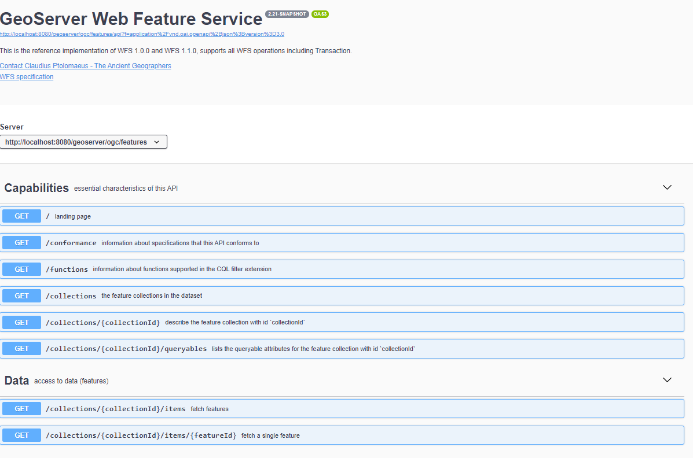
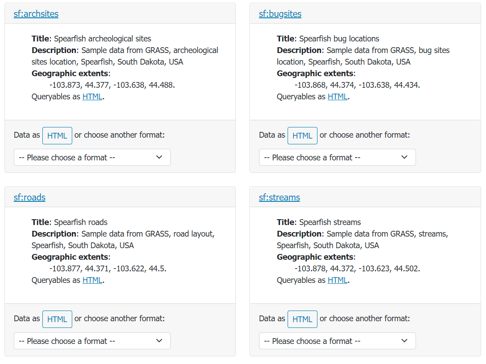
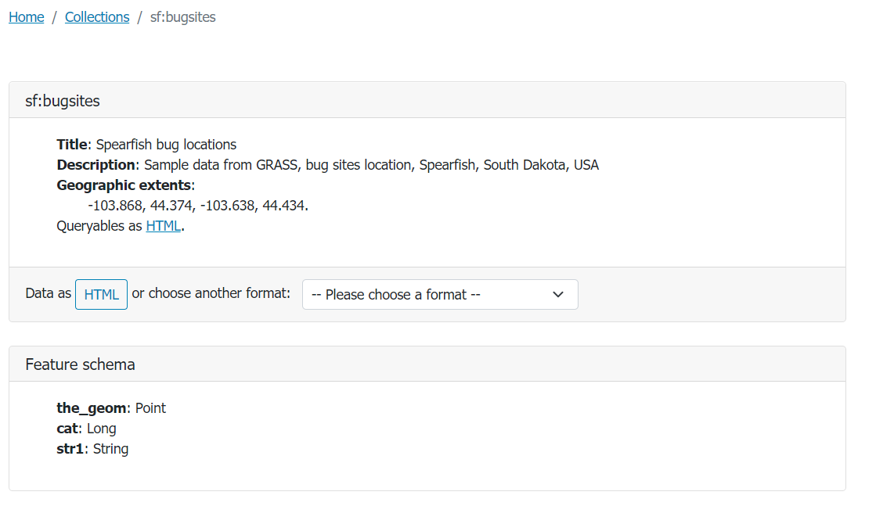
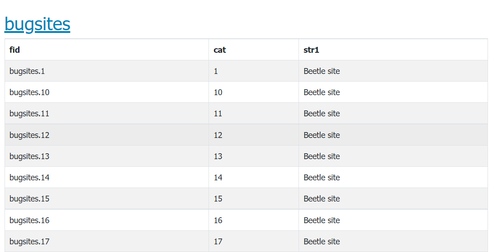

.. module:: geoserver.ogcapi.features.basics
   :synopsis: Introduction to ogcapi features service.

.. _geoserver.ogcapi.features.basics:

Features Service basics
=========================

The OGC API Features Service is accessed via the ``FEATURES`` version ``1.0`` link on the home page.

 .. figure:: img/ogcapi-features.png
    :width: 300
    :height: 300

The landing page (at ``http://localhost:8080/geoserver/ogc/features``) provides clients with a starting point for using the API, through a collection of resources, with links for navigation between content. The following screenshot shows the HTML representation of the landing page.

 .. figure:: img/ogcapi-features-capabilities.png

The page provides also link for other output formats, namely:

* ``application/json`` (at ``http://localhost:8080/geoserver/ogc/features?f=application/json``)  output format provides a collection of :file:`json` documents, with references between each document for programmatic access by web developers.

* ``application/x-yaml`` (at ``http://localhost:8080/geoserver/ogc/features?f=application/x-yaml``) output format will provide a collection of :file:`yaml` documents, with references between each document for programmatic access. ``Yaml`` is not specified by the standard but is additionally provided by the GeoServer service implementation.

The service title and description are provided by the existing Web Feature Service (WFS) settings.

The :guilabel:`API definition` provides an `OpenAPI <https://www.openapis.org/>`__ description of the available resources and the operation that can be perfomed on them. The following is the HTML representation:

Collections and Items
---------------------

``OGC API - Features`` provides access to collections of geospatial data. A collection is a generic concept for a set of related resources/items. 
A collection can thus be a Feature Collection when each of its items is a Feature.
For each configured vector layer in GeoServer a collection is provided. Each collection entry is described using the corresponding layer details: title, description, geographic extent.

   
   Collections page available at http://localhost:8080/geoserver/ogc/features/collections?f=text/html

From the collection page it is possible to request a collection definition to retrieve more details

   
   Bugsites collection page available at http://localhost:8080/geoserver/ogc/features/collections/bugsites?f=text/html

and retrieve the collection data. Data can be browsed as web pages, or downloaded in a range of formats such as GeoJSON and GML documents.

Data can be requested by adding ``/items`` path to the collection url, eg. ``http://localhost:8080/geoserver/ogc/features/collections/bugsites/items``.
A single item can be requested by adding also the ``Feature/Item`` id to the url eg. ``http://localhost:8080/geoserver/ogc/features/collections/bugsites/items/bugsites.1``.

HTML output
~~~~~~~~~~~~
The following is the ``HTML`` output for the bugsites items collection.

   
   Bugsites items HTML representation, available at http://localhost:8080/geoserver/ogc/features/collections/bugsites/items.

GeoJSON
~~~~~~~~

Feature Service supports ``application/geo+json``. In addition to a JSON representation of a collection, it provides also a links ``JSON array`` comrpising urls to all the output formats for which the collection and the collection description are available.
Moreover if pagination (see the next section) has been used a link to the next pagined result will be provided.

The following is the bugsites ``application/geo+json`` collection representation available at  ``http://localhost:8080/geoserver/ogc/features/collections/sf:bugsites/items?f=application%2Fgeo%2Bjson``.

.. code-block:: json
   
  {
   "type":"FeatureCollection",
   "features":[
      {
         "type":"Feature",
         "id":"bugsites.1",
         "geometry":{
            "type":"Point",
            "coordinates":[
               -103.86761148,
               44.38484141
            ]
         },
         "geometry_name":"the_geom",
         "properties":{
            "cat":1,
            "str1":"Beetle site"
         }
      },
      {
         "type":"Feature",
         "id":"bugsites.10",
         "geometry":{
            "type":"Point",
            "coordinates":[
               -103.85881675,
               44.38906627
            ]
         },
         "geometry_name":"the_geom",
         "properties":{
            "cat":10,
            "str1":"Beetle site"
         }
      },
      {
         "type":"Feature",
         "id":"bugsites.11",
         "geometry":{
            "type":"Point",
            "coordinates":[
               -103.85882875,
               44.37746168
            ]
         },
         "geometry_name":"the_geom",
         "properties":{
            "cat":11,
            "str1":"Beetle site"
         }
      }
   ],
   "numberMatched":90,
   "numberReturned":50,
   "timeStamp":"2021-09-15T14:19:23.383Z",
   "links":[
      {
         "title":"Next page",
         "type":"application/geo+json",
         "rel":"next",
         "href":"http://localhost:8080/geoserver/ogc/features/collections/sf%3Abugsites/items?limit=50&f=application%2Fgeo%2Bjson&startIndex=50"
      },
      {
         "title":"This document as text/html",
         "type":"text/html",
         "rel":"alternate",
         "href":"http://localhost:8080/geoserver/ogc/features/collections/sf%3Abugsites/items?f=text%2Fhtml"
      },
      {
         "title":"This document as application/vnd.google-earth.kml+xml",
         "type":"application/vnd.google-earth.kml+xml",
         "rel":"alternate",
         "href":"http://localhost:8080/geoserver/ogc/features/collections/sf%3Abugsites/items?f=application%2Fvnd.google-earth.kml%2Bxml"
      },
      {
         "title":"This document",
         "type":"application/geo+json",
         "rel":"self",
         "href":"http://localhost:8080/geoserver/ogc/features/collections/sf%3Abugsites/items?f=application%2Fgeo%2Bjson"
      },
      {
         "title":"This document as application/stac+json",
         "type":"application/stac+json",
         "rel":"alternate",
         "href":"http://localhost:8080/geoserver/ogc/features/collections/sf%3Abugsites/items?f=application%2Fstac%2Bjson"
      },
      {
         "title":"This document as application/gml+xml;version=3.2",
         "type":"application/gml+xml;version=3.2",
         "rel":"alternate",
         "href":"http://localhost:8080/geoserver/ogc/features/collections/sf%3Abugsites/items?f=application%2Fgml%2Bxml%3Bversion%3D3.2"
      },
      {
         "title":"This document as text/csv",
         "type":"text/csv",
         "rel":"alternate",
         "href":"http://localhost:8080/geoserver/ogc/features/collections/sf%3Abugsites/items?f=text%2Fcsv"
      },
      {
         "title":"This document as application/json",
         "type":"application/json",
         "rel":"alternate",
         "href":"http://localhost:8080/geoserver/ogc/features/collections/sf%3Abugsites/items?f=application%2Fjson"
      },
      {
         "title":"This document as application/cbor",
         "type":"application/cbor",
         "rel":"alternate",
         "href":"http://localhost:8080/geoserver/ogc/features/collections/sf%3Abugsites/items?f=application%2Fcbor"
      },
      {
         "title":"The collection description as application/x-yaml",
         "type":"application/x-yaml",
         "rel":"collection",
         "href":"http://localhost:8080/geoserver/ogc/features/collections/sf%3Abugsites?f=application%2Fx-yaml"
      },
      {
         "title":"The collection description as application/json",
         "type":"application/json",
         "rel":"collection",
         "href":"http://localhost:8080/geoserver/ogc/features/collections/sf%3Abugsites?f=application%2Fjson"
      },
      {
         "title":"The collection description as application/cbor",
         "type":"application/cbor",
         "rel":"collection",
         "href":"http://localhost:8080/geoserver/ogc/features/collections/sf%3Abugsites?f=application%2Fcbor"
      },
      {
         "title":"The collection description as text/html",
         "type":"text/html",
         "rel":"collection",
         "href":"http://localhost:8080/geoserver/ogc/features/collections/sf%3Abugsites?f=text%2Fhtml"
      }
   ]
 }

When a single item is requested it will appear as a single ``JSON object``.

The following is a bugsites item ``application/geo+json`` representation available at  ``http://localhost:8080/geoserver/ogc/features/collections/sf:bugsites/items/bugsites.1?f=application%2Fgeo%2Bjson``.

.. code-block:: json
   
   {
   "type":"Feature",
   "id":"bugsites.1",
   "geometry":{
      "type":"Point",
      "coordinates":[
         -103.86761148,
         44.38484141
      ]
   },
   "geometry_name":"the_geom",
   "properties":{
      "cat":1,
      "str1":"Beetle site"
   },
   "links":[
      {
         "title":"This document as text/html",
         "type":"text/html",
         "rel":"alternate",
         "href":"http://localhost:8080/geoserver/ogc/features/collections/sf%3Abugsites/items/bugsites.1?f=text%2Fhtml"
      },
      {
         "title":"This document as application/vnd.google-earth.kml+xml",
         "type":"application/vnd.google-earth.kml+xml",
         "rel":"alternate",
         "href":"http://localhost:8080/geoserver/ogc/features/collections/sf%3Abugsites/items/bugsites.1?f=application%2Fvnd.google-earth.kml%2Bxml"
      },
      {
         "title":"This document",
         "type":"application/geo+json",
         "rel":"self",
         "href":"http://localhost:8080/geoserver/ogc/features/collections/sf%3Abugsites/items/bugsites.1?f=application%2Fgeo%2Bjson"
      }
   ]
 }

GML output
~~~~~~~~~~~~
GeoServer also provides a GML output.

The following is the ``gml+xml;version=3.2`` representation available at 
``http://localhost:8080/geoserver/ogc/features/collections/sf:bugsites/items?f=application%2Fgml%2Bxml%3Bversion%3D3.2&limit=3``.

.. code-block:: xml
   
   <?xml version="1.0" encoding="UTF-8"?>
   <wfs:FeatureCollection xmlns:xs="http://www.w3.org/2001/XMLSchema" xmlns:sf="http://www.openplans.org/spearfish" xmlns:wfs="http://www.opengis.net/wfs/2.0" xmlns:gml="http://www.opengis.net/gml/3.2" xmlns:xsi="http://www.w3.org/2001/XMLSchema-instance" next="http://localhost:8080/geoserver/ogc/features/collections/sf%3Abugsites/items?limit=3&amp;f=application%2Fgml%2Bxml%3Bversion%3D3.2&amp;startIndex=3" numberMatched="90" numberReturned="3" timeStamp="2021-09-24T15:04:32.259Z" xsi:schemaLocation="http://www.opengis.net/wfs/2.0 http://localhost:8080/geoserver/schemas/wfs/2.0/wfs.xsd http://www.openplans.org/spearfish http://localhost:8080/geoserver/wfs?service=WFS&amp;version=2.0.0&amp;request=DescribeFeatureType&amp;typeName=sf%3Abugsites http://www.opengis.net/gml/3.2 http://localhost:8080/geoserver/schemas/gml/3.2.1/gml.xsd">
   <wfs:member>
      <sf:bugsites gml:id="bugsites.1">
         <sf:the_geom>
         <gml:Point srsName="http://www.opengis.net/gml/srs/epsg.xml#4326" srsDimension="2" gml:id="bugsites.1.the_geom">
            <gml:pos>-103.86761148 44.38484141</gml:pos>
         </gml:Point>
         </sf:the_geom>
         <sf:cat>1</sf:cat>
         <sf:str1>Beetle site</sf:str1>
      </sf:bugsites>
   </wfs:member>
   <wfs:member>
      <sf:bugsites gml:id="bugsites.10">
         <sf:the_geom>
         <gml:Point srsName="http://www.opengis.net/gml/srs/epsg.xml#4326" srsDimension="2" gml:id="bugsites.10.the_geom">
            <gml:pos>-103.85881675 44.38906627</gml:pos>
         </gml:Point>
         </sf:the_geom>
         <sf:cat>10</sf:cat>
         <sf:str1>Beetle site</sf:str1>
      </sf:bugsites>
   </wfs:member>
   <wfs:member>
      <sf:bugsites gml:id="bugsites.11">
         <sf:the_geom>
         <gml:Point srsName="http://www.opengis.net/gml/srs/epsg.xml#4326" srsDimension="2" gml:id="bugsites.11.the_geom">
            <gml:pos>-103.85882875 44.37746168</gml:pos>
         </gml:Point>
         </sf:the_geom>
         <sf:cat>11</sf:cat>
         <sf:str1>Beetle site</sf:str1>
      </sf:bugsites>
   </wfs:member>
   </wfs:FeatureCollection>