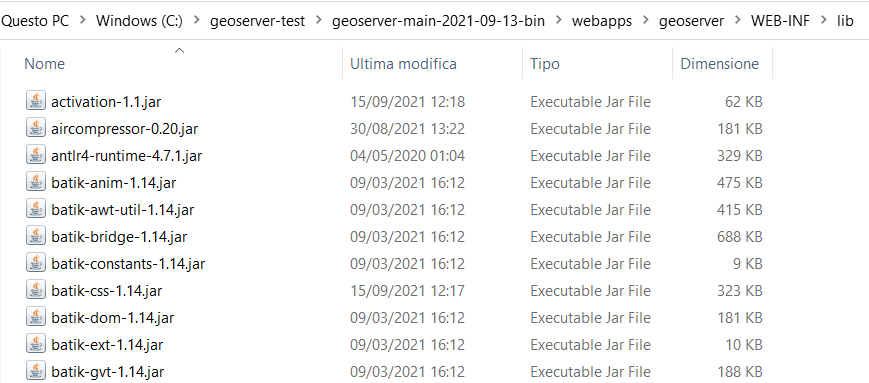
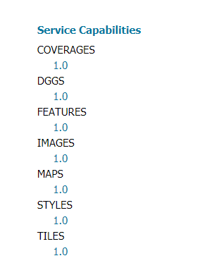

.. module:: geoserver.ogcapi.install
   :synopsis: Setting up a local environment.

.. _geoserver.ogcapi.install:

Setting up a local environment
==============================

 OGC API modules are still in their infancy and under heavy development. Most of the specs and extensions are still in draft form and their behavior is likely to change in the next months/year. 
 For this reasons this section explains how to set up a local environment using the latest GeoServer build.

 From the GeoServer `download page <http://geoserver.org/download/>`_ click on the development tab and then on the link to the main branch nightly builds.

 .. figure:: img/download-page.png
    :width: 600

#. Make sure you have a Java Runtime Environment (JRE) installed on your system. GeoServer requires a **Java 8** or **Java 11** environment, as provided by available from `OpenJDK <http://openjdk.java.net>`__ or `AdoptOpenJDK <https://adoptopenjdk.net>`__, depending if you are using Linux or Windows.

#. Download the `geoserver-main-latest-bin.zip <https://build.geoserver.org/geoserver/main/geoserver-main-latest-bin.zip>`_. Unzip it in a directory of your choice.

#. Download the `geoserver-2.21-SNAPSHOT-ogcapi-plugin.zip <https://build.geoserver.org/geoserver/main/community-latest/geoserver-2.21-SNAPSHOT-ogcapi-plugin.zip>`_. Unzip it and drop all its content in the ``webapps/geoserver/WEB-INF/lib`` folder of your GeoServer directory.

In the image below the ``geoserver-main-latest-bin.zip`` content has been placed inside ``C:\geoserver-test`` folder. The ``geoserver-2.21-SNAPSHOT-ogcapi-plugin.zip`` content has been then dropped inside ``C:\geoserver-test\geoserver-main-2021-09-13-bin\webapps\geoserver\WEB-INF\lib``.

Setting environment variables
~~~~~~~~~~~~~~~~~~~~~~~~~~~~~

You will need to set the ``JAVA_HOME`` environment variable if it is not already set. 
This is the path to your JRE such that :file:`%JAVA_HOME%\\bin\\java.exe` exists.

To set the ``JAVA_HOME`` in ``Linux/OSX`` run the following commands:

#. ``export JAVA_HOME=/path/to/jre``

#. ``export PATH=$JAVA_HOME/bin:$PATH``

To set the ``JAVA_HOME`` in ``Windows``:

#. Navigate to :menuselection:`Control Panel --> System --> Advanced --> Environment Variables`.

#. Under :guilabel:`System variables` click :guilabel:`New`. 

#. For :guilabel:`Variable name` enter ``JAVA_HOME``.  For :guilabel:`Variable value` enter the path to your JDK/JRE.

#. Click OK three times.

Running
~~~~~~~~

To start GeoServer:

* On ``Linux/OSX`` open the terminal, navigate to the root directory of you GeoServer installation and run :file:`bin/startup.sh`.

* On ``Windows`` run :file:`startup.bat` inside the :file:`bin` folder.  A command-line window will appear and persist. This window contains diagnostic and troubleshooting information. This window must be left open, otherwise GeoServer will shut down.

Once GeoServer is running:

#. Navigate to ``http://localhost:8080/geoserver`` (or wherever you installed GeoServer) to access the GeoServer home.

#. Check that ogcapi modules are installed by looking on the left side of the GeoServer home page. Under the section :guilabel:`Service Capabilities` you should have the following links:

Stopping
~~~~~~~~

To shut down GeoServer:

* On ``Linux/OSX`` press ``CTRL-C`` on the terminal where GeoServer is running.

* On ``Windows`` either close the persistent command-line window, or run the :file:`shutdown.bat` file inside the :file:`bin` directory.

Uninstallation
~~~~~~~~~~~~~~~

#. Stop GeoServer (if it is running).

#. Delete the directory where GeoServer is installed.
