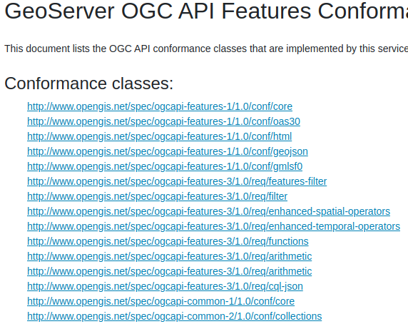

.. module:: geoserver.ogcapi.intro
   :synopsis: Learn how to work with OGC APIs.

.. _geoserver.ogcapi.intro:

Introduction
=============

OGC API is a family of standards based on OpenAPI.  Its purpose is to define resource-centric APIs that take advantage of modern web development practices. 

OpenAPI based
-------------

All OGC APIs are based on `OpenAPI <https://swagger.io/specification/>`_ "a standard, language-agnostic interface to RESTful APIs which allows both humans and computers to discover and understand the capabilities of the service without access to source code, documentation, or through network traffic inspection."

In particular, this means OGC APIs:

* Provide an **API definition** that is both machine-parseable and human-readable.

 .. figure:: img/openapi.png

    Sample OpenAPI document, represented as HTML.

* The API is based on **RESTful** concepts. The API exposes a set of resources at various paths and defines the HTTP methods that can be executed on them.

.. figure:: img/methods.png
   :width: 300

   One resource, multiple HTTP methods.

* Each resource has a **representation**, typical choices are HTML and JSON. HTML allows direct exploration of the API in a browser, while JSON is used by machine-to-machine communication.

 .. figure:: img/landing.png

    OGC API - Features landing page, in its HTML representation, from GeoServer.

Small core and extensions
--------------------------

OGC APIs are split into a small core and a set of optional extensions.

The **core** is meant to be minimal and easy to implement: it should be possible to implement a new server in a matter of days.
For reference, OGC API - Features core provides, in terms of data access, only the following:

* Paged data access
* Filtering by bounding box and and time
* The serverice works in CRS84 only (both input and filtering)

The **extensions** cover optional functionality that a server might implement. Many of these were part of the core functionality, in classic OGC services. For example, OGC API - Features extensions (existing and planned) include:

* Property selection
* CRS by reference (support CRS other than CRS84)
* CQL Filtering
* Transactions

A client can discover which extensions are implemented by a server exploring the "conformance declaration", a dedicated resource enumerating all implemented conformance classes.
A specification might indicate one or more  conformance classes for its implementation, for example, supporting the HTML representation of resources
adds its own conformance class, ``http://www.opengis.net/spec/ogcapi-features-1/1.0/conf/html``.

   Sample conformance classes from GeoServer OGC API - Features.

Linked representations
----------------------

Representations of resources are, whenever possible, linked with each other.
This makes the service "browseable", either by actually using a browser,
or by following links embedded in JSON representations.
The ``rel`` attribute, relationship, indicates the nature of the link.

For example, the landing page links to the OpenAPI description of the service using a relationship ``service-desc``:

.. code-block:: json

    {
      "href": "https://gs-main.geosolutionsgroup.com/geoserver/ogc/features/api?f=application%2Fvnd.oai.openapi%2Bjson%3Bversion%3D3.0",
      "rel": "service-desc",
      "type": "application/vnd.oai.openapi+json;version=3.0",
      "title": "API definition for this endpoint as application/vnd.oai.openapi +json;version=3.0"
    }

Links are also used to point to representations of the same resource in different formats, using the ``alternate`` relationship.

The representation is chosen by using the HTTP ``Accept`` header. This means a browser will automatically receive back a HTML representation, if available.
Representations can be commonly chosen also by using a query parameter, which is chosen by the server implemtation (OGC API - Commons suggests using either "f" or "Accept", GeoServer users the former).

No mandatory representation
---------------------------

OGC API - Commons defines the basics shared by all OGC APIs.
In terms of resource representation, it **reccommends** support for **HTML and JSON** representations. However, that is not mandated: a service that can represent its resources only using Protocol buffers (for the sake of picking an example) is an equivally valid implementation.

Basic structure
---------------

The basic structure of a OGC API structure contains:

* A **Landing Page**, the entry point of the service, which links to the other available resources.
* The Landing Page links to an **API definition**, describing the resources and methods supported by the service (no fixed location).
* The Landing Page links to a sub-resource called **Conformance**, which contains the list of all optional extensions/features implemented by this API
* If the service contains data, the Langing Page links to a sub-resouce called **Collections**, providing a list of data collections managed by the service.