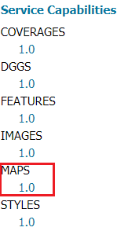
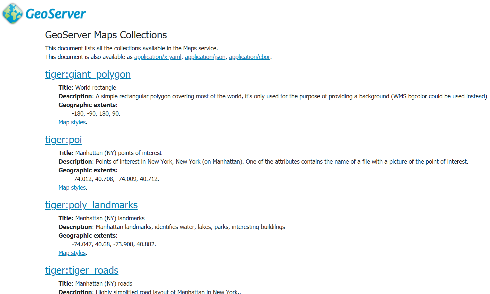
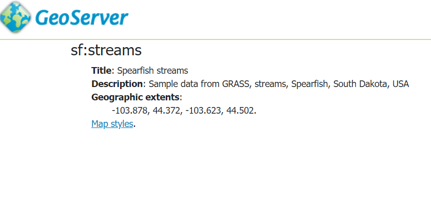
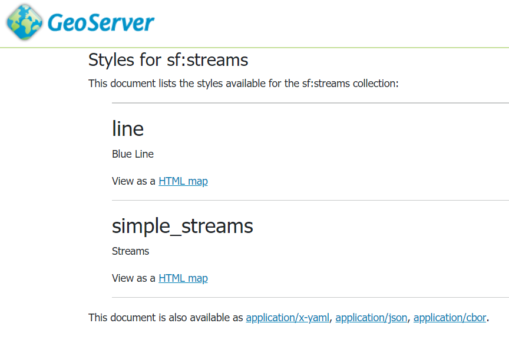
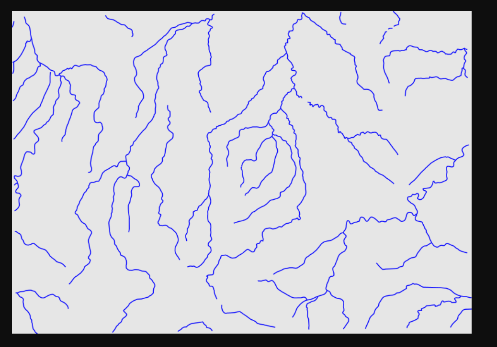
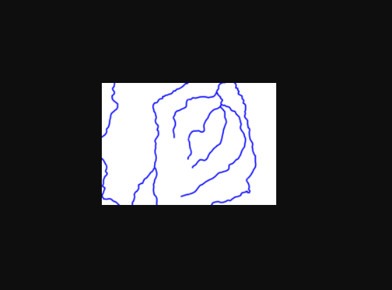
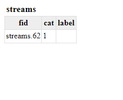
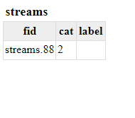

.. module:: geoserver.ogcapi.maps
   :synopsis: Providing maps representing geospatial data.

.. _geoserver.ogcapi.maps:

OGC API - Maps
===============

This module introduces the OGC API - Maps service, in particular, it shows how to perform discovery operations on collections of geospatial data and how to obtain maps from them.

.. warning:: GeoServer has an incomplete implementation of the current draft specification, which is still evolving. As examples no HTML output is provided yet for Maps and Layer Groups support is incomplete.

Discovery operations
----------------------

The OGC API Maps Service is accessed via the ``MAPS`` version ``1.0`` link on the home page.

The collections page, available at ``/collections`` provides a list of all the collections that can be served as maps. The list comprises all the configured layers and layer groups in GeoServer. The list can be requested in a number of output format (eg. ``text/html``, ``application/json``, ``application/x-yaml``).

    
    HTML representation of available collections, at http://localhost:8080/geoserver/ogc/maps/collections?f=text/html

The details of a collection ara available at ``/collections/{collectionId}`` in various output format. From UI it will be possible to obtain the collection details in an HTML representation by clicking on the collection name.

    
    HTML representation of sf:streams collection details, at http://localhost:8080/geoserver/ogc/maps/collections/sf:streams?f=text/html

The list of styles applied to the collection can be requested at ``/collections/{collectionId}/styles``.

    
    HTML representation of the list of the sf:streams collection styles, at http://localhost:8080/geoserver/ogc/maps/collections/sf:streams/styles?f=text/html

Maps
-----

The map representation of a collection with a given style can be requested at ``/collections/{collectionId}/styles/{styleName}/map``.

For instance this request 

``http://localhost:8080/geoserver/ogc/maps/collections/sf:streams/styles/line/map?f=image/png`` 

retrieves the map for sf:streams with the line style.

    
    Default sf:streams map 

It is worth mentioning that when using the OGCAPI - Maps service we don't have to specify all the parameters that are mandatory in ``WMS`` (eg. ``height``, ``width``, ``bbox``,``crs`` and so on). Indeed they are automatically filled by GeoServer. The client is then able to fill only those needed. 

The following request for instance adds the ``crs`` and the ``width`` parameters:

``http://localhost:8080/geoserver/ogc/maps/collections/sf:streams/styles/line/map?f=image/png&crs=EPGS:26713&width=200`` 

getting a smaller image in a different ``CRS`` by the default one that is ``EPSG:4326``.

This request adds also a bounding box to obtain a smaller area:

``http://localhost:8080/geoserver/ogc/maps/collections/sf:streams/styles/line/map?f=image/png&width=200&crs=EPSG:26713&bbox=595818.1692167784,4918417.953435432,603147.9094650361,4923571.677047489``

    
    sf:streams map with specific width, CRS and bounding box

Feature Info
-------------

OGCAPI - Maps Service allows, as WMS, to obtain information about elements draw on the map. The path to retrieve info is the following  ``/collections/{collectionId}/styles/{styleName}/map/info``. 

As for map requests the server is able to fill most of the request parameters that in the corresponding WMS operation are mandatory.
In addition to the output format parameter ``f``, the only mandatory parameters are indeed ``i`` and ``j``, specifying the pixels coordinates of the element of interest, inside the image generated by the corresponding ``map`` request.

For instance the following request retrieves informations about the element at coordinates 20,20 and doesn't provide any additional parameter 

``http://localhost:8080/geoserver/ogc/maps/collections/sf:streams/styles/line/map/info?f=text/html&i=20&j=20``.

    
     Feature information at pixel (20, 20) in the default ``sf:streams`` map

This request 

``http://localhost:8080/geoserver/ogc/maps/collections/sf:streams/styles/line/map/info?f=text/html&i=10&j=10&width=200&crs=EPSG:26713&bbox=595818.1692167784,4918417.953435432,603147.9094650361,4923571.677047489`` 

instead specifies additionally the ``width`` of the image, the ``crs`` and the ``bounding box``.

    
    Feature info at pixel (10, 10), based on a customized map request with explicit bbox, CRS and width.
