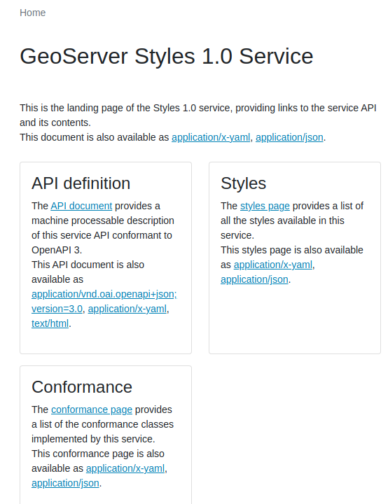
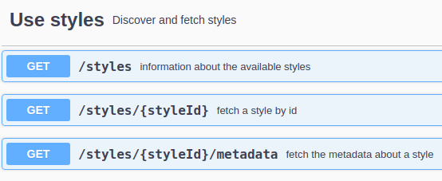
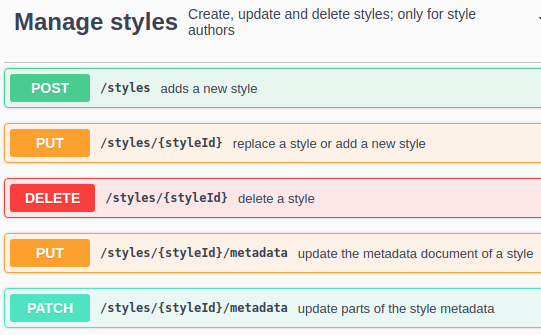
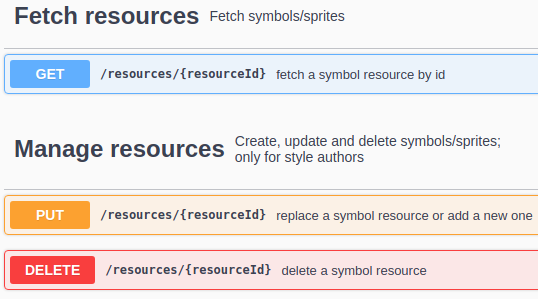
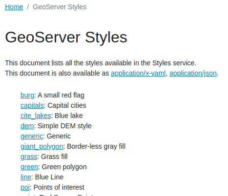
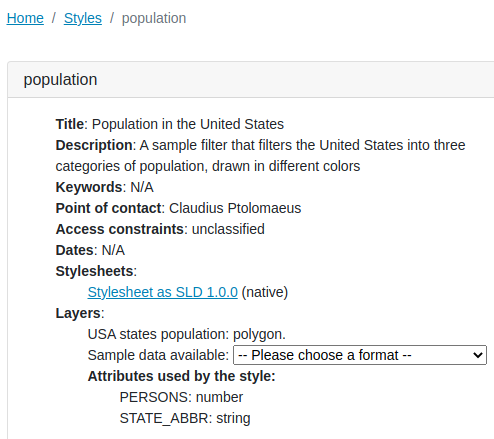
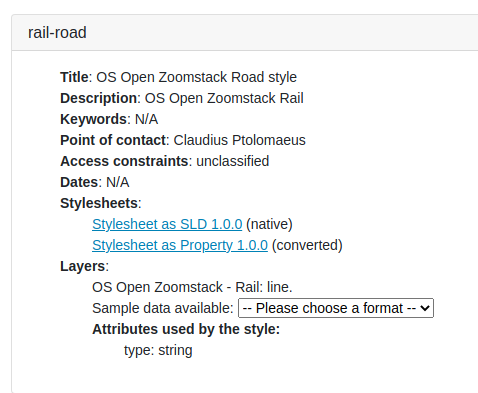
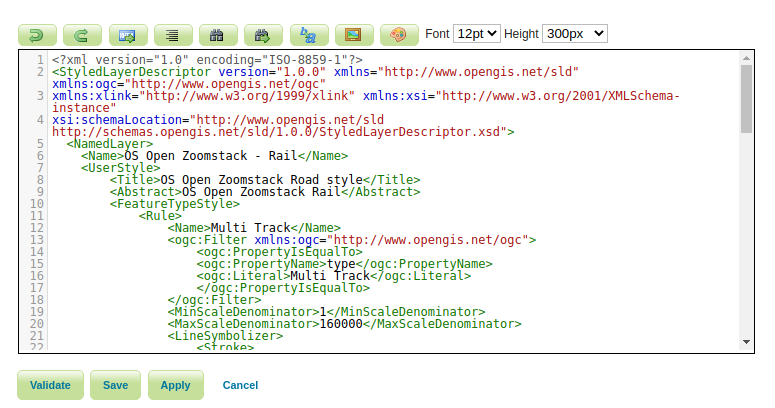

.. module:: geoserver.ogcapi.styles
   :synopsis: This service  describes, retrieves and updates the styles present on the server.

.. _geoserver.ogcapi.styles:

OGC API - Styles
================

The OGC API - Styles draft specification defines a Web API that enables map servers, clients as well as visual style editors, to manage and fetch styles,
and perform client side rendering of raw features and coverages.

Unlike other OGC APIs, this service is not based on data, as such, it does not contain collections, but simply, styles.

Conceptually, this also signs a departure from WMS, where styles were simply attributes of a layer, towards a model proposing a style catalog. In other words, styles exist independently of layers, although it's useful to associate them and advertise the relationship.

OGC API - Styles has been initially defined during Testbed 15, as reported by the `OGC Testbed-15: Styles API Engineering Report <http://docs.opengeospatial.org/per/19-010r2.html>`_, and is now being evolved in a `dedicated GitHub repository <https://github.com/opengeospatial/ogcapi-styles>`_.

GeoServer own implementation of the API dates back to the Testbed 15 experiments.

The landing page of the service can be found at::
   
   http://localhost:8080/geoserver/ogc/styles

   
   OGC API - Styles landing page in GeoServer.

The API basics
--------------

The API provides a list of ``styles``, in turn, each style can be fetched in one or more encodings, and described::

   http://localhost:8080/geoserver/ogc/styles/api

   
   OGC API - Styles, read only usage.

Given enough rights, styles can also be created, updated and removed.

   
   OGC API - Styles, modification API.

In addition, the API allows to optionally retrieve and manage resources, such as icons and fonts, used in the styles. **GeoServer does not yet implement this portion of the API**.

   
   OGC API - Styles, resource handlng.

Listing and exploring styles
----------------------------

The list of styles is reachable following a link from the langing page::

   http://localhost:8080/geoserver/ogc/styles/styles?f=text%2Fhtml

The document simply lists all available styles, with a short description for each (pulled from the style content).

   
   OGC API - Styles, an excerpt from the style list.

Following the link for the ``population`` style, the browser provides a description of the style, its available representations, and layers that can be used with it.

   
   OGC API - Styles. A single style.

The style page provides:

* A title and a description derived from the stylesheet.
* A list of stylesheets. One for the native format (SLD in this case), plus eventual other formats that can be converted from it. For example, had the style been written in GeoCSS, the page would have reported also an SLD link.
* The layers using the style, with eventual links to the raw data, and a list of attributes used by the style.

Updating/manipulating styles
----------------------------

While the training does not cover changing styles, it is possible to:

* Add a new style, either POSTing its body (stylesheed, SLD) to the ``styles`` resource, or by PUTing it against its desired final location.
* Update an existing style using PUT with the stylesheet.
* Delete a style against its resource.

For example, assume GeoServer does not already have a ``rail-road`` style. Then the following uploads the SLD for it, and creates the necessary configuration in GeoServer (effectively replacing part of the administration REST API)::

    curl -v -u admin:geoserver -XPUT -H "Content-Type: application/vnd.ogc.sld+xml" --data-binary @rail-road.sld "http://localhost:8080/geoserver/ogc/styles/styles/rail-road"

   Rail resource, as created with the POST request

   The rail style, in the GeoServer administration UI
