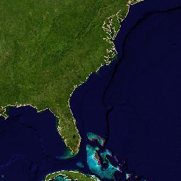
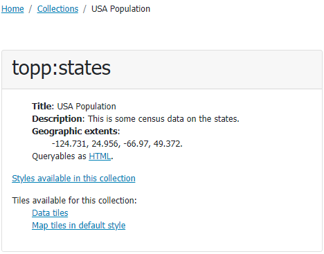
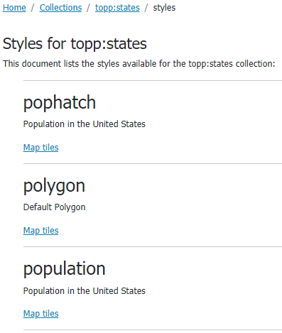
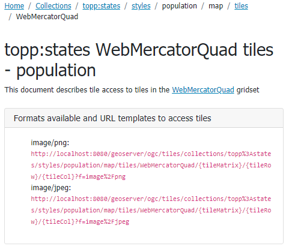
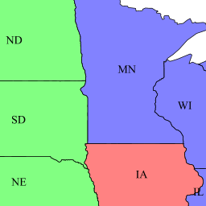

.. module:: geoserver.ogcapi.tiles.gettingtiles
   :synopsis: Getting tiles from tileservice.

.. _geoserver.ogcapi.tiles.gettingtiles:

Getting tiles
=============
OGC-API Tiles allows to get tiles through simple calls identifying a collection and the needed coordinates within the specified Tile Matrix Set.

Raster tiles
------------
The page at ``http://localhost:8080/geoserver/ogc/tiles/collections/nurc:Img_Sample/map/tiles/WebMercatorQuad?f=text%2Fhtml`` 
provides URL templates to get map tiles for ``nurc:Img_Sample`` layer on ``WebMercatorQuad`` Tile Matrix Set in the available formats.

.. figure:: img/url-template.png

Filling the URL template with proper ``tileMatrix id``, ``tileRow`` and ``tileCol`` values (within the Tile Matrix Set Limits) provides the specified map tile.

Request at ``http://localhost:8080/geoserver/ogc/tiles/collections/nurc%3AImg_Sample/map/tiles/WebMercatorQuad/4/6/4?f=image%2Fpng`` 

will result in getting the following tile:

Vector tiles
------------
The page at ``http://localhost:8080/geoserver/ogc/tiles/collections/top:states`` provides available tiles for the specified vector collection.

Depending on the available tile formats being previously configured, it is possible to get tiles in different ways:

* Vector data being provided as is, as vector ``Data tiles``.
* Vector data being provided as styled ``Map tiles`` (raster tiles).

Map tiles
~~~~~~~~~
Getting Map tiles results in requesting tiles in a raster output format (i.e. PNG, JPEG,...) as seen in the previous section.

The ``Map tiles in default style`` link allows getting vector data being provided as map tiles using the default style.

In case the tile collection supports multiple alternate style, it is possible to get different map tiles (based on different styles).

The page at ``http://localhost:8080/geoserver/ogc/tiles/collections/topp:states/styles?f=text%2Fhtml`` provides the set of alternate styles available for the ``topp:states`` tiled collection and the related ``map tiles`` resources.

Selecting a specific map tile (i.e. from ``population``) and a specific tile matrix set (i.e. ``WebMercatorQuad``) results in this:

Where you can notice the ``population`` style in the template URLs. Tiles obtained with that URL template are the result of the population style being applied.

Request at ``http://localhost:8080/geoserver/ogc/tiles/collections/topp%3Astates/styles/population/map/tiles/WebMercatorQuad/5/11/7?f=image%2Fpng`` 

will result in getting the following tile:

Data tiles
~~~~~~~~~~
Getting Data tiles results in a vector format.  Depending on the requested output format (i.e. ``application/vnd.mapbox-vector-tile``), it may require a client supporting it for further visualization.

Request at ``http://localhost:8080/geoserver/ogc/tiles/collections/topp%3Astates/tiles/WebMercatorQuad/5/11/7?f=application%2Fjson%3Btype%3Dgeojson``

will result in getting the following geoJSON tile content (geometry coordinates have been omitted):

.. code-block:: json

  	{
	   "type":"FeatureCollection",
	   "totalFeatures":"unknown",
	   "features":[
		  {
			 "type":"Feature",
			 "id":"states.1",
			 "geometry":{
				"type":"Polygon"
			 },
			 "geometry_name":"the_geom",
			 "properties":{
				"CARPOOL":652603,
				"DRVALONE":3741715,
				"EMPLOYED":5417967,
				"FAMILIES":2924880,
				"FEMALE":5878369,
				"HOUSHOLD":4202240,
				"LAND_KM":143986.61,
				"MALE":5552233,
				"MANUAL":828906,
				"PERSONS":1.1430602E7,
				"PUBTRANS":538071,
				"P_FEMALE":0.514,
				"P_MALE":0.486,
				"SAMP_POP":1747776,
				"SERVICE":1360159,
				"STATE_ABBR":"IL",
				"STATE_FIPS":"17",
				"STATE_NAME":"Illinois",
				"SUB_REGION":"E N Cen",
				"UNEMPLOY":385040,
				"WATER_KM":1993.335,
				"WORKERS":4199206
			 }
		  },
		  {
			 "type":"Feature",
			 "id":"states.10",
			 "geometry":{
				"type":"Polygon"
			 },
			 "geometry_name":"the_geom",
			 "properties":{
				"CARPOOL":312042,
				"DRVALONE":1816079,
				"EMPLOYED":2367395,
				"FAMILIES":1368334,
				"FEMALE":2652758,
				"HOUSHOLD":1961206,
				"LAND_KM":178445.951,
				"MALE":2464315,
				"MANUAL":386746,
				"PERSONS":5117073,
				"PUBTRANS":47129,
				"P_FEMALE":0.518,
				"P_MALE":0.482,
				"SAMP_POP":864999,
				"SERVICE":659782,
				"STATE_ABBR":"MO",
				"STATE_FIPS":"29",
				"STATE_NAME":"Missouri",
				"SUB_REGION":"W N Cen",
				"UNEMPLOY":155388,
				"WATER_KM":2100.115,
				"WORKERS":1861192
			}
		}
		]
	}

