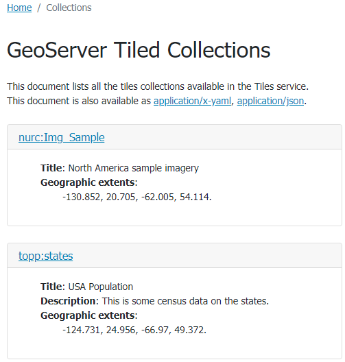
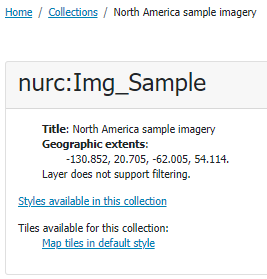
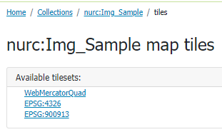
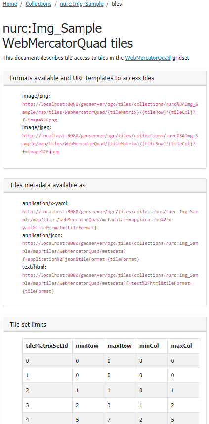
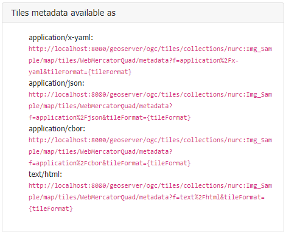
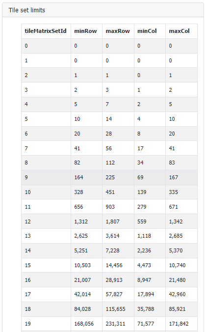

.. module:: geoserver.ogcapi.tiles.basics
   :synopsis: Introduction to ogcapi tiles service.

.. _geoserver.ogcapi.tiles.basics:

Tiles Service basics
====================

The API provides tiles of geospatial information, such as vector data (Vector Tiles) and raster data (Map Tiles)

The OGC API Tiles Service is accessed via the ``TILES`` version ``1.0`` link on the home page.

 .. figure:: img/ogcapi-tiles.png

The landing page (at ``http://localhost:8080/geoserver/ogc/tiles``) provides clients with a starting point for using the API, through a collection of resources, with links for navigation between content. 
The following screenshot shows the HTML representation of the landing page.

 .. figure:: img/ogc-api-tiles-capabilities.png

The landing page can also be represented as ``json``, e.g.. ``http://localhost:8080/geoserver/ogc/tiles?f=application/json``. This representation provides the same information, in a form suitable for programmatic access by web developers.

The :guilabel:`API definition` provides an `OpenAPI <https://www.openapis.org/>`__ description of the service is provided, that may be browsed as documentation, or used to generate a client to access the web services.

 .. figure:: img/api-definition.png

 .. figure:: img/api-links.png

Tile Matrix Sets
----------------
The :guilabel:`Tile matrix sets` link provides the list of available tiling schemes:

 .. figure:: img/tile-matrix-sets.png

 Selecting one of the entries from the list, i.e. :guilabel:`WebMercatorQuad`, provides the details for that Tile matrix set,
 showing the different zoom level properties and tiling layout.

 .. figure:: img/web-mercator-quad.png

Collections and tiles
---------------------

``OGC API - tiles`` provides access to collections of geospatial data. A collection is a generic concept for a set of related resources/items. 
A collection can thus be a Tiles Collection.
For each configured tiled layer in GeoServer a collection is provided. Each collection entry is described using the corresponding layer details: title, description, geographic extent.

   
   Collections page available at http://localhost:8080/geoserver/ogc/tiles/collections?f=text/html

From the collections page it is possible to request a collection definition to retrieve more details and get the collection tiles.

   
   North America sample imagery collection page available at http://localhost:8080/geoserver/ogc/tiles/collections/nurc:Img_Sample?f=text/html

From the collection definition it is possible to retrieve the list of available tilesets.
Let's click on the ``nurc:Img_Sample collection``

   North America sample imagery tilesets available at http://localhost:8080/geoserver/ogc/tiles/collections/nurc:Img_Sample/map/tiles?f=text/html

Selecting a specific tileset (i.e. WebMercatorQuad), it is possible to see the accessing details for that specific tileset for that collection.

The page contains multiple elements:

Tile URL Templates
~~~~~~~~~~~~~~~~~~
For each available format, the URL template allows to retrieve a tile by specifying proper tileMatrix id, row and column.

.. figure:: img/url-template.png

Tile metadata
~~~~~~~~~~~~~
A set of links is provided to retrieve tile metadata for the specified format.

Metadata can be retrieved as a JSON content at:
``http://localhost:8080/geoserver/ogc/tiles/collections/nurc:Img_Sample/map/tiles/WebMercatorQuad/metadata?f=application%2Fjson&tileFormat=image/png``

The following is the ``TileJSON`` output for the above metadata call, containing tiles url template too: 

.. code-block:: json

  {
   "tilejson":"2.2.0",
   "name":"nurc:Img_Sample",
   "scheme":"xyz",
   "tiles":[
      "http://localhost:8080/geoserver/ogc/tiles/collections/nurc%3AImg_Sample/map/tiles/WebMercatorQuad/{z}/{y}/{x}?f=image%2Fpng"
   ],
   "center":[
      -89.9999999749441,
      42.52556437629473,
      1.0
   ],
   "bounds":[
      -130.85168,
      20.7052,
      -62.0054,
      54.1141
   ],
   "format":"image/png",
   "minzoom":0,
   "maxzoom":24
  }

Metadata for vector tiles also contains a  ``vector_layers`` section, reporting additional metadata and available fields for the vector data.
The page at ``http://localhost:8080/geoserver/ogc/tiles/collections/topp:states/tiles/WebMercatorQuad/metadata?f=application%2Fjson`` reports ``TileJSON`` metadata including the ``vector_layers`` content.

.. code-block:: json

		{
	   "tilejson":"2.2.0",
	   "name":"topp:states",
	   "description":"This is some census data on the states.",
	   "scheme":"xyz",
	   "tiles":[
		  "http://localhost:8080/geoserver/ogc/tiles/collections/topp%3Astates/tiles/WebMercatorQuad/{z}/{y}/{x}?f=application%2Fvnd.mapbox-vector-tile"
	   ],
	   "center":[
		  -89.9999999749441,
		  42.52556437629473,
		  1.0
	   ],
	   "bounds":[
		  -124.731422,24.955967,
		  -66.969849,
		  49.371735
	   ],
	   "format":"application/vnd.mapbox-vector-tile",
	   "minzoom":0,
	   "maxzoom":24,
	   "vector_layers":[
		  {
			 "id":"states",
			 "description":"This is some census data on the states.",
			 "fields":{
				"STATE_NAME":"string",
				"STATE_FIPS":"string",
				"HOUSHOLD":"number",
				"EMPLOYED":"number",
				"CARPOOL":"number",
				"PERSONS":"number",
				"WORKERS":"number",
				"LAND_KM":"number",
				"P_FEMALE":"number",
				"SAMP_POP":"number",
				"STATE_ABBR":"string",
				"UNEMPLOY":"number",
				"MALE":"number",
				"FEMALE":"number",
				"WATER_KM":"number",
				"SUB_REGION":"string",
				"DRVALONE":"number",
				"FAMILIES":"number",
				"SERVICE":"number",
				"MANUAL":"number",
				"P_MALE":"number",
				"PUBTRANS":"number"
			 },
			 "minzoom":0,
			 "maxzoom":24,
			 "geometry_type":"polygon"
		  }
	   ]
	}

Tile set limits
~~~~~~~~~~~~~~~
In case the tiled collection isn't fully covering the whole tile matrix set domain, limits are reported as a table, containing min and max grid coordinates for each supported level.

